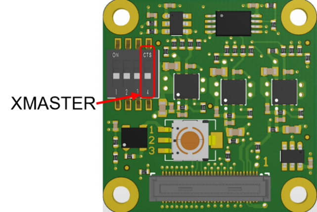

Multi Sensor Synchronization
++++++++++++++++++++++++++++++++++++++++++

Introduction
============

In the world of visual systems, taking two images at the same time
involves a meticulous synchronization of precise signal timing. Many
applications like Inspection systems, Stereo Vision, 3D cameras and
Panorama stitching require and benefit from sensor triggering and
synchronization.

Ideally a perfect multi-sensor synchronization would result in images
that are taken and read at the same time from all sensors. This means
all sensors shall run at the same FPS, and each frame is synchronized to
a v-sync signal. This appnote and given examples assume all sensors
operate at the same FPS, but their exposure times can be different as
long as maximum exposure time is not exceeded.

However, a time difference between the synchronized sensors is
practically inevitable. This difference can be within a few sensor clock
cycles or within one horizontal line period of the sensor, depending on
the synchronization mode.\*

This application note discusses three synchronization modes in SONY
Rolling Shutter sensors considering applications which require minimum
delay between the captured images (Master-Slave Sync Mode), minimum
signal connections between the sensors (Master-Master Sync Mode) or
require the sensors to synchronize to external signals (External Sync
Mode). Examples to achieve these synchronization modes using FRAMOS
FSM:GO and FSM development kits and drivers are presented.

\*Refer to :ref:`sec2-4`.

.. _chap2:

Theory
========

This application note discusses three synchronization modes feasible
with SONY rolling shutter sensors as stated in :ref:`appendix`:

1. Master-Master synchronization

2. Master-Slave synchronization

3. External Synchronization

.. _sec2-1:

Master-Master Synchronization
---------------------------------

Applications which require interconnecting minimum number of signal
lines between different sensors can benefit from the Master-Master
synchronization mode.

In this mode, synchronization is achieved between different master
sensors by interconnecting the sensors vertical sync signals (Figure 1).
One master sensor operates in sync with its own local clock and outputs
sync signals (via the XVS pin) to other master sensors for
synchronization.

In FSM Ecosystem, using this mode the sensors readout timing can be
synchronized within one horizontal line period (1H). From experience,
the output images will have up to one line difference, regardless of the
sensors using different or common clock (INCK) source. When sensors use
different INCK sources, there can be a frame-to- frame phase drift. This
frame-to-frame drift can be avoided using a common INCK source, there
still will be a phase difference when starting a new image acquisition.

|image-multi-1|

Figure 1. Master-Master Synchronization mode \*

\* Using common clock (INCK) source is optional.

.. _sec2-2:

Master-Slave Synchronization
--------------------------------

Applications that require minimum delay between the captured images can
benefit from the Master-Slave Synchronization.

In this mode, slave sensors can be operated in sync with an inputting
vertical and horizontal sync signal from an image sensor in master mode
(Figure 2). The master sensor operates in sync with its local clock and
outputs sync signals. The slave sensors are driven by inputting XVS and
XHS signals.

In FSM Ecosystem, using this mode the sensors readout timing can be
synchronized up to a few sensor clock periods. From experience, no
difference in synchronization performance was observed when using a
common clock source or difference clock sources for the sensors.

|image-multi-2|

Figure 2. Master-Slave Synchronization Mode \*

\* Using common clock (INCK) source is optional.

External Synchronization
----------------------------

Application that requires synchronizing image sensors with external
signals can use external synchronization mode.

External Master Synchronization
~~~~~~~~~~~~~~~~~~~~~~~~~~~~~~~

Master sensors can be synchronized using an external sync signal
inputting through the XVS pin (Figure 3). Synchronization performance
between the master sensors is expected to be like Master-Master mode
(Refer to :ref:`sec2-1`)

External Slave Synchronization
~~~~~~~~~~~~~~~~~~~~~~~~~~~~~~
Slave sensors can be synchronized by receiving horizontal and vertical
sync signals from external source(s) (Figure 4). Sychronization
performace between the slave sensors is expected to be like the
Master-Slave mode (Refer to :ref:`sec2-2`). 

|image-multi-3|

Figure 3. External Master Synchronization\*

|image-multi-4|

Figure 4. External Slave Synchronization\*

\* Using common clock (INCK) source is optional.

.. _sec2-4:

Expected Synchronization Performance
----------------------------------------

The expected delay between master-master sync is up to one horizontal
line time, or 1H time. The expected delay between master- slave sync is
up to a few INCK clock cycles.

In the case of IMX678 and below examples, the INCK is 74.25MHz; each
clock cycle is 13.47ns. Master-slave sync allows for synchronization
within dozens of nanoseconds.

Horizontal line time is denoted in units of INCK cycles and is dependent
on operation modes. For IMX678 12bit at 60fps, 1H period is 550 INCK
cycles or 7.4μs. Thus, using master-master sync, there will be up to
7.4μs delay between the two sensors.

Please refer to sensor documentation for more details.

.. _chap3:

FSM Ecosystem Hardware Description
====================================

Synchronization schemes (described in :ref:`chap2`) require
interconnecting the sensors sync signals (XVS or XHS) between the
sensors to be synchronized. In addition, to drive sensors in Slave mode
managing the sensor’s XMASTER pin is required. This section provides
details on managing these signals in the FSM Ecosystem.

FPA-4.A/AGX 
----------------

Supported platforms: Jetson AGX Xavier, Jetson AGX Orin

The sync signals (XVS or XHS) between the sensors connected to J5-J8
connectors, can be interconnected using the respective XVS (SW1) / XHS
(SW2) switches on the FPA. An external XVS or XHS signal can be provided
using the J1 connector. 

|image-multi-5|

Figure 5. FPA-4.A/AGX: XVS, XHS switches and J1 connector

|image-multi-6|

Figure 6. FPA-4.A/AGX: Schematics

FPA-A/P22-V2A
-----------------

Supported platforms: Jetson Orin Nano & Orin NX

In FPA-A/P22-V2A the XVS and/or XHS signals of different sensors can be
connected by connecting the J4/J5 of one FPA to the J4/J5 of the other
FPA.

|image-multi-7|

Figure 7. FPA-A/P22-V2A: J4/J5 Connectors

.. _sec3-3:

Slave Mode: FSM + FSA-FTx/A
-------------------------------

Supported sensor modules in :ref:`appendix`.

Sensors can be switched between slave and master mode using
the XMASTER pin. The XMASTER pin is managed in the FSM development kit
using FSA’s DIP-switch pin 4 (Figure 8). Other registers are
communicated by the sensor driver using I2C. 

+-------------------+-------------------------+------------------------+
| FSA SW PIN- 4     | XMASTER                 | Sensor Mode            |
+===================+=========================+========================+
| ON                | HIGH                    | Slave                  |
+-------------------+-------------------------+------------------------+
| OFF               | LOW                     | Master                 |
+-------------------+-------------------------+------------------------+

|image-multi-8|

Figure 8. Slave mode selection in FSA-FTx/A

Slave Mode: FSM:GO
----------------------

Supported sensors modules in :ref:`appendix`.

No hardware modifications are required for FSM:GO modules. Sensor’s
XMASTER pin can be managed directly by the sensor driver using I2C.

.. _chap4:

Example 1: Master-Master Synchronization
==========================================

This section discusses the hardware setup and software settings required
to synchronize sensor modules in Master-Master Synchronization in the
FSM Ecosystem. It includes an example to synchronize one FSM:GO IMX678
and one FSM-IMX678 sensor module.

Prerequisite 
-----------------

-  FRAMOS common driver and sensor driver installed.

-  Sensor Modules attached to the Jetson platform.

Hardware Setup: Jetson AGX Orin/Xavier platform
---------------------------------------------------

Connect the XVS signals of the sensors to be synchronized using the XVS
switch in FPA-4.A/AGX.

**Example:**

Figure 9 shows one FSM:GO-IMX678 connected to J5 and one FSM-IMX678 +
FSA-FT26/A stacked setup connected to J7 connector of FPA-4.A/AGX. The
corresponding XVS signals are interconnected by enabling the respective
XVS switch pins in FPA-4.A/AGX.

|image-multi-9|

Figure 9. Master-Master Synchronization in Jetson AGX Xavier

Hardware Setup: Jetson Orin Nano/NX
---------------------------------------

Connect the XVS signals using the J4/J5 connector in FPA-A/P22-V2A.

**Example:**

Figure 10 shows one FSM:GO-IMX678 and one FSM-IMX678 + FSA-FT26/A
stacked setup attached to a Jetson Orin Nano Devkit through
FPA-A/P22-V2A. The XVS signals between the FPA’s J4 connectors are
connected using the FMA-CBL-MPB125-150/5 cable.

|image-multi-10|

Figure 10. Master-Master Sync in Jetson Orin Nano

Software Settings 
----------------------

The image sensor mode and synchronization can be set using the v4L
controls. The control settings - operating mode and synchronizing
function, should be modified as follows:

+----------------------------+--------------------+--------------------+
| Control settings           | Sensor Internal    | Sensor External    |
|                            | Sync Master Mode   | Sync Master Mode   |
+============================+====================+====================+
| Operating mode             | Master Mode        | Master Mode        |
+----------------------------+--------------------+--------------------+
| Synchronizing function     | Internal Sync      | External Sync      |
+----------------------------+--------------------+--------------------+

Table 1. Control Settings for Master-Master Synchronization Mode

**Note**: These control settings are valid for drivers released for AGX
Xavier, AGX Orin and Orin Nano platforms with driver package v2.9.1

**Example:**

The v4l control settings can be modified using the prebuild LibSV
example - display_image or using the v4l2-ctl tool.

**Using LibSV display_image example to change driver settings:**

+-----------------------------------+-----------------------------------+
| |image-multi-11|                  | |image-multi-12|                  |
+===================================+===================================+
| a. Internal sync master mode      | b: External pulse master mode     |
+-----------------------------------+-----------------------------------+

Figure 11. V4L Controls using LibSV display_image example.

**Using the V4L2-CTL tool to change driver settings:**

| **Internal**:
| ``v4l2-ctl –d /dev/video0 –c operation_mode=0 –c
  synchronizing_function=1``

| **External**:
| ``v4l2-ctl –d /dev/video1 –c operation_mode=0 –c
   synchronizing_function=2``

**Using the V4L2-CTL tool to launch synchronized streams:**

``v4l2-ctl –d /dev/video0 –c operation_mode=0 –c synchronizing_function=1
–stream-mmap –stream-skip=10 –c bypass_mode=0 –verbose &``

``v4l2-ctl –d /dev/video1 –c operation_mode=0 –c synchronizing_function=2
–stream-mmap –stream-skip=10 –c bypass_mode=0 –verbose``

.. _chap5:

Example 2: Master-Slave Mode
==============================

This section discusses the hardware setup and software settings required
to synchronize sensor modules in Master-Slave mode in the FSM Ecosystem.
It includes examples to synchronize one FSM:GO IMX678 and one FSM-IMX678
sensor module.

Prerequisite 
-----------------

-  FRAMOS common driver and sensor driver.

-  XMASTER pin enabled in the FSA for slave sensors (Refer to :ref:`sec3-3`).
   Only required for FSM+FSA stacked setup.

-  Connect the sensor modules to the Jetson platform.

Hardware Setup: Jetson AGX Orin/Xavier 
-------------------------------------------

Connect the XVS signals of the sensors to be synchronized using the XVS
switch in FPA-4.A/AGX.

**Example:**

Figure 12 shows one FSM:GO-IMX678 connected to J5 and one FSM-IMX678 +
FSA-FT26/A stacked setup connected to J7 connector of FPA-4.A/AGX. The
corresponding XVS & XHS signals are interconnected using the respective
switches in FPA-4.A/AGX.

|image-multi-13|

Figure 12. Master-Slave Sync in Jetson AGX Xavier

Hardware Setup: Jetson Orin Nano/NX
---------------------------------------

Connect the XVS and XHS signals using the J4/J5 connector in
FPA-A/P22-V2A.

**Example:**

Figure 13 shows one FSM:GO-IMX678 and one FSM-IMX678 + FSA-FT26/A
stacked setup attached to a Jetson Orin Nano platform through
FPA-A/P22-V2A. The XVS & XHS signals between the FPA’s J4 connectors are
connected using the FMA-CBL-MPB125-150/5 cable.

|image-multi-14|

Figure13. Master-Slave Sync in Jetson Orin Nano

Software Settings 
----------------------

The image sensor mode and synchronization can be set using the v4L
controls. The control settings - operating mode and synchronizing
function, should be modified as follows:

+----------------------------+--------------------+--------------------+
| Control settings           | Sensor Internal    | Sensor Slave Mode  |
|                            | Sync Master Mode   |                    |
+============================+====================+====================+
| Operating mode             | Master Mode        | Slave Mode         |
+----------------------------+--------------------+--------------------+
| Synchronizing function     | Internal Sync      | Internal or        |
|                            |                    | External Sync      |
+----------------------------+--------------------+--------------------+

Table 2. Control Settings for Master-Slave Synchronization Mode

**Note**: These control settings are valid for drivers released for AGX
Xavier, AGX Orin and Orin Nano/NX platforms with driver package v2.9.1

**Example:**

The v4l control settings can be modified using the prebuild LibSV
example - display_image or using the v4l2-ctl tool.

**Using LibSV display_image example to change driver settings:**

+-----------------------------------+-----------------------------------+
| |image-multi-15|                  | |image-multi-16|                  |
|                                   |                                   |
+===================================+===================================+
| a. Master Sensor                  | b. Slave Sensor                   |
+-----------------------------------+-----------------------------------+

Figure 14. V4L Controls using LibSV display_image example.

The control settings can also be modified using the V4L2-CTL tool. Here
is an example image acquisition pipeline:

**Using the V4L2-CTL tool to change driver settings:**

**Master:** ``v4l2-ctl –d /dev/video0 –c operation_mode=0 –c
synchronizing_function=1``

**Slave:** ``v4l2-ctl –d /dev/video1 –c operation_mode=1 –c
synchronizing_function=2``

**Using the V4L2-CTL tool to launch synchronized streams:**

``v4l2-ctl –d /dev/video0 –c operation_mode=0 –c synchronizing_function=1
–stream-mmap –stream-skip=10 –c bypass_mode=0 –verbose &``

``v4l2-ctl –d /dev/video1 –c operation_mode=1 –c synchronizing_function=2
–stream-mmap –stream-skip=10 –c bypass_mode=0 –verbose``

.. _chap6:

Example 3: External Master Sync Mode
======================================

This section discusses the hardware setup and software settings required
to synchronize sensor modules with an external XVS signal. The external
signal can be generated using various sources (e.g. different sensors,
pulse generator, microcontroller, FPGA, etc.) considering the generated
XVS signal adheres to the electrical characteristics specified in the
sensor documentation.

Prerequisite
----------------

-  FRAMOS common driver, sensor driver and LibSV installed.

-  Sensor Modules attached to the Jetson platform.

Hardware Setup: Jetson AGX Orin/Xavier platform
---------------------------------------------------

-  Enable the XVS switch in FPA-4.A/AGX for the sensors to be
   synchronized

-  Provide the external XVS signal through the J1 connector in
   FPA-4.A/AGX

**Example:** Figure 15 shows one FSM:GO-IMX678 connected to J5 and one
FSM-IMX678 + FSA-FT26/A stacked setup connected to J7 connector of
FPA-4.A/AGX. The external XVS signal is provided through the J1
connector and the XVS signals between the sensors are interconnected
using the XVS (SW1) switch in FPA-4.A/AGX.

|image-multi-17|

Figure 15. External Synchronisation in Jetson AGX Xavier

Hardware Setup: Jetson Orin Nano/NX
---------------------------------------

-  Connect the XVS signals between the sensors to be synchronized using
   the J4/J5 connector in FPA-A/P22-V2A

-  Provide the external XVS signal through the connector J4/J5 in
   FPA-4.A/AGX

**Example:** Figure 16 shows one FSM:GO-IMX678 and one FSM-IMX678 +
FSA-FT26/A stacked setup attached to a Jetson Orin Nano Devkit through
FPA-A/P22-V2A. The external XVS signal is provided through the J4
connector and the XVS signals between the sensors are interconnected
using the FPA’s J5 connectors using the FMA-CBL-MPB125-150/5 cable.

|image-multi-18|

Figure 16. External Synchronization in Jetson Orin Nano

Software Settings
---------------------

The image sensor mode and synchronization can be set using the v4L
controls. The control settings - operating mode and synchronizing
function, should be modified as follows:

+-----------------------------------------+----------------------------+
| Control settings                        | Sensor External Sync       |
|                                         | Master Mode                |
+=========================================+============================+
| Operating mode                          | Master Mode                |
+-----------------------------------------+----------------------------+
| Synchronizing function                  | External Sync              |
+-----------------------------------------+----------------------------+

Table 3. Control Settings for External Master Synchronization Mode

**Note**: These control settings are valid for drivers released for AGX
Xavier, Orin and Orin Nano platforms with Jetpack 5.1.2.

**Example:**

The v4l control settings can be modified using the prebuild LibSV
example - display_image or using the v4l2-ctl tool.

**Using LibSV display_image example to change driver settings:**

|image-multi-19|

Figure 17. Control settings using display_image example

**Using the V4L2-CTL tool to change driver settings:**

``v4l2-ctl –d /dev/video0 –c operation_mode=0 –c synchronizing_function=2``

``v4l2-ctl –d /dev/video1 –c operation_mode=0 –c synchronizing_function=2``

**Using the V4L2-CTL tool to launch synchronized streams:**

``v4l2-ctl –d /dev/video0 –c operation_mode=0 –c synchronizing_function=2
–stream-mmap –stream-skip=10 –c bypass_mode=0 –verbose &``

``v4l2-ctl –d /dev/video1 –c operation_mode=0 –c synchronizing_function=2
–stream-mmap –stream-skip=10 –c bypass_mode=0 –verbose``

.. _appendix:

Appendix
==========

Supported Sensors
-----------------

This application note only provides examples (Refer to :ref:`chap4`, :ref:`chap5`,
:ref:`chap6`) and hardware details (Refer to :ref:`chap3`) for using sensor modules
with driver package v2.9.1 in Jetson AGX Orin/Xavier with FPA-4.A/AGX or
Jetson Orin Nano/NX with FPA-A/P22. These supported sensors are
summarized below:

+-----------------------+-----------------------+-----------------------+
| Jetpack               | 5.1.2                 |                       |
+-----------------------+-----------------------+-----------------------+
| Driver Package        | v2.9.1                |                       |
+-----------------------+-----------------------+-----------------------+
| FPA                   | FPA-4.A/AGX           | FPA-A/P22             |
+-----------------------+-----------------------+-----------------------+
| Supported Sensors     | IMX715                | IMX678                |
+-----------------------+-----------------------+-----------------------+
|                       | IMX678                | IMX676                |
+-----------------------+-----------------------+-----------------------+
|                       | IMX676                | IMX662                |
+-----------------------+-----------------------+-----------------------+
|                       | IMX675                |                       |
+-----------------------+-----------------------+-----------------------+
|                       | IMX662                |                       |
+-----------------------+-----------------------+-----------------------+
|                       | IMX585                |                       |
+-----------------------+-----------------------+-----------------------+
|                       | IMX464                |                       |
+-----------------------+-----------------------+-----------------------+
|                       | IMX415                |                       |
+-----------------------+-----------------------+-----------------------+
|                       | IMX335                |                       |
+-----------------------+-----------------------+-----------------------+

\* Contact `FRAMOS Support <mailto:support@framos.com>`__ to check
requirements or compatibility for older driver versions (< v2.9.1) and
sensors outside the scope of this documentation.

Revision History
==================

Version 1.0

.. |image-multi-5| image:: image-multi-5.png
   :width: 4in
   :height: 2.5in

.. |image-multi-12| image:: image-multi-12.png
   :width: 3in
   :height: 4.12707in

.. |image-multi-14| image:: image-multi-14.png
   :width: 6in
   :height: 3in
.. |image-multi-15| image:: image-multi-15.png
   :width: 3in
   :height: 4.12707in

