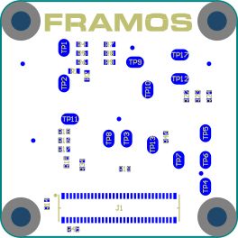

FSA-FTx/A
============

The following chapters provide the relevant technical information for sensor modules (FSM) with native MIPI CSI-2 data output.

A setup with single or multiple sensor modules consists of one to four FSMs, each with an appropriate sensor-specific FSA, and one FPA for the target processor board. Only FSA and FPA designs shown in this chapter are compatible with each other.

|image1|

While the FRAMOS Sensor Modules (FSM) are designed for maximum efficiency, the FRAMOS Sensor Adapters (FSA) support all current sensors and their specific electronic requirements, from voltage rails to reference clock generation. The goal is to reduce noise and heat generation on the image sensor board by shifting these functions to the FSA. Additionally, users have the option to integrate this circuitry into their own processor board designs, aiming to reduce size and redundancy. All electrical references are created and provided on a per-project basis.

**FSA-FTx/A in Detail:**

- Connects FSM with MIPI CSI-2 Output to FPA
- Each FSM has a specific FSA

**Functional Blocks:**

- Signal routing
- Voltage generation for image sensor
- Power-up sequence for image sensor
- Driving frequency generation (oscillator)
- EEPROM (config / ID)

Interface Description
------------------------

|image2|

Sensor Mode Selection
~~~~~~~~~~~~~~~~~~~~~~~~

+-----+--------+------------------+-------------------------------------------------------------+
| Pos | Select | State            | Description                                                 |
+=====+========+==================+=============================================================+
| 1   | ON     | Enabled /        | Enable / Disable EEPROM on FSA.                             |
|     | OFF    | Disabled         | Note: It is recommended to be disabled if FSM is equipped   |
|     |        |                  | with EEPROM.                                                |
+-----+--------+------------------+-------------------------------------------------------------+
| 2   | ON     | High / Low       | Select I2C address of sensor, signal depending on sensor    |
|     | OFF    |                  | type: SLAMODE, SLASEL or SLAMODE1. Please refer to sensor   |
|     |        |                  | documentation for available signals.                        |
+-----+--------+------------------+-------------------------------------------------------------+
| 3   | ON     | High / Low       | Select I2C address of sensor, signal availability depending |
|     | OFF    |                  | on sensor type: SLAMODE2. Please refer to sensor            |
|     |        |                  | documentation for available signals.                        |
+-----+--------+------------------+-------------------------------------------------------------+
| 4   | ON     | High / Low       | Drive XMASTER pin of FSM (see sensor documentation for      |
|     | OFF    |                  | details).                                                   |
+-----+--------+------------------+-------------------------------------------------------------+

**Table: Selection of Sensor Mode on FSA-FTx/A-V1**

Sensor Clock Source Selection
~~~~~~~~~~~~~~~~~~~~~~~~~~~~~~~~~~~~

+-----+---------------------------------------+
| Pos | Description                           |
+=====+=======================================+
| 1   | Clock Provided from FSA (**Default**) |
+-----+---------------------------------------+
| 2   | External Clock 1 (MCLK0)              |
+-----+---------------------------------------+
| 3   | External Clock 2 (MCLK1)              |
+-----+---------------------------------------+

**Table: Selection of Sensor Clock Source on FSA-FTx/A-V1**

Test Points
~~~~~~~~~~~~~~~~

|image4|

+------+--------------------------------+
| Name | Signal                         |
+======+================================+
| TP1  | I2C_0_SCL (SPI_SCK)            |
+------+--------------------------------+
| TP2  | I2C_0_SDA (SPI_MOSI)           |
+------+--------------------------------+
| TP3  | IS_MCLK_0                      |
+------+--------------------------------+
| TP4  | IS_RST_0                       |
+------+--------------------------------+
| TP5  | SLAMODE1                       |
+------+--------------------------------+
| TP6  | SLAMODE2                       |
+------+--------------------------------+
| TP7  | IS_GPIO0 (XMASTER0)            |
+------+--------------------------------+
| TP8  | GND                            |
+------+--------------------------------+
| TP9  | 3V8_VDD                        |
+------+--------------------------------+
| TP10 | 1V8_VDD                        |
+------+--------------------------------+
| TP11 | V_ANA                          |
+------+--------------------------------+
| TP12 | V_IF                           |
+------+--------------------------------+
| TP13 | V_DIG                          |
+------+--------------------------------+
| TP17 | GND                            |
+------+--------------------------------+

**Table: Test Points on FSA-FTx/A-V1**

Connector to FPA
~~~~~~~~~~~~~~~~~~~~

Type: Hirose DF40C-60DP-0.4V 

Name: J1

|image5|

.. role:: blue
   :class: blue

+------+----------------------------+------+----------------------------+
| Pin #| Name                       | Pin #| Name                       |
+======+============================+======+============================+
| 1    | :blue:`3V8_VDD`            | 2    | :blue:`1V8_VDD`            |
+------+----------------------------+------+----------------------------+
| 3    | :blue:`3V8_VDD`            | 4    | :blue:`1V8_VDD`            |
+------+----------------------------+------+----------------------------+
| 5    | :blue:`AUX_ANA`            | 6    | :blue:`AUX_DIG`            |
+------+----------------------------+------+----------------------------+
| 7    | :blue:`AUX_ANA`            | 8    | :blue:`AUX_DIG`            |
+------+----------------------------+------+----------------------------+
| 9    | :blue:`AUX_IF`             | 10   | :blue:`AUX_V`              |
+------+----------------------------+------+----------------------------+
| 11   | GND                        | 12   | GND                        |
+------+----------------------------+------+----------------------------+
| 13   | GND                        | 14   | GND                        |
+------+----------------------------+------+----------------------------+
| 15   | :blue:`RST_0`              | 16   | RST_1                      |
+------+----------------------------+------+----------------------------+
| 17   | GPIO14                     | 18   | GPIO15(SPI_MISO)           |
+------+----------------------------+------+----------------------------+
| 19   | :blue:`GPIO0(XMASTER0)`    | 20   | GPIO8                      |
+------+----------------------------+------+----------------------------+
| 21   | I2C_0_SCL(SPI_SCK)         | 22   | I2C_1_SCL                  |
+------+----------------------------+------+----------------------------+
| 23   | GPIO17(SPI_CS)             | 24   | GPIO16(SYS_PW_EN)          |
+------+----------------------------+------+----------------------------+
| 25   | GPIO1(XVS0)                | 26   | GPIO9                      |
+------+----------------------------+------+----------------------------+
| 27   | I2C_0_SDA(SPI_MOSI)        | 28   | I2C_1_SDA                  |
+------+----------------------------+------+----------------------------+
| 29   | GPIO2(XHS0)                | 30   | GPIO10                     |
+------+----------------------------+------+----------------------------+
| 31   | GPIO3(XTRIG0)              | 32   | GPIO11(FSTROBE)            |
+------+----------------------------+------+----------------------------+
| 33   | PW_EN_0                    | 34   | PW_EN_1                    |
+------+----------------------------+------+----------------------------+
| 35   | :blue:`GPIO6`              | 36   | :blue:`GPIO7`              |
+------+----------------------------+------+----------------------------+
| 37   | GND                        | 38   | GND                        |
+------+----------------------------+------+----------------------------+
| 39   | :blue:`MCLK_0`             | 40   | GPIO4(MCLK2)               |
+------+----------------------------+------+----------------------------+
| 41   | MCLK_1                     | 42   | GPIO5(MCLK3)               |
+------+----------------------------+------+----------------------------+
| 43   | GND                        | 44   | GND                        |
+------+----------------------------+------+----------------------------+
| 45   | D_CLK_1_P                  | 46   | D_DATA_3_P                 |
+------+----------------------------+------+----------------------------+
| 47   | D_CLK_1_N                  | 48   | D_DATA_3_N                 |
+------+----------------------------+------+----------------------------+
| 49   | GND                        | 50   | GND                        |
+------+----------------------------+------+----------------------------+
| 51   | D_DATA_0_N                 | 52   | D_DATA_1_N                 |
+------+----------------------------+------+----------------------------+
| 53   | D_DATA_0_P                 | 54   | D_DATA_1_P                 |
+------+----------------------------+------+----------------------------+
| 55   | GND                        | 56   | GND                        |
+------+----------------------------+------+----------------------------+
| 57   | D_DATA_2_P                 | 58   | D_CLK_0_P                  |
+------+----------------------------+------+----------------------------+
| 59   | D_DATA_2_N                 | 60   | D_CLK_0_N                  |
+------+----------------------------+------+----------------------------+

**Table: Pinout of FSA-FTx/A-V1, connector to FRAMOS Processor Adapter (FPA)**

.. note::
   **Colored signals** are not routed directly to FSM and might be modified by FSA. 
   All other signals are unmodified and passed through right from the image sensor.

J1: Signal Description to FPA (Part 1/2)
~~~~~~~~~~~~~~~~~~~~~~~~~~~~~~~~~~~~~~~~~~~~~~~~~

+------+---------------------+---------+--------------------------------------------------+----------------+------------------+-----------------------------+---------------------------+
| Pin  | Net Name            | I/O     | Primary function description                     | Connected to   | I/O Standard     | I/O State                   | I/O DC Characteristic     |
+======+=====================+=========+==================================================+================+==================+=============================+===========================+
| 1    | 3V8_VDD             | Power   | 3.8V Power Supply (Triggers FSA/FSM power-up)    | LDO_ICs, FSM   |                  |                             | 3V8_VDD=3.7V-5.1V, max.   |
|      |                     |         |                                                  |                |                  |                             | 0.3A                      |
+------+---------------------+---------+--------------------------------------------------+----------------+------------------+-----------------------------+---------------------------+
| 2    | 1V8_VDD             | Power   | 1.8V Power Supply                                | LDO_ICs, FSM   |                  |                             | 1V8_VDD=1.7V-1.9V, max.   |
|      |                     |         |                                                  |                |                  |                             | 0.3A                      |
+------+---------------------+---------+--------------------------------------------------+----------------+------------------+-----------------------------+---------------------------+
| 3    | 3V8_VDD             | Power   | 3.8V Power Supply (Triggers FSA/FSM power-up)    | LDO_ICs, FSM   |                  |                             | 3V8_VDD=3.7V-5.1V, max.   |
|      |                     |         |                                                  |                |                  |                             | 0.3A                      |
+------+---------------------+---------+--------------------------------------------------+----------------+------------------+-----------------------------+---------------------------+
| 4    | 1V8_VDD             | Power   | 1.8V Power Supply                                | LDO_ICs, FSM   |                  |                             | 1V8_VDD=1.7V-1.9V, max.   |
|      |                     |         |                                                  |                |                  |                             | 0.3A                      |
+------+---------------------+---------+--------------------------------------------------+----------------+------------------+-----------------------------+---------------------------+
| 5    | AUX_ANA             | Power   | Not Connected                                    | (FSM)          |                  |                             |                           |
+------+---------------------+---------+--------------------------------------------------+----------------+------------------+-----------------------------+---------------------------+
| 6    | AUX_DIG             | Power   | Not Connected                                    | (FSM)          |                  |                             |                           |
+------+---------------------+---------+--------------------------------------------------+----------------+------------------+-----------------------------+---------------------------+
| 7    | AUX_ANA             | Power   | Not Connected                                    | (FSM)          |                  |                             |                           |
+------+---------------------+---------+--------------------------------------------------+----------------+------------------+-----------------------------+---------------------------+
| 8    | AUX_DIG             | Power   | Not Connected                                    | (FSM)          |                  |                             |                           |
+------+---------------------+---------+--------------------------------------------------+----------------+------------------+-----------------------------+---------------------------+
| 9    | AUX_IF              | Power   | Not Connected                                    | (FSM)          |                  |                             |                           |
+------+---------------------+---------+--------------------------------------------------+----------------+------------------+-----------------------------+---------------------------+
| 10   | AUX_V               | Power   | Not Connected                                    | (FSM)          |                  |                             |                           |
+------+---------------------+---------+--------------------------------------------------+----------------+------------------+-----------------------------+---------------------------+
| 11   | GND                 | GND     | Common Ground                                    |                |                  |                             |                           |
+------+---------------------+---------+--------------------------------------------------+----------------+------------------+-----------------------------+---------------------------+
| 12   | GND                 | GND     | Common Ground                                    |                |                  |                             |                           |
+------+---------------------+---------+--------------------------------------------------+----------------+------------------+-----------------------------+---------------------------+
| 13   | GND                 | GND     | Common Ground                                    |                |                  |                             |                           |
+------+---------------------+---------+--------------------------------------------------+----------------+------------------+-----------------------------+---------------------------+
| 14   | GND                 | GND     | Common Ground                                    |                |                  |                             |                           |
+------+---------------------+---------+--------------------------------------------------+----------------+------------------+-----------------------------+---------------------------+
| 15   | RST_0               | IN      | General reset for FSM, resets image sensor       | Reset_IC       | LVCMOS18 (1.8V)  | Normal: High,               | VILmax=0.36V,             |
|      |                     |         | (XCLR)                                           |                |                  | Reset: Low                  | VIHmin=1.44V              |
+------+---------------------+---------+--------------------------------------------------+----------------+------------------+-----------------------------+---------------------------+
| 16   | RST_1               | IN      | General reset for FSM                            | (Reset_IC)     | LVCMOS18 (1.8V)  | Normal: High,               | VILmax=0.36V,             |
|      |                     |         |                                                  |                |                  | Reset: Low                  | VIHmin=1.44V              |
+------+---------------------+---------+--------------------------------------------------+----------------+------------------+-----------------------------+---------------------------+
| 17   | GPIO14              | IN      |                                                  | FSM            | LVCMOS18 (1.8V)  |                             |                           |
+------+---------------------+---------+--------------------------------------------------+----------------+------------------+-----------------------------+---------------------------+
| 18   | GPIO15(SPI_MISO)    | OUT     |                                                  | FSM            | LVCMOS18 (1.8V)  |                             | VILmax=0.2V,              |
|      |                     |         |                                                  |                |                  |                             | VOHmin=1.6V               |
+------+---------------------+---------+--------------------------------------------------+----------------+------------------+-----------------------------+---------------------------+
| 19   | GPIO0(XMASTER0)     | IN      |                                                  | FSM            | LVCMOS18 (1.8V)  |                             | VILmax=0.36V,             |
|      |                     |         |                                                  |                |                  |                             | VIHmin=1.44V              |
+------+---------------------+---------+--------------------------------------------------+----------------+------------------+-----------------------------+---------------------------+
| 20   | GPIO8               | IN/OUT  |                                                  | FSM            | LVCMOS18 (1.8V)  |                             |                           |
+------+---------------------+---------+--------------------------------------------------+----------------+------------------+-----------------------------+---------------------------+
| 21   | I2C_0_SCL (SPI_SCK) | IN      | I2C SCL for EEPROM and FSM                       | EEPROM, FSM    | LVCMOS18 (1.8V)  |                             | VILmax=0.54V,             |
|      |                     |         |                                                  |                |                  |                             | VIHmin=1.26V              |
+------+---------------------+---------+--------------------------------------------------+----------------+------------------+-----------------------------+---------------------------+
| 22   | I2C_1_SCL           | IN/OUT  | Additional I2C SCL for FSM                       | FSM            | LVCMOS18 (1.8V)  |                             | VILmax=0.54V,             |
|      |                     |         |                                                  |                |                  |                             | VIHmin=1.26V              |
+------+---------------------+---------+--------------------------------------------------+----------------+------------------+-----------------------------+---------------------------+
| 23   | GPIO17(SPI_CS)      | IN/OUT  |                                                  | FSM            | LVCMOS18 (1.8V)  |                             | VILmax=0.36V,             |
|      |                     |         |                                                  |                |                  |                             | VIHmin=1.44V              |
+------+---------------------+---------+--------------------------------------------------+----------------+------------------+-----------------------------+---------------------------+
| 24   | GPIO16 (SYS_PW_EN)  | IN/OUT  | SYS_PW_EN                                        | FSM            | LVCMOS18 (1.8V)  |                             | VILmax=0.36V,             |
|      |                     |         |                                                  |                |                  |                             | VIHmin=1.44V              |
+------+---------------------+---------+--------------------------------------------------+----------------+------------------+-----------------------------+---------------------------+
| 25   | GPIO1(XVS0)         | IN/OUT  | XVS from/to FSM                                  | FSM            | LVCMOS18 (1.8V)  |                             | VILmax=0.36V,             |
|      |                     |         |                                                  |                |                  |                             | VIHmin=1.44V              |
+------+---------------------+---------+--------------------------------------------------+----------------+------------------+-----------------------------+---------------------------+
| 26   | GPIO9               | IN/OUT  |                                                  | FSM            | LVCMOS18 (1.8V)  |                             | VILmax=0.2V,              |
|      |                     |         |                                                  |                |                  |                             | VOHmin=1.6V               |
+------+---------------------+---------+--------------------------------------------------+----------------+------------------+-----------------------------+---------------------------+
| 27   | I2C_0_SDA           | IN/OUT  | I2C SDA for EEPROM and FSM                       | EEPROM, FSM    | LVCMOS18 (1.8V)  |                             | VILmax=0.54V,             |
|      | (SPI_MOSI)          |         |                                                  |                |                  |                             | VIHmin=1.26V              |
+------+---------------------+---------+--------------------------------------------------+----------------+------------------+-----------------------------+---------------------------+
| 28   | I2C_1_SDA           | IN/OUT  | Additional I2C SDA for FSM                       | FSM            | LVCMOS18 (1.8V)  |                             | VILmax=0.54V,             |
|      |                     |         |                                                  |                |                  |                             | VIHmin=1.26V              |
+------+---------------------+---------+--------------------------------------------------+----------------+------------------+-----------------------------+---------------------------+
| 29   | GPIO2(XHS0)         | IN/OUT  | XHS from/to FSM                                  | FSM            | LVCMOS18 (1.8V)  |                             | VILmax=0.36V,             |
|      |                     |         |                                                  |                |                  |                             | VIHmin=1.44V              |
+------+---------------------+---------+--------------------------------------------------+----------------+------------------+-----------------------------+---------------------------+
| 30   | GPIO10              | IN/OUT  |                                                  | FSM            | LVCMOS18 (1.8V)  |                             | VILmax=0.2V,              |
|      |                     |         |                                                  |                |                  |                             | VOHmin=1.6V               |
+------+---------------------+---------+--------------------------------------------------+----------------+------------------+-----------------------------+---------------------------+
| 31   | GPIO3(XTRIG0)       | IN/OUT  | XTRIG for FSM                                    | FSM            | LVCMOS18 (1.8V)  |                             | VILmax=0.36V,             |
|      |                     |         |                                                  |                |                  |                             | VIHmin=1.44V              |
+------+---------------------+---------+--------------------------------------------------+----------------+------------------+-----------------------------+---------------------------+
| 32   | GPIO11(FSTROBE)     | IN/OUT  | FSTROBE from FSM                                 | FSM            | LVCMOS18 (1.8V)  |                             | VILmax=0.36V,             |
|      |                     |         |                                                  |                |                  |                             | VIHmin=1.44V              |
+------+---------------------+---------+--------------------------------------------------+----------------+------------------+-----------------------------+---------------------------+
| 33   | PW_EN_0             | IN      | PW_EN for FSM                                    | FSM            | LVCMOS18 (1.8V)  | Normal: High,               | VILmax=0.36V,             |
|      |                     |         |                                                  |                |                  | Down: Low                   | VIHmin=1.44V              |
+------+---------------------+---------+--------------------------------------------------+----------------+------------------+-----------------------------+---------------------------+

J1: Signal Description to FPA (Part 2/2)
~~~~~~~~~~~~~~~~~~~~~~~~~~~~~~~~~~~~~~~~~~~~~~~

+------+---------------------+---------+------------------------------------------------------------+----------------+------------------+-----------------------------+---------------------------+
| Pin  | Net Name            | I/O     | Primary function description                               | Connected to   | I/O Standard     | I/O State                   | I/O DC Characteristic     |
+======+=====================+=========+============================================================+================+==================+=============================+===========================+
| 34   | PW_EN_1             | IN      | Additional PW_EN for FSM                                   | FSM            | LVCMOS18 (1.8V)  | Normal: High,               | VILmax=0.36V,             |
|      |                     |         |                                                            |                |                  | Pwr Down: Low               | VIHmin=1.44V              |
+------+---------------------+---------+------------------------------------------------------------+----------------+------------------+-----------------------------+---------------------------+
| 35   | GPIO6               | IN      |                                                            | (FSM)          | LVCMOS18 (1.8V)  |                             | VILmax=0.36V,             |
|      |                     |         |                                                            |                |                  |                             | VIHmin=1.44V              |
+------+---------------------+---------+------------------------------------------------------------+----------------+------------------+-----------------------------+---------------------------+
| 36   | GPIO7               | IN      |                                                            | (FSM)          | LVCMOS18 (1.8V)  |                             | VILmax=0.36V,             |
|      |                     |         |                                                            |                |                  |                             | VIHmin=1.44V              |
+------+---------------------+---------+------------------------------------------------------------+----------------+------------------+-----------------------------+---------------------------+
| 37   | GND                 | GND     | Common Ground                                              |                |                  |                             |                           |
+------+---------------------+---------+------------------------------------------------------------+----------------+------------------+-----------------------------+---------------------------+
| 38   | GND                 | GND     | Common Ground                                              |                |                  |                             |                           |
+------+---------------------+---------+------------------------------------------------------------+----------------+------------------+-----------------------------+---------------------------+
| 39   | MCLK_0              | IN CLK  | Master clock 0 (FSM input clock when SW1 in position 2)    | Rotary Switch  | LVCMOS18 (1.8V)  |                             | VILmax=0.36V,             |
|      |                     |         |                                                            |                |                  |                             | VIHmin=1.44V              |
+------+---------------------+---------+------------------------------------------------------------+----------------+------------------+-----------------------------+---------------------------+
| 40   | GPIO4 (MCLK2)       | IN/OUT  |                                                            | FSM            | LVCMOS18 (1.8V)  |                             | VILmax=0.36V,             |
|      |                     |         |                                                            |                |                  |                             | VIHmin=1.44V              |
+------+---------------------+---------+------------------------------------------------------------+----------------+------------------+-----------------------------+---------------------------+
| 41   | MCLK_1              | IN CLK  | Master clock 1 (FSM input clock when SW1 in position 3)    | Rotary Switch  | LVCMOS18 (1.8V)  |                             | VILmax=0.36V,             |
|      |                     |         |                                                            |                |                  |                             | VIHmin=1.44V              |
+------+---------------------+---------+------------------------------------------------------------+----------------+------------------+-----------------------------+---------------------------+
| 42   | GPIO5 (MCLK3)       | IN/OUT  |                                                            | FSM            | LVCMOS18 (1.8V)  |                             | VILmax=0.36V,             |
|      |                     |         |                                                            |                |                  |                             | VIHmin=1.44V              |
+------+---------------------+---------+------------------------------------------------------------+----------------+------------------+-----------------------------+---------------------------+
| 43   | GND                 | GND     | Common Ground                                              |                |                  |                             |                           |
+------+---------------------+---------+------------------------------------------------------------+----------------+------------------+-----------------------------+---------------------------+
| 44   | GND                 | GND     | Common Ground                                              |                |                  |                             |                           |
+------+---------------------+---------+------------------------------------------------------------+----------------+------------------+-----------------------------+---------------------------+
| 45   | D_CLK_1_P           | OUT     | MIPI-CSI2 output clock (1, P)                              | FSM            | MIPI D-PHY       |                             |                           |
+------+---------------------+---------+------------------------------------------------------------+----------------+------------------+-----------------------------+---------------------------+
| 46   | D_DATA_3_P          | OUT     | MIPI-CSI2 output data (3, P)                               | FSM            | MIPI D-PHY       |                             |                           |
+------+---------------------+---------+------------------------------------------------------------+----------------+------------------+-----------------------------+---------------------------+
| 47   | D_CLK_1_N           | OUT     | MIPI-CSI2 output clock (1, N)                              | FSM            | MIPI D-PHY       |                             |                           |
+------+---------------------+---------+------------------------------------------------------------+----------------+------------------+-----------------------------+---------------------------+
| 48   | D_DATA_3_N          | OUT     | MIPI-CSI2 output data (3, N)                               | FSM            | MIPI D-PHY       |                             |                           |
+------+---------------------+---------+------------------------------------------------------------+----------------+------------------+-----------------------------+---------------------------+
| 49   | GND                 | GND     | Common Ground                                              |                |                  |                             |                           |
+------+---------------------+---------+------------------------------------------------------------+----------------+------------------+-----------------------------+---------------------------+
| 50   | GND                 | GND     | Common Ground                                              |                |                  |                             |                           |
+------+---------------------+---------+------------------------------------------------------------+----------------+------------------+-----------------------------+---------------------------+
| 51   | D_DATA_0_N          | OUT     | MIPI-CSI2 output data (0, N)                               | FSM            | MIPI D-PHY       |                             |                           |
+------+---------------------+---------+------------------------------------------------------------+----------------+------------------+-----------------------------+---------------------------+
| 52   | D_DATA_1_N          | OUT     | MIPI-CSI2 output data (1, N)                               | FSM            | MIPI D-PHY       |                             |                           |
+------+---------------------+---------+------------------------------------------------------------+----------------+------------------+-----------------------------+---------------------------+
| 53   | D_DATA_0_P          | OUT     | MIPI-CSI2 output data (0, P)                               | FSM            | MIPI D-PHY       |                             |                           |
+------+---------------------+---------+------------------------------------------------------------+----------------+------------------+-----------------------------+---------------------------+
| 54   | D_DATA_1_P          | OUT     | MIPI-CSI2 output data (1, P)                               | FSM            | MIPI D-PHY       |                             |                           |
+------+---------------------+---------+------------------------------------------------------------+----------------+------------------+-----------------------------+---------------------------+
| 55   | GND                 | GND     | Common Ground                                              |                |                  |                             |                           |
+------+---------------------+---------+------------------------------------------------------------+----------------+------------------+-----------------------------+---------------------------+
| 56   | GND                 | GND     | Common Ground                                              |                |                  |                             |                           |
+------+---------------------+---------+------------------------------------------------------------+----------------+------------------+-----------------------------+---------------------------+
| 57   | D_DATA_2_P          | OUT     | MIPI-CSI2 output data (2, P)                               | FSM            | MIPI D-PHY       |                             |                           |
+------+---------------------+---------+------------------------------------------------------------+----------------+------------------+-----------------------------+---------------------------+
| 58   | D_CLK_0_P           | OUT CLK | MIPI-CSI2 output clock (0, P)                              | FSM            | MIPI D-PHY       |                             |                           |
+------+---------------------+---------+------------------------------------------------------------+----------------+------------------+-----------------------------+---------------------------+
| 59   | D_DATA_2_N          | OUT     | MIPI-CSI2 output data (2, N)                               | FSM            | MIPI D-PHY       |                             |                           |
+------+---------------------+---------+------------------------------------------------------------+----------------+------------------+-----------------------------+---------------------------+
| 60   | D_CLK_0_N           | OUT CLK | MIPI-CSI2 output clock (0, N)                              | FSM            | MIPI D-PHY       |                             |                           |
+------+---------------------+---------+------------------------------------------------------------+----------------+------------------+-----------------------------+---------------------------+

Technical Drawing
-----------------------

|image3|

.. raw:: html

   

      <b>Figure:</b> Technical Drawing of FSA-FTx/A-V1
   

