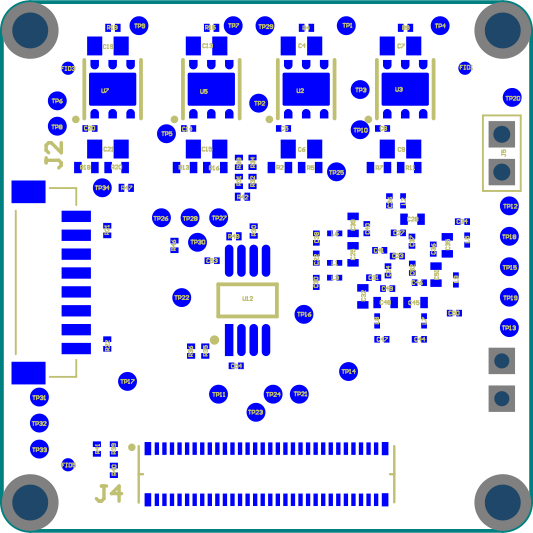

FSA-FTx/A-00G
===================

Ecosystem for Sub-LVDS, SLVS and SLVS-EC Image Sensors
------------------------------------------------------

The following chapters provide the relevant technical information for Sub-LVDS, SLVS, and SLVS-EC sensor modules (FSM), according to the two supported data chains:

- Data conversion to MIPI CSI-2 (D-PHY)
- Native data streaming

Sub-LVDS and SLVS Sensors on MIPI CSI-2
-------------------------------------------------

The Sub-LVDS and SLVS sensor setup with MIPI CSI-2 conversion hardware configuration consists of one or multiple FSMs with Sub-LVDS or SLVS output, each with an appropriate sensor-specific FSA and one FPA for the target processor board. The MIPI CSI-2 conversion takes place on the FSA. Only FSA and FPA designs shown in this chapter are compatible with each other. The FPA defines the maximum number of sensor modules that can be operated per processor board.

|image1|

FSA-FTx/A-00G-V1: FRAMOS Sensor Adapter with LVDS to CSI-2 Conversion
-----------------------------------------------------------------------

- Connects FSM with Sub-LVDS or SLVS data output to FPA with MIPI CSI-2 input.
- Performs image data conversion to MIPI CSI-2 (D-PHY).
- Each FSA variant ("x") might be FSM specific.

|image2|

Functional Blocks
~~~~~~~~~~~~~~~~~~~~~~~~

- Signal routing
- Voltage generation and power-up sequence for image sensor
- Master clock and slave timing generation
- Image data conversion to MIPI CSI-2

Functional Specification
~~~~~~~~~~~~~~~~~~~~~~~~~~~~~

+----------------------+-----------------+-----------------+-----------------+
| Item                 | FSA-FT14/A-00G  | FSA-FT15/A-00G  | FSA-FT18/A-00G  |
+======================+=================+=================+=================+
| Supported FSM        | FSM-IMX264      | FSM-IMX304      | FSM-IMX530      |
+----------------------+-----------------+-----------------+-----------------+
| Color / Mono         | Both            | Both            | Both            |
+----------------------+-----------------+-----------------+-----------------+
| Resolution &         | 2448 x 2048 @   | 4096 x 3000 @   | 5320 x 4600 @   |
| Framerate            | 35FPS           | 23FPS           | 15FPS           |
|                      | 2048 x 1536 @   | 4096 x 2160 @   | 4512 x 4512 @   |
|                      | 47FPS           | 30FPS           | 18FPS           |
|                      | 1920 x 1080 @   | 3840 x 2160 @   | 5328 x 3040 @   |
|                      | 60FPS           | 30FPS           | 22FPS           |
|                      |                 |                 | 4064 x 3008 @   |
|                      |                 |                 | 27FPS           |
|                      |                 |                 | 2660 x 2300 @   |
|                      |                 |                 | 54FPS           |
+----------------------+-----------------+-----------------+-----------------+
| Bit Depth            | 10, 12 bit      | 10, 12 bit      | 10, 12 bit      |
|                      | (RAW)           | (RAW)           | (RAW)           |
+----------------------+-----------------+-----------------+-----------------+
| Input Data Format    | 4-Lane,         | 8-Lane,         | 8-Lane, SLVS    |
|                      | Sub-LVDS        | Sub-LVDS        |                 |
+----------------------+-----------------+-----------------+-----------------+
| Output Data Format   | 4-Lane, MIPI    | 4-Lane, MIPI    | 4-Lane, MIPI    |
|                      | CSI-2 (D-PHY)   | CSI-2 (D-PHY)   | CSI-2 (D-PHY)   |
|                      | @ 594 Mbps      | @ 1188 Mbps     | @ 1188 Mbps     |
+----------------------+-----------------+-----------------+-----------------+
| Operating Mode       | Master, Slave   | Master, Slave   | Master, Slave   |
+----------------------+-----------------+-----------------+-----------------+
| Clock Source         | Internal        | Internal        | Internal        |
|                      | (37.125MHz),    | (37.125MHz),    | (37.125MHz),    |
|                      | or extern via   | or extern via   | or extern via   |
|                      | processor board | processor board | processor board |
+----------------------+-----------------+-----------------+-----------------+
| FW Change/Update     | I2C (int),      | I2C (int),      | I2C (int),      |
|                      | SPI (ext)       | SPI (ext)       | SPI (ext)       |
+----------------------+-----------------+-----------------+-----------------+
| Driver               | NVIDIA Jetson   | NVIDIA Jetson   | NVIDIA Jetson   |
|                      | TX2, AGX Xavier | TX2, AGX Xavier | TX2, AGX Xavier |
|                      | (LibSV and      | (LibSV and      | (LibSV and      |
|                      | Libargus)       | Libargus)       | Libargus)       |
+----------------------+-----------------+-----------------+-----------------+

**Note:** Firmware updates are applied via the processor board over the I2C bus, or using the external SPI interface by attaching an appropriate programmer (Lattice HW-USBN-2B). Updates to the onboard flash are permanent and can only be applied via SPI. Updates via I2C will be lost when power cycling the FSA.

Interface Description
-----------------------------

|image3|

J3: Connector to FSM
~~~~~~~~~~~~~~~~~~~~~~~~~~~~~

- **Label**: J3
- **Type**: DF40HC(4.0)-60DS-0.4V
- **Pinout**: According to FSM

J4: Connector to FPA
~~~~~~~~~~~~~~~~~~~~~~~~~~~

|image4|

- **Label**: J4
- **Type**: DF40C-60DP-0.4V
- **Pinout**: 

+-------+---------------------+-------+----------------------+
| Pin # | Name                | Pin # | Name                 |
+=======+=====================+=======+======================+
| 1     | 3V8_VDD             | 2     | 1V8_VDD              |
+-------+---------------------+-------+----------------------+
| 3     | 3V8_VDD             | 4     | 1V8_VDD              |
+-------+---------------------+-------+----------------------+
| 5     | NC                  | 6     | NC                   |
+-------+---------------------+-------+----------------------+
| 7     | NC                  | 8     | NC                   |
+-------+---------------------+-------+----------------------+
| 9     | NC                  | 10    | NC                   |
+-------+---------------------+-------+----------------------+
| 11    | GND                 | 12    | GND                  |
+-------+---------------------+-------+----------------------+
| 13    | GND                 | 14    | GND                  |
+-------+---------------------+-------+----------------------+
| 15    | RST_0               | 16    | RST_1                |
+-------+---------------------+-------+----------------------+
| 17    | EE_MISO             | 18    | GPIO15(SPI_MISO)     |
+-------+---------------------+-------+----------------------+
| 19    | GPIO0(XMASTER0)     | 20    | EE_MOSI              |
+-------+---------------------+-------+----------------------+
| 21    | I2C_0_SCL(SPI_SCK)  | 22    | NC                   |
+-------+---------------------+-------+----------------------+
| 23    | GPIO17(SPI_CS)      | 24    | GPIO16(SYS_PW_EN)    |
+-------+---------------------+-------+----------------------+
| 25    | GPIO1(XVS0)         | 26    | EE_SCK               |
+-------+---------------------+-------+----------------------+
| 27    | I2C_0_SDA(SPI_MOSI) | 28    | NC                   |
+-------+---------------------+-------+----------------------+
| 29    | GPIO2(XHS0)         | 30    | EE_SS                |
+-------+---------------------+-------+----------------------+
| 31    | GPIO3(XTRIG0)       | 32    | GPIO11               |
+-------+---------------------+-------+----------------------+
| 33    | PW_EN               | 34    | CRESET_B             |
+-------+---------------------+-------+----------------------+
| 35    | GPIO6               | 36    | GPIO7                |
+-------+---------------------+-------+----------------------+
| 37    | GND                 | 38    | GND                  |
+-------+---------------------+-------+----------------------+
| 39    | MCLK_0              | 40    | GPIO4(MCLK2)         |
+-------+---------------------+-------+----------------------+
| 41    | MCLK_1              | 42    | GPIO5(MCLK3)         |
+-------+---------------------+-------+----------------------+
| 43    | GND                 | 44    | GND                  |
+-------+---------------------+-------+----------------------+
| 45    | NC                  | 46    | D_DATA_3_P           |
+-------+---------------------+-------+----------------------+
| 47    | NC                  | 48    | D_DATA_3_N           |
+-------+---------------------+-------+----------------------+
| 49    | GND                 | 50    | GND                  |
+-------+---------------------+-------+----------------------+
| 51    | D_DATA_0_N          | 52    | D_DATA_1_N           |
+-------+---------------------+-------+----------------------+
| 53    | D_DATA_0_P          | 54    | D_DATA_1_P           |
+-------+---------------------+-------+----------------------+
| 55    | GND                 | 56    | GND                  |
+-------+---------------------+-------+----------------------+
| 57    | D_DATA_2_P          | 58    | D_CLK_0_P            |
+-------+---------------------+-------+----------------------+
| 59    | D_DATA_2_N          | 60    | D_CLK_0_N            |
+-------+---------------------+-------+----------------------+

**Table: Pinout of FSA-FTx/A-00G-V1, connector to FRAMOS Processor Adapter (FPA)**

J4: Signal Description
~~~~~~~~~~~~~~~~~~~~~~~~~~~~~~~~~~

+-----+------------------------+---------+-----------------------------------------------+-----------------+--------------+------------+------------------------------+
| Pin | Net Name               | I/O     | Primary Function Description                  | Connected to    | I/O Standard | I/O State  | I/O DC Characteristic        |
+=====+========================+=========+===============================================+=================+==============+============+==============================+
| 1   | 3V8_VDD                | Power   | 3.8V Power Supply                             | LDO_ICs, FSM    |              |            | 3V8_VDD=3.7V-5.1V, max. 0.3A |
+-----+------------------------+---------+-----------------------------------------------+-----------------+--------------+------------+------------------------------+
| 2   | 1V8_VDD                | Power   | 1.8V Power Supply                             | LDO_ICs, FSM    |              |            | 1V8_VDD=1.7V-1.9V, max. 0.3A |
+-----+------------------------+---------+-----------------------------------------------+-----------------+--------------+------------+------------------------------+
| 3   | 3V8_VDD                | Power   | 3.8V Power Supply                             | LDO_ICs, FSM    |              |            | 3V8_VDD=3.7V-5.1V, max. 0.3A |
+-----+------------------------+---------+-----------------------------------------------+-----------------+--------------+------------+------------------------------+
| 4   | 1V8_VDD                | Power   | 1.8V Power Supply                             | LDO_ICs, FSM    |              |            | 1V8_VDD=1.7V-1.9V, max. 0.3A |
+-----+------------------------+---------+-----------------------------------------------+-----------------+--------------+------------+------------------------------+
| 5   | NC                     | -       | Not Connected                                 |                 |              |            |                              |
+-----+------------------------+---------+-----------------------------------------------+-----------------+--------------+------------+------------------------------+
| 6   | NC                     | -       | Not Connected                                 |                 |              |            |                              |
+-----+------------------------+---------+-----------------------------------------------+-----------------+--------------+------------+------------------------------+
| 7   | NC                     | -       | Not Connected                                 |                 |              |            |                              |
+-----+------------------------+---------+-----------------------------------------------+-----------------+--------------+------------+------------------------------+
| 8   | NC                     | -       | Not Connected                                 |                 |              |            |                              |
+-----+------------------------+---------+-----------------------------------------------+-----------------+--------------+------------+------------------------------+
| 9   | NC                     | -       | Not Connected                                 |                 |              |            |                              |
+-----+------------------------+---------+-----------------------------------------------+-----------------+--------------+------------+------------------------------+
| 10  | NC                     | -       | Not Connected                                 |                 |              |            |                              |
+-----+------------------------+---------+-----------------------------------------------+-----------------+--------------+------------+------------------------------+
| 11  | GND                    | GND     | Common Ground                                 |                 |              |            |                              |
+-----+------------------------+---------+-----------------------------------------------+-----------------+--------------+------------+------------------------------+
| 12  | GND                    | GND     | Common Ground                                 |                 |              |            |                              |
+-----+------------------------+---------+-----------------------------------------------+-----------------+--------------+------------+------------------------------+
| 13  | GND                    | GND     | Common Ground                                 |                 |              |            |                              |
+-----+------------------------+---------+-----------------------------------------------+-----------------+--------------+------------+------------------------------+
| 14  | GND                    | GND     | Common Ground                                 |                 |              |            |                              |
+-----+------------------------+---------+-----------------------------------------------+-----------------+--------------+------------+------------------------------+
| 15  | RST_0                  | IN      | General reset for FSA and FSM, resets         | Reset_IC        | LVCMOS18     | Normal:    | VILmax=0.36V,                |
|     |                        |         | Crosslink logic and image sensor (XCLR).      |                 | (1.8V)       | High,      | VIHmin=1.44V                 |
|     |                        |         |                                               |                 |              | Reset: Low |                              |
+-----+------------------------+---------+-----------------------------------------------+-----------------+--------------+------------+------------------------------+
| 16  | RST_1                  | IN      |                                               | Reset_IC        | LVCMOS18     | Normal:    | VILmax=0.36V,                |
|     |                        |         |                                               |                 | (1.8V)       | High,      | VIHmin=1.44V                 |
|     |                        |         |                                               |                 |              | Reset: Low |                              |
+-----+------------------------+---------+-----------------------------------------------+-----------------+--------------+------------+------------------------------+
| 17  | EE_MISO                | OUT     | 4-wire SPI MISO for Crosslink and Flash       | Crosslink,      | LVCMOS18     |            | VOLmax=-0.2V,                |
|     |                        |         | programming                                   | Flash FSM       | (1.8V)       |            | VOHmin=1.6V                  |
+-----+------------------------+---------+-----------------------------------------------+-----------------+--------------+------------+------------------------------+
| 18  | GPIO15(SPI_MISO)       | OUT     |                                               | Crosslink,      | LVCMOS18     |            | VOLmax=-0.2V,                |
|     |                        |         |                                               | Flash FSM       | (1.8V)       |            | VOHmin=1.6V                  |
+-----+------------------------+---------+-----------------------------------------------+-----------------+--------------+------------+------------------------------+
| 19  | GPIO0(XMASTER0)        | IN/OUT  | Connected to Test Point (TP22)                | Test point      | LVCMOS18     |            | VILmax=0.36V,                |
|     |                        |         |                                               |                 | (1.8V)       |            | VIHmin=1.44V                 |
+-----+------------------------+---------+-----------------------------------------------+-----------------+--------------+------------+------------------------------+
| 20  | EE_MOSI                | IN      | 4-wire SPI MOSI for Crosslink and Flash       | Crosslink,      | LVCMOS18     |            | VILmax=0.54V,                |
|     |                        |         | programming                                   | Flash FSM       | (1.8V)       |            | VIHmin=1.26V                 |
+-----+------------------------+---------+-----------------------------------------------+-----------------+--------------+------------+------------------------------+
| 21  | I2C_0_SCL(SPI_SCK)     | IN      | I2C SCL for Crosslink user interface and FSM  | Crosslink, FSM  | LVCMOS18     |            | VILmax=0.2V,                 |
|     |                        |         |                                               |                 | (1.8V)       |            | VOHmin=1.6V                  |
+-----+------------------------+---------+-----------------------------------------------+-----------------+--------------+------------+------------------------------+
| 22  | NC                     | -       | Not Connected                                 |                 |              |            |                              |
+-----+------------------------+---------+-----------------------------------------------+-----------------+--------------+------------+------------------------------+
| 23  | GPIO17(SPI_CS)         | IN      |                                               | FSM             | LVCMOS18     |            | VILmax=0.36V,                |
|     |                        |         |                                               |                 | (1.8V)       |            | VIHmin=1.44V                 |
+-----+------------------------+---------+-----------------------------------------------+-----------------+--------------+------------+------------------------------+
| 24  | GPIO16(SYS_PW_EN)      | IN/OUT  | Connected to Test Point (TP34)                | Test point, FSM | LVCMOS18     |            | VILmax=0.36V,                |
|     |                        |         |                                               |                 | (1.8V)       |            | VIHmin=1.44V                 |
+-----+------------------------+---------+-----------------------------------------------+-----------------+--------------+------------+------------------------------+
| 25  | GPIO1(XVS0)            | IN/OUT  | Multiple FSM synchronization                  | Crosslink       | LVCMOS18     |            | VILmax=0.36V,                |
|     |                        |         |                                               |                 | (1.8V)       |            | VIHmin=1.44V                 |
+-----+------------------------+---------+-----------------------------------------------+-----------------+--------------+------------+------------------------------+
| 26  | EE_SCK                 | IN      | 4-wire SPI SCK for Crosslink and Flash        | Crosslink,      | LVCMOS18     |            | VOLmax=-0.2V,                |
|     |                        |         | programming                                   | Flash FSM       | (1.8V)       |            | VOHmin=1.6V                  |
+-----+------------------------+---------+-----------------------------------------------+-----------------+--------------+------------+------------------------------+
| 27  | I2C_0_SDA(SPI_MOSI)    | IN      | I2C SDA for Crosslink user interface and FSM  | Crosslink, FSM  | LVCMOS18     |            | VILmax=0.54V,                |
|     |                        |         |                                               |                 | (1.8V)       |            | VIHmin=1.26V                 |
+-----+------------------------+---------+-----------------------------------------------+-----------------+--------------+------------+------------------------------+
| 28  | NC                     | -       | Not Connected                                 |                 |              |            |                              |
+-----+------------------------+---------+-----------------------------------------------+-----------------+--------------+------------+------------------------------+
| 29  | GPIO2(XHS0)            | IN/OUT  | Connected to Test Point (TP23)                | Test point      | LVCMOS18     |            | VILmax=0.36V,                |
|     |                        |         |                                               |                 | (1.8V)       |            | VIHmin=1.44V                 |
+-----+------------------------+---------+-----------------------------------------------+-----------------+--------------+------------+------------------------------+
| 30  | EE_SS                  | IN      | 4-wire SPI CS for Crosslink and Flash         | Crosslink,      | LVCMOS18     |            | VILmax=0.36V,                |
|     |                        |         | programming                                   | Flash FSM       | (1.8V)       |            | VIHmin=1.44V                 |
+-----+------------------------+---------+-----------------------------------------------+-----------------+--------------+------------+------------------------------+
| 31  | GPIO3(XTRIG0)          | IN/OUT  | Connected to Test Point (TP24)                | Test point      | LVCMOS18     |            | VILmax=0.36V,                |
|     |                        |         |                                               |                 | (1.8V)       |            | VIHmin=1.44V                 |
+-----+------------------------+---------+-----------------------------------------------+-----------------+--------------+------------+------------------------------+
| 32  | GPIO11                 | OUT     |                                               | FSM             | LVCMOS18     |            | VILmax=0.36V,                |
|     |                        |         |                                               |                 | (1.8V)       |            | VIHmin=1.44V                 |
+-----+------------------------+---------+-----------------------------------------------+-----------------+--------------+------------+------------------------------+
| 33  | PW_EN                  | IN      | FSA Power Enable (Crosslink and FSM)          | LDO_ICs         | LVCMOS18     | Normal:    | VILmax=0.36V,                |
|     |                        |         |                                               |                 | (1.8V)       | High,      | VIHmin=1.44V                 |
|     |                        |         |                                               |                 |              | Down: Low  |                              |
+-----+------------------------+---------+-----------------------------------------------+-----------------+--------------+------------+------------------------------+
| 34  | CRESET_B               | IN      | Reset Crosslink Configuration                 | CrossLink       | LVCMOS18     | Normal:    | VILmax=0.36V, VIHmin=1.44V   |
|     |                        |         |                                               |                 | (1.8V)       | High,      | Reset: Low                   |
+-----+------------------------+---------+-----------------------------------------------+-----------------+--------------+------------+------------------------------+
| 35  | GPIO6                  | IN/OUT  | Connected to Test Point (TP21)                | Test point, FSM | LVCMOS18     | 1A: High,  | VILmax=0.36V, VIHmin=1.44V   |
|     |                        |         |                                               |                 | (1.8V)       | 10: Low    |                              |
+-----+------------------------+---------+-----------------------------------------------+-----------------+--------------+------------+------------------------------+
| 36  | GPIO7                  | IN/OUT  | Connected to Test Point (TP33)                | Test point      |              |            |                              |
+-----+------------------------+---------+-----------------------------------------------+-----------------+--------------+------------+------------------------------+
| 37  | GND                    | GND     | Common Ground                                 |                 |              |            |                              |
+-----+------------------------+---------+-----------------------------------------------+-----------------+--------------+------------+------------------------------+
| 38  | GND                    | GND     | Common Ground                                 |                 |              |            |                              |
+-----+------------------------+---------+-----------------------------------------------+-----------------+--------------+------------+------------------------------+
| 39  | MCLK_0                 | IN CLK  | Master clock 0 (Crosslink input clock when    | Rotary Switch   | LVCMOS18     |            | VILmax=0.36V, VIHmin=1.44V   |
|     |                        |         | SW2 in position 2)                            |                 | (1.8V)       |            |                              |
+-----+------------------------+---------+-----------------------------------------------+-----------------+--------------+------------+------------------------------+
| 40  | GPIO4(MCLK2)           | IN/OUT  | Connected to Test Point (TP32)                | Test point      |              |            |                              |
+-----+------------------------+---------+-----------------------------------------------+-----------------+--------------+------------+------------------------------+
| 41  | MCLK_1                 | IN CLK  | Master clock 1 (Crosslink input clock when    | Rotary Switch   | LVCMOS18     |            | VILmax=0.36V, VIHmin=1.44V   |
|     |                        |         | SW2 in position 3)                            |                 | (1.8V)       |            |                              |
+-----+------------------------+---------+-----------------------------------------------+-----------------+--------------+------------+------------------------------+
| 42  | GPIO5(MCLK3)           | IN/OUT  | Connected to Test Point (TP31)                | Test point      |              |            |                              |
+-----+------------------------+---------+-----------------------------------------------+-----------------+--------------+------------+------------------------------+
| 43  | GND                    | GND     | Common Ground                                 |                 |              |            |                              |
+-----+------------------------+---------+-----------------------------------------------+-----------------+--------------+------------+------------------------------+
| 44  | GND                    | GND     | Common Ground                                 |                 |              |            |                              |
+-----+------------------------+---------+-----------------------------------------------+-----------------+--------------+------------+------------------------------+
| 45  | NC                     | -       | Not Connected                                 |                 |              |            |                              |
+-----+------------------------+---------+-----------------------------------------------+-----------------+--------------+------------+------------------------------+
| 46  | D_DATA_3_P             | OUT     | MIPI-CSI2 output data (3, P)                  | CrossLink       | MIPI D-PHY   |            |                              |
+-----+------------------------+---------+-----------------------------------------------+-----------------+--------------+------------+------------------------------+
| 47  | NC                     | -       | Not Connected                                 |                 |              |            |                              |
+-----+------------------------+---------+-----------------------------------------------+-----------------+--------------+------------+------------------------------+
| 48  | D_DATA_3_N             | OUT     | MIPI-CSI2 output data (3, N)                  | CrossLink       | MIPI D-PHY   |            |                              |
+-----+------------------------+---------+-----------------------------------------------+-----------------+--------------+------------+------------------------------+
| 49  | GND                    | GND     | Common Ground                                 |                 |              |            |                              |
+-----+------------------------+---------+-----------------------------------------------+-----------------+--------------+------------+------------------------------+
| 50  | GND                    | GND     | Common Ground                                 |                 |              |            |                              |
+-----+------------------------+---------+-----------------------------------------------+-----------------+--------------+------------+------------------------------+
| 51  | D_DATA_0_N             | OUT     | MIPI-CSI2 output data (0, N)                  | CrossLink       | MIPI D-PHY   |            |                              |
+-----+------------------------+---------+-----------------------------------------------+-----------------+--------------+------------+------------------------------+
| 52  | D_DATA_1_N             | OUT     | MIPI-CSI2 output data (1, N)                  | CrossLink       | MIPI D-PHY   |            |                              |
+-----+------------------------+---------+-----------------------------------------------+-----------------+--------------+------------+------------------------------+
| 53  | D_DATA_0_P             | OUT     | MIPI-CSI2 output data (0, P)                  | CrossLink       | MIPI D-PHY   |            |                              |
+-----+------------------------+---------+-----------------------------------------------+-----------------+--------------+------------+------------------------------+
| 54  | D_DATA_1_P             | OUT     | MIPI-CSI2 output data (1, P)                  | CrossLink       | MIPI D-PHY   |            |                              |
+-----+------------------------+---------+-----------------------------------------------+-----------------+--------------+------------+------------------------------+
| 55  | GND                    | GND     | Common Ground                                 |                 |              |            |                              |
+-----+------------------------+---------+-----------------------------------------------+-----------------+--------------+------------+------------------------------+
| 56  | GND                    | GND     | Common Ground                                 |                 |              |            |                              |
+-----+------------------------+---------+-----------------------------------------------+-----------------+--------------+------------+------------------------------+
| 57  | D_DATA_2_P             | OUT     | MIPI-CSI2 output data (2, P)                  | CrossLink       | MIPI D-PHY   |            |                              |
+-----+------------------------+---------+-----------------------------------------------+-----------------+--------------+------------+------------------------------+
| 58  | D_CLK_0_P              | OUT CLK | MIPI-CSI2 output clock (0, P)                 | CrossLink       | MIPI D-PHY   |            |                              |
+-----+------------------------+---------+-----------------------------------------------+-----------------+--------------+------------+------------------------------+
| 59  | D_DATA_2_N             | OUT     | MIPI-CSI2 output data (2, N)                  | CrossLink       | MIPI D-PHY   |            |                              |
+-----+------------------------+---------+-----------------------------------------------+-----------------+--------------+------------+------------------------------+
| 60  | D_CLK_0_N              | OUT CLK | MIPI-CSI2 output clock (0, N)                 | CrossLink       | MIPI D-PHY   |            |                              |
+-----+------------------------+---------+-----------------------------------------------+-----------------+--------------+------------+------------------------------+

Firmware Flashing/Configuration
----------------------------------

+----------------------------------------------------------------+-----+-----+------+-----+
| Options \ Switch Pattern                                       |  1  |  2  |  3   |  4  |
+================================================================+=====+=====+======+=====+
| Boot configuration from flash, configuration and flash update  | Off | On  | Off  | On  |
| via SPI enabled (Default)                                      |     |     |      |     |
+----------------------------------------------------------------+-----+-----+------+-----+
| Configuration from host via I2C                                | On  | Off | On   | Off |
+----------------------------------------------------------------+-----+-----+------+-----+

**Table: Selection of Sensor Mode on FSA-FTx/A-00G-V1**

FPGA Clock Source Selection
------------------------------

+-----+-----------------------------------------+
| Pos.| Description                             |
+=====+=========================================+
| 1   | Clock provided from FSA (Default)       |
+-----+-----------------------------------------+
| 2   | External clock 1 (MCLK0)                |
+-----+-----------------------------------------+
| 3   | External clock 2 (MCLK1)                |
+-----+-----------------------------------------+

**Table: Selection of Sensor Clock Source on FSA-FTx/A-00G-V1**

Test Points
------------------

|image5|

+------+---------------+------+------------------+-------+-------------------+
| Name | Signal        | Name | Signal           | Name  | Signal            |
+======+===============+======+==================+=======+===================+
| TP1  | PW_EN1        | TP13 | IS_MCLK          | TP25  | XTRIG2            |
+------+---------------+------+------------------+-------+-------------------+
| TP2  | V_ANA         | TP14 | GND              | TP26  | GPIO11(TOUT0)     |
+------+---------------+------+------------------+-------+-------------------+
| TP3  | GND           | TP15 | XHS              | TP27  | GPIO8(TOUT1)      |
+------+---------------+------+------------------+-------+-------------------+
| TP4  | PW_EN2        | TP16 | IS_RST           | TP28  | GPIO9(TOUT2)      |
+------+---------------+------+------------------+-------+-------------------+
| TP5  | AUX_V         | TP17 | GND              | TP29  | GPIO16            |
+------+---------------+------+------------------+-------+-------------------+
| TP6  | GND           | TP18 | XMASTER          | TP30  | GND               |
+------+---------------+------+------------------+-------+-------------------+
| TP7  | PW_EN3        | TP19 | XVS              | TP31  | GPIO5(MCLK3)      |
+------+---------------+------+------------------+-------+-------------------+
| TP8  | V_DIG         | TP20 | GND              | TP32  | GPIO4(MCLK2)      |
+------+---------------+------+------------------+-------+-------------------+
| TP9  | PW_EN4        | TP21 | GPIO6            | TP33  | GPIO7             |
+------+---------------+------+------------------+-------+-------------------+
| TP10 | V_IF          | TP22 | GPIO0(XMASTER0)  | TP34  | GPIO16(SYS_PW_EN) |
+------+---------------+------+------------------+-------+-------------------+
| TP11 | GPIO1(XVS0)   | TP23 | GPIO2(XHS0)      |       |                   |
+------+---------------+------+------------------+-------+-------------------+
| TP12 | XTRIG         | TP24 | GPIO3(XTRIG)     |       |                   |
+------+---------------+------+------------------+-------+-------------------+

**Table: Test Points on FSA-FTx/A-00G-V1**

Technical Drawing
------------------

|image6|

