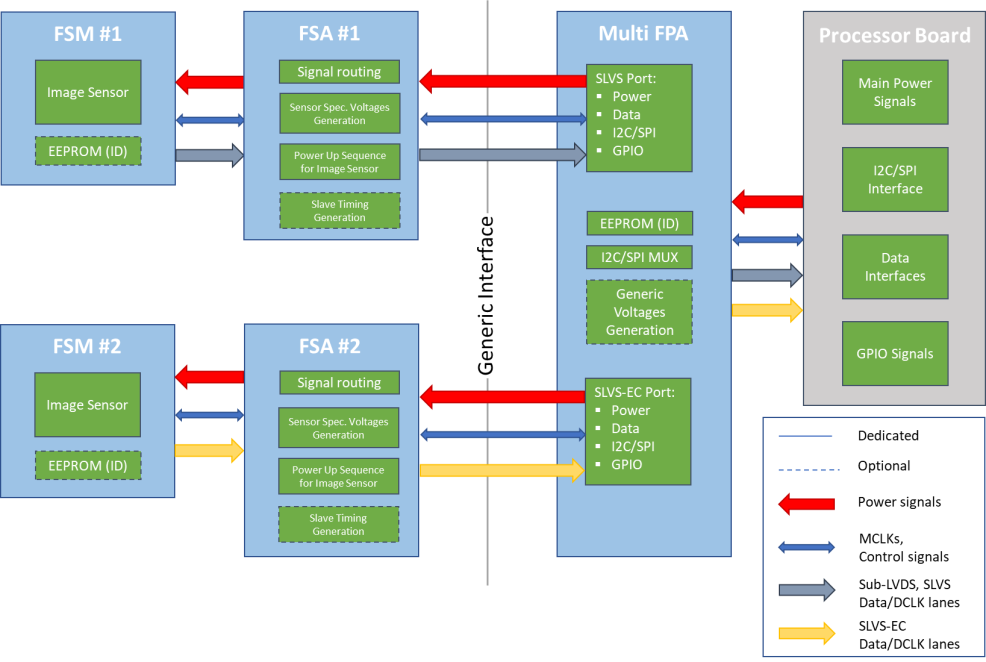
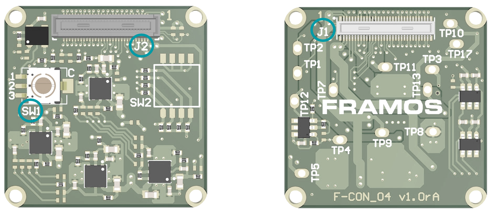
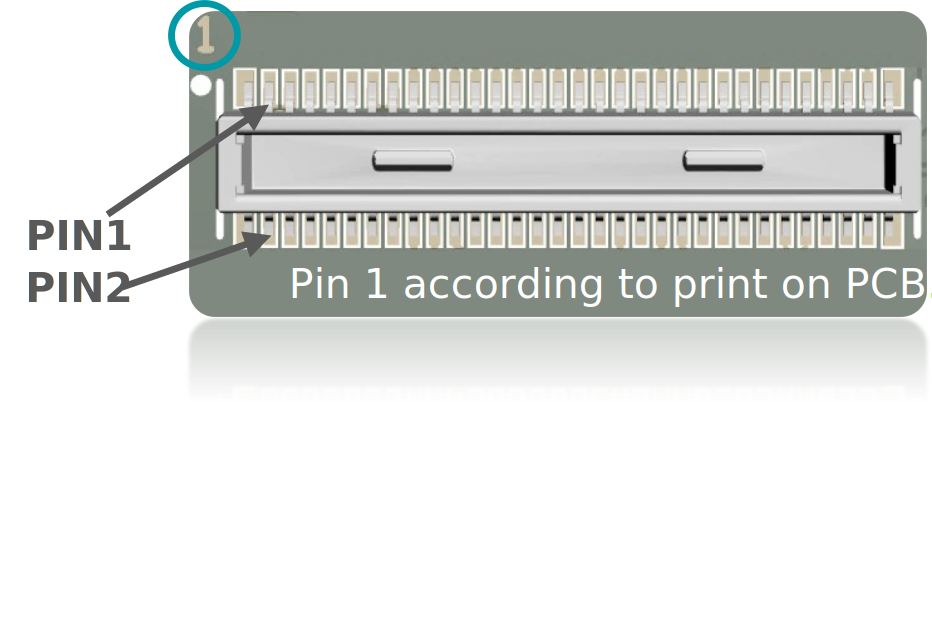
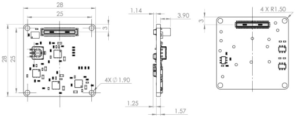

FSA-FTx/BC
===================

Ecosystem for Sub-LVDS, SLVS, and SLVS-EC Image Sensors
-------------------------------------------------------

The following chapters provide the relevant technical information for Sub-LVDS, SLVS, and SLVS-EC sensor modules (FSM), according to the two supported data chains:

- Data conversion to MIPI CSI-2 (D-PHY)
- Native data streaming

Pure Sub-LVDS, SLVS, or SLVS-EC Chain
-------------------------------------

The pure Sub-LVDS, SLVS, and SLVS-EC sensor setup consists of one or multiple FSMs with Sub-LVDS or SLVS output, each with an appropriate sensor-specific FSA and one FPA for the target processor board. No data signal conversion takes place. Only FSA and FPA designs shown in this chapter are compatible with each other. The FPA defines the maximum number of sensor modules that can be operated per processor board.

|image1|

**Figure: Block Diagram of components in Sub-LVDS, SLVS, and SLVS-EC Sensor Setup**

FSA-FTx/BC-V1: FRAMOS Sensor Adapter for Sub-LVDS, SLVS, and SLVS-EC
--------------------------------------------------------------------

- Connects FSM with Sub-LVDS, SLVS, or SLVS-EC output to FPA
- Each FSA variant (“x”) might be FSM specific

|image2|

Functional Blocks
~~~~~~~~~~~~~~~~~~~~~

- Signal routing
- Voltage generation for image sensor
- Power up sequence for image sensor

Interface Description
---------------------------------

|image3|

SW1: Sensor Clock Source Selection
~~~~~~~~~~~~~~~~~~~~~~~~~~~~~~~~~~~~~

+-----+--------------------------------------------+
| Pos.| Description                                |
+=====+============================================+
| 1   | Clock Provided from FSA (Default)          |
+-----+--------------------------------------------+
| 2   | External Clock 1 (MCLK0)                   |
+-----+--------------------------------------------+
| 3   | External Clock 2 (MCLK1)                   |
+-----+--------------------------------------------+

**Table: Selection of Sensor Clock Source on FSA-FTx/A-V1**

J2: Connector to FSM
~~~~~~~~~~~~~~~~~~~~~~~~~~~~~

+--------+----------------------------+
| Label  | J2                         |
+--------+----------------------------+
| Type   | DF40HC(4.0)-60DS-0.4V      |
+--------+----------------------------+
| Pinout | According to FSM           |
+--------+----------------------------+

J1: Connector to FPA
~~~~~~~~~~~~~~~~~~~~~~~~~

|image4|

- **Label:** J1
- **Type:** Hirose DF40C-60DP-0.4V

**Pinout:**

+-----+-------------------------+-------+---------------------------+
| Pin #| Name                   | Pin # | Name                      |
+=====+=========================+=======+===========================+
| 1   | 3V8_VDD                 | 2     | 1V8_VDD                   |
+-----+-------------------------+-------+---------------------------+
| 3   | 3V8_VDD                 | 4     | 1V8_VDD                   |
+-----+-------------------------+-------+---------------------------+
| 5   | AUX_ANA                 | 6     | AUX_DIG                   |
+-----+-------------------------+-------+---------------------------+
| 7   | AUX_ANA                 | 8     | AUX_DIG                   |
+-----+-------------------------+-------+---------------------------+
| 9   | AUX_IF                  | 10    | AUX_V                     |
+-----+-------------------------+-------+---------------------------+
| 11  | GND                     | 12    | GND                       |
+-----+-------------------------+-------+---------------------------+
| 13  | GND                     | 14    | GND                       |
+-----+-------------------------+-------+---------------------------+
| 15  | I2C_0_SDA(SPI_MOSI)     | 16    | I2C_0_SCL(SPI_SCK)        |
+-----+-------------------------+-------+---------------------------+
| 17  | SDO                     | 18    | XCE                       |
+-----+-------------------------+-------+---------------------------+
| 19  | TOUT0                   | 20    | GPIO6                     |
+-----+-------------------------+-------+---------------------------+
| 21  | TOUT1                   | 22    | GPIO0(XMASTER)            |
+-----+-------------------------+-------+---------------------------+
| 23  | TOUT2                   | 24    | GPIO7                     |
+-----+-------------------------+-------+---------------------------+
| 25  | GPIO16                  | 26    | XTRIG1                    |
+-----+-------------------------+-------+---------------------------+
| 27  | GPIO14                  | 28    | XHS                       |
+-----+-------------------------+-------+---------------------------+
| 29  | GPIO10                  | 30    | XVS                       |
+-----+-------------------------+-------+---------------------------+
| 31  | GND                     | 32    | GND                       |
+-----+-------------------------+-------+---------------------------+
| 33  | RST_0                   | 34    | D_DATA_7_P                |
+-----+-------------------------+-------+---------------------------+
| 35  | MCLK_0                  | 36    | D_DATA_7_N                |
+-----+-------------------------+-------+---------------------------+
| 37  | GND                     | 38    | GND                       |
+-----+-------------------------+-------+---------------------------+
| 39  | D_DATA_6_P              | 40    | D_DATA_5_P                |
+-----+-------------------------+-------+---------------------------+
| 41  | D_DATA_6_N              | 42    | D_DATA_5_N                |
+-----+-------------------------+-------+---------------------------+
| 43  | GND                     | 44    | GND                       |
+-----+-------------------------+-------+---------------------------+
| 45  | D_DATA_4_P              | 46    | D_DATA_3_P                |
+-----+-------------------------+-------+---------------------------+
| 47  | D_DATA_4_N              | 48    | D_DATA_3_N                |
+-----+-------------------------+-------+---------------------------+
| 49  | GND                     | 50    | GND                       |
+-----+-------------------------+-------+---------------------------+
| 51  | D_DATA_2_P              | 52    | D_DATA_1_P                |
+-----+-------------------------+-------+---------------------------+
| 53  | D_DATA_2_N              | 54    | D_DATA_1_N                |
+-----+-------------------------+-------+---------------------------+
| 55  | GND                     | 56    | GND                       |
+-----+-------------------------+-------+---------------------------+
| 57  | D_DATA_0_P              | 58    | D_CLK_0_P                 |
+-----+-------------------------+-------+---------------------------+
| 59  | D_DATA_0_N              | 60    | D_CLK_0_N                 |
+-----+-------------------------+-------+---------------------------+

**Table: Pinout of FSA-FTx/BC-V1, connector to FRAMOS Processor Adapter (FPA) with Sub-LVDS, SLVS or SLVS-EC input**

J1: Signal Description
~~~~~~~~~~~~~~~~~~~~~~~~~~~

.. list-table:: Ecosystem Compatibility Matrix – Native CSI-2 (D-PHY) FSMs
   :widths: auto
   :header-rows: 1
   :align: center

   * - Item
     - FSM-IMX290, FSM-IMX327, FSM-IMX334, FSM-IMX335, FSM-IMX462, FSM-IMX464, FSM-IMX477, FSM-IMX485
     - FSM-IMX296, FSM-IMX297
     - FSM-AR0521, FSM-AR1335
     - FSM-IMX415, FSM-IMX715
     - FSM-IMX283
     - FSM-AR0144
     - FSM-HDP230
     - FSM-IMX565, FSM-IMX568, FSM-IMX585, FSM-IMX662, FSM-IMX675, FSM-IMX678
   * - FSA-FT1/A
     - FPA-4.4/TXA  
       FPA-A/N/V/N  
       FPA-2.4/9GB  
       FPA-ABC/XX/1
     - 
     - 
     - 
     - 
     - 
     - 
     - 
   * - FSA-FT3/A
     - FPA-4.4/TXA  
       FPA-A/N/V/N  
       FPA-2.4/9GB  
       FPA-ABC/XX/12
     - 
     - 
     - 
     - 
     - 
     - 
   * - FSA-FT6/A
     - 
     - FPA-4.4/TXA  
       FPA-A/N/V/N  
       FPA-2.4/9GB  
       FPA-ABC/XX/12
     - 
     - 
     - 
     - 
     - 
   * - FSA-FT7/A
     - 
     - FPA-4.4/TXA  
       FPA-A/N/V/N  
       FPA-2.4/9GB  
       FPA-ABC/XX/12
     - FPA-4.4/TXA  
       FPA-A/N/V/N  
       FPA-2.4/9GB  
       FPA-ABC/XX/12
     - 
     - 
     - 
     - 
   * - FSA-FT11/A
     - 
     - 
     - 
     - FPA-4.4/TXA  
       FPA-A/N/V/N  
       FPA-2.4/9GB  
       FPA-ABC/XX/12
     - 
     - 
     - 
   * - FSA-FT12/A
     - 
     - 
     - 
     - 
     - FPA-4.4/TXA  
       FPA-A/N/V/N  
       FPA-2.4/9GB  
       FPA-ABC/XX/12
     - 
     - 
   * - FSA-FT13/A
     - 
     - 
     - 
     - 
     - 
     - FPA-4.4/TXA  
       FPA-A/N/V/N  
       FPA-2.4/9GB  
       FPA-ABC/XX/12
     - 
   * - FSA-FT19/A
     - 
     - 
     - 
     - 
     - 
     - 
     - FPA-4.4/TXA  
       FPA-A/N/V/N  
       FPA-2.4/9GB  
       FPA-ABC/XX/12
   * - FSA-FT26/A
     - 
     - 
     - 
     - 
     - 
     - 
     - 
     - FPA-4.4/TXA  
       FPA-A/N/V/N  
       FPA-2.4/9GB  
       FPA-ABC/XX/12

+-----+--------------------------+--------+-----------------------------------------+-------------------------+-------------------------+----------------+-------------------------------+
| Pin | Net name                 | I/O    | Primary function description            | Connected to            | I/O Standard            | I/O State      | I/O DC Characteristic         |
+=====+==========================+========+=========================================+=========================+=========================+================+===============================+
| 1   | 3V8_VDD                  | Power  | 3.8V Power Supply (Triggers FSA/FSM     | LDO_ICs, FSM            |                         |                | 3V8_VDD=3.7V-5.1V, max. 0.3A  |
|     |                          |        | power-up)                               |                         |                         |                |                               |
+-----+--------------------------+--------+-----------------------------------------+-------------------------+-------------------------+----------------+-------------------------------+
| 2   | 1V8_VDD                  | Power  | 1.8V Power Supply                       | LDO_ICs, FSM            |                         |                | 1V8_VDD=1.7V-1.9V, max. 0.3A  |
+-----+--------------------------+--------+-----------------------------------------+-------------------------+-------------------------+----------------+-------------------------------+
| 3   | 3V8_VDD                  | Power  | 3.8V Power Supply (Triggers FSA/FSM     | LDO_ICs, FSM            |                         |                | 3V8_VDD=3.7V-5.1V, max. 0.3A  |
|     |                          |        | power-up)                               |                         |                         |                |                               |
+-----+--------------------------+--------+-----------------------------------------+-------------------------+-------------------------+----------------+-------------------------------+
| 4   | 1V8_VDD                  | Power  | 1.8V Power Supply                       | LDO_ICs, FSM            |                         |                | 1V8_VDD=1.7V-1.9V, max. 0.3A  |
+-----+--------------------------+--------+-----------------------------------------+-------------------------+-------------------------+----------------+-------------------------------+
| 5   | AUX_ANA                  | Power  | Not Connected                           | (FSM)                   |                         |                |                               |
+-----+--------------------------+--------+-----------------------------------------+-------------------------+-------------------------+----------------+-------------------------------+
| 6   | AUX_DIG                  | Power  | Not Connected                           | (FSM)                   |                         |                |                               |
+-----+--------------------------+--------+-----------------------------------------+-------------------------+-------------------------+----------------+-------------------------------+
| 7   | AUX_ANA                  | Power  | Not Connected                           | (FSM)                   |                         |                |                               |
+-----+--------------------------+--------+-----------------------------------------+-------------------------+-------------------------+----------------+-------------------------------+
| 8   | AUX_DIG                  | Power  | Not Connected                           | (FSM)                   |                         |                |                               |
+-----+--------------------------+--------+-----------------------------------------+-------------------------+-------------------------+----------------+-------------------------------+
| 9   | AUX_IF                   | Power  | Not Connected                           | (FSM)                   |                         |                |                               |
+-----+--------------------------+--------+-----------------------------------------+-------------------------+-------------------------+----------------+-------------------------------+
| 10  | AUX_V                    | Power  | Not Connected                           | (FSM)                   |                         |                |                               |
+-----+--------------------------+--------+-----------------------------------------+-------------------------+-------------------------+----------------+-------------------------------+
| 11  | GND                      | GND    | Common Ground                           |                         |                         |                |                               |
+-----+--------------------------+--------+-----------------------------------------+-------------------------+-------------------------+----------------+-------------------------------+
| 12  | GND                      | GND    | Common Ground                           |                         |                         |                |                               |
+-----+--------------------------+--------+-----------------------------------------+-------------------------+-------------------------+----------------+-------------------------------+
| 13  | GND                      | GND    | Common Ground                           |                         |                         |                |                               |
+-----+--------------------------+--------+-----------------------------------------+-------------------------+-------------------------+----------------+-------------------------------+
| 14  | GND                      | GND    | Common Ground                           |                         |                         |                |                               |
+-----+--------------------------+--------+-----------------------------------------+-------------------------+-------------------------+----------------+-------------------------------+
| 15  | I2C_0_SDA(SPI_MOSI)      | IN/OUT | I2C SDA for FSM. Connected to Test      | Test point, FSM         | LVCMOS18 (1.8V)         |                | VILmax=0.36V, VIHmin=1.44V,   |
|     |                          |        | Point (TP1)                             |                         |                         |                | VOLmax=0.4V, VOHmin=1.4V      |
+-----+--------------------------+--------+-----------------------------------------+-------------------------+-------------------------+----------------+-------------------------------+
| 16  | I2C_0_SCL(SPI_SCK)       | IN     | I2C SCL for FSM. Connected to Test      | Test point, FSM         | LVCMOS18 (1.8V)         |                | VILmax=0.36V, VIHmin=1.44V    |
|     |                          |        | Point (TP2)                             |                         |                         |                |                               |
+-----+--------------------------+--------+-----------------------------------------+-------------------------+-------------------------+----------------+-------------------------------+
| 17  | SDO                      | OUT    |                                         | FSM                     | LVCMOS18 (1.8V)         |                | VOLmax=0.4V, VOHmin=1.4V      |
+-----+--------------------------+--------+-----------------------------------------+-------------------------+-------------------------+----------------+-------------------------------+
| 18  | XCE                      | IN     |                                         | FSM                     | LVCMOS18 (1.8V)         | I2C: High,     | VILmax=0.36V,                 |
|     |                          |        |                                         |                         |                         | 4-wire: Low    | VIHmin=1.44V                  |
+-----+--------------------------+--------+-----------------------------------------+-------------------------+-------------------------+----------------+-------------------------------+
| 19  | TOUT0                    | OUT    | TOUT0 from FSM                          | FSM                     | LVCMOS18 (1.8V)         |                | VOLmax=0.4V, VOHmin=1.4V      |
+-----+--------------------------+--------+-----------------------------------------+-------------------------+-------------------------+----------------+-------------------------------+
| 20  | GPIO6                    | IN     | Slave address select for FSM (SLAMODE0) | FSM                     | LVCMOS18 (1.8V)         | 1A: High,      | VILmax=0.36V, VIHmin=1.44V    |
|     |                          |        |                                         |                         |                         | 10: Low        |                               |
+-----+--------------------------+--------+-----------------------------------------+-------------------------+-------------------------+----------------+-------------------------------+
| 21  | TOUT1                    | OUT    | TOUT1 from FSM                          | FSM                     | LVCMOS18 (1.8V)         |                | VOLmax=0.4V, VOHmin=1.4V      |
+-----+--------------------------+--------+-----------------------------------------+-------------------------+-------------------------+----------------+-------------------------------+
| 22  | GPIO0(XMASTER)           | IN     | XMASTER for FSM. Connected to Test      | Test point, FSM         | LVCMOS18 (1.8V)         | Slave: High,   | VILmax=0.36V,                 |
|     |                          |        | Point (TP7)                             |                         |                         | Master: Low    | VIHmin=1.44V                  |
+-----+--------------------------+--------+-----------------------------------------+-------------------------+-------------------------+----------------+-------------------------------+
| 23  | TOUT2                    | OUT    | TOUT2 from FSM                          | FSM                     | LVCMOS18 (1.8V)         |                | VOLmax=0.4V, VOHmin=1.4V      |
+-----+--------------------------+--------+-----------------------------------------+-------------------------+-------------------------+----------------+-------------------------------+
| 24  | GPIO7                    | IN     | XTRIG2 for FSM                          | FSM                     | LVCMOS18 (1.8V)         |                | VILmax=0.36V, VIHmin=1.44V    |
+-----+--------------------------+--------+-----------------------------------------+-------------------------+-------------------------+----------------+-------------------------------+
| 25  | GPIO16                   | IN     | Slave address select for FSM (SLAMODE1) | FSM                     | LVCMOS18 (1.8V)         |                | VILmax=0.36V, VIHmin=1.44V    |
+-----+--------------------------+--------+-----------------------------------------+-------------------------+-------------------------+----------------+-------------------------------+
| 26  | XTRIG1                   | IN     | XTRIG1 for FSM                          | FSM                     | LVCMOS18 (1.8V)         |                | VILmax=0.36V, VIHmin=1.44V    |
+-----+--------------------------+--------+-----------------------------------------+-------------------------+-------------------------+----------------+-------------------------------+
| 27  | GPIO14                   | IN     | Slave address select for FSM (SLAMODE2) | FSM                     | LVCMOS18 (1.8V)         |                | VILmax=0.36V, VIHmin=1.44V    |
+-----+--------------------------+--------+-----------------------------------------+-------------------------+-------------------------+----------------+-------------------------------+
| 28  | XHS                      | IN/OUT | XHS for FSM                             | FSM                     | LVCMOS18 (1.8V)         |                | VILmax=0.36V, VIHmin=1.44V,   |
|     |                          |        |                                         |                         |                         |                | VOLmax=0.4V, VOHmin=1.4V      |
+-----+--------------------------+--------+-----------------------------------------+-------------------------+-------------------------+----------------+-------------------------------+
| 29  | GPIO10                   | IN     | OMODE for FSM                           | FSM, (Power Sequencer)  | LVCMOS18 (1.8V)         | SLVS-EC: High, | VILmax=0.36V,                 |
|     |                          |        |                                         |                         |                         | SLVS: Low      | VIHmin=1.44V                  |
+-----+--------------------------+--------+-----------------------------------------+-------------------------+-------------------------+----------------+-------------------------------+
| 30  | XVS                      | IN/OUT | Multiple FSM synchronization            | FSM                     | LVCMOS18 (1.8V)         |                | VILmax=0.36V, VIHmin=1.44V,   |
|     |                          |        |                                         |                         |                         |                | VOLmax=0.4V, VOHmin=1.4V      |
+-----+--------------------------+--------+-----------------------------------------+-------------------------+-------------------------+----------------+-------------------------------+
| 31  | GND                      | GND    | Common Ground                           |                         |                         |                |                               |
+-----+--------------------------+--------+-----------------------------------------+-------------------------+-------------------------+----------------+-------------------------------+
| 32  | GND                      | GND    | Common Ground                           |                         |                         |                |                               |
+-----+--------------------------+--------+-----------------------------------------+-------------------------+-------------------------+----------------+-------------------------------+
| 33  | RST_0                    | IN     | General reset for FSM                   | Reset_IC                | LVCMOS18 (1.8V)         | Normal: High,  | VILmax=0.54V,                 |
|     |                          |        |                                         |                         |                         | Reset: Low     | VIHmin=1.26V                  |
+-----+--------------------------+--------+-----------------------------------------+-------------------------+-------------------------+----------------+-------------------------------+
| 34  | D_DATA_7_P               | OUT    | LVDS output data (7, P)                 | FSM                     | LVDS/SLVS/SLVS-EC       |                |                               |
+-----+--------------------------+--------+-----------------------------------------+-------------------------+-------------------------+----------------+-------------------------------+
| 35  | MCLK_0                   | IN CLK | Master clock 0 (SW1 in pos 2 or 3)      | Rotary switch           | LVCMOS18 (1.8V)         |                | VILmax=0.36V, VIHmin=1.44V    |
+-----+--------------------------+--------+-----------------------------------------+-------------------------+-------------------------+----------------+-------------------------------+
| 36  | D_DATA_7_N               | OUT    | LVDS output data (7, N)                 | FSM                     | LVDS/SLVS/SLVS-EC       |                |                               |
+-----+--------------------------+--------+-----------------------------------------+-------------------------+-------------------------+----------------+-------------------------------+
| 37  | GND                      | GND    | Common Ground                           |                         |                         |                |                               |
+-----+--------------------------+--------+-----------------------------------------+-------------------------+-------------------------+----------------+-------------------------------+
| 38  | GND                      | GND    | Common Ground                           |                         |                         |                |                               |
+-----+--------------------------+--------+-----------------------------------------+-------------------------+-------------------------+----------------+-------------------------------+
| 39  | D_DATA_6_P               | OUT    | LVDS output data (6, P)                 | FSM                     | LVDS/SLVS/SLVS-EC       |                |                               |
+-----+--------------------------+--------+-----------------------------------------+-------------------------+-------------------------+----------------+-------------------------------+
| 40  | D_DATA_5_P               | OUT    | LVDS output data (5, P)                 | FSM                     | LVDS/SLVS/SLVS-EC       |                |                               |
+-----+--------------------------+--------+-----------------------------------------+-------------------------+-------------------------+----------------+-------------------------------+
| 41  | D_DATA_6_N               | OUT    | LVDS output data (6, N)                 | FSM                     | LVDS/SLVS/SLVS-EC       |                |                               |
+-----+--------------------------+--------+-----------------------------------------+-------------------------+-------------------------+----------------+-------------------------------+
| 42  | D_DATA_5_N               | OUT    | LVDS output data (5, N)                 | FSM                     | LVDS/SLVS/SLVS-EC       |                |                               |
+-----+--------------------------+--------+-----------------------------------------+-------------------------+-------------------------+----------------+-------------------------------+
| 43  | GND                      | GND    | Common Ground                           |                         |                         |                |                               |
+-----+--------------------------+--------+-----------------------------------------+-------------------------+-------------------------+----------------+-------------------------------+
| 44  | GND                      | GND    | Common Ground                           |                         |                         |                |                               |
+-----+--------------------------+--------+-----------------------------------------+-------------------------+-------------------------+----------------+-------------------------------+
| 45  | D_DATA_4_P               | OUT    | LVDS output data (4, P)                 | FSM                     | LVDS/SLVS/SLVS-EC       |                |                               |
+-----+--------------------------+--------+-----------------------------------------+-------------------------+-------------------------+----------------+-------------------------------+
| 46  | D_DATA_3_P               | OUT    | LVDS output data (3, P)                 | FSM                     | LVDS/SLVS/SLVS-EC       |                |                               |
+-----+--------------------------+--------+-----------------------------------------+-------------------------+-------------------------+----------------+-------------------------------+
| 47  | D_DATA_4_N               | OUT    | LVDS output data (4, N)                 | FSM                     | LVDS/SLVS/SLVS-EC       |                |                               |
+-----+--------------------------+--------+-----------------------------------------+-------------------------+-------------------------+----------------+-------------------------------+
| 48  | D_DATA_3_N               | OUT    | LVDS output data (3, N)                 | FSM                     | LVDS/SLVS/SLVS-EC       |                |                               |
+-----+--------------------------+--------+-----------------------------------------+-------------------------+-------------------------+----------------+-------------------------------+
| 49  | GND                      | GND    | Common Ground                           |                         |                         |                |                               |
+-----+--------------------------+--------+-----------------------------------------+-------------------------+-------------------------+----------------+-------------------------------+
| 50  | GND                      | GND    | Common Ground                           |                         |                         |                |                               |
+-----+--------------------------+--------+-----------------------------------------+-------------------------+-------------------------+----------------+-------------------------------+
| 51  | D_DATA_2_P               | OUT    | LVDS output data (2, P)                 | FSM                     | LVDS/SLVS/SLVS-EC       |                |                               |
+-----+--------------------------+--------+-----------------------------------------+-------------------------+-------------------------+----------------+-------------------------------+
| 52  | D_DATA_1_P               | OUT    | LVDS output data (1, P)                 | FSM                     | LVDS/SLVS/SLVS-EC       |                |                               |
+-----+--------------------------+--------+-----------------------------------------+-------------------------+-------------------------+----------------+-------------------------------+
| 53  | D_DATA_2_N               | OUT    | LVDS output data (2, N)                 | FSM                     | LVDS/SLVS/SLVS-EC       |                |                               |
+-----+--------------------------+--------+-----------------------------------------+-------------------------+-------------------------+----------------+-------------------------------+
| 54  | D_DATA_1_N               | OUT    | LVDS output data (1, N)                 | FSM                     | LVDS/SLVS/SLVS-EC       |                |                               |
+-----+--------------------------+--------+-----------------------------------------+-------------------------+-------------------------+----------------+-------------------------------+
| 55  | GND                      | GND    | Common Ground                           |                         |                         |                |                               |
+-----+--------------------------+--------+-----------------------------------------+-------------------------+-------------------------+----------------+-------------------------------+
| 56  | GND                      | GND    | Common Ground                           |                         |                         |                |                               |
+-----+--------------------------+--------+-----------------------------------------+-------------------------+-------------------------+----------------+-------------------------------+
| 57  | D_DATA_0_P               | OUT    | LVDS output data (0, P)                 | FSM                     | LVDS/SLVS/SLVS-EC       |                |                               |
+-----+--------------------------+--------+-----------------------------------------+-------------------------+-------------------------+----------------+-------------------------------+
| 58  | D_CLK_0_P                | OUT CLK| LVDS output clock (0, P)                | FSM                     | LVDS/SLVS/SLVS-EC       |                |                               |
+-----+--------------------------+--------+-----------------------------------------+-------------------------+-------------------------+----------------+-------------------------------+
| 59  | D_DATA_0_N               | OUT    | LVDS output data (0, N)                 | FSM                     | LVDS/SLVS/SLVS-EC       |                |                               |
+-----+--------------------------+--------+-----------------------------------------+-------------------------+-------------------------+----------------+-------------------------------+
| 60  | D_CLK_0_N                | OUT CLK| LVDS output clock (0, N)                | FSM                     | LVDS/SLVS/SLVS-EC       |                |                               |
+-----+--------------------------+--------+-----------------------------------------+-------------------------+-------------------------+----------------+-------------------------------+

TPx: Test Points
~~~~~~~~~~~~~~~~~~~~~~~~~

+------+-----------------------+------+----------------------+-------+-----------------+
| Name | Signal                | Name | Signal               | Name  | Signal          |
+======+=======================+======+======================+=======+=================+
| TP1  | I2C_0_SDA (SPI_MOSI)  | TP7  | IS_GPIO0 (XMASTER0)  | TP12  | V_IF            |
+------+-----------------------+------+----------------------+-------+-----------------+
| TP2  | I2C_0_SCL (SPI_SCK)   | TP8  | GND                  | TP13  | V_DIG           |
+------+-----------------------+------+----------------------+-------+-----------------+
| TP3  | IS_MCLK_0             | TP9  | 3V8_VDD              | TP17  | GND             |
+------+-----------------------+------+----------------------+-------+-----------------+
| TP4  | IS_RST_0              | TP10 | 1V8_VDD              |       |                 |
+------+-----------------------+------+----------------------+-------+-----------------+
| TP5  | V_ANA-1               | TP11 | V_ANA                |       |                 |
+------+-----------------------+------+----------------------+-------+-----------------+

**Table: Test Points on FSA-FTx/BC-V1**

Technical Drawing
---------------------

|image5|

**Figure: Technical Drawing of FSA-FTx/BC-V1**

.. |image2| image:: FSAFTxBC4.png
   :width: 740px
   :height: 300px

