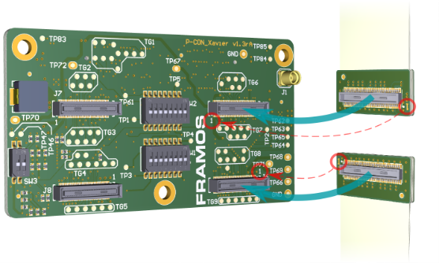
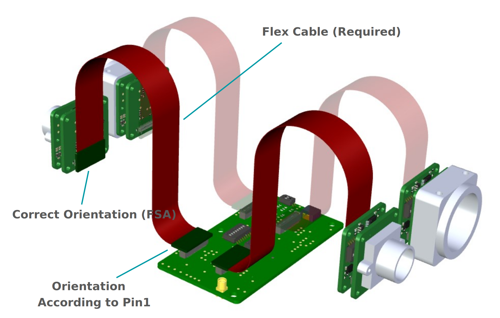

FPA-4.A/TXA Devkit
+++++++++++++++++++++++++++++++++++++++++++++++++++++++++++++++++

Introduction
~~~~~~~~~~~~~~

This guide outlines the assembly process for the FSM-XXXXXXX /TXA Devkit, 
designed for integration with the FPA-4.A/TXA interface and processing boards 
like the NVIDIA Jetson TX2. Detailed instructions are provided to ensure proper 
flex cable connections and module compatibility, emphasizing the importance of 
correct orientation to prevent hardware damage and maximize system functionality.

Assembly Instructions
~~~~~~~~~~~~~~~~~~~~~~~

1. Connect FSA to FPA
=====================================

Connect the other side of the flex cable to a sensor connector on the
FPA. According to the available sensor interface count, multiple FSM+FSA
assemblies can be connected.

|image8|

With processor boards like the NVIDIA Jetson TX2 Development Kit, the
FPA provides access to only two MIPI CSI-2 lanes on FSM3 (J7) and FSM4
(J8). This might lead to restrictions in combination with some FSMs. For
compatibility, please review the connector description of the specific
FPA.

**Warning:** Direct connection of FSM to FPA (without FSA) or wrong
cable orientation will lead to permanent damage of FSM, Adapters or the
Processor Board.

2. Finalize Assembly
====================================

Remove the power supply of the processor board and connect the complete
assembly to the processor board. Follow the guidelines of the processor
board manufacturer for the appropriate camera connector.

|image9|

**Figure**: Correct orientation of Flex Cable in an example Multi-Sensor
Setup (NVIDIA Jetson)

Power up the processing board and start the software setup.

