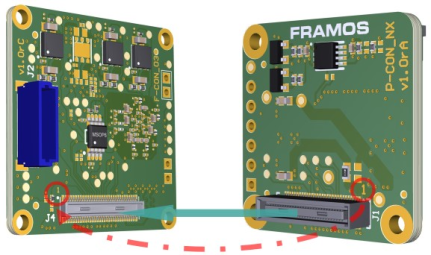
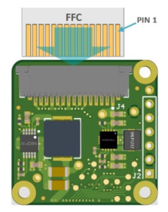
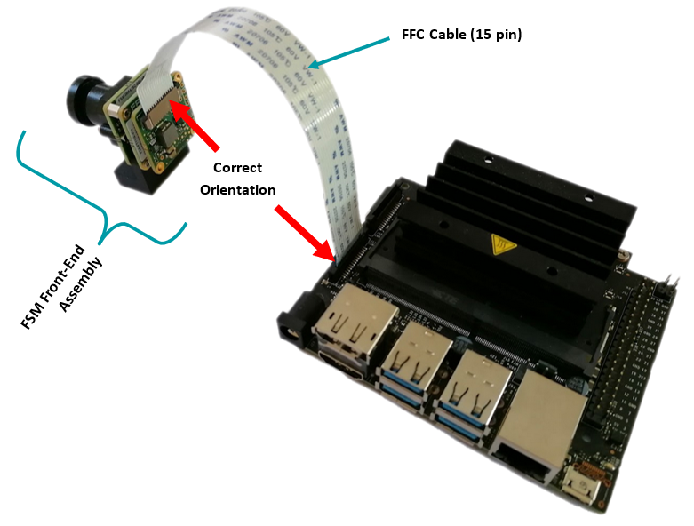

FPA-A/NVN Devkit
++++++++++++++++++++++++++++++++++++++++++

Introduction
~~~~~~~~~~~~~

This section outlines the steps required to assemble and connect the FSM-xxxxxxx/NVN-Devkit,
which includes the FSM (Frame Sensor Module), FSA (Frame Sensor Adapter), and FPA (Frame Processor Adapter).
The following instructions are critical to ensure proper connectivity and functionality of your hardware setup.
Careful attention to connector orientation and cable placement is essential to prevent any damage to the components.

Assembly Instructions
~~~~~~~~~~~~~~~~~~~~~~~

1. Connect FSA to FPA
=====================================

To begin the assembly, connect the FSA to the FPA by aligning and pressing the two 60-pin connectors together.
It is crucial to ensure the correct orientation of these connectors by matching "Pin1" on the FSA to “Pin1” on the FPA.

|image5|

2. Add Flex Cable
=====================================

Next, integrate the flex cable into the FSM-FSA-FPA assembly. 

- Cable Installation: Carefully set the flex cable in the connector, ensuring the proper orientation to avoid pin mismatch.

- Connection to Processing Unit: Attach the complete FSM, FSA, and FPA stack via the flex cable to the appropriate connector on your processing unit, such as the Jetson Nano or Xavier NX.

|image6|

**Warning:** Direct connection of FSM to FPA (without FSA) or wrong
cable orientation will lead to permanent damage of FSM, Adapters or the
Processor Board.

3. Final Assembly
=====================================

Remove the power supply of the carrier board and connect the complete
assembly. Power up the processing board and start the software setup.

|image7|

