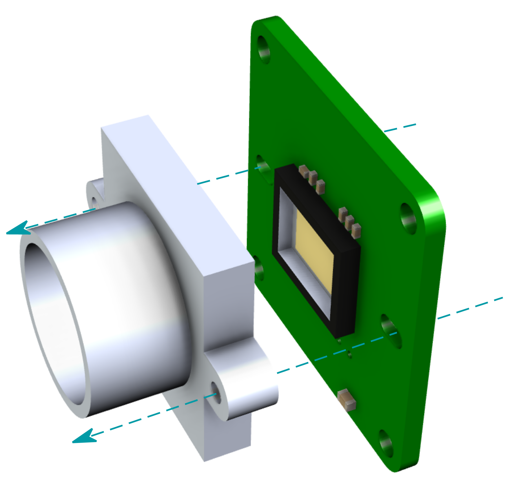
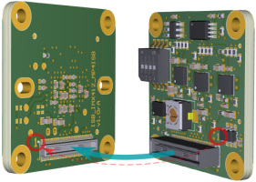
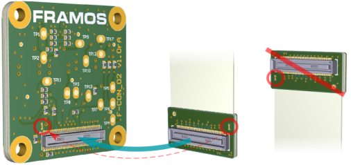
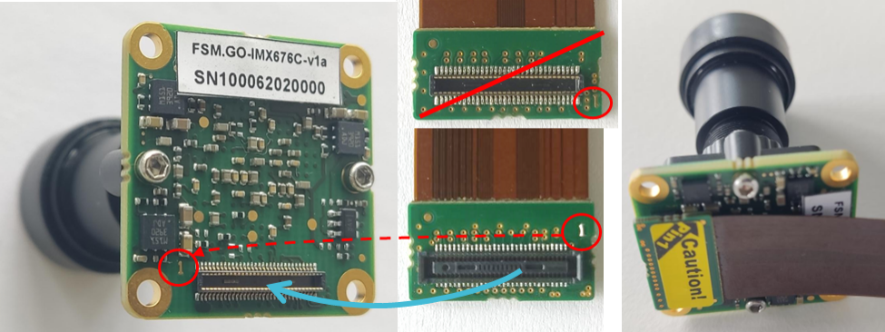

Quickstart
++++++++++++++++++++++++++++++++++++++++++

This chapter provides a general example of the hardware assembly procedure. Note that the actual setup may differ in appearance depending on the components used. However, the primary steps, rules, and cautions
apply to every system.

Hardware Assembly
-----------------

All development kits (Devkits) come pre-assembled.

It is only necessary to connect the FSM, FSA, and Flex Cable assembly
to the FPA and attach it to the appropriate Processor Board.

**Required Materials**

FRAMOS Sensor Module Development Kit or individual components. Note that
‘\ **X**\ ’ represents a placeholder value for the specific product code
you may be using:

-  FSM-IMX\ **XXX**

-  FSA-FT\ **XX**/A

-  FPA-**XXXXXX**

-  FMA-FC-150/60-**XXXX**

-  M12 lens mount (optional)

**Note:** Due to manual alignment requirements for back focal
distance and position, C/CS-mounts are frequently shipped already
attached to the FSM.

.. raw:: html
     
    

1. Add M12 lens mount (optional)
=====================================

Prior to assembling the FSM to the FSA, screw an optional M12 lens mount
to the FSM.

Fitting screws are provided with the lens mount. If assembling a
third-party mount, refer to the technical drawings for the specific
module to confirm the hole diameters and select the appropriate fitting
screws.

.. raw:: html
     

1. Connect FSM and FSA
=============================

Connect the FSM to the FSA by pressing the two 60 pin connectors
together. Watch carefully for the correct connector orientation and the
match of both "Pin1" to “Pin1”.

.. raw:: html
     

Fix the mechanical connection by using the provided screws with distance
holders and nuts between both boards. In the case of a C/CS-mount, screw
the board stack into the lens mount mechanics instead of using the nuts.

1. Add Flex Cable
==========================

Connect the FSM, FSA stack via the connector on the rear side of the FSA to the appropriate side of the FMA-FC-150/60 flex cable.

   **Note:** Skip this step if you are going to connect a “piggy-back” FPA
   like the FPA-A/NVN.

|image1|

   **Warning:** Direct connection of FSM to FPA (without FSA) or wrong
   cable orientation will lead to permanent damage of the FSM, Adapters
   or the Processor Board.

4. Connect to FPA and Processor Board
==========================================

|image2|

For detailed dev kit specific assembly instructions, proceed according to the Devkit type you purchased:

.. toctree::
   :maxdepth: 1

   FPA-A-NVN-Devkit
   FPA-4.A-TXA-DevKit

   
