FPA-4.A/AGX Devkit
++++++++++++++++++++++++++++++++++++++++++

Introduction
~~~~~~~~~~~~~~

This guide provides detailed instructions for assembling the FSM:GO modules
onto the Nvidia Jetson AGX Xavier/Orin Development Kits using the
FPA-4.A/AGX interface.

Adding M12 Lens Mount (Optional)
^^^^^^^^^^^^^^^^^^^^^^^^^^^^^^^^^^

Before proceeding with the full assembly of the FSM:GO module, attach the
optional M12 lens mount if required.

-  **Procedure:** Align the mount with the corresponding threads on the
   FSM:GO module and screw it into place securely.

   **Note:** The FSM:GO sensor module is shipped pre-assembled with a
   default lens mount and lens. If a change is needed:

-  **Guidelines:** Refer to the M12 Lens Kit User Guide for detailed
   instructions on changing the mount.

Assembly Instructions for Different Cabling Solutions
~~~~~~~~~~~~~~~~~~~~~~~~~~~~~~~~~~~~~~~~~~~~~~~~~~~~~~~

Connecting the FSM:GO module to the Nvidia Jetson AGX Xavier/Orin via the
FPA-4.A/AGX interface can be achieved through various cabling options,
each suited for different application needs. Below are detailed
instructions for each cabling solution.

Scenario 1: Flex Cable Connection
^^^^^^^^^^^^^^^^^^^^^^^^^^^^^^^^^^

**Requirements:**

-  FSM:GO module

-  FMA-FC-150/60 Flex Cable

-  FPA-4.A/AGX Interface

**Step 1**: Connecting the FSM:GO Module to Flex Cable

1. **Orientation Check:** Identify pin-1 on both the FSM:GO module and the
   FMA-FC-150/60 flex cable. This is crucial to ensure the correct
   alignment and functionality.

2. **Connection:** Align the 60-pin Pixelmate connectors on the FSM:GO
   module and the flex cable. Carefully press them together until they
   are securely connected.

   |image19|

**Step 2**: Connecting Flex Cable to FPA-4.A/AGX

1. **Connection:** Attach the other end of the FMA-FC-150/60 flex cable
   to one of the sensor connectors on the FPA-4.A/AGX.

2. **Multiple Modules:** Up to four FSM:GO modules can be connected to the
   FPA-4.A/AGX using additional flex cables, allowing for scalability in
   your setup.

   |image20|

   **Note:**

      -  Ensure that the orientation of the connectors is correct before
         pressing them together to avoid damaging the pins.

      -  Visual cues on the connectors can help align the pins correctly; look
         for markings or notches that indicate pin-1.

Scenario 2: FFC Cable Connection
^^^^^^^^^^^^^^^^^^^^^^^^^^^^^^^^^^

**Requirements:**

-  FSM:GO module

-  FFA-FFC40/Kit-0.2m-v1a

-  FMA-FC-150/60 Flex Cable (optional)

-  FPA-4.A/AGX Interface

**Step 1**: Preparing the FFA-FFC40/Kit (Optional)

The FFA-FFC40/Kit typically ships with the FFC cable already
preassembled with appropriate adapter boards.

-  **If not pre-assembled:** Manually attach the FFC cable to the
   adapter boards. Ensure the connectors are fully seated and secure.

-  **Visual Check:** Refer to the provided image to confirm proper
   connection.

**Step 2**: Connecting the FFA-FFC Adapter to the FSM:GO Module

1. **Orientation Check:** Align the 60-pin Pixelmate connectors of the
   FFA-FFC adapter (sensor side) and the FSM:GO module. It's crucial to
   match pin-1 on both connectors to ensure correct orientation.

2. **Connection:** Press the connectors together firmly until they are
   securely engaged.

   |image21|

**Step 3**: Connecting the FFA-FFC Adapter to FPA-4.A/AGX

1. **Orientation Check:** Ensure the correct alignment of the 60-pin
   connectors when connecting the FFA-FFC adapter (processor side) to
   the FPA-4.A/AGX.

2. **Connection:** Firmly press the connectors together, ensuring they
   are properly aligned and locked in place.

   |image22|

**Step 4: Connecting via Flex Cable [Optional]**

-  **Flex Cable Usage:** If additional reach or flexibility is needed,
   connect the FFA-FFC adapter (processor side) to the flex cable
   FMA-FC-150/60, then attach the flex cable to one of the sensor
   connectors on the FPA-4.A/AGX.

-  **Secure Connection:** Verify the orientation and make sure all
   connections are secure.

   |image23|

**Caution:** Incorrect cable or connector orientation can cause
permanent damage to the hardware. Always double-check alignment before
finalizing connections.

Scenario 3: Micro-Coax Cable Connection
^^^^^^^^^^^^^^^^^^^^^^^^^^^^^^^^^^^^^^^^

**Requirements:**

-  FSM:GO module

-  FFA-MC50/Kit-0.3m-v1a

-  FMA-FC-150/60 Flex Cable (optional)

-  FPA-4.A/AGX Interface

**Step 1**: Preparing the FFA-MC50/Kit (Optional)

   The FFA-MC50/Kit typically comes preassembled with the Micro-Coax
   cable and the appropriate adapters.

-  **If not pre-assembled:** Manually attach the Micro-Coax cable to the
   adapter boards. Ensure the connectors are fully seated and secure.

-  **Visual Check:** Refer to the provided image to confirm proper
   connection.

**Step 2**: Connecting the FFA-MC Adapter to the FSM:GO Module

1. **Orientation Check:** Identify pin-1 on both the FSM:GO module and the
   FFA-MC adapter (sensor side). Correct alignment is essential for
   proper functionality.

2. **Connection:** Align and press the 60-pin Pixelmate connectors
   together until they securely engage.

   |image24|

**Step 3**: Connecting the FFA-MC Adapter to FPA-4.A/AGX

1. **Direct Connection:** Connect the FFA-MC adapter (processor side)
   directly to one of the sensor connectors on the FPA-4.A/AGX.

   |image25|

   OR

2. **Optional Flex Cable Usage:** If additional reach or flexibility is
   required, connect the FFA-MC adapter (processor side) to the flex
   cable FMA-FC-150/60. Then, attach the other side of the flex cable to
   one of the sensor connectors on the FPA-4.A/AGX.

   **Note:** Check with R&D for recommendations on using the flex cable
   setup based on specific application needs. 
   
   |image31|

**Caution:** Incorrect cable or connector orientation can cause
permanent damage to the hardware. Always double-check alignment before
finalizing connections.

Scenario 4: GMSL Cable Connection
^^^^^^^^^^^^^^^^^^^^^^^^^^^^^^^^^^^

**Required Materials:**

-  FSM:GO module

-  FFA-GMSL/SerDes-Kit

-  FMA-FC-150/60 Flex Cable (optional)

-  FPA-4.A/AGX Interface

**Step 1**: Connecting the FFA-GMSL-Ser-V2A to the FSM:GO Module

1. **Orientation Check:** Identify and align pin-1 on both the FSM:GO
   module and the FFA-GMSL-Ser-V2A to ensure proper connectivity.

2. **Connection:** Press the 60-pin connectors together firmly until
   they securely engage.

   |image26|

**Step 2**: Connecting the FFA-GMSL-Des-V2A to FPA-4.A/AGX

-  **Option 1 (Direct Connection):** Directly connect the
   FFA-GMSL-Des-V2A to connectors J6 or J8 on the FPA-4.A/AGX for a more
   streamlined setup.

   |image27|

   OR

-  **Option 2 (Using Flex Cable):** If additional length or flexibility
   is needed:

   1. Connect the FFA-GMSL-Des-V2A to the flex cable FMA-FC-150/60.

   2. Attach the other end of the flex cable to a sensor connector on
      the FPA-4.A/AGX.

   **Note:** Verify with R&D about the suitability of using direct
   connections versus the flex cable based on the specific system
   configuration.

   |image28|

**Step 3**: Adding the GMSL Cable and Power Connection

1. **GMSL Cable Connection:** Insert the GMSL cable between the
   FFA-GMSL-Ser-V2A and FFA-GMSL-Des-V2A to establish data transmission
   pathways.

2. **Power Connection:** Attach the power connector to the
   FFA-GMSL-Des-V2A. **Important: Do not switch on the power supply
   yet.** This prevents any potential electrical damage during setup.

   |image29|

   **Caution:**

   -  Incorrect cable or connector orientation can lead to permanent damage
      to the hardware. Always double-check the alignment before making
      connections.

   -  Ensure the power supply is off while making connections to avoid any
      electrical issues.

Scenario 5: No Cable Connection (Optional)
^^^^^^^^^^^^^^^^^^^^^^^^^^^^^^^^^^^^^^^^^^^^

**Context:** Direct connection of the FSM:GO module to the FPA-4.A/AGX is
possible through connectors J6 and J8. This option is suitable for
applications where minimal cabling is preferable.

**Step 1**: Preparing for Connection

-  **Optional Cabling:** If you need to use connectors J5 or J7, you
   must connect the FSM:GO modules to these connectors before mounting
   other modules on J6 or J8 as these connectors will not be accessible
   afterwards.

-  **Choose Connector:** Decide whether to connect directly to J6 or J8
   based on your configuration and accessibility.

**Step 2**: Direct Connection to FPA-4.A/AGX

1. **Connector Selection:** Attach the FSM:GO module directly to either the
   J6 or J8 connector on the FPA-4.A/AGX.

2. **Orientation Check:** Ensure the correct alignment of the 60-pin
   PixelMate connectors by matching pin-1 on both the FSM:GO module and the
   FPA-4.A/AGX connector.

   |image30|

**Caution:**

-  **Incorrect Connector Orientation:** Improper alignment of the
   connectors can lead to permanent damage to both the FSM:GO module and
   the processor board. Always double-check the orientation before
   making any connections.

-  **Access Limitation:** Once the FSM:GO modules are mounted directly on
   connectors J6 or J8, connectors J5 and J7 will no longer be
   accessible. Plan your setup accordingly to avoid any configuration
   issues.

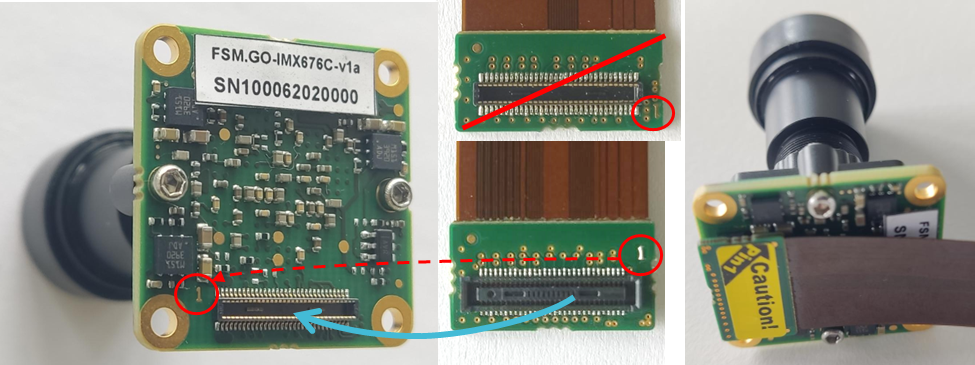
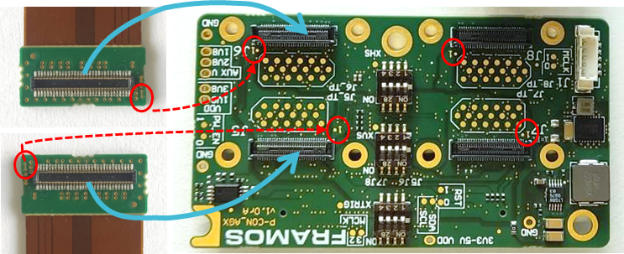
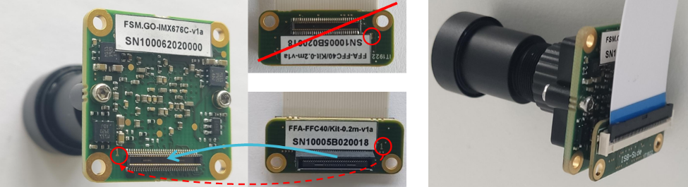
.. |image22| image:: Connect-22s.svg
   :width: 979px
   :height: 270px
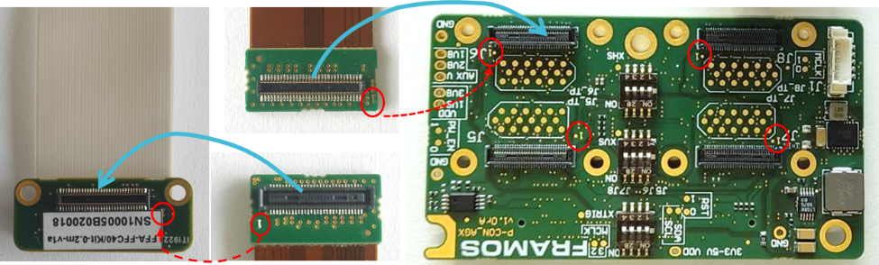
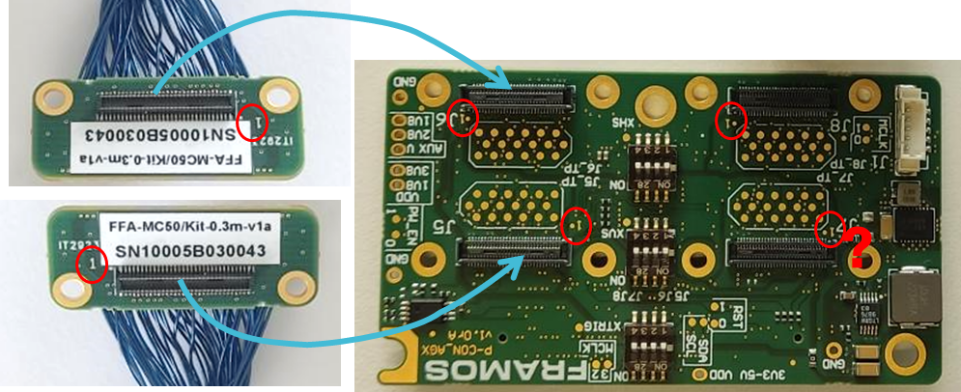
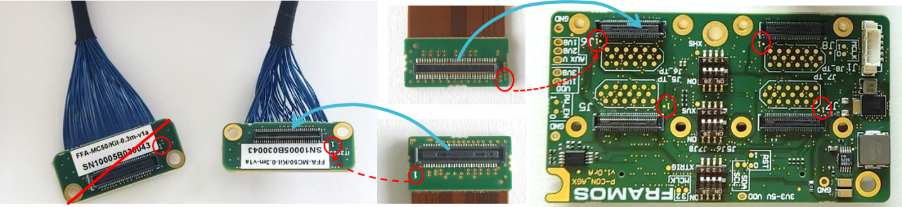
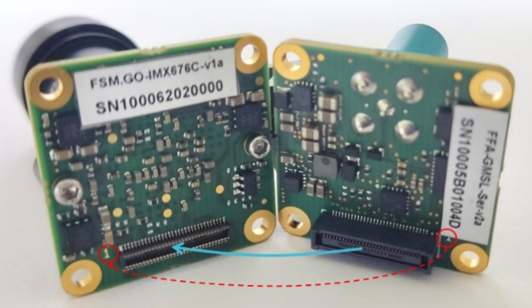
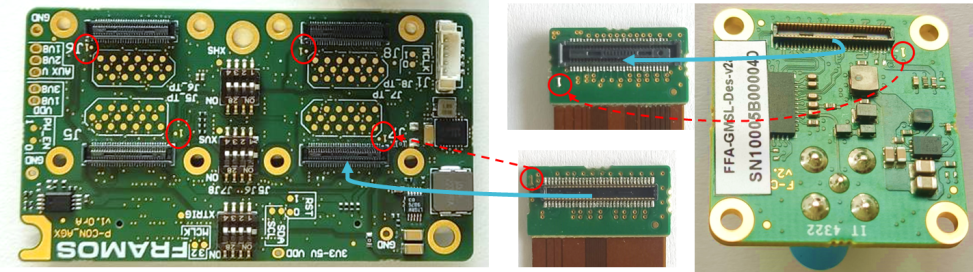
.. |image28| image:: Connect-28s.svg
   :width: 800px
   :height: 300px
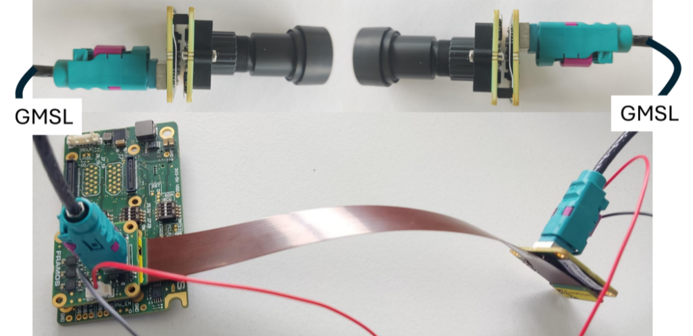
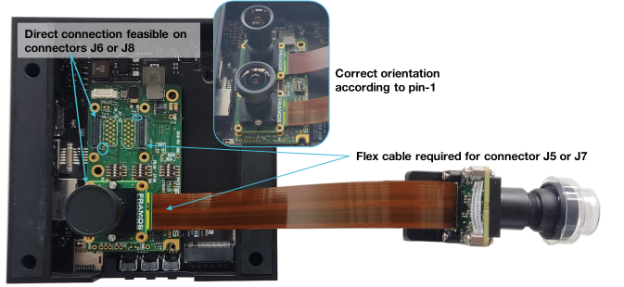
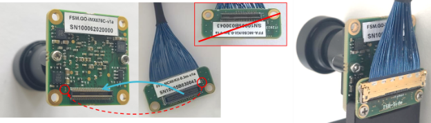