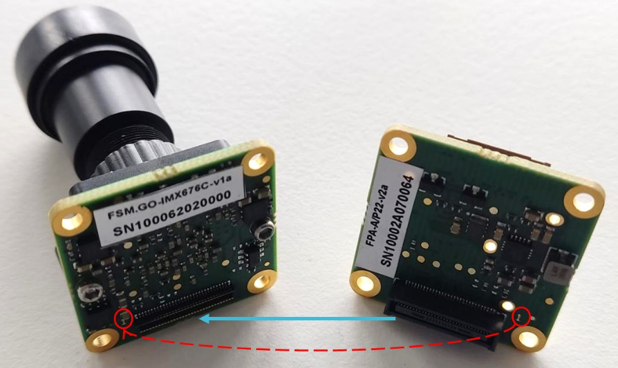
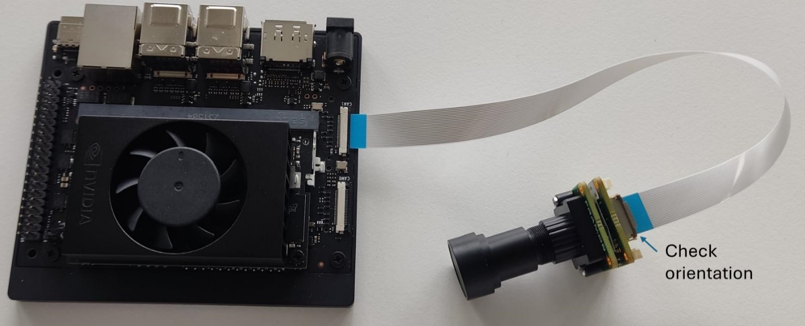
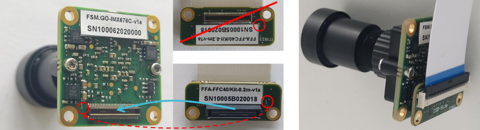
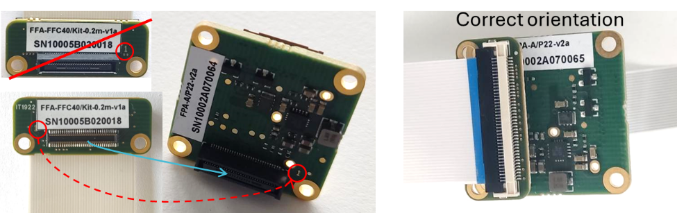
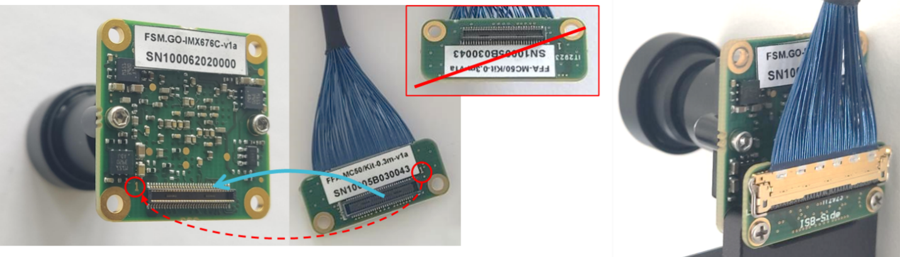
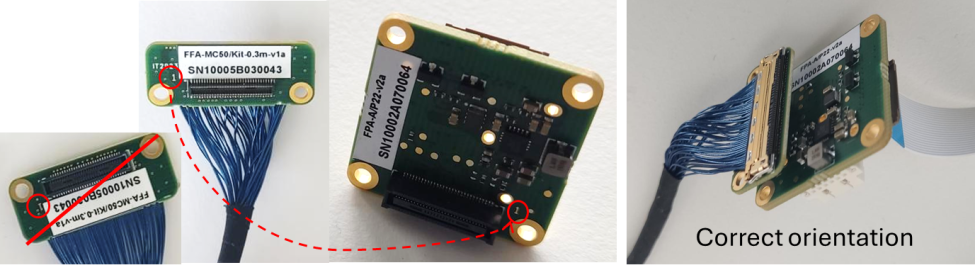
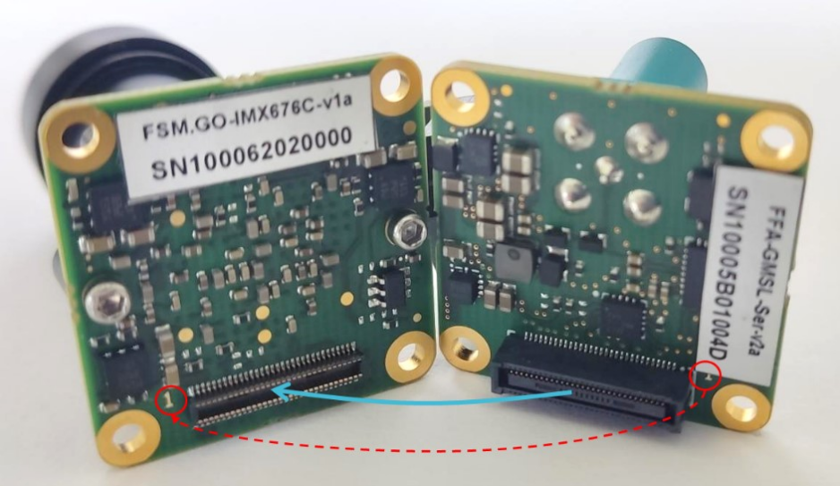
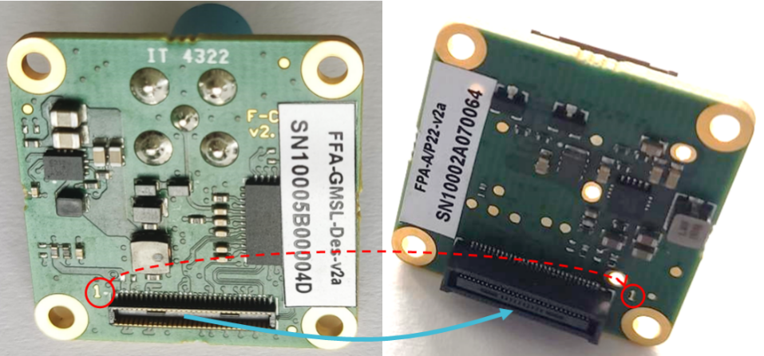
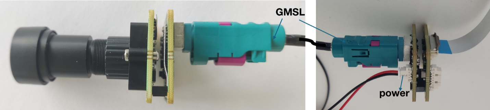

FPA-A/P22-V2A Devkit
++++++++++++++++++++++++++++++++++++++++++

Introduction
~~~~~~~~~~~~

This section covers the assembly instructions for the FSM:GO module
designed to interface with the Nvidia Jetson Orin Nano/NX Development
Kit. This document will guide you through the necessary steps to
correctly assemble and configure your hardware with different cable and
lens mount options.

Pre-assembly Information
^^^^^^^^^^^^^^^^^^^^^^^^^^

The FSM:GO sensor module is typically pre-assembled with a standard lens
mount and the lens of your choice. Should you need to replace or modify
the lens mount, refer to the M12 Lens Kit User Guide. [Insert link to
M12 Lens Kit User Guide here]

Adding a Lens Mount
^^^^^^^^^^^^^^^^^^^^

**Optional: M12 Lens Mount**

Before proceeding with the complete assembly of the FSM:GO module,
you have the option to attach an M12 lens mount. To do this,
simply align the mount with the designated threads on the module and
screw it in place securely.

**Important Note:** Always ensure that the lens mount is securely
fastened to prevent any movement during operation.

Assembly Instructions for Different Cabling Solutions
~~~~~~~~~~~~~~~~~~~~~~~~~~~~~~~~~~~~~~~~~~~~~~~~~~~~~

Connecting the FSM:GO module to the FPA-A/P22-V2A can be achieved through
various cabling solutions. Each option caters to different needs and
setups, ensuring flexibility and efficiency in integration. Below, we
detail the assembly procedures for each type of cable.

Scenario 1: Flex Cable Connection
^^^^^^^^^^^^^^^^^^^^^^^^^^^^^^^^^^

**Requirements:**

-  FSM:GO module

-  FPA-A/P22-V2A connector

-  FMA-CBL-FFC22 Flex Cable

**Procedure:**

**Step 1**: Connecting the FSM:GO Module to FPA-A/P22-V2A

1. **Orientation Check:** Begin by confirming the orientation of the
   60-pin Pixelmate connectors on both the FSM:GO module and the
   FPA-A/P22-V2A. It is critical to align pin-1 of the FSM:GO connector
   with pin-1 on the FPA-A/P22-V2A to avoid any misalignment.

2. **Connection:** Carefully press the connectors together, ensuring
   that they are properly aligned and fully seated.

      |image10|

**8Step 2**: Connecting FPA-A/P22-V2A to Nvidia Jetson

1. **Cable Attachment:** Attach one end of the FMA-CBL-FFC22 flex cable
   to the FPA-A/P22-V2A. Before connecting, check the orientation of the
   cable to ensure correct alignment.

2. **Connecting to Jetson:** Connect the opposite end of the flex cable
   to the CAM0/1 sensor connectors on the Nvidia Jetson Orin Nano/NX
   DevKit. Again, ensure the cable is oriented correctly before
   insertion.

3. **Securing the Connection:** Once both ends are connected, secure
   them by gently pressing down until the clips lock into place,
   ensuring a stable and secure connection.

   |image11|

**Caution:** Incorrect orientation of connectors can cause permanent
damage to both the FSM:GO module and the Nvidia processor board. Always
double-check the alignment before connecting.

Scenario 2: FFC Cable Connection
^^^^^^^^^^^^^^^^^^^^^^^^^^^^^^^^^^

**Requirements:**

-  FSM:GO module

-  FFA-FFC40/Kit-0.2m-v1a

-  FMA-CBL-FFC22 Flex Cable

-  FPA-A/P22-V2A Connector

**Step 1**: Preparing the FFA-FFC40/Kit (Optional)

   The FFA-FFC40/Kit typically ships with the FFC cable pre-assembled to
   the appropriate adapter boards.

-  **If not pre-assembled:** Manually connect the FFC cable to the
   adapter boards. Ensure that the cable is fully seated in the
   connector, which may require gentle pressure.

-  **Visual Check:** Refer to the provided diagram to verify proper
   connection.

   |image12|

**Step 2**: Connecting the FFA-FFC Adapter to the FSM:GO Module

1. **Orientation Check:** Align the 60-pin Pixelmate connectors of the
   FFA-FFC adapter (sensor side) and the FSM:GO module by matching pin-1 of
   both connectors.

2. **Connection:** Press the two connectors together until they are
   fully engaged, ensuring a secure and correct connection.

   |image13|

**Step 3**: Connecting the FFA-FFC Adapter to FPA-A/P22-V2A

1. **Orientation Check:** Similar to Step 2, check the orientation of
   the 60-pin connectors on the FFA-FFC adapter (processor side) and the
   FPA-A/P22-V2A.

2. **Connection:** Firmly press the connectors together, ensuring they
   are properly aligned and locked in place.

**Step 4**: Connecting FPA-A/P22-V2A to Nvidia Jetson

   Connect the FPA-A/P22-V2A to the CAM0/1 sensor connectors on the
   Nvidia Jetson Orin Nano/NX DevKit using the FMA-CBL-FFC22.

-  **Secure Connection:** Make sure that the cable is correctly oriented
   and securely connected at both ends.

**Caution:** Incorrect cable orientation can lead to permanent damage to
the FSM:GO module, the processor board, or both. Always double-check
connector alignment before finalizing connections.

Scenario 3: Micro-Coax Cable Connection
^^^^^^^^^^^^^^^^^^^^^^^^^^^^^^^^^^^^^^^^^

**Requirements:**

-  FSM:GO module

-  FFA-MC50/Kit-0.3m-v1a

-  FMA-CBL-FFC22 Flex Cable

-  FPA-A/P22-V2A Connector

**Step 1**: Preparing the FFA-MC50/Kit (Optional)

   The FFA-MC50/Kit usually comes pre-assembled with the Micro-Coax
   cable attached to the appropriate adapters.

-  **If not pre-assembled:** Attach the Micro-Coax cable to the adapters
   manually. Ensure that the cable connectors are properly seated.

-  **Visual Check:** Use the provided images to verify that the cable is
   correctly attached from both the sensor side and the adapter side.

   |image14|

**Step 2**: Connecting the FFA-MC Adapter to the FSM:GO Module

1. **Orientation Check:** Align the 60-pin connectors of the FFA-MC
   adapter (sensor side) and the FSM:GO module. Match pin-1 of both
   connectors for correct alignment.

2. **Connection:** Firmly press the connectors together until fully
   engaged, ensuring a secure connection.

   |image15|

**Step 3**: Connecting the FFA-MC Adapter to FPA-A/P22-V2A

1. **Orientation Check:** Similar to the previous step, align the 60-pin
   connectors of the FFA-MC adapter (processor side) with the
   FPA-A/P22-V2A. Ensure pin-1 matches on both connectors.

2. **Connection:** Press the connectors together until they are properly
   and securely connected.

**Step 4**: Connecting FPA-A/P22-V2A to Nvidia Jetson

   Connect the FPA-A/P22-V2A to the CAM0/1 sensor connectors on the
   Nvidia Jetson Orin Nano/NX DevKit using the FMA-CBL-FFC22 Flex Cable.

-  **Secure Connection:** Check the orientation and secure the
   connection, ensuring the cable is correctly oriented and locked in
   place.

**Caution:** Incorrect cable orientation can lead to permanent damage to
the FSM:GO module, the processor board, or both. Double-check all connector
alignments before making connections to avoid any mishaps.

Scenario 4: GMSL Cable Connection
^^^^^^^^^^^^^^^^^^^^^^^^^^^^^^^^^^

**Required Materials:**

-  FSM:GO module

-  FFA-GMSL/SerDes-Kit

-  FMA-CBL-FFC22 Flex Cable

-  FPA-A/P22-V2A Connector

**Step 1**: Connecting the FFA-GMSL-Ser-V2A to the FSM:GO Module

1. **Orientation Check:** Ensure the 60-pin connectors of the
   FFA-GMSL-Ser-V2A and the FSM:GO module are correctly aligned by matching
   pin-1 on both connectors.

2. **Connection:** Press the connectors together until they securely
   engage.

   |image16|

**Step 2**: Connecting the FFA-GMSL-Des-V2A to FPA-A/P22-V2A

1. **Orientation Check:** Align the 60-pin connectors of the
   FFA-GMSL-Des-V2A and the FPA-A/P22-V2A, ensuring pin-1 matches on
   both.

2. **Connection:** Firmly press the connectors together to establish a
   secure connection.

   |image17|

**Step 3**: Adding the GMSL Cable and Power Connection

1. **GMSL Cable Connection:** Connect the GMSL cable between the
   FFA-GMSL-Ser-V2A and FFA-GMSL-Des-V2A.

2. **Power Connection:** Attach the power connector to the
   FFA-GMSL-Des-V2A. **Do not switch on the power supply yet.**

   |image18|

**Step 4**: Connecting to Nvidia Jetson

   Connect the flex cable FMA-CBL-FFC22 between the FPA-A/P22-V2A and
   the sensor connectors CAM0/1 on the Nvidia Jetson Orin Nano/NX
   DevKit.

**Caution:** Incorrect cable orientation or premature power supply
activation can cause permanent damage to the FSM:GO module, the processor
board, or both. Ensure all connections are correctly aligned and secure
before applying power.

