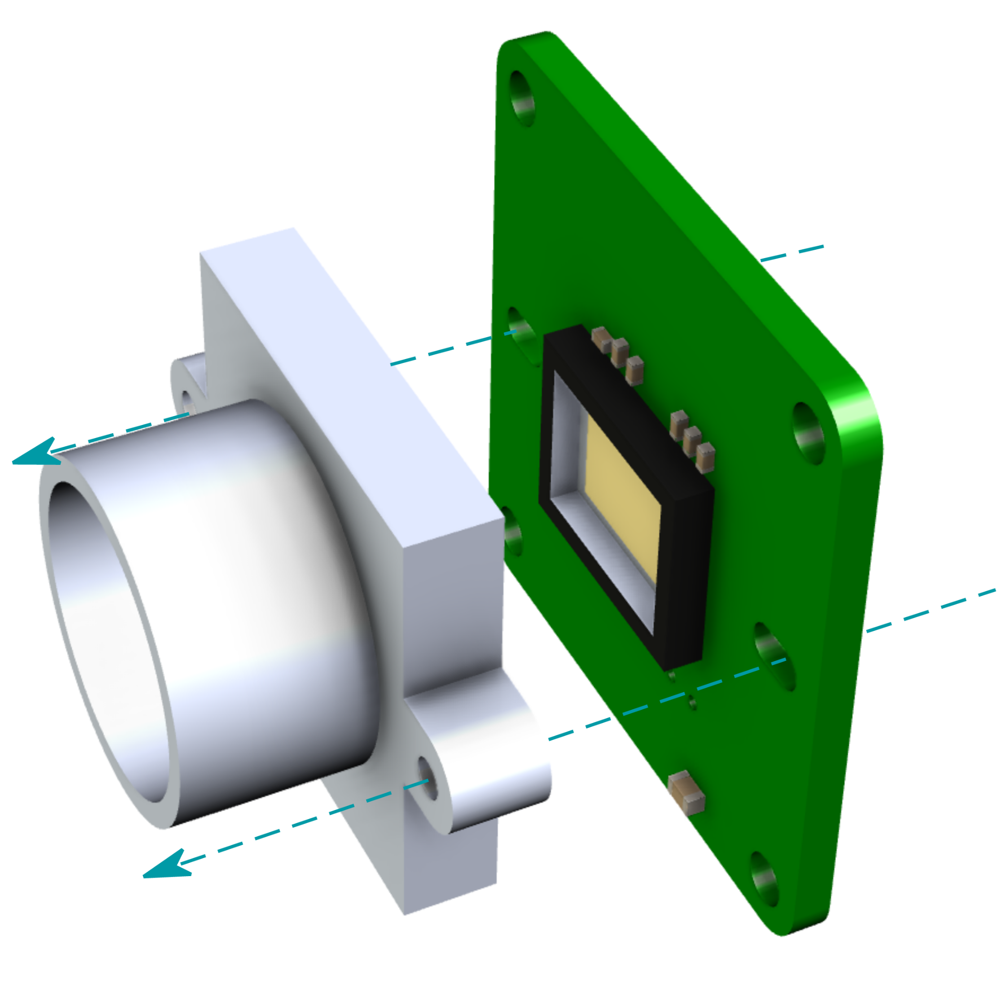
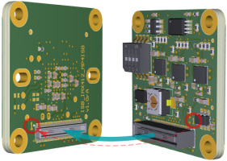
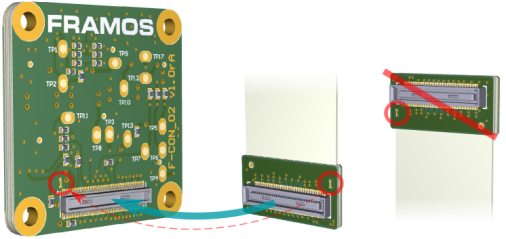

Quickstart
++++++++++++++++++++++++++++++++++++++++++

This chapter provides a general example of the hardware assembly
procedure. Note that the actual setup may differ in appearance depending
on the components used. However, the primary steps, rules, and cautions
apply to every system.

Hardware Assembly
-----------------

All development kits (Devkits) come pre-assembled.

For FSM Go Dev kits, it is only necessary to connect the FSM assembly to the FPA and
attach it to the appropriate Processor Board.

**Required Materials**

FRAMOS Sensor Module Development Kit or individual components. Note that
‘\ **X**\ ’ represents a placeholder value for the specific product code
you may be using:

-  FSM:GO-IMX\ **XXX**

-  FPA-**XXXXXX**

-  FMA-FC-150/60-**XXXX**

-  M12 lens mount (optional)

**Note:** Due to manual alignment requirements for back focal
distance and position, C/CS-mounts are frequently shipped already
attached to the FSM.

1. Add M12 lens mount (optional)
====================================

   .. image:: Connect-1s.svg
      :align: right
      :width: 340px
      :height: 310px

   Prior to assembling the FSM to the FSA, screw an optional M12 lens mount
   to the FSM.

   Fitting screws are provided with the lens mount. If assembling a
   third-party mount, refer to the technical drawings for the specific
   module to confirm the hole diameters and select the appropriate fitting
   screws.

2. Add Flex Cable (optional)
====================================

   Connect the rear side of the FSM:GO module to the appropriate
   side of the FMA-FC-150/60 flex cable by pressing the two 60-pin
   pixelmate connectors together. Ensure the correct orientation by
   matching pin-1 on both connectors before securing the connection.

   |image4|

3. Connect to FPA and Processor Board
=============================================

   For detailed dev kit specific assembly instructions, proceed according to the Devkit type you purchased:

   .. toctree::
      :maxdepth: 1

      FPA-4.A-AGX-Devkit
      FPA-A-P22-V2A-DevKit

.. |image4| image:: Connect-4s.svg
   :width: 700px
   :height: 300px