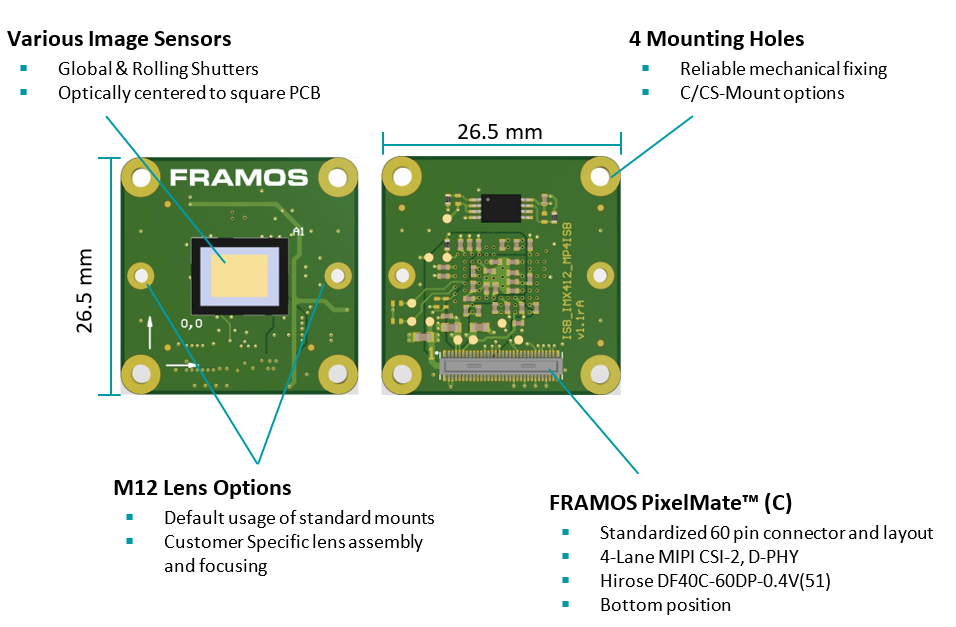
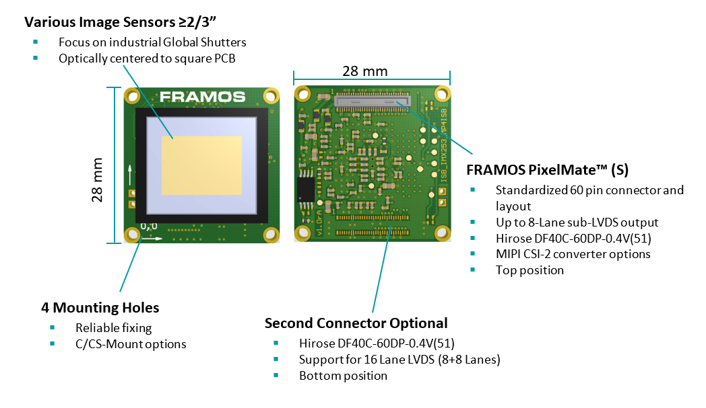

Mechanical Standards
=======================

Generic 26.5 mm footprint
~~~~~~~~~~~~~~~~~~~~~~~~~~~~~~~~~~~~

The Generic 26.5 mm footprint standard is designed for various image sensors, ensuring optical centering on a 26.5 mm square PCB. It supports standard M12 lenses, includes secure mounting options, and features the FRAMOS PixelMate™ connector for high-speed data transmission.

|image1|

Generic 28 mm footprint
~~~~~~~~~~~~~~~~~~~~~~~~~~~~~~~~~~~~

The Generic 28 mm footprint is designed for ≥2/3" image sensors, featuring robust mounting, standard lens options, and the FRAMOS PixelMate™ connector for high-speed data transfer with optional expanded connectivity.

|image2|

