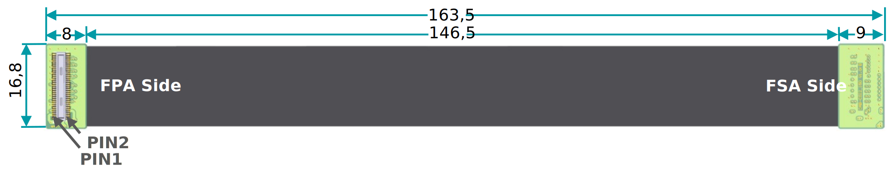
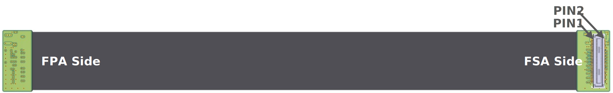
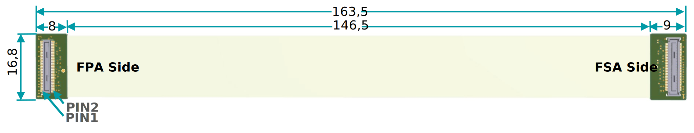
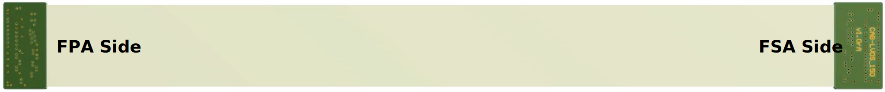

FMA-CBL (Cables)
===============================

FMA-FC-150/60-V1: Flex Cable for MIPI CSI-2 Connections
-------------------------------------------------------

-  FSA to FPA for MIPI CSI-2 connections (mandatory)

-  Extension through “daisy-chaining” possible (maximum length is sensor
   and setup depending)

-  Rigid-flex design (connectors on rigid PCBs)

**Note:** Don’t use for any other connections than for MIPI CSI-2. Might
lead to signal degradation and even damage!

**Flex Cable Connectors**

-  FSA Side: Hirose DF40C-60DS-0.4V

-  FPA Side: Hirose DF40C-60DP-0.4V

-  Pin Assignment: Pin 1 to Pin 1

**Mechanical Drawing**

**Top Side**

|image7|

**Bottom Side**

|image8|

FMA-FC-150/60-LVDS-V1: Flex Cable for Sub-LVDS, SLVS and SLVS-EC Connections
----------------------------------------------------------------------------

-  FSA to FPA for Sub-LVDS, SLVS and SLVS-EC connections (mandatory)

-  Extension through “daisy-chaining” possible (maximum length is sensor
   and setup depending)

-  Rigid-flex design (connectors on rigid PCBs)

**Note:** Don’t use for MIPI CSI-2 connections. Might lead to signal
degradation and even damage!

**Flex Cable Connectors**

-  FSA Side: Hirose DF40C-60DS-0.4V

-  FPA Side: Hirose DF40C-60DP-0.4V

-  Pin Assignment: Pin 1 to Pin 1

**Mechanical Drawing and Pinout**

**Top Side**

|image7|

**Bottom Side**

|image8|

