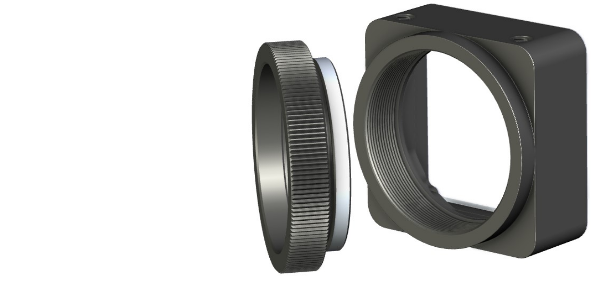
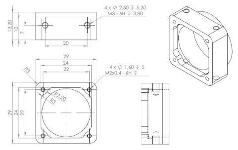
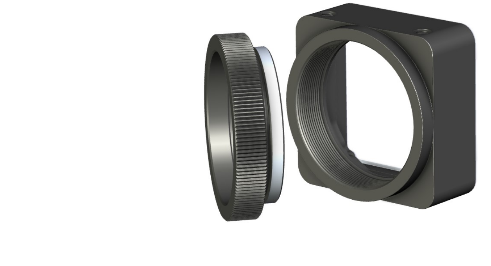
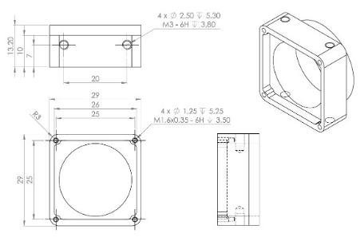

FMA-MNT (Mechanicals)
===============================

FMA-MNT-CCS/260-V1: C/CS-Mount for 26.5mm Footprint
-----------------------------------------------------

|image1|

CS-mount body delivered with 5mm CS- to C-Mount extension ring.

-  Lens Thread: 1-32 UN 2A

-  Extension Ring: CS- to C-Type, BFD + 5 mm

-  Material: AlMgSi0.5

-  Finish: Black Anodizing

-  Optical Filter: Not applicable

**Technical Drawing**

|image2|

**Figure**: CS-Mount Body for 26.5 mm FSM

**Note:** The sensor specific distance of the active pixel layer to PCB
and different types of sensor cover glasses might require adding a
number of 0.1 mm distance rings to raise the flange height. Appropriate
spacers or extension rings are not provided with the lens mount. All
FSMs delivered with this mount applied are adjusted accordingly to meet
the correct back focal distance by C- and CS-Mount standard using thin
foils between mount and PCB.

FMA-MNT-CCS/280-V1: C/CS-Mount for 28mm FSM Footprint
-----------------------------------------------------

|image3|

CS-mount body delivered with 5mm CS- to C-Mount extension ring.

-  Lens Thread: 1-32 UN 2A

-  Extension Ring: CS- to C-Type, BFD + 5 mm

-  Material: AlMgSi0.5

-  Finish: Black Anodizing

-  Optical Filter: Not applicable

**Technical Drawing**

|image4|

**Figure**: CS-Mount Body for 28 mm FSM

**Note:** The sensor specific distance of the active pixel layer to PCB
and different types of sensor cover glasses might require adding a
number of 0.1 mm distance rings to raise the flange height. Appropriate
spacers or extension rings are not provided with the lens mount. All
FSMs delivered with this mount applied are adjusted accordingly to meet
the correct back focal distance by C- and CS-Mount standard using thin
foils between mount and PCB.

