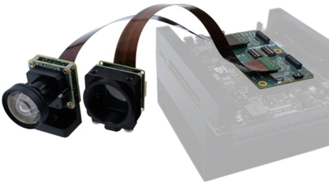
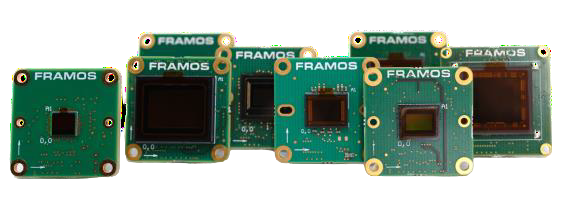
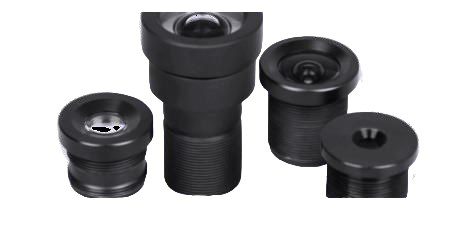
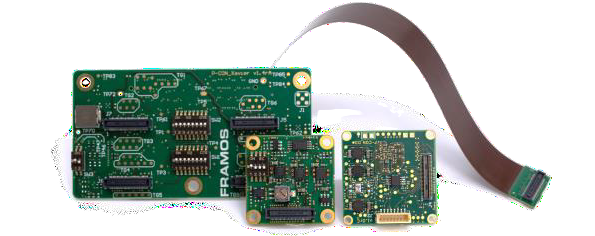
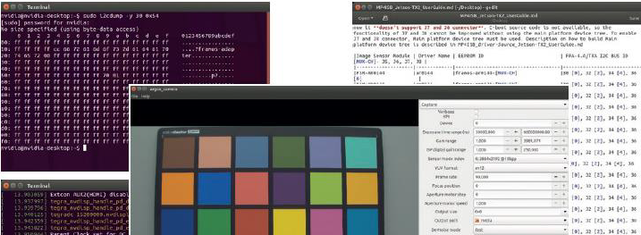
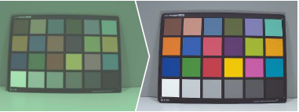

NVIDIA® Jetson AGX Orin™, Xavier™, TX2™
++++++++++++++++++++++++++++++++++++++++++++++++++++++++++++++++++++++++++++++++++

The Framos Sensor Module development kits provide a
ready-to-use and feature-rich development platform for embedded
vision projects. They support all phases, from proof-of-concept to
shaping mass production design. Each kit comes with one or multiple
sensor modules from our large FSM portfolio, paired with adapters,
optics, and accessories, fitting to the specific processor platform. 

|image-1|

With this factsheet you can:

- **Start quickly.**
- **Prototype easily.**
- **Customize fully.**

Key Features:

|image-2|

Comprehensive portfolio of 25+ sensor modules

|image-3|

Sensor specific lens configurations

|image-4|

Adapter framework with 150 mm flex cable

|image-5|

Software Package with Sensor Drivers

|image-6|

Image Signal Processing by Jetson Hard ISP

Framos Sensor Module (FSM)
===========================

The FSM is a PCB image sensor with signal filtering, allowing easy
connection to standard connectors, lens mounts, and mechanical
attachments. The interchangeable footprint facilitates rapid
prototyping. Additionally, our standard design acts as a reference to
understand your requirements and create a fully customized optical
sensor module optimized for mass production, using the sensor of your
choice.

Lens Mount & Optics
===================

The best vision systems need the best optics. At FRAMOS, we provide
customers with high-quality optical products tailored to their
specific applications. We consider all aspects, from optical
parameters to assembly and quality assurance. Our Devkits with M12
mounts come with a lens specifically selected for the imager, serving
as starting point for your individual solution.

Framos Sensor Module Adapter (FSA)
==================================

The FSA serves as a crucial link between image sensors and our
versatile PixelMate™ interface. It generates sensor-specific power
rails, handles bootup sequencing, and facilitates other signaling
functions with a standardized pinout and connector. Additionally, it
contains SLVS to MIPI CSI-2 data conversion to guarantee a maximum
compatibility and flexibility.

Framos Processor Board Adapter (FPA)
====================================

The FPA for NVIDIA® Jetson AGX Orin™, Xavier™, and TX2™ connects up
to four FSM+FSA combinations to official NVIDIA® developer processor
boards. It handles signal routing, power conversion, sync signals,
and provides 10Gbps MIPI CSI-2 (4-Lane) access on each of the four
60-pin PixelMate™ ports.

PixelMate™ Flex Cable
=====================

Each kit comes with a 150 mm flex cable, that combines a reliable and
precise connector, fully shielded and impedance controlled, for
maximum signal integrity.

+-----------------+----------------+------------------------+-------+------------------------+----------------+--------------+------------------+
| FRAMOS Sensor Modules - Available as Developer Kit                                                                                            |
+=================+================+========================+=======+========================+================+==============+==================+
|**Module/Sensor**| **Technology** | **Resolution[MP(HxV)]**|**FPS**|**Format(Pixel Size)**  |**Chromaticity**|**Lens Mount**|**HFOV(Color      |
|                 |                |                        |       |                        |                |              |/Mono)**          |
+-----------------+----------------+------------------------+-------+------------------------+----------------+--------------+------------------+
| **FSM-IMX297**  | Pregius (Gen2) | 0.4 MP (728x544)       | 120   | 1/3” (3.45 µm)         | Color/Mono     | M12-S-Mount  | Yes (70°)        |
+-----------------+----------------+------------------------+-------+------------------------+----------------+--------------+------------------+
| **FSM-AR0144**  | Global Shutter | 1 MP (1280x800)        | 66    | 1/4” (3 µm)            | Color/Mono     | M12-S-Mount  | Yes              |
+-----------------+----------------+------------------------+-------+------------------------+----------------+--------------+------------------+
| **FSM-IMX296**  | Pregius (Gen2) | 1.6 MP (1456x1088)     | 60    | 1/2.9” (6.9 µm)        | Color/Mono     | M12-S-Mount  | Yes (70°)        |
+-----------------+----------------+------------------------+-------+------------------------+----------------+--------------+------------------+
| **FSM-IMX290**  | Starvis        | 2.1 MP (1945x1097)     | 120   | 1/2.8” (2.9 µm)        | Mono           | M12-S-Mount  | Yes (75°)        |
+-----------------+----------------+------------------------+-------+------------------------+----------------+--------------+------------------+
| **FSM-IMX462**  | Starvis (+NIR) | 2.1 MP (1920x1080)     | 120   | 1/2.8” (2.9 µm)        | Color/Mono     | M12-S-Mount  | Yes (75°)        |
+-----------------+----------------+------------------------+-------+------------------------+----------------+--------------+------------------+
| **FSM-IMX662**  | Starvis2       | 2.1 MP (1920x1080)     | 97    | 1/2.8” (2.9 µm)        | Color/Mono     | M12-S-Mount  | Yes (75°)        |
+-----------------+----------------+------------------------+-------+------------------------+----------------+--------------+------------------+
| **FSM-HDP230**  |Global Shutter  | 2.3 MP (1944x1204)     | 60    | 1/2.5” (3.2 µm)        | Color/Mono     | M12-S-Mount  | Yes (83°)        |
|                 |(AT,HDR)        |                        |       |                        |                |              |                  |
+-----------------+----------------+------------------------+-------+------------------------+----------------+--------------+------------------+
| **FSM-IMX464**  | Starvis (+NIR) | 4.1 MP (2688x1520)     | 90    | 1/1.8” (2.9 µm)        | Color/Mono     | M12-S-Mount  | Yes (89°)        |
+-----------------+----------------+------------------------+-------+------------------------+----------------+--------------+------------------+
| **FSM-AR0521**  |Rolling Shutter | 5 MP (2592x1944)       | 60    | 1/2.5” (2.2 µm)        | Color/Mono     | M12-S-Mount  | Yes (78°)        |
+-----------------+----------------+------------------------+-------+------------------------+----------------+--------------+------------------+
| **FSM-IMX675**  | Starvis2       | 5 MP (2592x1944)       | 80    | 1/2.8” (2 µm)          | Color/Mono     | M12-S-Mount  | Yes (110°)       |
+-----------------+----------------+------------------------+-------+------------------------+----------------+--------------+------------------+
| **FSM-IMX264**  | Pregius (Gen2) | 5.1 MP (2464x2056)     | 35    | 2/3” (3.45 µm)         | Color/Mono     | C-Mount      | ---              |
+-----------------+----------------+------------------------+-------+------------------------+----------------+--------------+------------------+
| **FSM-IMX335**  | Starvis        | 5.1 MP (2616x1964)     | 60    | 1/2.8” (2 µm)          | Color/Mono     | M12-S-Mount  | Yes (65°)        |
+-----------------+----------------+------------------------+-------+------------------------+----------------+--------------+------------------+
| **FSM-IMX568**  |Pregius S(Gen4) | 5.1 MP (2472x2064)     | 96    | 1/1.8”(2.74 µm)        | Color/Mono     | M12-S-Mount  | Yes (80°)        |
+-----------------+----------------+------------------------+-------+------------------------+----------------+--------------+------------------+
| **FSM-IMX334**  | Starvis        | 8.3 MP (3840x2160)     | 60    | 1/1.8” (2 µm)          | Color/Mono     | M12-S-Mount  | Yes (88°)        |
+-----------------+----------------+------------------------+-------+------------------------+----------------+--------------+------------------+
| **FSM-IMX678**  | Starvis2       | 8.3 MP (3840x2160)     | 60    | 1/1.8” (2 µm)          | Color/Mono     | M12-S-Mount  | Yes (88°)        |
+-----------------+----------------+------------------------+-------+------------------------+----------------+--------------+------------------+
| **FSM-IMX715**  | Starvis (+NIR) | 8.4 MP (3864x2176)     | 90    | 1/2.8”(1.45 µm)        | Color/Mono     | M12-S-Mount  | Yes (110°)       |
+-----------------+----------------+------------------------+-------+------------------------+----------------+--------------+------------------+
| **FSM-IMX485**  | Starvis (+NIR) | 8.4 MP (3864x2176)     | 90    | 1/1.2” (2.9 µm)        | Color          | C-Mount      | ---              |
+-----------------+----------------+------------------------+-------+------------------------+----------------+--------------+------------------+
| **FSM-IMX585**  | Starvis2       | 8.4 MP (3864x2176)     | 90    | 1/1.2”(2.9 µm)         | Color          | C-Mount      | ---              |
+-----------------+----------------+------------------------+-------+------------------------+----------------+--------------+------------------+
| **FSM-IMX412**  | Starvis (MV)   | 12.3 MP (4056x3040)    | 60    | 1/2.3”(1.55 µm)        |  Color/Mono    | M12-S-Mount  | Yes (80°)        |
+-----------------+----------------+------------------------+-------+------------------------+----------------+--------------+------------------+
| **FSM-IMX477**  |Starvis(AV,PDAF)| 12.3 MP (4056x3040)    | 60    | 1/2.3”(1.55 µm)        | Color/Mono     | M12-S-Mount  | Yes (80°)        |
+-----------------+----------------+------------------------+-------+------------------------+----------------+--------------+------------------+
| **FSM-IMX577**  | Starvis (AV)   | 12.3 MP (4056x3040)    | 60    | 1/2.3”(1.55 µm)        | Color/Mono     | M12-S-Mount  | Yes (80°)        |
+-----------------+----------------+------------------------+-------+------------------------+----------------+--------------+------------------+
| **FSM-IMX304**  | Pregius (Gen2) | 12.4 MP (4112x3008)    | 23    | 1.1” (3.45 µm)         | Color/Mono     | C-Mount      | ---              |
+-----------------+----------------+------------------------+-------+------------------------+----------------+--------------+------------------+
| **FSM-IMX565**  |Pregius S(Gen4) | 12.4 MP (4128x3008)    | 42    | 1/1.1”(2.74 µm)        | Color/Mono     | C-Mount      | ---              |
+-----------------+----------------+------------------------+-------+------------------------+----------------+--------------+------------------+
| **FSM-AR1335**  |Rolling Shutter | 13.3 MP (4208x3120)    | 60    | 1/3.2” (1.1 µm)        | Color/Mono     | M12-S-Mount  | Yes (99°)        |
+-----------------+----------------+------------------------+-------+------------------------+----------------+--------------+------------------+
| **FSM-IMX283**  | Starvis        | 20.2 MP (5496x3672)    | 22    | 1” (2.4 µm)            | Color          | C-Mount      | ---              |
+-----------------+----------------+------------------------+-------+------------------------+----------------+--------------+------------------+
| **FSM-IMX530**  |Pregius S(Gen 4)| 24.6 MP (5328x4608)    | 106   | 1.2” (2.74 µm)         | Color/Mono     | C-Mount      | ---              |
+-----------------+----------------+------------------------+-------+------------------------+----------------+--------------+------------------+
|\ :sub:`Starvis: Sony CMOS Rolling Shutter`                                                                                                    |
|                                                                                                                                               |
|\ :sup:`Pregius: Sony CMOS Global Shutter`                                                                                                     |
+-----------------+----------------+------------------------+-------+------------------------+----------------+--------------+------------------+

\ :sup:`*`\ :sub:`Color only: Equipped with IR cut filter`

Software & Driver
-----------------

The software package contains a reference implementation
demonstrating how to utilize the platform specific data interface,
implement communication and initialize the image sensor. It provides
comfortable access to the sensor's main features and a sensor
specific configuration for the powerful hard Image Signal Processor
(ISP) that is part of the NVIDIA Jetson silicon. The idea behind the
Software Package is to enable embedded software engineers to get
quickly to a streaming system and provide at the same time all tools
that are needed to adapt it to the individual needs of the
application.

Implemented Functions* (if supported by sensor)
----------------------

-  Image Resolution & Bitdepth

-  Lane configuration & data rate

-  Exposure Time & Gain Control

-  Sensor Operation Mode

-  Frame Rate, Blacklevel

-  HDR Output

\ :sup:`*`\ :sub:`Further features via sensor register access.`

Driver Package Content:
-----------------------

-  Platform and device drivers with Linux for Tegra Support

-  V4L2 based subdevice drivers (low-level C API)

-  Streamlined V4L2 library (LibSV) providing C/C++ API

-  Displaying and Processing Examples:

   -  OpenCV (Software)

   -  LibArgus (Hardware)

-  Sensor and kit lens optimized ISP configuration
   

Ordering Information
--------------------

**Part Number:** FSM-XXXYYYK/TXA_Devkit_[Single/Dual/Quad]

+--------------------------------+--------------------+----------------+
|    Components inside           |  Description       |Qty[Single      |
|                                |                    |/Dual/Quad]     |
+================================+====================+================+
| 1. FSM-XXXYYYK + *Lens         |    Sensor Module   |    1/2/4 pcs   |
|    Mount\**                    |                    |                |
+--------------------------------+--------------------+----------------+           
| 2. *Lens\* (only w/ M12        |    Lens            |    1/2/4 pcs   |
|    options)*                   |                    |                |
+--------------------------------+--------------------+----------------+ 
|                                |                    |                |
| 3. FSA-FTx/A                   |   Sensor Adapter   |    1/2/4 pcs   |
|                                |                    |                |
+--------------------------------+--------------------+----------------+ 
| 4. FMA-FC-150/60               | Flex Cable, 150 mm |    1/2/4 pcs   |
|                                |                    |                |
+--------------------------------+--------------------+----------------+ 
| 5. FPA-4.A/TXA                 | Processor Adapter  |    1 pc        |
|                                |                    |                |
+--------------------------------+--------------------+----------------+ 
| 6. FMA-MNT-TRP1/4              | ¼" Tripod Adapter  |    1 pc        |
|                                |                    |                |
+--------------------------------+--------------------+----------------+ 
| 7. Software Download           |   Weblink          |    1 pc        |
+--------------------------------+--------------------+----------------+

Version v1.0e from 2023-06-18

.. |image-7| image:: image-7.png
   :width: 4in
   :height: 2in
