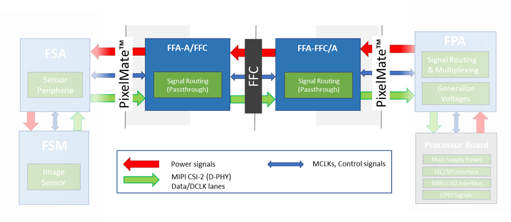
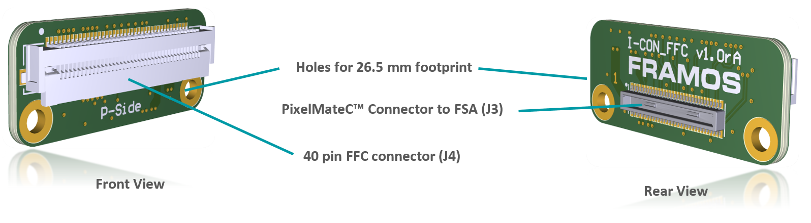
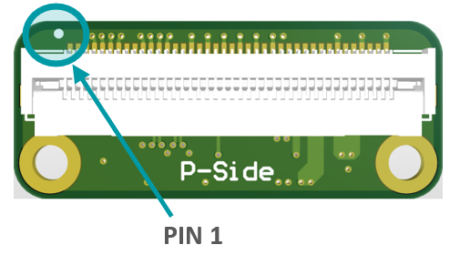

FFA-FFC-PixelMateC to FFC Adapters
++++++++++++++++++++++++++++++++++++++++++

Two small format boards (FFA-A/FFC and FFA-FFC/A) are available which
adapt the PixelMateC MIPI CSI-2 connector to an unshielded Flat Flexible
Cable (FFC) and back. This allows the connection of affordable and
highly available FFC cabling in different lengths between the front-end
and the receiver for evaluation purposes and as reference for integrated
solutions on custom basis.

|image16|

**Figure**: System Diagram of FFA-A/FFC and FFA-FFC/A inside
the FSM Ecosystem.

As shown in the above figure, the integration takes place in form of two FFAs,
adapting from PixelMateC to FFC and back. The boards only take care
about signal routing from one to the other connector, signals pass
through and stay unaltered.

|image18|

**Figure**: FFA-A/FFC Connected to FSM+FSA Stack (Front-End)

**Cabling**

For the cabling, an unshielded standard 40 pin FFC cable with 0.5 mm
pitch is required. For signal matching, a TOP to BOTTOM cable (like the
Molex 0150200440 or 0150200446) must be used in-between both adapters.

Due to the reduction from 60 pins to 40 pins, a couple of signals were
dropped from the PixelMateC layout. The following signals are not
available when using the FFC cable:

-  RST1 (1)

-  Second I2C (2)

-  MCLK 1, 2, 3 (3)

-  GPIOs: 14, 15, 8, 17, 9, 10, 11 (7)

-  SLAMODE 1, 2, 3 (3)

-  Second MIPI CLK (2)

-  GND (2)

Regular single sensor setups in the FSM Ecosystem (native CSI-2 or
converted from SLVS) do not use these signals and are not affected by
missing signals. The complete pinout can be found in the following
adapter-specific chapters.

FFA-A/FFC40-V1A (PixelMateC to 40 pin FFC, Sensor/FSA Side)
~~~~~~~~~~~~~~~~~~~~~~~~~~~~~~~~~~~~~~~~~~~~~~~~~~~~~~~~~~~~~

The FFA-A/FFC40 board adapts the output of the front-end (FSM+FSA stack)
to utilize an appropriate FFC cable. The pin count is reduced from 60
pins to 40 pins; signals stay untouched.

|image19|

+------------------------+----+-----------------------+----+--------------------+----+
|   FFC Connector        |    |                       |    |                    |    |
+========================+====+=======================+====+====================+====+
| Label: J2              |    |                       |    |                    |    |
| Type: Molex 5051104091 |    |                       |    |                    |    |
| Pin Count: 40 pin      |    |                       |    |                    |    |
| Pitch: 0.5 mm          |    |                       |    |                    |    |
|                        |    |                       |    |                    |    |
| Shielding Connector /  |    |                       |    |                    |    |
| Cable: No / No         |    |                       |    |                    |    |
+------------------------+----+-----------------------+----+--------------------+----+
| |image20|              | 1  | GND                   | 21 | GPIO3(XTRIG0)      |    |
+------------------------+----+-----------------------+----+--------------------+----+
|                        | 2  | D_CLK_0_N             | 22 | GPIO2(XHS0)        |    |
+------------------------+----+-----------------------+----+--------------------+----+
|                        | 3  | D_CLK_0_P             | 23 | GPIO1(XVS0)        |    |
+------------------------+----+-----------------------+----+--------------------+----+
|                        | 4  | GND                   | 24 | I2C_0_SDA(SPI_MOSI)|    |
+------------------------+----+-----------------------+----+--------------------+----+
|                        | 5  | D_DATA_2_N            | 25 | I2C_0_SCL(SPI_SCK) |    |
+------------------------+----+-----------------------+----+--------------------+----+
|                        | 6  | D_DATA_2_P            | 26 | GPIO0(XMASTER0)    |    |
+------------------------+----+-----------------------+----+--------------------+----+
|                        | 7  | GND                   | 27 | RST_0              |    |
+------------------------+----+-----------------------+----+--------------------+----+
|                        | 8  | D_DATA_1_P            | 28 | AUX_V              |    |
+------------------------+----+-----------------------+----+--------------------+----+
|                        | 9  | D_DATA_1_N            | 29 | AUX_IF             |    |
+------------------------+----+-----------------------+----+--------------------+----+
|                        | 10 | GND                   | 30 | AUX_DIG            |    |
+------------------------+----+-----------------------+----+--------------------+----+
|                        | 11 | D_DATA_0_P            | 31 | AUX_DIG            |    |
+------------------------+----+-----------------------+----+--------------------+----+
|                        | 12 | D_DATA_0_N            | 32 | AUX_ANA            |    |
+------------------------+----+-----------------------+----+--------------------+----+
|                        | 13 | GND                   | 33 | AUX_ANA            |    |
+------------------------+----+-----------------------+----+--------------------+----+
|                        | 14 | D_DATA_3_N            | 34 | GND                |    |
+------------------------+----+-----------------------+----+--------------------+----+
|                        | 15 | D_DATA_3_P            | 35 | 1V8_VDD            |    |
+------------------------+----+-----------------------+----+--------------------+----+
|                        | 16 | GND                   | 36 | 1V8_VDD            |    |
+------------------------+----+-----------------------+----+--------------------+----+
|                        | 17 | MCLK_0                | 37 | GND                |    |
+------------------------+----+-----------------------+----+--------------------+----+
|                        | 18 | GND                   | 38 | 3V8_VDD            |    |
+------------------------+----+-----------------------+----+--------------------+----+
|                        | 19 | PW_EN_1               | 39 | 3V8_VDD            |    |
+------------------------+----+-----------------------+----+--------------------+----+
|                        | 20 | PW_EN_0               | 40 | GND                |    |
+------------------------+----+-----------------------+----+--------------------+----+

**Table**: FFC Connector on FFA-A/FFC40

FFA-FFC40/A-V1A (40 pin FFC to PixelMateC, Processor Side)
~~~~~~~~~~~~~~~~~~~~~~~~~~~~~~~~~~~~~~~~~~~~~~~~~~~~~~~~~~

Adapting the FFC cable coming from a front-end with FFA-A/FFC back to
PixelMateC.

|image21|

+------------------------+----+-----------------------+----+--------------------+----+
|   FFC Connector        |    |                       |    |                    |    |
+========================+====+=======================+====+====================+====+
| Label: J4              |    |                       |    |                    |    |
| Type: Molex 5051104091 |    |                       |    |                    |    |
| Pin Count: 40 pin      |    |                       |    |                    |    |
| Pitch: 0.5 mm          |    |                       |    |                    |    |
|                        |    |                       |    |                    |    |
| Shielding Connector /  |    |                       |    |                    |    |
| Cable: No / No         |    |                       |    |                    |    |
+------------------------+----+-----------------------+----+--------------------+----+
| |image22|              | 1  | GND                   | 21 | GPIO3(XTRIG0)      |    |
+------------------------+----+-----------------------+----+--------------------+----+
|                        | 2  | D_CLK_0_N             | 22 | GPIO2(XHS0)        |    |
+------------------------+----+-----------------------+----+--------------------+----+
|                        | 3  | D_CLK_0_P             | 23 | GPIO1(XVS0)        |    |
+------------------------+----+-----------------------+----+--------------------+----+
|                        | 4  | GND                   | 24 | I2C_0_SDA(SPI_MOSI)|    |
+------------------------+----+-----------------------+----+--------------------+----+
|                        | 5  | D_DATA_2_N            | 25 | I2C_0_SCL(SPI_SCK) |    |
+------------------------+----+-----------------------+----+--------------------+----+
|                        | 6  | D_DATA_2_P            | 26 | GPIO0(XMASTER0)    |    |
+------------------------+----+-----------------------+----+--------------------+----+
|                        | 7  | GND                   | 27 | RST_0              |    |
+------------------------+----+-----------------------+----+--------------------+----+
|                        | 8  | D_DATA_1_P            | 28 | AUX_V              |    |
+------------------------+----+-----------------------+----+--------------------+----+
|                        | 9  | D_DATA_1_N            | 29 | AUX_IF             |    |
+------------------------+----+-----------------------+----+--------------------+----+
|                        | 10 | GND                   | 30 | AUX_DIG            |    |
+------------------------+----+-----------------------+----+--------------------+----+
|                        | 11 | D_DATA_0_P            | 31 | AUX_DIG            |    |
+------------------------+----+-----------------------+----+--------------------+----+
|                        | 12 | D_DATA_0_N            | 32 | AUX_ANA            |    |
+------------------------+----+-----------------------+----+--------------------+----+
|                        | 13 | GND                   | 33 | AUX_ANA            |    |
+------------------------+----+-----------------------+----+--------------------+----+
|                        | 14 | D_DATA_3_N            | 34 | GND                |    |
+------------------------+----+-----------------------+----+--------------------+----+
|                        | 15 | D_DATA_3_P            | 35 | 1V8_VDD            |    |
+------------------------+----+-----------------------+----+--------------------+----+
|                        | 16 | GND                   | 36 | 1V8_VDD            |    |
+------------------------+----+-----------------------+----+--------------------+----+
|                        | 17 | MCLK_0                | 37 | GND                |    |
+------------------------+----+-----------------------+----+--------------------+----+
|                        | 18 | GND                   | 38 | 3V8_VDD            |    |
+------------------------+----+-----------------------+----+--------------------+----+
|                        | 19 | PW_EN_1               | 39 | 3V8_VDD            |    |
+------------------------+----+-----------------------+----+--------------------+----+
|                        | 20 | PW_EN_0               | 40 | GND                |    |
+------------------------+----+-----------------------+----+--------------------+----+

**Table**: FFC Connector on FFA-FFC40/A

.. |image16| image:: FFA-16.png
   :width: 10in
   :height: 4in

.. |image18| image:: FFA-18.png
   :width: 3.50031in
   :height: 3.45079in
.. |image19| image:: FFA-19.png
   :width: 7.00031in
   :height: 3.00079in
.. |image20| image:: FFA-20.png
   :width: 3.00031in
   :height: 2.15079in

