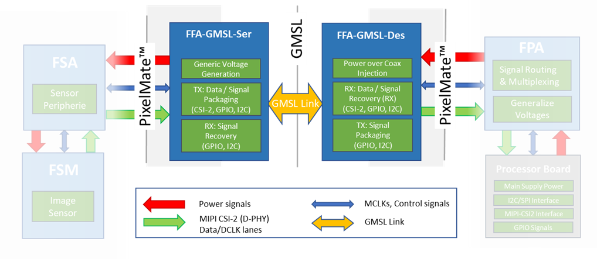
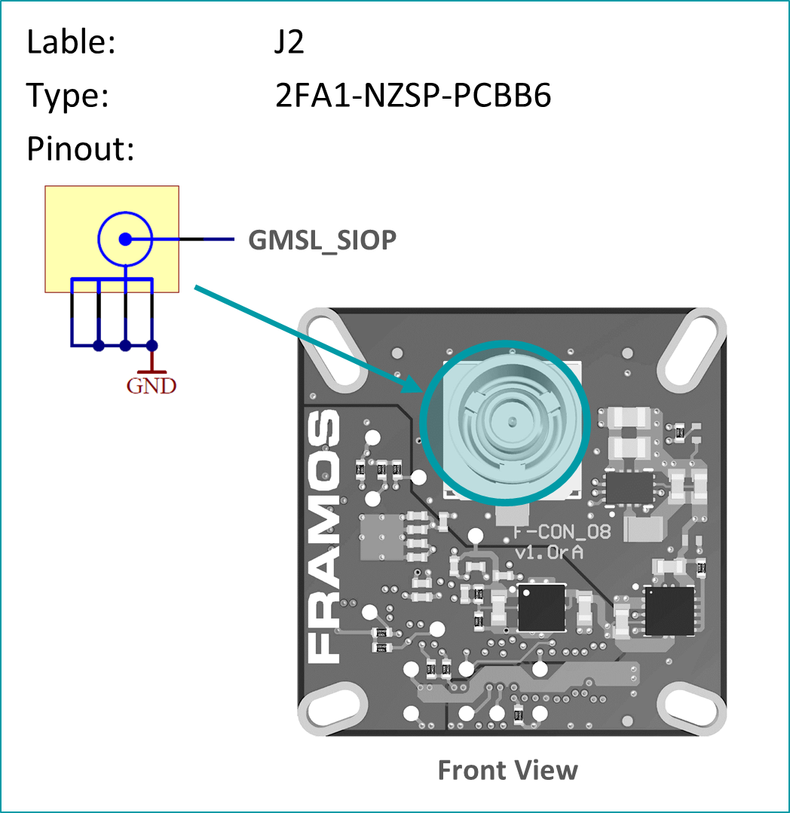
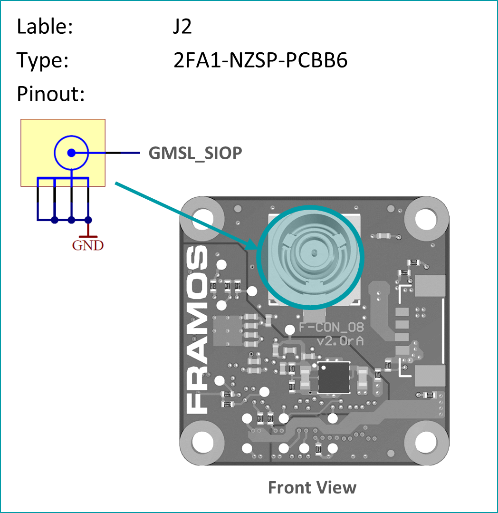
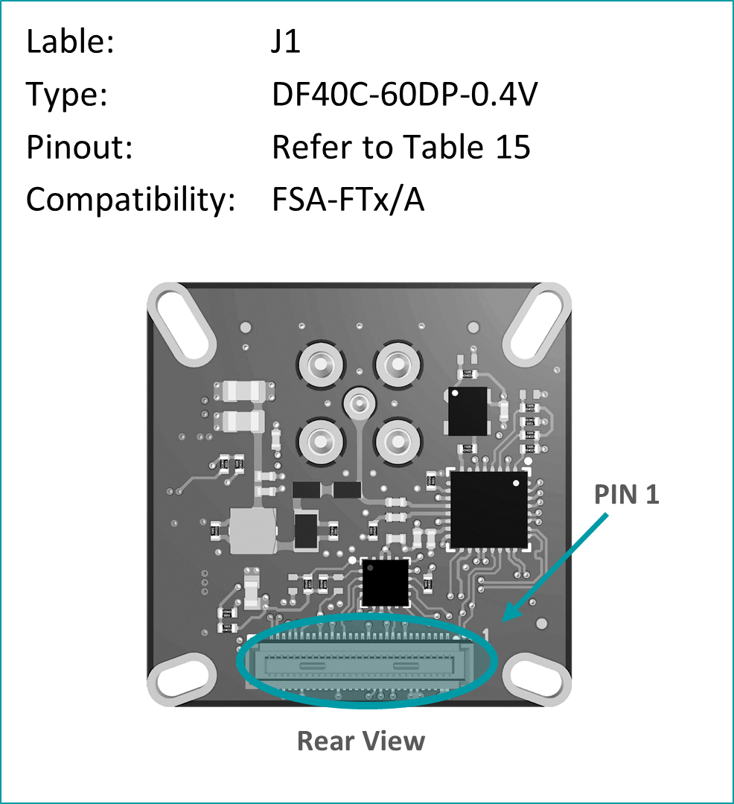
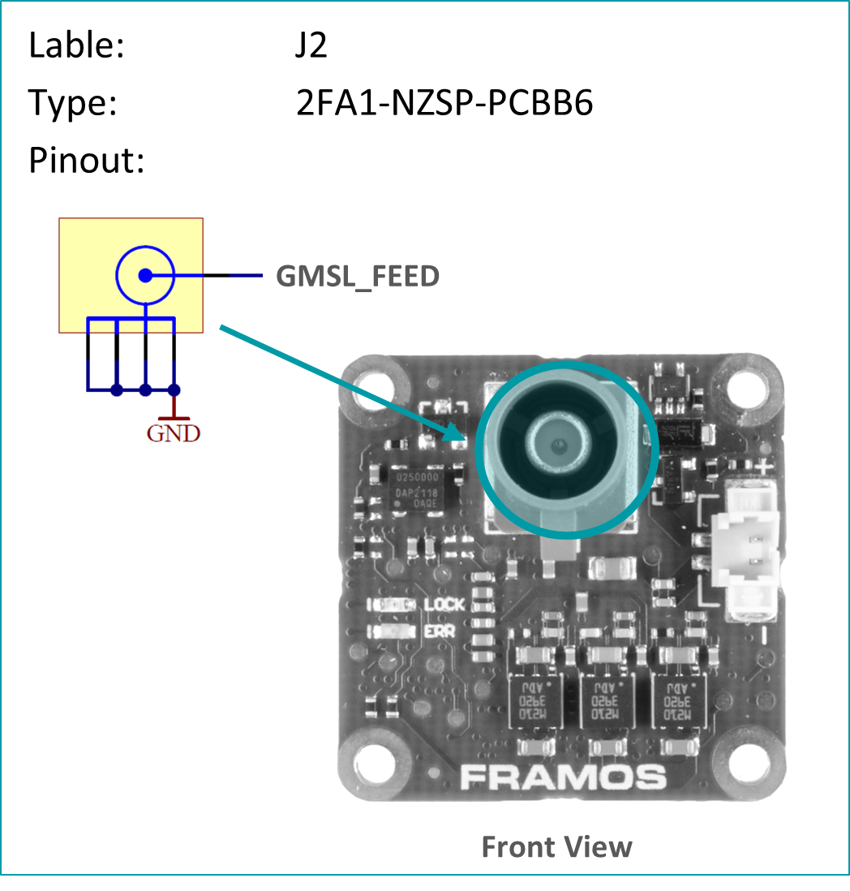

FFA-GMSL-SerDes
++++++++++++++++++++++++++++++++++++++++++

On the FRAMOS Functional Adapters (FFAs) for GMSL, Maxim’s “Gigabit
Multimedia Serial Link” is utilized to transfer up to 12 Gbps of
uncompressed video data, I2C communication, GPIOs and Power via a single
coax wire with automotive grade Fakra connectors.

|image2|

**Figure:** Block Diagram of FFA-GMSL-Ser and FFA-GMSL-Des inside the FSM
Ecosystem.

As shown in the figure, the integration takes place in form of a
serializer- (FFA-GMSL-Ser) and deserializer- (FFA-GMSL-Des) board, that
create the appropriate GMSL line between each other and providing
PixelMate™ conform MIPI CSI-2 connectivity on in- / output to FSA / FPA.
This way they are physically compatible to all FSMs of the Ecosystem
with this interface.

**Note:** Due to high power requirements of specific sensors, even if
physically interface compatible, operation might not be possible due to
lack of power over coax. Please check the following table for an overview about
tested and confirmed setups.

+-------------------+--------------------+---------------------------------+----------------------------+----------------------+
|                   |                    |                                 | Driver Implemented Modes   |                      |
|                   |                    |                                 |                            |                      |
|                   |                    |                                 | [Full Resolution /         |                      |
|                   |                    |                                 | max. FPS]                  |                      |
+===================+====================+=================================+============================+======================+
| **Modules**       | **Physically       | **Reference                     | **6 Gbps**                 | **12 Gbps**          |
|                   | Compatible**       | Drivers**                       |                            |                      |
|                   |                    |                                 | Driver support on request, |                      |
|                   |                    | **(NVIDIA Jetson)**             | physically supported.      |                      |
+-------------------+--------------------+---------------------------------+----------------------------+----------------------+
| FSM-AR0144        | Yes                | On Request                      |                            | -                    |
+-------------------+--------------------+---------------------------------+----------------------------+----------------------+
| FSM-AR0521        | Yes                | On Request                      |                            | -                    |
+-------------------+--------------------+---------------------------------+----------------------------+----------------------+
| FSM-AR1335        | Yes                | On Request                      |                            | -                    |
+-------------------+--------------------+---------------------------------+----------------------------+----------------------+
| FSM-HDP230        | Yes                | On Request                      |                            | -                    |
+-------------------+--------------------+---------------------------------+----------------------------+----------------------+
| FSM-IMX264        | Yes                | On Request                      |                            | -                    |
+-------------------+--------------------+---------------------------------+----------------------------+----------------------+
| FSM-IMX283        | Yes                | On Request                      |                            | -                    |
+-------------------+--------------------+---------------------------------+----------------------------+----------------------+
| FSM-IMX290        | Yes                | Yes                             |                            | 1920 x 1080 / 120    |
+-------------------+--------------------+---------------------------------+----------------------------+----------------------+
| FSM-IMX327        | Yes                | On Request                      |                            | -                    |
+-------------------+--------------------+---------------------------------+----------------------------+----------------------+
| FSM-IMX296        | Yes                | Yes                             |                            | 1456 x 1088 / 60     |
+-------------------+--------------------+---------------------------------+----------------------------+----------------------+
| FSM-IMX297        | Yes                | On Request                      |                            | -                    |
+-------------------+--------------------+---------------------------------+----------------------------+----------------------+
| FSM-IMX304        | Yes[1]             | Yes                             |                            | 4112 x 3008 / 24     |
+-------------------+--------------------+---------------------------------+----------------------------+----------------------+
| FSM-IMX334        | Yes                | On Request                      |                            | -                    |
+-------------------+--------------------+---------------------------------+----------------------------+----------------------+
| FSM-IMX335        | Yes                | On Request                      |                            | -                    |
+-------------------+--------------------+---------------------------------+----------------------------+----------------------+
| FSM-IMX412        | Yes                | Yes                             |                            | 4056 x 3040 / 60     |
+-------------------+--------------------+---------------------------------+----------------------------+----------------------+
| FSM-IMX477        | Yes                | On Request                      |                            | -                    |
+-------------------+--------------------+---------------------------------+----------------------------+----------------------+
| FSM-IMX577        | Yes                | Yes                             |                            | 4056 x 3040 / 60     |
+-------------------+--------------------+---------------------------------+----------------------------+----------------------+
| FSM-IMX415, 715   | Yes                | Yes                             |                            | 3864 x 2192 / 90     |
+-------------------+--------------------+---------------------------------+----------------------------+----------------------+
| FSM-IMX462        | Yes                | Yes                             |                            | 1920 x 1080 / 120    |
+-------------------+--------------------+---------------------------------+----------------------------+----------------------+
| FSM-IMX662        | Yes                | Yes                             |                            | 1920 x 1080 / 98     |
+-------------------+--------------------+---------------------------------+----------------------------+----------------------+
| FSM-IMX464        | Yes                | Yes                             |                            | 2712 x 1538 / 90     |
+-------------------+--------------------+---------------------------------+----------------------------+----------------------+
| FSM-IMX485        | Yes                | On Request                      |                            | -                    |
+-------------------+--------------------+---------------------------------+----------------------------+----------------------+
| FSM-IMX568        | Yes                | Yes                             |                            | 2472 x 2064 / 96     |
+-------------------+--------------------+---------------------------------+----------------------------+----------------------+
| FSM-IMX585        | Yes                | Yes                             |                            | 3856 x 2180 / 90     |
+-------------------+--------------------+---------------------------------+----------------------------+----------------------+
| FSM-IMX530        | Yes[2]             | Yes                             |                            | 5328 x 4608 / 15     |
+-------------------+--------------------+---------------------------------+----------------------------+----------------------+
| FSM-IMX565        | Yes                | Yes                             |                            | 4128 x 3008 / 43     |
+-------------------+--------------------+---------------------------------+----------------------------+----------------------+
| FSM-IMX675        | Yes                | Yes                             |                            | 2608 x 1964 / 81     |
+-------------------+--------------------+---------------------------------+----------------------------+----------------------+
| FSM-IMX678        | Yes                | Yes                             |                            | 3856 x 2180 / 72     |
+-------------------+--------------------+---------------------------------+----------------------------+----------------------+
| FSM-IMX990        | Yes                | Yes                             |                            | 1296 x 1032 / 125    |
+-------------------+--------------------+---------------------------------+----------------------------+----------------------+

**Table:** FRAMOS Sensor Module Compatibility and Support by
FFA-GMSL-SerDes

**Note:** With the revision **V1A** of the FFA-GMSL-Des (Deserializer),
**only one GMSL line is supported per carrier board**. The power
supplied from the carriers is not sufficient to source multiple or
demanding image sensors. The **V2A** variant supports more power
demanding image sensors with an external 12V power supply.

**Latency**

The latency added by GMSL conversion is related to the data rate and
image width. It is 1 video line + 128 x T\ :sub:`PCLK` where
T\ :sub:`PCLK` is the pixel clock of the sensor. As the actual delay
depends on the operation mode, you can find a few examples for
orientation below.

+-------------------+------------------+--------------+--------------+
| Modules           | Resolution       | Framerate    | Latency      |
|                   |                  |              |              |
|                   | [V x H]          | [fps / Hz]   | [µs]         |
+===================+==================+==============+==============+
| FSM-IMX462        | 1920 x 1080      | 60           | 7,76         |
|                   |                  |              | 8,26         |
|                   |                  | 120          |              |
+-------------------+------------------+--------------+--------------+
| FSM-IMX415        | 3864 x 2192      | 45           | 23,55        |
|                   |                  |              | 10,15        |
|                   |                  | 90           |              |
+-------------------+------------------+--------------+--------------+
| FSM-IMX283        | 5496 x 3694      | 12           | 47,21        |
|                   |                  |              |              |
|                   |                  | 25           | 31,58        |
+-------------------+------------------+--------------+--------------+

The values needed for calculation can be found in the corresponding
sensor datasheet.

Sensor Communication and General Purpose Input- / Outputs (GPIO)

The SerDes chain embeds several (sensor) signals as well as
communication into the GMSL stream. It is differentiated between 10
available multi-functional pins (MFP), providing latency optimized
signals, and slower signals available by an IO extender communicating
via I2C:

   -  GPIO Extender:

   -  SLAMODE0, SLAMODE1, SLAMODE2, XMASTER, TOUT0, TOUT1, TOUT2

   -  Multi-Functional Pins

   -  MFP0: SCK

   -  MFP1: XCE

   -  MFP2: XCLR

   -  MFP3: XVS

   -  MFP4: INCK (MFP4 is output of PLL, can generate a 1-75 MHz clock)

   -  MFP5: XHS (OD out)

   -  MFP6: XTRIG1 (OD out)

   -  MFP7: SDI or I2C SDA (configurable)

   -  MFP8: SDO or I2C SCL (configurable)

   -  MFP9: XTRIG2 (OD out)

   -  MFP10: NC

For details on the specific signals, check the documentation of your
image sensor and FSA type.

FFA-GMSL-Ser-V1A (Serializer, Sensor Side)
~~~~~~~~~~~~~~~~~~~~~~~~~~~~~~~~~~~~~~~~~~

Serializer board acting as transmitter (TX), connecting to FSM+FSA stack
serializing image data, embedding of bidirectional communication and
sensor GPIOs. Connects to PixelMateC and outputs GMSL on Fakra type
connector.

   -  4-Lane MIPI CSI-2 Input

   -  Supporting 6 / 12 Gbps output modes

   -  Generic supply voltage (3V8, 1V8) recovery from PoC

   -  GPIOs and I2C Communication via MFP/ I2C Extender

   -  Testpoints to important signals

   -  Compatible to GMSL 6 / 12 Gbps compliant receivers.

|Image3|

+-----------------------------------------+-----------------------------------------+
| **Fakra / GMSL Connector**              | **PixelMateC™ Connector**               |
+-----------------------------------------+-----------------------------------------+
| |Image4|                                | |Image5|                                |
+-----------------------------------------+-----------------------------------------+

FFA-GMSL-Ser-V2A (Serializer, Sensor Side)
~~~~~~~~~~~~~~~~~~~~~~~~~~~~~~~~~~~~~~~~~~

Serializer board acting as transmitter (TX), connecting to FSM+FSA stack
serializing image data, embedding of bidirectional communication and
sensor GPIOs. Connects to PixelMateC and outputs GMSL on Fakra type
connector.

   -  4-Lane MIPI CSI-2 Input

   -  Supporting 6 / 12 Gbps output modes

   -  Generic supply voltage (3V8, 1V8) recovery from PoC

   -  **V2A**: 26.5 mm footprint\ :sup:`2`

   -  GPIOs and I2C Communication via MFP/ I2C Extender

   -  Testpoints to important signals

   -  Compatible to GMSL 6 / 12 Gbps compliant receivers.

|Image7|

+-----------------------------------------+-----------------------------------------+
| **Fakra / GMSL Connector**              | **PixelMateC™ Connector**               |
+-----------------------------------------+-----------------------------------------+
| |Image8|                                | |Image9|                                |
+-----------------------------------------+-----------------------------------------+

FFA-GMSL-Des-V1A (Deserializer, Processor Side)
~~~~~~~~~~~~~~~~~~~~~~~~~~~~~~~~~~~~~~~~~~~~~~~

The deserializer board acts as a receiver (RX) by converting GMSL data
(on the input) to FPA or Carrier boards using the PixelMateC interface.
This board comes in two variants, namely **FFA-GMSL-Des-V1A** and
**FFS-GMSL-Des-V2A**, both of which are responsible for deserializing
image data, embedding bidirectional communication, and sensor GPIOs.
They connect to the PixelMateC interface and output GMSL through a
Fakra-type connector. The key features of the deserializer board are
listed below, along with the differences between the V1A and V2A
variants.

   -  Supporting 6 / 12 Gbps input modes

   -  4-Lane MIPI CSI-2 Output

   -  Maximum one GMSL chain supported per FPA/Carrier

   -  | GPIOs and I2C Communication via
      | MFP / I2C Extender

   -  Testpoints to important signals

   -  Power over Coax (PoC) Injection

|Image10|

+-----------------------------------------+-----------------------------------------+
| **Fakra / GMSL Connector**              | **PixelMateC™ Connector**               |
+-----------------------------------------+-----------------------------------------+
| |Image11|                               | |Image12|                               |
+-----------------------------------------+-----------------------------------------+

FFA-GMSL-Des-V2A (Deserializer, Processor Side)
~~~~~~~~~~~~~~~~~~~~~~~~~~~~~~~~~~~~~~~~~~~~~~~

The deserializer board acts as a receiver (RX) by converting GMSL data
(on the input) to FPA or Carrier boards using the PixelMateC interface.
This board comes in two variants, namely **FFA-GMSL-Des-V1A** and
**FFS-GMSL-Des-V2A**, both of which are responsible for deserializing
image data, embedding bidirectional communication, and sensor GPIOs.
They connect to the PixelMateC interface and output GMSL through a
Fakra-type connector. The key features of the deserializer board are
listed below, along with the differences between the V1A and V2A
variants.

   -  Supporting 6 / 12 Gbps input modes

   -  4-Lane MIPI CSI-2 Output

   -  Power over Coax (PoC) Injection

   -  V2A variant allows a separate, carrier independent power input

   -  | GPIOs and I2C Communication via
      | MFP / I2C Extender

   -  Testpoints to important signals

   -  Supports multi-sensor operation on the FPA/Carrier

|Image13|

+-----------------------------------------+-----------------------------------------+
| **Fakra / GMSL Connector**              | **PixelMateC™ Connector**               |
+-----------------------------------------+-----------------------------------------+
| |Image14|                               | |Image15|                               |
+-----------------------------------------+-----------------------------------------+

Pinout: J1 (PixelMateC)

+-------+--------------------------+-------+----------------------------+
| Pin # | Name                     | Pin # | Name                       |
+=======+==========================+=======+============================+
| 1     | 3V8_VDD                  | 2     | 1V8_VDD                    |
+-------+--------------------------+-------+----------------------------+
| 3     | 3V8_VDD                  | 4     | 1V8_VDD                    |
+-------+--------------------------+-------+----------------------------+
| 5     | NC                       | 6     | NC                         |
+-------+--------------------------+-------+----------------------------+
| 7     | NC                       | 8     | NC                         |
+-------+--------------------------+-------+----------------------------+
| 9     | NC                       | 10    | NC                         |
+-------+--------------------------+-------+----------------------------+
| 11    | GND                      | 12    | GND                        |
+-------+--------------------------+-------+----------------------------+
| 13    | GND                      | 14    | GND                        |
+-------+--------------------------+-------+----------------------------+
| 15    | RST_0                    | 16    | RST_1                      |
+-------+--------------------------+-------+----------------------------+
| 17    | NC                       | 18    | NC                         |
+-------+--------------------------+-------+----------------------------+
| 19    | NC                       | 20    | NC                         |
+-------+--------------------------+-------+----------------------------+
| 21    | I2C_0_SCL(SPI_SCK)       | 22    | NC                         |
+-------+--------------------------+-------+----------------------------+
| 23    | NC                       | 24    | NC                         |
+-------+--------------------------+-------+----------------------------+
| 25    | GPIO1(XVS0)              | 26    | NC                         |
+-------+--------------------------+-------+----------------------------+
| 27    | I2C_0_SDA(SPI_MOSI)      | 28    | NC                         |
+-------+--------------------------+-------+----------------------------+
| 29    | GPIO2(XHS0)              | 30    | GPIO10(XTRIG1)             |
+-------+--------------------------+-------+----------------------------+
| 31    | GPIO3(XTRIG0)            | 32    | NC                         |
+-------+--------------------------+-------+----------------------------+
| 33    | PW_EN_0                  | 34    | PW_EN_1                    |
+-------+--------------------------+-------+----------------------------+
| 35    | NC                       | 36    | NC                         |
+-------+--------------------------+-------+----------------------------+
| 37    | GND                      | 38    | GND                        |
+-------+--------------------------+-------+----------------------------+
| 39    | MCLK_0                   | 40    | NC                         |
+-------+--------------------------+-------+----------------------------+
| 41    | NC                       | 42    | NC                         |
+-------+--------------------------+-------+----------------------------+
| 43    | GND                      | 44    | GND                        |
+-------+--------------------------+-------+----------------------------+
| 45    | NC                       | 46    | D_DATA_3_P                 |
+-------+--------------------------+-------+----------------------------+
| 47    | NC                       | 48    | D_DATA_3_N                 |
+-------+--------------------------+-------+----------------------------+
| 49    | GND                      | 50    | GND                        |
+-------+--------------------------+-------+----------------------------+
| 51    | D_DATA_0_N               | 52    | D_DATA_1_N                 |
+-------+--------------------------+-------+----------------------------+
| 53    | D_DATA_0_P               | 54    | D_DATA_1_P                 |
+-------+--------------------------+-------+----------------------------+
| 55    | GND                      | 56    | GND                        |
+-------+--------------------------+-------+----------------------------+
| 57    | D_DATA_2_P               | 58    | D_CLK_0_P                  |
+-------+--------------------------+-------+----------------------------+
| 59    | D_DATA_2_N               | 60    | D_CLK_0_N                  |
+-------+--------------------------+-------+----------------------------+

**Table:** Pinout of FFA-GMSL-Des-V\ **X**\ A, connector to FRAMOS
Processor Adapter (FPA)

**Device Details:**

The FFA-GMSL-Des-V2A deserializer is similar to the V1A variant.
However, it moves the PoC power source to an external power supply,
making it independent of power limitations imposed by the FPA or carrier
board. As a result, it can support demanding sensors as well as
multi-sensor operation on the FPA/Carrier, whereas the V1A variant only
supports one sensor. One GMSL deserializer physically supports 6 or 12
Gbps GMSL input, and one MIPI CSI-2 output via PixelMate™. The **V2A**
deserializer receives power from a **required** external 12V power
supply before being converted down by a switching buck converter to 8V,
which is then available through Power over Coax (PoC):

**Note:** To provide power to the V2A deserializer, an external 12 V
power supply is required. A power rating of 12 VDC, 1 A is recommended.

It is important to note that though 6 Gbps is physically supported in
the V2A variant of the deserializer, NVIDIA Jetpack JP5.1 only supports
the 12 Gbps speed.

.. |image3| image:: FFA-3.png
   :width: 7.30031in
   :height: 2.95079in

.. |image5| image:: FFA-5.png
   :width: 3.50031in
   :height: 3.45079in
.. |image6| image:: FFA-6.png
   :width: 4.58942in
   :height: 2.17857in
.. |image7| image:: FFA-6.png
   :width: 7.00031in
   :height: 2.80079in

.. |image9| image:: FFA-9.png
   :width: 3.50031in
   :height: 3.45079in
.. |image10| image:: FFA-10.png
   :width: 7.30031in
   :height: 3.15079in
.. |image11| image:: FFA-11.png
   :width: 3.50031in
   :height: 3.45079in

.. |image13| image:: FFA-13.png
   :width: 7.30031in
   :height: 2.95079in

.. |image15| image:: FFA-15.png
   :width: 3.50031in
   :height: 3.45079in