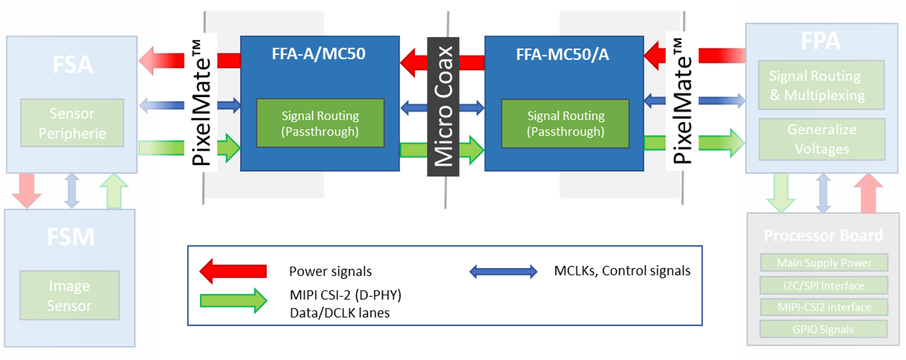
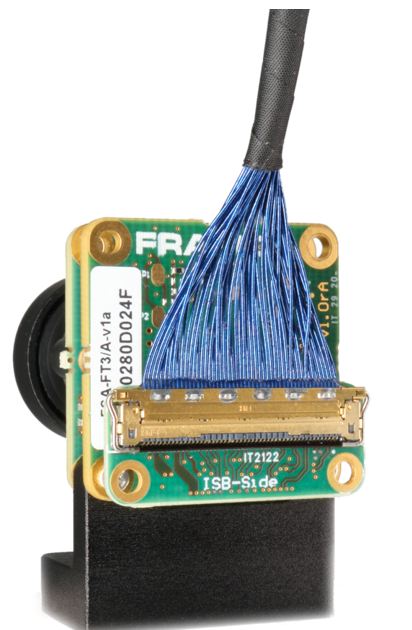
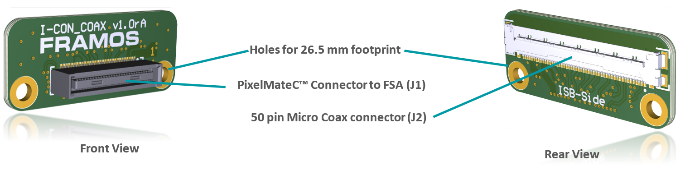
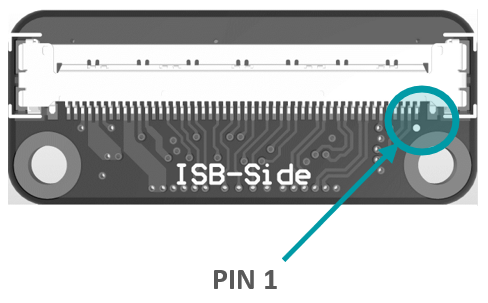
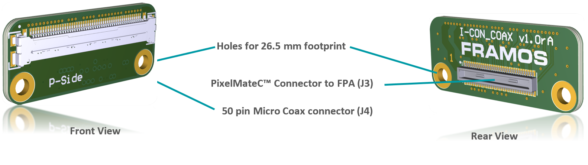
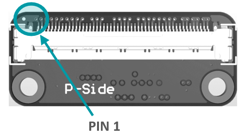

FFA-MC–PixelMateC to Micro Coax Adapters
++++++++++++++++++++++++++++++++++++++++++

Small format boards adapting from the sophisticated PixelMateC MIPI
CSI-2 connector to a shielded micro coaxial cable and back. Allowing the
connection of special customized, flexible and round cabling made for
cable routing through challenging and winding enclosures at great
environmental robustness. As a component of the FSM Ecosystem, they aim
for evaluation purpose and are a reference to be integrated into custom
solutions.

|image23|

**Figure**: System Diagram of FFA-A/MC50 and FFA-MC50/A inside the FSM
Ecosystem.

As shown in Figure 11, the integration takes place in form of two FFAs,
adapting from PixelMateC to micro coax and back. The boards only take
care about signal routing from one to the other connector, signals pass
through and stay unaltered.

|image24|

**Figure**: FFA-A/MC50 Connected to FSM+FSA Stack (Front-End)

**Cabling**

For the cabling, a shielded, 50 pin micro coaxial cable with 0.4 mm
pitch and 1:1 pin assignment on both ends is required. Please refer to
Chapter 9.3.3 – “FMA-CBL-MC50-0.3m-V1A – Micro Coax Cable” for a
recommended reference assembly.

Due to the reduction from 60 to 50 pins, a couple of signals are dropped
from the PixelMateC layout. The following signals are not available:

-  Second I2C (2)

-  MCLK 1, 2, 3 (3)

-  Second MIPI CLK (2)

-  GND (3)

Regular single sensor setups in the FSM Ecosystem (native CSI-2 or
converted from SLVS) do not use these signals and are not affected by
missing signals. The complete pinout can be found in the following,
adapter specific, chapters.

FFA-A/MC50-V1A (PixelMateC to 50 pin Micro Coax, Sensor / FSA Side)
~~~~~~~~~~~~~~~~~~~~~~~~~~~~~~~~~~~~~~~~~~~~~~~~~~~~~~~~~~~~~~~~~~~

Adapting the output of the front-end (FSM+FSA stack) to utilize an
appropriate Micro Coax cable. Pin count is reduced from 60 pins to 50
pins, signals stay untouched.

|image25|

**Micro Coax Connector**

|image26| 

Label: J2 
Type: I-PEX 20525-050E-02 
Pin Count: 50 pin 
Pitch: 0.4 mm 
Shielding: Yes 

**Pinout:**

+---------+---------------------+---------+------------------------+
| **Pin** | **Signal**          | **Pin** | **Signal**             |
+---------+---------------------+---------+------------------------+
|    1    | GND                 |   26    | I2C_0_SDA(SPI_MOSI)    |
+---------+---------------------+---------+------------------------+
|    2    | D_CLK_0_N           |   27    | GPIO9                  |
+---------+---------------------+---------+------------------------+
|    3    | D_CLK_0_P           |   28    | GPIO1(XVS0)            |
+---------+---------------------+---------+------------------------+
|    4    | GND                 |   29    | GPIO16(SYS_PW_EN)      |
+---------+---------------------+---------+------------------------+
|    5    | D_DATA_2_N          |   30    | GPIO17(SPI_CS)         |
+---------+---------------------+---------+------------------------+
|    6    | D_DATA_2_P          |   31    | I2C_0_SCL(SPI_SCK)     |
+---------+---------------------+---------+------------------------+
|    7    | GND                 |   32    | GPIO8                  |
+---------+---------------------+---------+------------------------+
|    8    | D_DATA_1_P          |   33    | GPIO0(XMASTER0)        |
+---------+---------------------+---------+------------------------+
|    9    | D_DATA_1_N          |   34    | GPIO15(SPI_MISO)       |
+---------+---------------------+---------+------------------------+
|   10    | GND                 |   35    | GPIO14                 |
+---------+---------------------+---------+------------------------+
|   11    | D_DATA_0_P          |   36    | RST_1                  |
+---------+---------------------+---------+------------------------+
|   12    | D_DATA_0_N          |   37    | RST_0                  |
+---------+---------------------+---------+------------------------+
|   13    | GND                 |   38    | GND                    |
+---------+---------------------+---------+------------------------+
|   14    | D_DATA_3_N          |   39    | AUX_V                  |
+---------+---------------------+---------+------------------------+
|   15    | D_DATA_3_P          |   40    | AUX_IF                 |
+---------+---------------------+---------+------------------------+
|   16    | GND                 |   41    | AUX_DIG                |
+---------+---------------------+---------+------------------------+
|   17    | MCLK_0              |   42    | AUX_DIG                |
+---------+---------------------+---------+------------------------+
|   18    | GPIO7               |   43    | AUX_ANA                |
+---------+---------------------+---------+------------------------+
|   19    | GPIO6               |   44    | AUX_ANA                |
+---------+---------------------+---------+------------------------+
|   20    | PW_EN_1             |   45    | GND                    |
+---------+---------------------+---------+------------------------+
|   21    | PW_EN_0             |   46    | 1V8_VDD                |
+---------+---------------------+---------+------------------------+
|   22    | GPIO11              |   47    | 1V8_VDD                |
+---------+---------------------+---------+------------------------+
|   23    | GPIO3(XTRIG0)       |   48    | GND                    |
+---------+---------------------+---------+------------------------+
|   24    | GPIO10              |   49    | 3V8_VDD                |
+---------+---------------------+---------+------------------------+
|   25    | GPIO2(XHS0)         |   50    | 3V8_VDD                |
+---------+---------------------+---------+------------------------+

**Table**: FFC Connector on FFA-A/MC50

FFA-MC50/A-V1A (50 pin FFC to PixelMateC, Processor Side)
~~~~~~~~~~~~~~~~~~~~~~~~~~~~~~~~~~~~~~~~~~~~~~~~~~~~~~~~~

Adapting the output of the front-end (FSM+FSA stack) to utilize an
appropriate Micro Coax cable. Pin count is reduced from 60 pins to 50
pins, signals stay untouched.

|image27|

**FFC Connector**

|image28|

Label: J4
Type: I-PEX 20525-050E-02
Pin Count: 50 pin
Pitch: 0.4 mm
Shielding: Yes 

+---------+---------------------+---------+------------------------+
| **Pin** | **Signal**          | **Pin** | **Signal**             |
+---------+---------------------+---------+------------------------+
|    1    | GND                 |   26    | I2C_0_SDA(SPI_MOSI)    |
+---------+---------------------+---------+------------------------+
|    2    | D_CLK_0_N           |   27    | GPIO9                  |
+---------+---------------------+---------+------------------------+
|    3    | D_CLK_0_P           |   28    | GPIO1(XVS0)            |
+---------+---------------------+---------+------------------------+
|    4    | GND                 |   29    | GPIO16(SYS_PW_EN)      |
+---------+---------------------+---------+------------------------+
|    5    | D_DATA_2_N          |   30    | GPIO17(SPI_CS)         |
+---------+---------------------+---------+------------------------+
|    6    | D_DATA_2_P          |   31    | I2C_0_SCL(SPI_SCK)     |
+---------+---------------------+---------+------------------------+
|    7    | GND                 |   32    | GPIO8                  |
+---------+---------------------+---------+------------------------+
|    8    | D_DATA_1_P          |   33    | GPIO0(XMASTER0)        |
+---------+---------------------+---------+------------------------+
|    9    | D_DATA_1_N          |   34    | GPIO15(SPI_MISO)       |
+---------+---------------------+---------+------------------------+
|   10    | GND                 |   35    | GPIO14                 |
+---------+---------------------+---------+------------------------+
|   11    | D_DATA_0_P          |   36    | RST_1                  |
+---------+---------------------+---------+------------------------+
|   12    | D_DATA_0_N          |   37    | RST_0                  |
+---------+---------------------+---------+------------------------+
|   13    | GND                 |   38    | GND                    |
+---------+---------------------+---------+------------------------+
|   14    | D_DATA_3_N          |   39    | AUX_V                  |
+---------+---------------------+---------+------------------------+
|   15    | D_DATA_3_P          |   40    | AUX_IF                 |
+---------+---------------------+---------+------------------------+
|   16    | GND                 |   41    | AUX_DIG                |
+---------+---------------------+---------+------------------------+
|   17    | MCLK_0              |   42    | AUX_DIG                |
+---------+---------------------+---------+------------------------+
|   18    | GPIO7               |   43    | AUX_ANA                |
+---------+---------------------+---------+------------------------+
|   19    | GPIO6               |   44    | AUX_ANA                |
+---------+---------------------+---------+------------------------+
|   20    | PW_EN_1             |   45    | GND                    |
+---------+---------------------+---------+------------------------+
|   21    | PW_EN_0             |   46    | 1V8_VDD                |
+---------+---------------------+---------+------------------------+
|   22    | GPIO11              |   47    | 1V8_VDD                |
+---------+---------------------+---------+------------------------+
|   23    | GPIO3(XTRIG0)       |   48    | GND                    |
+---------+---------------------+---------+------------------------+
|   24    | GPIO10              |   49    | 3V8_VDD                |
+---------+---------------------+---------+------------------------+
|   25    | GPIO2(XHS0)         |   50    | 3V8_VDD                |
+---------+---------------------+---------+------------------------+

**Table**: FFC Connector on FFA-FFC40/A

FMA-CBL-MC50-0.3m-V1A – Micro Coax Cable
~~~~~~~~~~~~~~~~~~~~~~~~~~~~~~~~~~~~~~~~

Cable assembly of I-PEX connectors with micro coaxial cable. CE and RoHS
compliant, various lengths are available on request. Pin assignment is
1:1.

|image29|

**(1) Connector: I-PEX CABLINE® -CA**

   -  Housing: 20634-150T-02

   -  Shell: 2764-0501-002

   -  P-Bar: 2766-0501

   -  Shielded: Yes

   -  Contact Pitch (mm): 0.400

   -  Height: 1.10 Max (1.00 Nom.)

   -  Pin Count: 50

   -  Mating Direction: Horizontal

**(2) Cable: Micro Coaxial**

   -  Type: MCX AWG40 UL1354

   -  Length: 300 mm

   -  Color: Black

**(3) Insulation Tape**

.. |image29| image:: FFA-29.png
   :width: 10.16in
   :height: 3.00079in