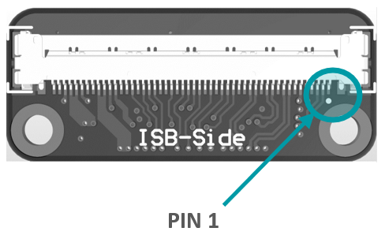
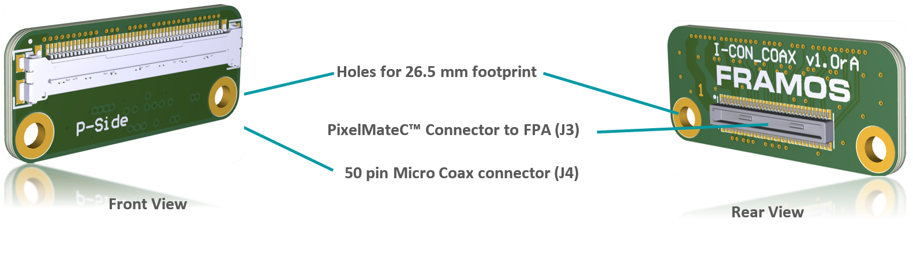
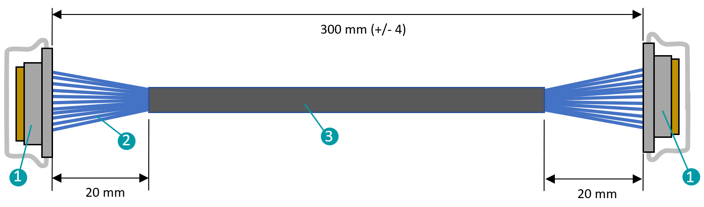

FRAMOS Functional Adapter (FFA) 
++++++++++++++++++++++++++++++++++++++++++

The FRAMOS Functional Adapters (FFA) add device specific functionality
to the FSM Ecosystem. They are optional to use and provide PixelMate™
interfaces on in- and output. This way they integrate seamlessly into an
existing chain that consists of all components required to connect an
FSM to a processor board.

|image1|

Figure 10: Block Diagram of components in MIPI CSI-2 chain with optional
FFA on top FSM chain.

As an example, Figure 10 shows the block diagram of two FSMs connected
to a processor board with their appropriate adapters (FSA, FPA). In the
lower chain (#2), the FSM+FSA combination is directly connected to the
FPA via the generalized PixelMate™ connector. In the upper chain (#1)
contains an FFA (pair) with PixelMate™ in- and output. This FFA can be a
single PCB performing i.e. image pre-processing, as well as a pair of
boards acting as interface adapters, converting the interface completely
(SerDes) or partially (connector/cable type) back and forth.

FFA-GMSL-SerDes
---------------

On the FRAMOS Functional Adapters (FFAs) for GMSL, Maxim’s “Gigabit
Multimedia Serial Link” is utilized to transfer up to 12 Gbps of
uncompressed video data, I2C communication, GPIOs and Power via a single
coax wire with automotive grade Fakra connectors.

|image2|

Figure 11: Block Diagram of FFA-GMSL-Ser and FFA-GMSL-Des inside the FSM
Ecosystem.

As shown in Figure 11, the integration takes place in form of a
serializer- (FFA-GMSL-Ser) and deserializer- (FFA-GMSL-Des) board, that
create the appropriate GMSL line between each other and providing
PixelMate™ conform MIPI CSI-2 connectivity on in- / output to FSA / FPA.
This way they are physically compatible to all FSMs of the Ecosystem
with this interface.

**Note:** Due to high power requirements of specific sensors, even if
physically interface compatible, operation might not be possible due to
lack of power over coax. Please check the Table 14 for an overview about
tested and confirmed setups.

+-------------------+--------------------+---------------------------------+----------------------------+----------------------+
|                   |                    |                                 | Driver Implemented Modes    |                     |
|                   |                    |                                 |                             |                     |
|                   |                    |                                 | [Full Resolution /          |                     |
|                   |                    |                                 | max. FPS]                   |                     |
+===================+====================+=================================+============================+======================+
| Modules           | **Physically       | **Reference                     | **6 Gbps**                 | **12 Gbps**          |
|                   | Compatible**       | Drivers**                       |                            |                      |
|                   |                    |                                 | Driver support on request, |                      |
|                   |                    | (NVIDIA Jetson)**               | physically supported.      |                      |
+-------------------+--------------------+---------------------------------+----------------------------+----------------------+
| FSM-AR0144        | Yes                | On Request                      |                            | -                    |
+-------------------+--------------------+---------------------------------+----------------------------+----------------------+
| FSM-AR0521        | Yes                | On Request                      |                            | -                    |
+-------------------+--------------------+---------------------------------+----------------------------+----------------------+
| FSM-AR1335        | Yes                | On Request                      |                            | -                    |
+-------------------+--------------------+---------------------------------+----------------------------+----------------------+
| FSM-HDP230        | Yes                | On Request                      |                            | -                    |
+-------------------+--------------------+---------------------------------+----------------------------+----------------------+
| FSM-IMX264        | Yes                | On Request                      |                            | -                    |
+-------------------+--------------------+---------------------------------+----------------------------+----------------------+
| FSM-IMX283        | Yes                | On Request                      |                            | -                    |
+-------------------+--------------------+---------------------------------+----------------------------+----------------------+
| FSM-IMX290        | Yes                | Yes                             |                            | 1920 x 1080 / 120    |
+-------------------+--------------------+---------------------------------+----------------------------+----------------------+
| FSM-IMX327        | Yes                | On Request                      |                            | -                    |
+-------------------+--------------------+---------------------------------+----------------------------+----------------------+
| FSM-IMX296        | Yes                | Yes                             |                            | 1456 x 1088 / 60     |
+-------------------+--------------------+---------------------------------+----------------------------+----------------------+
| FSM-IMX297        | Yes                | On Request                      |                            | -                    |
+-------------------+--------------------+---------------------------------+----------------------------+----------------------+
| FSM-IMX304        | Yes[1]             | Yes                             |                            | 4112 x 3008 / 24     |
+-------------------+--------------------+---------------------------------+----------------------------+----------------------+
| FSM-IMX334        | Yes                | On Request                      |                            | -                    |
+-------------------+--------------------+---------------------------------+----------------------------+----------------------+
| FSM-IMX335        | Yes                | On Request                      |                            | -                    |
+-------------------+--------------------+---------------------------------+----------------------------+----------------------+
| FSM-IMX412        | Yes                | Yes                             |                            | 4056 x 3040 / 60     |
+-------------------+--------------------+---------------------------------+----------------------------+----------------------+
| FSM-IMX477        | Yes                | On Request                      |                            | -                    |
+-------------------+--------------------+---------------------------------+----------------------------+----------------------+
| FSM-IMX577        | Yes                | Yes                             |                            | 4056 x 3040 / 60     |
+-------------------+--------------------+---------------------------------+----------------------------+----------------------+
| FSM-IMX415, 715   | Yes                | Yes                             |                            | 3864 x 2192 / 90     |
+-------------------+--------------------+---------------------------------+----------------------------+----------------------+
| FSM-IMX462        | Yes                | Yes                             |                            | 1920 x 1080 / 120    |
+-------------------+--------------------+---------------------------------+----------------------------+----------------------+
| FSM-IMX662        | Yes                | Yes                             |                            | 1920 x 1080 / 98     |
+-------------------+--------------------+---------------------------------+----------------------------+----------------------+
| FSM-IMX464        | Yes                | Yes                             |                            | 2712 x 1538 / 90     |
+-------------------+--------------------+---------------------------------+----------------------------+----------------------+
| FSM-IMX485        | Yes                | On Request                      |                            | -                    |
+-------------------+--------------------+---------------------------------+----------------------------+----------------------+
| FSM-IMX568        | Yes                | Yes                             |                            | 2472 x 2064 / 96     |
+-------------------+--------------------+---------------------------------+----------------------------+----------------------+
| FSM-IMX585        | Yes                | Yes                             |                            | 3856 x 2180 / 90     |
+-------------------+--------------------+---------------------------------+----------------------------+----------------------+
| FSM-IMX530        | Yes[2]             | Yes                             |                            | 5328 x 4608 / 15     |
+-------------------+--------------------+---------------------------------+----------------------------+----------------------+
| FSM-IMX565        | Yes                | Yes                             |                            | 4128 x 3008 / 43     |
+-------------------+--------------------+---------------------------------+----------------------------+----------------------+
| FSM-IMX675        | Yes                | Yes                             |                            | 2608 x 1964 / 81     |
+-------------------+--------------------+---------------------------------+----------------------------+----------------------+
| FSM-IMX678        | Yes                | Yes                             |                            | 3856 x 2180 / 72     |
+-------------------+--------------------+---------------------------------+----------------------------+----------------------+
| FSM-IMX990        | Yes                | Yes                             |                            | 1296 x 1032 / 125    |
+-------------------+--------------------+---------------------------------+----------------------------+----------------------+

Table: FRAMOS Sensor Module Compatibility and Support by
FFA-GMSL-SerDes

**Note:** With the revision **V1A** of the FFA-GMSL-Des (Deserializer),
**only one GMSL line is supported per carrier board**. The power
supplied from the carriers is not sufficient to source multiple or
demanding image sensors. The **V2A** variant supports more power
demanding image sensors with an external 12V power supply.

Latency

The latency added by GMSL conversion is related to the data rate and
image width. It is 1 video line + 128 x T\ :sub:`PCLK` where
T\ :sub:`PCLK` is the pixel clock of the sensor. As the actual delay
depends on the operation mode, you can find a few examples for
orientation below.

+-------------------+------------------+--------------+--------------+
| Modules           | Resolution       | Framerate    | Latency      |
|                   |                  |              |              |
|                   | [V x H]          | [fps / Hz]   | [µs]         |
+===================+==================+==============+==============+
| FSM-IMX462        | 1920 x 1080      | 60           | 7,76         |
|                   |                  |              | 8,26         |
|                   |                  | 120          |              |
+-------------------+------------------+--------------+--------------+
| FSM-IMX415        | 3864 x 2192      | 45           | 23,55        |
|                   |                  |              | 10,15        |
|                   |                  | 90           |              |
+-------------------+------------------+--------------+--------------+
| FSM-IMX283        | 5496 x 3694      | 12           | 47,21        |
|                   |                  |              |              |
|                   |                  | 25           | 31,58        |
+-------------------+------------------+--------------+--------------+

The values needed for calculation can be found in the corresponding
sensor datasheet.

Sensor Communication and General Purpose Input- / Outputs (GPIO)

The SerDes chain embeds several (sensor) signals as well as
communication into the GMSL stream. It is differentiated between 10
available multi-functional pins (MFP), providing latency optimized
signals, and slower signals available by an IO extender communicating
via I2C:

-  GPIO Extender:

-  SLAMODE0, SLAMODE1, SLAMODE2, XMASTER, TOUT0, TOUT1, TOUT2

-  Multi-Functional Pins

-  MFP0: SCK

-  MFP1: XCE

-  MFP2: XCLR

-  MFP3: XVS

-  MFP4: INCK (MFP4 is output of PLL, can generate a 1-75 MHz clock)

-  MFP5: XHS (OD out)

-  MFP6: XTRIG1 (OD out)

-  MFP7: SDI or I2C SDA (configurable)

-  MFP8: SDO or I2C SCL (configurable)

-  MFP9: XTRIG2 (OD out)

-  MFP10: NC

For details on the specific signals, check the documentation of your
image sensor and FSA type.

FFA-GMSL-Ser-V1A (Serializer, Sensor Side)
~~~~~~~~~~~~~~~~~~~~~~~~~~~~~~~~~~~~~~~~~~

Serializer board acting as transmitter (TX), connecting to FSM+FSA stack
serializing image data, embedding of bidirectional communication and
sensor GPIOs. Connects to PixelMateC and outputs GMSL on Fakra type
connector.

-  4-Lane MIPI CSI-2 Input

-  Supporting 6 / 12 Gbps output modes

-  Generic supply voltage (3V8, 1V8) recovery from PoC

-  GPIOs and I2C Communication via MFP/ I2C Extender

-  Testpoints to important signals

-  Compatible to GMSL 6 / 12 Gbps compliant receivers.

|Image3|

**Fakra / GMSL Connector**

|Image4|

**PixelMateC™ Connector**

|Image5|

FFA-GMSL-Ser-V2A (Serializer, Sensor Side)
~~~~~~~~~~~~~~~~~~~~~~~~~~~~~~~~~~~~~~~~~~

Serializer board acting as transmitter (TX), connecting to FSM+FSA stack
serializing image data, embedding of bidirectional communication and
sensor GPIOs. Connects to PixelMateC and outputs GMSL on Fakra type
connector.

-  4-Lane MIPI CSI-2 Input

-  Supporting 6 / 12 Gbps output modes

-  Generic supply voltage (3V8, 1V8) recovery from PoC

-  **V2A**: 26.5 mm footprint [2]_

-  GPIOs and I2C Communication via MFP/ I2C Extender

-  Testpoints to important signals

-  Compatible to GMSL 6 / 12 Gbps compliant receivers.

|Image7|

**Fakra / GMSL Connector**

|Image8|

**PixelMateC™ Connector**

|Image9|

FFA-GMSL-Des-V1A (Deserializer, Processor Side)
~~~~~~~~~~~~~~~~~~~~~~~~~~~~~~~~~~~~~~~~~~~~~~~

The deserializer board acts as a receiver (RX) by converting GMSL data
(on the input) to FPA or Carrier boards using the PixelMateC interface.
This board comes in two variants, namely **FFA-GMSL-Des-V1A** and
**FFS-GMSL-Des-V2A**, both of which are responsible for deserializing
image data, embedding bidirectional communication, and sensor GPIOs.
They connect to the PixelMateC interface and output GMSL through a
Fakra-type connector. The key features of the deserializer board are
listed below, along with the differences between the V1A and V2A
variants.

-  Supporting 6 / 12 Gbps input modes

-  4-Lane MIPI CSI-2 Output

-  Maximum one GMSL chain supported per FPA/Carrier

-  | GPIOs and I2C Communication via
   | MFP / I2C Extender

-  Testpoints to important signals

-  Power over Coax (PoC) Injection

|Image10|

**Fakra / GMSL Connector**

|Image11|

**PixelMateC™ Connector**

|Image12|

FFA-GMSL-Des-V2A (Deserializer, Processor Side)
~~~~~~~~~~~~~~~~~~~~~~~~~~~~~~~~~~~~~~~~~~~~~~~

The deserializer board acts as a receiver (RX) by converting GMSL data
(on the input) to FPA or Carrier boards using the PixelMateC interface.
This board comes in two variants, namely **FFA-GMSL-Des-V1A** and
**FFS-GMSL-Des-V2A**, both of which are responsible for deserializing
image data, embedding bidirectional communication, and sensor GPIOs.
They connect to the PixelMateC interface and output GMSL through a
Fakra-type connector. The key features of the deserializer board are
listed below, along with the differences between the V1A and V2A
variants.

-  Supporting 6 / 12 Gbps input modes

-  4-Lane MIPI CSI-2 Output

-  Power over Coax (PoC) Injection

-  V2A variant allows a separate, carrier independent power input

-  | GPIOs and I2C Communication via
   | MFP / I2C Extender

-  Testpoints to important signals

-  Supports multi-sensor operation on the FPA/Carrier

|Image13|

**Fakra / GMSL Connector**

|Image14|

**PixelMateC™ Connector**

|Image15|

Pinout: J1 (PixelMateC)

+-------+--------------------------+-------+----------------------------+
| Pin # | Name                     | Pin # | Name                       |
+=======+==========================+=======+============================+
| 1     | 3V8_VDD                  | 2     | 1V8_VDD                    |
+-------+--------------------------+-------+----------------------------+
| 3     | 3V8_VDD                  | 4     | 1V8_VDD                    |
+-------+--------------------------+-------+----------------------------+
| 5     | NC                       | 6     | NC                         |
+-------+--------------------------+-------+----------------------------+
| 7     | NC                       | 8     | NC                         |
+-------+--------------------------+-------+----------------------------+
| 9     | NC                       | 10    | NC                         |
+-------+--------------------------+-------+----------------------------+
| 11    | GND                      | 12    | GND                        |
+-------+--------------------------+-------+----------------------------+
| 13    | GND                      | 14    | GND                        |
+-------+--------------------------+-------+----------------------------+
| 15    | RST_0                    | 16    | RST_1                      |
+-------+--------------------------+-------+----------------------------+
| 17    | NC                       | 18    | NC                         |
+-------+--------------------------+-------+----------------------------+
| 19    | NC                       | 20    | NC                         |
+-------+--------------------------+-------+----------------------------+
| 21    | I2C_0_SCL(SPI_SCK)       | 22    | NC                         |
+-------+--------------------------+-------+----------------------------+
| 23    | NC                       | 24    | NC                         |
+-------+--------------------------+-------+----------------------------+
| 25    | GPIO1(XVS0)              | 26    | NC                         |
+-------+--------------------------+-------+----------------------------+
| 27    | I2C_0_SDA(SPI_MOSI)      | 28    | NC                         |
+-------+--------------------------+-------+----------------------------+
| 29    | GPIO2(XHS0)              | 30    | GPIO10(XTRIG1)             |
+-------+--------------------------+-------+----------------------------+
| 31    | GPIO3(XTRIG0)            | 32    | NC                         |
+-------+--------------------------+-------+----------------------------+
| 33    | PW_EN_0                  | 34    | PW_EN_1                    |
+-------+--------------------------+-------+----------------------------+
| 35    | NC                       | 36    | NC                         |
+-------+--------------------------+-------+----------------------------+
| 37    | GND                      | 38    | GND                        |
+-------+--------------------------+-------+----------------------------+
| 39    | MCLK_0                   | 40    | NC                         |
+-------+--------------------------+-------+----------------------------+
| 41    | NC                       | 42    | NC                         |
+-------+--------------------------+-------+----------------------------+
| 43    | GND                      | 44    | GND                        |
+-------+--------------------------+-------+----------------------------+
| 45    | NC                       | 46    | D_DATA_3_P                 |
+-------+--------------------------+-------+----------------------------+
| 47    | NC                       | 48    | D_DATA_3_N                 |
+-------+--------------------------+-------+----------------------------+
| 49    | GND                      | 50    | GND                        |
+-------+--------------------------+-------+----------------------------+
| 51    | D_DATA_0_N               | 52    | D_DATA_1_N                 |
+-------+--------------------------+-------+----------------------------+
| 53    | D_DATA_0_P               | 54    | D_DATA_1_P                 |
+-------+--------------------------+-------+----------------------------+
| 55    | GND                      | 56    | GND                        |
+-------+--------------------------+-------+----------------------------+
| 57    | D_DATA_2_P               | 58    | D_CLK_0_P                  |
+-------+--------------------------+-------+----------------------------+
| 59    | D_DATA_2_N               | 60    | D_CLK_0_N                  |
+-------+--------------------------+-------+----------------------------+

Table 15: Pinout of FFA-GMSL-Des-V\ **X**\ A, connector to FRAMOS
Processor Adapter (FPA)

**Device Details:**

The FFA-GMSL-Des-V2A deserializer is similar to the V1A variant.
However, it moves the PoC power source to an external power supply,
making it independent of power limitations imposed by the FPA or carrier
board. As a result, it can support demanding sensors as well as
multi-sensor operation on the FPA/Carrier, whereas the V1A variant only
supports one sensor. One GMSL deserializer physically supports 6 or 12
Gbps GMSL input, and one MIPI CSI-2 output via PixelMate™. The **V2A**
deserializer receives power from a **required** external 12V power
supply before being converted down by a switching buck converter to 8V,
which is then available through Power over Coax (PoC):

**Note:** To provide power to the V2A deserializer, an external 12 V
power supply is required. A power rating of 12 VDC, 1 A is recommended.

It is important to note that though 6 Gbps is physically supported in
the V2A variant of the deserializer, NVIDIA Jetpack JP5.1 only supports
the 12 Gbps speed.

FFA-FFC – PixelMateC to FFC Adapters
------------------------------------

Two small format boards (FFA-A/FFC and FFA-FFC/A) are available which
adapt the PixelMateC MIPI CSI-2 connector to an unshielded Flat Flexible
Cable (FFC) and back. This allows the connection of affordable and
highly available FFC cabling in different lengths between the front-end
and the receiver for evaluation purposes and as reference for integrated
solutions on custom basis.

|image16|

Figure: System Diagram of FFA-A/FFC and FFA-FFC/A inside
the FSM Ecosystem.

As shown in the above figure, the integration takes place in form of two FFAs,
adapting from PixelMateC to FFC and back. The boards only take care
about signal routing from one to the other connector, signals pass
through and stay unaltered.

|image18|

Figure: FFA-A/FFC Connected to FSM+FSA Stack (Front-End)

**Cabling**

For the cabling, an unshielded standard 40 pin FFC cable with 0.5 mm
pitch is required. For signal matching, a TOP to BOTTOM cable (like the
Molex 0150200440 or 0150200446) must be used in-between both adapters.

Due to the reduction from 60 pins to 40 pins, a couple of signals were
dropped from the PixelMateC layout. The following signals are not
available when using the FFC cable:

-  RST1 (1)

-  Second I2C (2)

-  MCLK 1, 2, 3 (3)

-  GPIOs: 14, 15, 8, 17, 9, 10, 11 (7)

-  SLAMODE 1, 2, 3 (3)

-  Second MIPI CLK (2)

-  GND (2)

Regular single sensor setups in the FSM Ecosystem (native CSI-2 or
converted from SLVS) do not use these signals and are not affected by
missing signals. The complete pinout can be found in the following
adapter-specific chapters.

FFA-A/FFC40-V1A (PixelMateC to 40 pin FFC, Sensor / FSA Side)
~~~~~~~~~~~~~~~~~~~~~~~~~~~~~~~~~~~~~~~~~~~~~~~~~~~~~~~~~~~~~

The FFA-A/FFC40 board adapts the output of the front-end (FSM+FSA stack)
to utilize an appropriate FFC cable. The pin count is reduced from 60
pins to 40 pins; signals stay untouched.

|image19|

+------------------------+----+-----------------------+----+--------------------+----+
| **FFC Connector**      |    |                       |    |                    |    |
+========================+====+=======================+====+====================+====+
| Label: J2              |    |                       |    |                    |    |
| Type: Molex 5051104091 |    |                       |    |                    |    |
| Pin Count: 40 pin      |    |                       |    |                    |    |
| Pitch: 0.5 mm          |    |                       |    |                    |    |
|                        |    |                       |    |                    |    |
| Shielding Connector /  |    |                       |    |                    |    |
| Cable: No / No         |    |                       |    |                    |    |
+------------------------+----+-----------------------+----+--------------------+----+
| |image20|              | 1  | GND                   | 21 | GPIO3(XTRIG0)      |    |
+------------------------+----+-----------------------+----+--------------------+----+
|                        | 2  | D_CLK_0_N             | 22 | GPIO2(XHS0)        |    |
+------------------------+----+-----------------------+----+--------------------+----+
|                        | 3  | D_CLK_0_P             | 23 | GPIO1(XVS0)        |    |
+------------------------+----+-----------------------+----+--------------------+----+
|                        | 4  | GND                   | 24 | I2C_0_SDA(SPI_MOSI)|    |
+------------------------+----+-----------------------+----+--------------------+----+
|                        | 5  | D_DATA_2_N            | 25 | I2C_0_SCL(SPI_SCK) |    |
+------------------------+----+-----------------------+----+--------------------+----+
|                        | 6  | D_DATA_2_P            | 26 | GPIO0(XMASTER0)    |    |
+------------------------+----+-----------------------+----+--------------------+----+
|                        | 7  | GND                   | 27 | RST_0              |    |
+------------------------+----+-----------------------+----+--------------------+----+
|                        | 8  | D_DATA_1_P            | 28 | AUX_V              |    |
+------------------------+----+-----------------------+----+--------------------+----+
|                        | 9  | D_DATA_1_N            | 29 | AUX_IF             |    |
+------------------------+----+-----------------------+----+--------------------+----+
|                        | 10 | GND                   | 30 | AUX_DIG            |    |
+------------------------+----+-----------------------+----+--------------------+----+
|                        | 11 | D_DATA_0_P            | 31 | AUX_DIG            |    |
+------------------------+----+-----------------------+----+--------------------+----+
|                        | 12 | D_DATA_0_N            | 32 | AUX_ANA            |    |
+------------------------+----+-----------------------+----+--------------------+----+
|                        | 13 | GND                   | 33 | AUX_ANA            |    |
+------------------------+----+-----------------------+----+--------------------+----+
|                        | 14 | D_DATA_3_N            | 34 | GND                |    |
+------------------------+----+-----------------------+----+--------------------+----+
|                        | 15 | D_DATA_3_P            | 35 | 1V8_VDD            |    |
+------------------------+----+-----------------------+----+--------------------+----+
|                        | 16 | GND                   | 36 | 1V8_VDD            |    |
+------------------------+----+-----------------------+----+--------------------+----+
|                        | 17 | MCLK_0                | 37 | GND                |    |
+------------------------+----+-----------------------+----+--------------------+----+
|                        | 18 | GND                   | 38 | 3V8_VDD            |    |
+------------------------+----+-----------------------+----+--------------------+----+
|                        | 19 | PW_EN_1               | 39 | 3V8_VDD            |    |
+------------------------+----+-----------------------+----+--------------------+----+
|                        | 20 | PW_EN_0               | 40 | GND                |    |
+------------------------+----+-----------------------+----+--------------------+----+

Table: FFC Connector on FFA-A/FFC40

FFA-FFC40/A-V1A (40 pin FFC to PixelMateC, Processor Side)
~~~~~~~~~~~~~~~~~~~~~~~~~~~~~~~~~~~~~~~~~~~~~~~~~~~~~~~~~~

Adapting the FFC cable coming from a front-end with FFA-A/FFC back to
PixelMateC.

|image21|

+------------------------+----+-----------------------+----+--------------------+----+
| **FFC Connector**      |    |                       |    |                    |    |
+========================+====+=======================+====+====================+====+
| Label: J4              |    |                       |    |                    |    |
| Type: Molex 5051104091 |    |                       |    |                    |    |
| Pin Count: 40 pin      |    |                       |    |                    |    |
| Pitch: 0.5 mm          |    |                       |    |                    |    |
|                        |    |                       |    |                    |    |
| Shielding Connector /  |    |                       |    |                    |    |
| Cable: No / No         |    |                       |    |                    |    |
+------------------------+----+-----------------------+----+--------------------+----+
| |image22|              | 1  | GND                   | 21 | GPIO3(XTRIG0)      |    |
+------------------------+----+-----------------------+----+--------------------+----+
|                        | 2  | D_CLK_0_N             | 22 | GPIO2(XHS0)        |    |
+------------------------+----+-----------------------+----+--------------------+----+
|                        | 3  | D_CLK_0_P             | 23 | GPIO1(XVS0)        |    |
+------------------------+----+-----------------------+----+--------------------+----+
|                        | 4  | GND                   | 24 | I2C_0_SDA(SPI_MOSI)|    |
+------------------------+----+-----------------------+----+--------------------+----+
|                        | 5  | D_DATA_2_N            | 25 | I2C_0_SCL(SPI_SCK) |    |
+------------------------+----+-----------------------+----+--------------------+----+
|                        | 6  | D_DATA_2_P            | 26 | GPIO0(XMASTER0)    |    |
+------------------------+----+-----------------------+----+--------------------+----+
|                        | 7  | GND                   | 27 | RST_0              |    |
+------------------------+----+-----------------------+----+--------------------+----+
|                        | 8  | D_DATA_1_P            | 28 | AUX_V              |    |
+------------------------+----+-----------------------+----+--------------------+----+
|                        | 9  | D_DATA_1_N            | 29 | AUX_IF             |    |
+------------------------+----+-----------------------+----+--------------------+----+
|                        | 10 | GND                   | 30 | AUX_DIG            |    |
+------------------------+----+-----------------------+----+--------------------+----+
|                        | 11 | D_DATA_0_P            | 31 | AUX_DIG            |    |
+------------------------+----+-----------------------+----+--------------------+----+
|                        | 12 | D_DATA_0_N            | 32 | AUX_ANA            |    |
+------------------------+----+-----------------------+----+--------------------+----+
|                        | 13 | GND                   | 33 | AUX_ANA            |    |
+------------------------+----+-----------------------+----+--------------------+----+
|                        | 14 | D_DATA_3_N            | 34 | GND                |    |
+------------------------+----+-----------------------+----+--------------------+----+
|                        | 15 | D_DATA_3_P            | 35 | 1V8_VDD            |    |
+------------------------+----+-----------------------+----+--------------------+----+
|                        | 16 | GND                   | 36 | 1V8_VDD            |    |
+------------------------+----+-----------------------+----+--------------------+----+
|                        | 17 | MCLK_0                | 37 | GND                |    |
+------------------------+----+-----------------------+----+--------------------+----+
|                        | 18 | GND                   | 38 | 3V8_VDD            |    |
+------------------------+----+-----------------------+----+--------------------+----+
|                        | 19 | PW_EN_1               | 39 | 3V8_VDD            |    |
+------------------------+----+-----------------------+----+--------------------+----+
|                        | 20 | PW_EN_0               | 40 | GND                |    |
+------------------------+----+-----------------------+----+--------------------+----+

Table: FFC Connector on FFA-FFC40/A

FFA-MC – PixelMateC to Micro Coax Adapters
------------------------------------------

Small format boards adapting from the sophisticated PixelMateC MIPI
CSI-2 connector to a shielded micro coaxial cable and back. Allowing the
connection of special customized, flexible and round cabling made for
cable routing through challenging and winding enclosures at great
environmental robustness. As a component of the FSM Ecosystem, they aim
for evaluation purpose and are a reference to be integrated into custom
solutions.

|image23|

Figure: System Diagram of FFA-A/MC50 and FFA-MC50/A inside the FSM
Ecosystem.

As shown in Figure 11, the integration takes place in form of two FFAs,
adapting from PixelMateC to micro coax and back. The boards only take
care about signal routing from one to the other connector, signals pass
through and stay unaltered.

|image24|

Figure: FFA-A/MC50 Connected to FSM+FSA Stack (Front-End)

**Cabling**

For the cabling, a shielded, 50 pin micro coaxial cable with 0.4 mm
pitch and 1:1 pin assignment on both ends is required. Please refer to
Chapter 9.3.3 – “FMA-CBL-MC50-0.3m-V1A – Micro Coax Cable” for a
recommended reference assembly.

Due to the reduction from 60 to 50 pins, a couple of signals are dropped
from the PixelMateC layout. The following signals are not available:

-  Second I2C (2)

-  MCLK 1, 2, 3 (3)

-  Second MIPI CLK (2)

-  GND (3)

Regular single sensor setups in the FSM Ecosystem (native CSI-2 or
converted from SLVS) do not use these signals and are not affected by
missing signals. The complete pinout can be found in the following,
adapter specific, chapters.

FFA-A/MC50-V1A (PixelMateC to 50 pin Micro Coax, Sensor / FSA Side)
~~~~~~~~~~~~~~~~~~~~~~~~~~~~~~~~~~~~~~~~~~~~~~~~~~~~~~~~~~~~~~~~~~~

Adapting the output of the front-end (FSM+FSA stack) to utilize an
appropriate Micro Coax cable. Pin count is reduced from 60 pins to 50
pins, signals stay untouched.

|image25|

+------------------------+----+-----------------------+----+--------------------+----+
| **Micro Coax Connector** |  |                       |    |                    |    |
+========================+====+=======================+====+====================+====+
| Label: J2              |    |                       |    |                    |    |
| Type: I-PEX 20525-050E-02 |  |                       |    |                    |    |
| Pin Count: 50 pin      |    |                       |    |                    |    |
| Pitch: 0.4 mm          |    |                       |    |                    |    |
| Shielding: Yes         |    |                       |    |                    |    |
+------------------------+----+-----------------------+----+--------------------+----+
| |image26|              |  1 | GND                   | 26 | I2C_0_SDA(SPI_MOSI)|    |
+------------------------+----+-----------------------+----+--------------------+----+
|                        |  2 | D_CLK_0_N             | 27 | GPIO9              |    |
+------------------------+----+-----------------------+----+--------------------+----+
|                        |  3 | D_CLK_0_P             | 28 | GPIO1(XVS0)        |    |
+------------------------+----+-----------------------+----+--------------------+----+
|                        |  4 | GND                   | 29 | GPIO16(SYS_PW_EN)  |    |
+------------------------+----+-----------------------+----+--------------------+----+
|                        |  5 | D_DATA_2_N            | 30 | GPIO17(SPI_CS)     |    |
+------------------------+----+-----------------------+----+--------------------+----+
|                        |  6 | D_DATA_2_P            | 31 | I2C_0_SCL(SPI_SCK) |    |
+------------------------+----+-----------------------+----+--------------------+----+
|                        |  7 | GND                   | 32 | GPIO8              |    |
+------------------------+----+-----------------------+----+--------------------+----+
|                        |  8 | D_DATA_1_P            | 33 | GPIO0(XMASTER0)    |    |
+------------------------+----+-----------------------+----+--------------------+----+
|                        |  9 | D_DATA_1_N            | 34 | GPIO15(SPI_MISO)   |    |
+------------------------+----+-----------------------+----+--------------------+----+
|                        | 10 | GND                   | 35 | GPIO14             |    |
+------------------------+----+-----------------------+----+--------------------+----+
|                        | 11 | D_DATA_0_P            | 36 | RST_1              |    |
+------------------------+----+-----------------------+----+--------------------+----+
|                        | 12 | D_DATA_0_N            | 37 | RST_0              |    |
+------------------------+----+-----------------------+----+--------------------+----+
|                        | 13 | GND                   | 38 | GND                |    |
+------------------------+----+-----------------------+----+--------------------+----+
|                        | 14 | D_DATA_3_N            | 39 | AUX_V              |    |
+------------------------+----+-----------------------+----+--------------------+----+
|                        | 15 | D_DATA_3_P            | 40 | AUX_IF             |    |
+------------------------+----+-----------------------+----+--------------------+----+
|                        | 16 | GND                   | 41 | AUX_DIG            |    |
+------------------------+----+-----------------------+----+--------------------+----+
|                        | 17 | MCLK_0                | 42 | AUX_DIG            |    |
+------------------------+----+-----------------------+----+--------------------+----+
|                        | 18 | GPIO7                 | 43 | AUX_ANA            |    |
+------------------------+----+-----------------------+----+--------------------+----+
|                        | 19 | GPIO6                 | 44 | AUX_ANA            |    |
+------------------------+----+-----------------------+----+--------------------+----+
|                        | 20 | PW_EN_1               | 45 | GND                |    |
+------------------------+----+-----------------------+----+--------------------+----+
|                        | 21 | PW_EN_0               | 46 | 1V8_VDD            |    |
+------------------------+----+-----------------------+----+--------------------+----+
|                        | 22 | GPIO11                | 47 | 1V8_VDD            |    |
+------------------------+----+-----------------------+----+--------------------+----+
|                        | 23 | GPIO3(XTRIG0)         | 48 | GND                |    |
+------------------------+----+-----------------------+----+--------------------+----+
|                        | 24 | GPIO10                | 49 | 3V8_VDD            |    |
+------------------------+----+-----------------------+----+--------------------+----+
|                        | 25 | GPIO2(XHS0)           | 50 | 3V8_VDD            |    |
+------------------------+----+-----------------------+----+--------------------+----+

Table: FFC Connector on FFA-A/MC50

FFA-MC50/A-V1A (50 pin FFC to PixelMateC, Processor Side)
~~~~~~~~~~~~~~~~~~~~~~~~~~~~~~~~~~~~~~~~~~~~~~~~~~~~~~~~~

Adapting the output of the front-end (FSM+FSA stack) to utilize an
appropriate Micro Coax cable. Pin count is reduced from 60 pins to 50
pins, signals stay untouched.

|image27|

+------------------------------+----+-----------------------+----+--------------------+----+
| **FFC Connector**            |    |                       |    |                    |    |
+==============================+====+=======================+====+====================+====+
| Label: J4                    |    |                       |    |                    |    |
| Type: I-PEX 20525-050E-02    |    |                       |    |                    |    |
| Pin Count: 50 pin            |    |                       |    |                    |    |
| Pitch: 0.4 mm                |    |                       |    |                    |    |
| Shielding: Yes               |    |                       |    |                    |    |
+------------------------------+----+-----------------------+----+--------------------+----+
| |image28|                    |  1 | GND                   | 26 | I2C_0_SDA(SPI_MOSI)|    |
+------------------------------+----+-----------------------+----+--------------------+----+
|                              |  2 | D_CLK_0_N             | 27 | GPIO9              |    |
+------------------------------+----+-----------------------+----+--------------------+----+
|                              |  3 | D_CLK_0_P             | 28 | GPIO1(XVS0)        |    |
+------------------------------+----+-----------------------+----+--------------------+----+
|                              |  4 | GND                   | 29 | GPIO16(SYS_PW_EN)  |    |
+------------------------------+----+-----------------------+----+--------------------+----+
|                              |  5 | D_DATA_2_N            | 30 | GPIO17(SPI_CS)     |    |
+------------------------------+----+-----------------------+----+--------------------+----+
|                              |  6 | D_DATA_2_P            | 31 | I2C_0_SCL(SPI_SCK) |    |
+------------------------------+----+-----------------------+----+--------------------+----+
|                              |  7 | GND                   | 32 | GPIO8              |    |
+------------------------------+----+-----------------------+----+--------------------+----+
|                              |  8 | D_DATA_1_P            | 33 | GPIO0(XMASTER0)    |    |
+------------------------------+----+-----------------------+----+--------------------+----+
|                              |  9 | D_DATA_1_N            | 34 | GPIO15(SPI_MISO)   |    |
+------------------------------+----+-----------------------+----+--------------------+----+
|                              | 10 | GND                   | 35 | GPIO14             |    |
+------------------------------+----+-----------------------+----+--------------------+----+
|                              | 11 | D_DATA_0_P            | 36 | RST_1              |    |
+------------------------------+----+-----------------------+----+--------------------+----+
|                              | 12 | D_DATA_0_N            | 37 | RST_0              |    |
+------------------------------+----+-----------------------+----+--------------------+----+
|                              | 13 | GND                   | 38 | GND                |    |
+------------------------------+----+-----------------------+----+--------------------+----+
|                              | 14 | D_DATA_3_N            | 39 | AUX_V              |    |
+------------------------------+----+-----------------------+----+--------------------+----+
|                              | 15 | D_DATA_3_P            | 40 | AUX_IF             |    |
+------------------------------+----+-----------------------+----+--------------------+----+
|                              | 16 | GND                   | 41 | AUX_DIG            |    |
+------------------------------+----+-----------------------+----+--------------------+----+
|                              | 17 | MCLK_0                | 42 | AUX_DIG            |    |
+------------------------------+----+-----------------------+----+--------------------+----+
|                              | 18 | GPIO7                 | 43 | AUX_ANA            |    |
+------------------------------+----+-----------------------+----+--------------------+----+
|                              | 19 | GPIO6                 | 44 | AUX_ANA            |    |
+------------------------------+----+-----------------------+----+--------------------+----+
|                              | 20 | PW_EN_1               | 45 | GND                |    |
+------------------------------+----+-----------------------+----+--------------------+----+
|                              | 21 | PW_EN_0               | 46 | 1V8_VDD            |    |
+------------------------------+----+-----------------------+----+--------------------+----+
|                              | 22 | GPIO11                | 47 | 1V8_VDD            |    |
+------------------------------+----+-----------------------+----+--------------------+----+
|                              | 23 | GPIO3(XTRIG0)         | 48 | GND                |    |
+------------------------------+----+-----------------------+----+--------------------+----+
|                              | 24 | GPIO10                | 49 | 3V8_VDD            |    |
+------------------------------+----+-----------------------+----+--------------------+----+
|                              | 25 | GPIO2(XHS0)           | 50 | 3V8_VDD            |    |
+------------------------------+----+-----------------------+----+--------------------+----+

Table: FFC Connector on FFA-FFC40/A

FMA-CBL-MC50-0.3m-V1A – Micro Coax Cable
~~~~~~~~~~~~~~~~~~~~~~~~~~~~~~~~~~~~~~~~

Cable assembly of I-PEX connectors with micro coaxial cable. CE and RoHS
compliant, various lengths are available on request. Pin assignment is
1:1.

|image29|

(1) Connector: I-PEX CABLINE® -CA

-  Housing: 20634-150T-02

-  Shell: 2764-0501-002

-  P-Bar: 2766-0501

-  Shielded: Yes

-  Contact Pitch (mm): 0.400

-  Height: 1.10 Max (1.00 Nom.)

-  Pin Count: 50

-  Mating Direction: Horizontal

(2) Cable: Micro Coaxial

-  Type: MCX AWG40 UL1354

-  Length: 300 mm

-  Color: Black

(3) Insulation Tape

.. |image2| image:: FFA-2.png
   :width: 7.30031in
   :height: 2.95079in

.. |image4| image:: FFA-4.png
   :width: 3.50031in
   :height: 3.45079in

.. |image8| image:: FFA-8.png
   :width: 3.50031in
   :height: 3.45079in

.. |image12| image:: FFA-12.png
   :width: 3.50031in
   :height: 3.45079in

.. |image14| image:: FFA-14.png
   :width: 3.50031in
   :height: 3.45079in

.. |image17| image:: FFA-17.png
   :width: 3.50031in
   :height: 3.45079in

.. |image21| image:: FFA-21.png
   :width: 7.00031in
   :height: 3.00079in
.. |image22| image:: FFA-22.png
   :width: 3.00031in
   :height: 2.15079in
.. |image23| image:: FFA-23.png
   :width: 7.00031in
   :height: 3.00079in
.. |image24| image:: FFA-24.png
   :width: 3.50031in
   :height: 3.45079in
.. |image25| image:: FFA-25.png
   :width: 7.00031in
   :height: 3.00079in

.. |image28| image:: FFA-28.png
   :width: 3.00031in
   :height: 2.15079in
