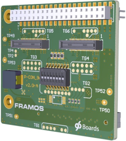
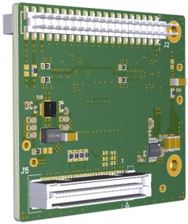
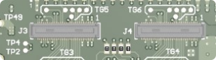
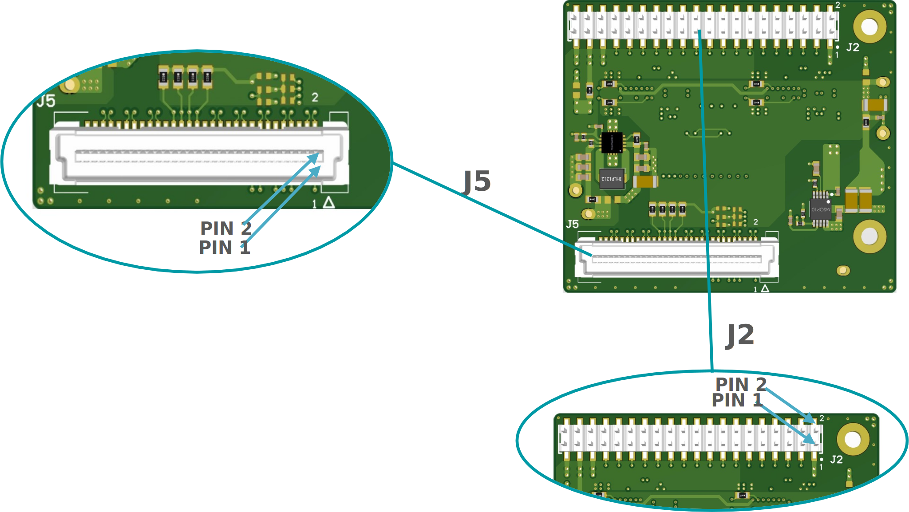
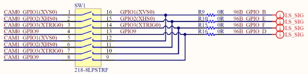
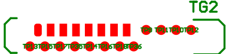
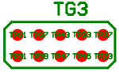
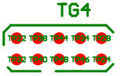

FPA-2.A/96B-V1
++++++++++++++++

Dual FPA to 96Boards.org Consumer Edition:

   -  Two MIPI CSI-2 Inputs with 4- and 2-Lanes

   -  Signal routing and I2C multiplexing

   -  EEPROM for dynamic device tree management

   -  Testpoints to important sensor signals

   -  Configuration of trigger routing

   -  Compatible Processor Boards:

      -  96boards Consumer Edition (CE)
  
      |image38|

+--------------+-----------------+
| **Top View** | **Bottom View** |
+--------------+-----------------+
| |image39|    | |image40|       |
+--------------+-----------------+

**J3, J4: Image Sensor Connectors**

|image41|

+------+-------------------------+------------------------------+--------------------------------------+
| Name | Description             | Connector Type               | Orientation                          |
+======+=========================+==============================+======================================+
| J3   | Port 1, 4-Lanes CSI-2,  | Hirose DF40HC(4.0)-60DS-0.4V | Pin 1 Printed on PCB next to each    |
|      | to FSA                  |                              | connector.                           |
+------+-------------------------+------------------------------+--------------------------------------+
| J4   | Port 2, 4-Lanes CSI-2,  | Hirose DF40HC(4.0)-60DS-0.4V | Pin 1 Printed on PCB next to each    |
|      | to FSA                  |                              | connector.                           |
+------+-------------------------+------------------------------+--------------------------------------+

**Table**: Image Sensor Connectors on FPA-2.A/A-V1

All ports provide the same pinout. The pin assignment is according to
the corresponding FSA.

**Caution:** Direct connection of FSM to FPA (without FSA) or wrong
cable orientation will lead to permanent damage of FSM, Adapters or the
Processor Board. Using flex cable (FMA-FC-150/60-v1) between FSA and FPA
is mandatory.

**Image Sensor Support per Port**

The table below shows the possible MIPI CSI-2 lane configurations per
FSM / Processor Board combination, that are supported in HW using the
FPA-2.A/96B-V1.

+---------------------------------------+--------------+--------------+
|                                       | 96Boards CE  |              |
+=======================================+==============+==============+
| FSM with FSA-FTx/A (all)              | **J5**       | **J6**       |
+---------------------------------------+--------------+--------------+
| FSM-AR0144                            | 2            | 2            |
+---------------------------------------+--------------+--------------+
| FSM-AR0521                            | 2 / 4        | 2            |
+---------------------------------------+--------------+--------------+
| FSM-AR1335                            | 2 / 4        | 2            |
+---------------------------------------+--------------+--------------+
| FSM-HDP230                            | 4            | 2            |
+---------------------------------------+--------------+--------------+
| FSM-IMX264                            | 4            | -            |
+---------------------------------------+--------------+--------------+
| FSM-IMX283                            | 4            | -            |
+---------------------------------------+--------------+--------------+
| FSM-IMX290, 327                       | 2 / 4        | 2            |
+---------------------------------------+--------------+--------------+
| FSM-IMX296, 297                       | 1            | 1            |
+---------------------------------------+--------------+--------------+
| FSM-IMX304                            | 4            | -            |
+---------------------------------------+--------------+--------------+
| FSM-IMX334                            | 4            | -            |
+---------------------------------------+--------------+--------------+
| FSM-IMX335                            | 2 / 4        | 2            |
+---------------------------------------+--------------+--------------+
| FSM-IMX412, 477, 577                  | 2 / 4        | 2            |
+---------------------------------------+--------------+--------------+
| FSM-IMX415, 715                       | 2 / 4        | 2            |
+---------------------------------------+--------------+--------------+
| FSM-IMX462, 662                       | 2 / 4        | 2            |
+---------------------------------------+--------------+--------------+
| FSM-IMX464                            | 2 / 4        | 2            |
+---------------------------------------+--------------+--------------+
| FSM-IMX485, 585                       | 2 / 4        | 2            |
+---------------------------------------+--------------+--------------+
| FSM-IMX530                            | 4            | -            |
+---------------------------------------+--------------+--------------+
| FSM-IMX565, 568                       | 2 / 4        | 2            |
+---------------------------------------+--------------+--------------+
| FSM-IMX678                            | 2 / 4        | 2            |
+---------------------------------------+--------------+--------------+

**Table**: Image Sensor Support per Port with FPA-2.A/96B-V1

J5: Processor Board Connector
~~~~~~~~~~~~~~~~~~~~~~~~~~~~~~~~~~~~~~~~

|image42|

**Label**: J5

**Type**: 61083-063402LF

**Pinout**:

+-------+-------------+-------+-------------------+
| Pin # | Name        | Pin # | Name              |
+=======+=============+=======+===================+
| 1     | SPI_MOSI    | 2     | D_CLK_0_P (J3)    |
+-------+-------------+-------+-------------------+
| 3     | NC          | 4     | D_CLK_0_N (J3)    |
+-------+-------------+-------+-------------------+
| 5     | SPI_CS      | 6     | GND               |
+-------+-------------+-------+-------------------+
| 7     | SPI_SCK     | 8     | D_DATA_0_P (J3)   |
+-------+-------------+-------+-------------------+
| 9     | SPI_MISO    | 10    | D_DATA_0_N (J3)   |
+-------+-------------+-------+-------------------+
| 11    | GND         | 12    | GND               |
+-------+-------------+-------+-------------------+
| 13    | MCLK_0      | 14    | D_DATA_1_P (J3)   |
+-------+-------------+-------+-------------------+
| 15    | MCLK_1      | 16    | D_DATA_1_N (J3)   |
+-------+-------------+-------+-------------------+
| 17    | GND         | 18    | GND               |
+-------+-------------+-------+-------------------+
| 19    | NC          | 20    | D_DATA_2_P (J3)   |
+-------+-------------+-------+-------------------+
| 21    | GND         | 22    | D_DATA_2_N (J3)   |
+-------+-------------+-------+-------------------+
| 23    | NC          | 24    | GND               |
+-------+-------------+-------+-------------------+
| 25    | GND         | 26    | D_DATA_3_P (J3)   |
+-------+-------------+-------+-------------------+
| 27    | NC          | 28    | D_DATA_3_N (J3)   |
+-------+-------------+-------+-------------------+
| 29    | NC          | 30    | GND               |
+-------+-------------+-------+-------------------+
| 31    | GND         | 32    | I2C_0_SCL         |
+-------+-------------+-------+-------------------+
| 33    | NC          | 34    | I2C_0_SDA         |
+-------+-------------+-------+-------------------+
| 35    | NC          | 36    | I2C_2_SCL         |
+-------+-------------+-------+-------------------+
| 37    | GND         | 38    | I2C_2_SDA         |
+-------+-------------+-------+-------------------+
| 39    | NC          | 40    | GND               |
+-------+-------------+-------+-------------------+
| 41    | NC          | 42    | D_DATA_4_P (J4)   |
+-------+-------------+-------+-------------------+
| 43    | NC          | 44    | D_DATA_4_N (J4)   |
+-------+-------------+-------+-------------------+
| 45    | NC          | 46    | GND               |
+-------+-------------+-------+-------------------+
| 47    | NC          | 48    | D_DATA_5_P (J4)   |
+-------+-------------+-------+-------------------+
| 49    | GND         | 50    | D_DATA_5_N (J4)   |
+-------+-------------+-------+-------------------+
| 51    | NC          | 52    | GND               |
+-------+-------------+-------+-------------------+
| 53    | NC          | 54    | D_CLK_0_P (J4)    |
+-------+-------------+-------+-------------------+
| 55    | NC          | 56    | D_CLK_0_N (J4)    |
+-------+-------------+-------+-------------------+
| 57    | GND         | 58    | GND               |
+-------+-------------+-------+-------------------+
| 59    | NC          | 60    | NC                |
+-------+-------------+-------+-------------------+

**Label**: J1/J2

**Type**: 61083-063402LF

**Pinout**:

+-------+----------------+-------+----------------+
| Pin # | Name           | Pin # | Name           |
+=======+================+=======+================+
| 1     | GND            | 2     | GND            |
+-------+----------------+-------+----------------+
| 3     | 96B_UART0_CTS  | 4     | 96B_PWR_BTNn   |
+-------+----------------+-------+----------------+
| 5     | 96B_UART0_TXD  | 6     | 96B_PWR_BTNn   |
+-------+----------------+-------+----------------+
| 7     | 96B_UART0_RXD  | 8     | 96B_SPI0_CLK   |
+-------+----------------+-------+----------------+
| 9     | 96B_UART0_RTS  | 10    | 96B_SPI0_MISO  |
+-------+----------------+-------+----------------+
| 11    | 96B_UART1_TXD  | 12    | 96B_SPI0_CS    |
+-------+----------------+-------+----------------+
| 13    | 96B_UART1_RXD  | 14    | 96B_SPI0_MOSI  |
+-------+----------------+-------+----------------+
| 15    | 96B_SCL_0      | 16    | 96B_PCM_FS     |
+-------+----------------+-------+----------------+
| 17    | 96B_SDA_0      | 18    | 96B_PCM_CLK    |
+-------+----------------+-------+----------------+
| 19    | 96B_SCL_1      | 20    | 96B_PCM_DO     |
+-------+----------------+-------+----------------+
| 21    | 96B_SDA_1      | 22    | 96B_PCM_DI     |
+-------+----------------+-------+----------------+
| 23    | 96B_GPIO_A     | 24    | 96B_GPIO_B     |
+-------+----------------+-------+----------------+
| 25    | 96B_GPIO_C     | 26    | 96B_GPIO_D     |
+-------+----------------+-------+----------------+
| 27    | 96B_GPIO_E     | 28    | 96B_GPIO_F     |
+-------+----------------+-------+----------------+
| 29    | 96B_GPIO_G     | 30    | 96B_GPIO_H     |
+-------+----------------+-------+----------------+
| 31    | CAM0_RST_0     | 32    | CAM0_PW_EN_0   |
+-------+----------------+-------+----------------+
| 33    | CAM1_RST_0     | 34    | CAM1_PW_EN_0   |
+-------+----------------+-------+----------------+
| 35    | 96B_1V8        | 36    | 96B_SYS_DCIN   |
+-------+----------------+-------+----------------+
| 37    | 96B_5V0        | 38    | GND            |
+-------+----------------+-------+----------------+
| 39    | GND            | 40    | GND            |
+-------+----------------+-------+----------------+

**Table**: Pinout of FPA-2.A/96B-V1 connector to 96Boards.org Consumer
Edition Standard

SW1: Configuration Switch
~~~~~~~~~~~~~~~~~~~~~~~~~~~~~

The DIP switch SW1 is for interconnecting FSA’s triggering signals (XVS,
XHS and XTRIG). It is designated to interconnect XVS, XHS and XTRIG pins
from FPA in parallel to both FSA connectors.

|image43|

**Table**: Configuration of SW1 on FPA-2.A/96B-V1

**Default state of DIP switch**

-  SW1 – all positions OFF (XVS/XHS pins are NOT interconnected)

TGx, TPx: Test Groups and Test Points
~~~~~~~~~~~~~~~~~~~~~~~~~~~~~~~~~~~~~~~~~~

Ungrouped (according to silk print)
~~~~~~~~~~~~~~~~~~~~~~~~~~~~~~~~~~~

+----------+------------------------+----------+----------------------+
| Label    | Signal                 | Label    | Signal               |
+==========+========================+==========+======================+
| TP2      | GPIO4(MCLK2)           | TP51     | 5V0_VDD              |
+----------+------------------------+----------+----------------------+
| TP4      | GPIO5(MCLK3)           | TP52     | GND                  |
+----------+------------------------+----------+----------------------+
| TP49     | 1V8_VDD                | TP53     | GND                  |
+----------+------------------------+----------+----------------------+
| TP50     | 3V8_VDD                |          |                      |
+----------+------------------------+----------+----------------------+

TG1: Clocks and SPI

|image44|

+-----------+--------------------+-----------+------------------------+
| Label     | Signal             | Label     | Signal                 |
+===========+====================+===========+========================+
| TP1       | MCLK_0             | TP55      | SPI_CS                 |
+-----------+--------------------+-----------+------------------------+
| TP3       | MCLK_1             | TP56      | SPI_SCK                |
+-----------+--------------------+-----------+------------------------+
| TP54      | SPI_MOSI           | TP57      | SPI_MISO               |
+-----------+--------------------+-----------+------------------------+

TG2: Synchronisation Signals

|image45|

+----------+-------------------------+----------+---------------------+
| Label    | Signal                  | Label    | Signal              |
+==========+=========================+==========+=====================+
| TP9      | CAM0_I2C_0_SCL(SPI_SCK) | TP18     | CAM1_GPIO3(XTRIG0)  |
+----------+-------------------------+----------+---------------------+
| TP10     | CAM1_I2C_0_SCL(SPI_SCK) | TP35     | CAM0_GPIO9          |
+----------+-------------------------+----------+---------------------+
| TP11     | CAM0_I2C_0_SDA(SPI_MOSI)| TP36     | CAM1_GPIO9          |
+----------+-------------------------+----------+---------------------+
| TP12     | CAM1_I2C_0_SDA(SPI_MOSI)|          |                     |
+----------+-------------------------+----------+---------------------+
| TP13     | CAM0_GPIO1(XVS0)        |          |                     |
+----------+-------------------------+----------+---------------------+
| TP14     | CAM1_GPIO1(XVS0)        |          |                     |
+----------+-------------------------+----------+---------------------+
| TP15     | CAM0_GPIO2(XHS0)        |          |                     |
+----------+-------------------------+----------+---------------------+
| TP16     | CAM1_GPIO2(XHS0)        |          |                     |
+----------+-------------------------+----------+---------------------+
| TP17     | CAM0_GPIO3(XTRIG0)      |          |                     |
+----------+-------------------------+----------+---------------------+

TG3: Control Signals and GPIOs J3 (CAM0)

|image46|

+----------+-----------------------+----------+------------------------+
| Label    | Signal                | Label    | Signal                 |
+==========+=======================+==========+========================+
| TP21     | CAM0_PW_EN_1          | TP37     | CAM0_GPIO10            |
+----------+-----------------------+----------+------------------------+
| TP23     | CAM0_GPIO15(SPI_MISO) | TP39     | CAM0_GPIO11            |
+----------+-----------------------+----------+------------------------+
| TP27     | CAM0_RST_1            | TP43     | CAM0_GPIO16(SYS_PW_EN) |
+----------+-----------------------+----------+------------------------+
| TP31     | CAM0_GPIO7            | TP45     | CAM0_I2C_1_SCL         |
+----------+-----------------------+----------+------------------------+
| TP33     | CAM0_GPIO8            | TP47     | CAM0_I2C_1_SDA         |
+----------+-----------------------+----------+------------------------+

TG4: Control Signals and GPIOs J4 (CAM1)

|image47|

+----------+-----------------------+----------+------------------------+
| Label    | Signal                | Label    | Signal                 |
+==========+=======================+==========+========================+
| TP22     | CAM1_PW_EN_1          | TP38     | CAM1_GPIO10            |
+----------+-----------------------+----------+------------------------+
| TP24     | CAM1_GPIO15(SPI_MISO) | TP40     | CAM1_GPIO11            |
+----------+-----------------------+----------+------------------------+
| TP28     | CAM1_RST_1            | TP44     | CAM1_GPIO16(SYS_PW_EN) |
+----------+-----------------------+----------+------------------------+
| TP32     | CAM1_GPIO7            | TP46     | CAM1_I2C_1_SCL         |
+----------+-----------------------+----------+------------------------+
| TP34     | CAM1_GPIO8            | TP48     | CAM1_I2C_1_SDA         |
+----------+-----------------------+----------+------------------------+

TG6: Control Signals and GPIOs J3 (CAM0)

|image48|

+----------+------------------------+----------+----------------------+
| Label    | Signal                 | Label    | Signal               |
+==========+========================+==========+======================+
| TP5      | CAM0_RST_0             | TP25     | CAM0_GPIO17(SPI_CS)  |
+----------+------------------------+----------+----------------------+
| TP7      | CAM0_GPIO0(XMASTER0)   | TP29     | CAM0_GPIO6           |
+----------+------------------------+----------+----------------------+
| TP19     | CAM0_PW_EN_0           | TP41     | CAM0_GPIO14          |
+----------+------------------------+----------+----------------------+

TG6: Control Signals and GPIOs J4 (CAM1)

|image49|

+----------+------------------------+----------+----------------------+
| Label    | Signal                 | Label    | Signal               |
+==========+========================+==========+======================+
| TP6      | CAM1_RST_0             | TP26     | CAM1_GPIO17(SPI_CS)  |
+----------+------------------------+----------+----------------------+
| TP8      | CAM1_GPIO0(XMASTER0)   | TP30     | CAM1_GPIO6           |
+----------+------------------------+----------+----------------------+
| TP20     | CAM1_PW_EN_0           | TP42     | CAM1_GPIO14          |
+----------+------------------------+----------+----------------------+

Technical Drawing
~~~~~~~~~~~~~~~~~

|image50|

Figure: Technical Drawing of FPA-2.A/96B-V1

.. |image50| image:: FPA-50s.svg
   :width: 900px
   :height: 400px