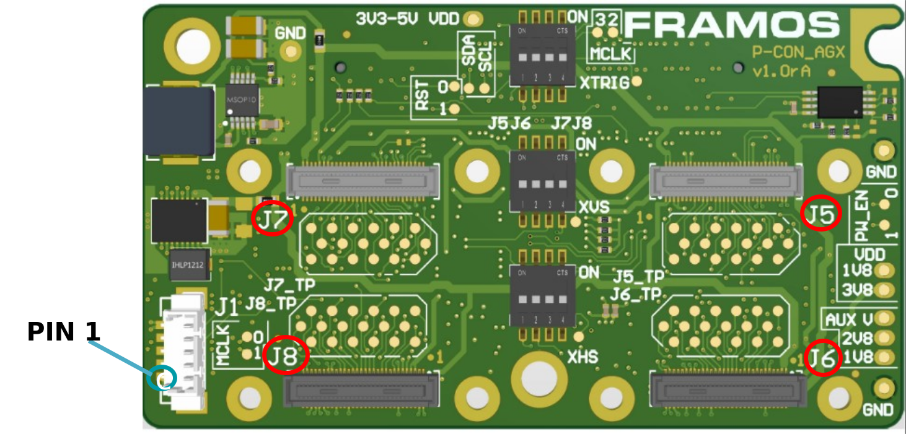
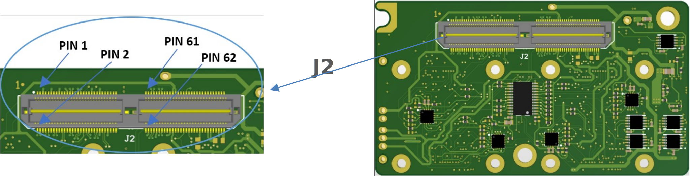
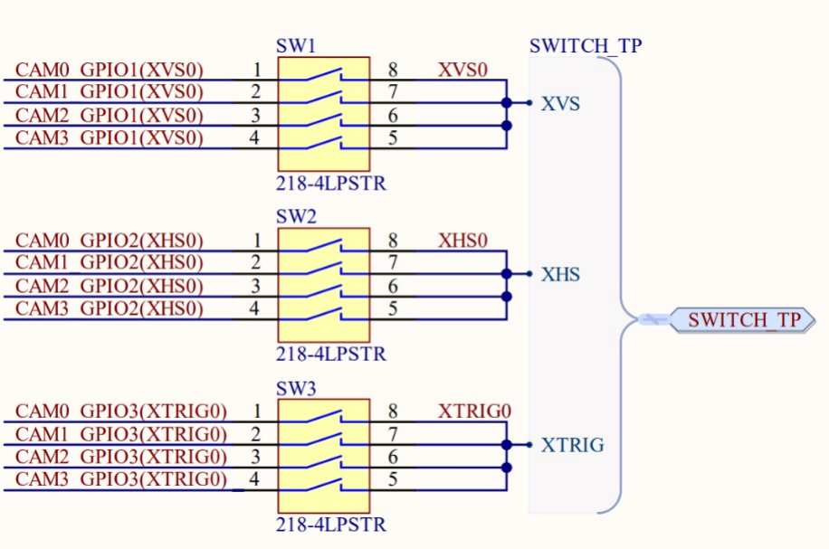
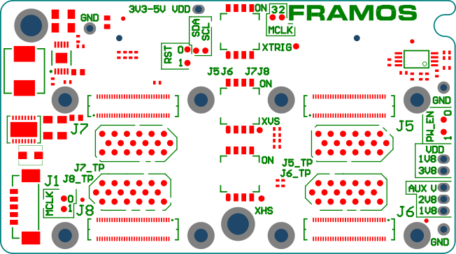
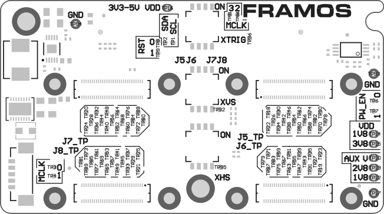
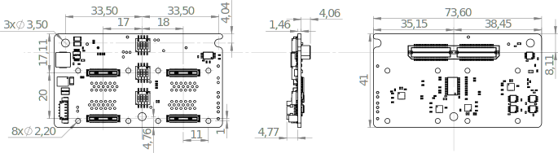

FPA-4.A/AGX-V1A
+++++++++++++++++

Quad FPA to NVIDIA Jetson AGX Orin and AGX Xavier: 

   -  Adapting from PixelMate to NVIDIA Jetson AGX Developer Kit Connector

   -  Four 4-Lane MIPI CSI-2

   -  Generation of standard PixelMate power rails

   -  Testpoints to important sensor signals

   -  Enhanced sensor control signal access via I2C extender

   -  Synchronization and timing signal access via Molex Picoblade
      connector

   -  Compatible Processor Boards:

      -  NVIDIA Jetson Orin AGX Development Kit

      -  NVIDIA Jetson Xavier AGX Development Kit

         |image1|

|image2|

Description of Connectors and Interfaces
~~~~~~~~~~~~~~~~~~~~~~~~~~~~~~~~~~~~~~~~~~~~

+----------+--------------------------+---------------------------+--------------------------+
| **Name** | **Description**          | **Connector Type**        | **Orientation**          |
+==========+==========================+===========================+==========================+
| **J1**   | XVS, XHS and XTRIG       | Molex PicoBlade, 5-Pin    | Pin 1 marked on PCB      |
|          | Signals                  | (53398-0571)              |                          |
+----------+--------------------------+---------------------------+--------------------------+
| **J2**   | PixelMate to Processor   | Samtec QTH-060-01-L-D-A   | Pin 1 marked on PCB      |
|          | Board                    |                           |                          |
+----------+--------------------------+---------------------------+--------------------------+
| **J5**   | PixelMate to FSA (4x     | Hirose DF40C-60DS-0.4V(51)| Pin 1 Printed on PCB     |
|          | MIPI CSI-2 lanes)        |                           | next to each connector.  |
+----------+--------------------------+---------------------------+--------------------------+
| **J6**   | PixelMate to FSA (4x     | Hirose DF40H              | Pin 1 Printed on PCB     |
|          | MIPI CSI-2 lanes)        | C(4.0)-60DS-0.4V(51)      | next to each connector.  |
+----------+--------------------------+---------------------------+--------------------------+
| **J7**   | PixelMate to FSA (4x     | Hirose DF40C-60DS-0.4V(51)| Pin 1 Printed on PCB     |
|          | MIPI CSI-2 lanes)        |                           | next to each connector.  |
+----------+--------------------------+---------------------------+--------------------------+
| **J8**   | PixelMate to FSA (4x     | Hirose DF40H              | Pin 1 Printed on PCB     |
|          | MIPI CSI-2 lanes)        | C(4.0)-60DS-0.4V(51)      | next to each connector.  |
+----------+--------------------------+---------------------------+--------------------------+

**Table**: Connectors on FPA-4.A/AGX-V1A

The Pin 1 markings can be found in the following chapters along with the
Pinout, as well as on the PCB in copper or silkscreen layer next to the
connector.

**Note:** All signals are routed from J5, J6, J7, J8 (to FSA) to J2 (to
processor), test points and pin row. They follow the signal
specification according to the FSA output interface. Control signals
going to J1 (I2C, clock, GPIO) are buffered to allow voltage
translation.

**J1 – XVS, XHS and XTRIG Signals**

|image3|

**Type**: Molex PicoBlade, 53398-0571

**Pinout**:

+--------------------+-------------------------------------------------+
| Pin #              | Name                                            |
+====================+=================================================+
| 1                  | 1V8_VDD                                         |
+--------------------+-------------------------------------------------+
| 2                  | XVS0                                            |
+--------------------+-------------------------------------------------+
| 3                  | XHS0                                            |
+--------------------+-------------------------------------------------+
| 4                  | XTRIG0                                          |
+--------------------+-------------------------------------------------+
| 6                  | GND                                             |
+--------------------+-------------------------------------------------+

**Note**: Switches SW1, SW2 and SW3 refer to XVS, XHS
and XTRIG signals respectively. When SW1, SW2 and SW3
are off, the corresponding signals XVS0, XHS0 and XTRIG0
are not connected.

**J5, J6, J7, J8 - Connectors to Sensor Adapters (FSA)**

+---------------------------+------------------------------------------+
| Connectors                | Type                                     |
+===========================+==========================================+
| J5, J7                    | Hirose DF40C-60DS-0.4V(51)               |
+---------------------------+------------------------------------------+
| J6, J8                    | Hirose DF40HC(4.0)-60DS-0.4V(51)         |
+---------------------------+------------------------------------------+

**Note**: The two PixelMate connectors, J5 and J7, feature a compact 1.5 mm
height, enabling direct connection of 26.5x26.5mm FSM:GO or classic FSA
modules onto the board through J6 and J8.**

**Pinout:**

+---------+-------------------+---------+-------------------+---------+-------------------+---------+-------------------+
| **Pin** | **Name**          | **Pin** | **Name**          | **Pin** | **Name**          | **Pin** | **Name**          |
+=========+===================+=========+===================+=========+===================+=========+===================+
| 1       | 3V8_VDD           | 16      | RST_1             | 31      | GPIO3(XTRIG0)     | 46      | D_DATA_D_P        |
+---------+-------------------+---------+-------------------+---------+-------------------+---------+-------------------+
| 2       | 1V8_VDD           | 17      | NC                | 32      | NC                | 47      | D_CLK_B_N         |
+---------+-------------------+---------+-------------------+---------+-------------------+---------+-------------------+
| 3       | 3V8_VDD           | 18      | NC                | 33      | PW_EN_0           | 48      | D_DATA_D_N        |
+---------+-------------------+---------+-------------------+---------+-------------------+---------+-------------------+
| 4       | 1V8_VDD           | 19      | GPIO0(XMASTER0)   | 34      | PW_EN_1           | 49      | GND               |
+---------+-------------------+---------+-------------------+---------+-------------------+---------+-------------------+
| 5       | 2V8_AUX           | 20      | NC                | 35      | GPIO6(SLAMODE0)   | 50      | GND               |
+---------+-------------------+---------+-------------------+---------+-------------------+---------+-------------------+
| 6       | NC                | 21      | I2C_X_SCL         | 36      | GPIO7(SLAMODE1)   | 51      | D_DATA_A_N        |
+---------+-------------------+---------+-------------------+---------+-------------------+---------+-------------------+
| 7       | 2V8_AUX           | 22      | I2C_Y_SCL         | 37      | GND               | 52      | D_DATA_B_N        |
+---------+-------------------+---------+-------------------+---------+-------------------+---------+-------------------+
| 8       | NC                | 23      | NC                | 38      | GND               | 53      | D_DATA_A_P        |
+---------+-------------------+---------+-------------------+---------+-------------------+---------+-------------------+
| 9       | 1V8_AUX           | 24      | GPIO16(SLAMODE2)  | 39      | MCLK_0            | 54      | D_DATA_B_P        |
+---------+-------------------+---------+-------------------+---------+-------------------+---------+-------------------+
| 10      | NC                | 25      | GPIO1(XVS0)       | 40      | GPIO4(MCLK2)      | 55      | GND               |
+---------+-------------------+---------+-------------------+---------+-------------------+---------+-------------------+
| 11      | GND               | 26      | NC                | 41      | MCLK_1            | 56      | GND               |
+---------+-------------------+---------+-------------------+---------+-------------------+---------+-------------------+
| 12      | GND               | 27      | I2C_X_SDA         | 42      | GPIO5(MCLK3)      | 57      | D_DATA_C_P        |
+---------+-------------------+---------+-------------------+---------+-------------------+---------+-------------------+
| 13      | GND               | 28      | I2C_Y_SDA         | 43      | GND               | 58      | D_CLK_A_P         |
+---------+-------------------+---------+-------------------+---------+-------------------+---------+-------------------+
| 14      | GND               | 29      | GPIO2(XHS0)       | 44      | GND               | 59      | D_DATA_C_N        |
+---------+-------------------+---------+-------------------+---------+-------------------+---------+-------------------+
| 15      | RST_0             | 30      | GPIO10(TENABLE)   | 45      | D_CLK_B_P         | 60      | D_CLK_A_N         |
+---------+-------------------+---------+-------------------+---------+-------------------+---------+-------------------+

**Connector I2C Mapping**

The connectors are mapped to specific ports on the I2C multiplexer.
Each PixelMate is associated with two I2C lines: the primary line
(I2C_X) and the auxiliary line (I2C_Y)

+----------------+--------------------------+--------------------------+
| Connector      | I2C_X                    | I2C_Y                    |
+================+==========================+==========================+
| J5             | I2C_0                    | I2C_1                    |
+----------------+--------------------------+--------------------------+
| J6             | I2C_2                    | I2C_3                    |
+----------------+--------------------------+--------------------------+
| J7             | I2C_4                    | I2C_5                    |
+----------------+--------------------------+--------------------------+
| J8             | I2C_6                    | I2C_7                    |
+----------------+--------------------------+--------------------------+

**MIPI CSI-2 Signal Mapping for PixelMate Connectors**

+-----------+----------+-----------+-----------+-----------+-----------+
| PixelMate | Signal   | Signal    | Signal    | Signal    | Signal    |
| Pin       | Name     | Name on   | Name on   | Name on   | Name on   |
|           |          | J5        | J6        | J7        | J8        |
+===========+==========+===========+===========+===========+===========+
| P:58 N:60 | D_CLK_A  | D_CLK_0   | D_CLK_2   | D_CLK_4   | D_CLK_6   |
+-----------+----------+-----------+-----------+-----------+-----------+
| P:45 N:47 | D_CLK_B  | D_CLK_1   | D_CLK_3   | D_CLK_5   | D_CLK_7   |
+-----------+----------+-----------+-----------+-----------+-----------+
| P:53 N:51 | D_DATA_A | D_DATA_0  | D_DATA_4  | D_DATA_8  | D_DATA_12 |
+-----------+----------+-----------+-----------+-----------+-----------+
| P:54 N:52 | D_DATA_B | D_DATA_1  | D_DATA_5  | D_DATA_9  | D_DATA_13 |
+-----------+----------+-----------+-----------+-----------+-----------+
| P:57 N:59 | D_DATA_C | D_DATA_2  | D_DATA_6  | D_DATA_10 | D_DATA_14 |
+-----------+----------+-----------+-----------+-----------+-----------+
| P:46 N:48 | D_DATA_D | D_DATA_3  | D_DATA_7  | D_DATA_11 | D_DATA_15 |
+-----------+----------+-----------+-----------+-----------+-----------+

J2: Connector to Processor Board
~~~~~~~~~~~~~~~~~~~~~~~~~~~~~~~~~~~~~~~~~~~

|image4|

**Label**: J2

**Type**: Samtec QTH-060-01-L-D-A

**Pinout**:

+---------+--------------+---------+----------------+---------+----------------+---------+----------------+
| **Pin** | **Name**     | **Pin** | **Name**       | **Pin** | **Name**       | **Pin** | **Name**       |
+=========+==============+=========+================+=========+================+=========+================+
| 1       | D_DATA_0_P   | 2       | D_DATA_2_P     | 61      | D_DATA_10_N    | 62      | D_DATA_14_N    |
+---------+--------------+---------+----------------+---------+----------------+---------+----------------+
| 3       | D_DATA_0_N   | 4       | D_DATA_2_N     | 63      | GND            | 64      | GND            |
+---------+--------------+---------+----------------+---------+----------------+---------+----------------+
| 5       | GND          | 6       | GND            | 65      | D_CLK_5_P      | 66      | D_CLK_7_P      |
+---------+--------------+---------+----------------+---------+----------------+---------+----------------+
| 7       | D_CLK_0_P    | 8       | D_CLK_1_P      | 67      | D_CLK_5_N      | 68      | D_CLK_7_N      |
+---------+--------------+---------+----------------+---------+----------------+---------+----------------+
| 9       | D_CLK_0_N    | 10      | D_CLK_1_N      | 69      | GND            | 70      | GND            |
+---------+--------------+---------+----------------+---------+----------------+---------+----------------+
| 11      | GND          | 12      | GND            | 71      | D_DATA_11_P    | 72      | D_DATA_15_P    |
+---------+--------------+---------+----------------+---------+----------------+---------+----------------+
| 13      | D_DATA_1_P   | 14      | D_DATA_3_P     | 73      | D_DATA_11_N    | 74      | D_DATA_15_N    |
+---------+--------------+---------+----------------+---------+----------------+---------+----------------+
| 15      | D_DATA_1_N   | 16      | D_DATA_3_N     | 75      | I2C_SCL        | 76      | NC             |
+---------+--------------+---------+----------------+---------+----------------+---------+----------------+
| 17      | GND          | 18      | GND            | 77      | I2C_SDA        | 78      | NC             |
+---------+--------------+---------+----------------+---------+----------------+---------+----------------+
| 19      | D_DATA_4_P   | 20      | D_DATA_6_P     | 79      | GND            | 80      | GND            |
+---------+--------------+---------+----------------+---------+----------------+---------+----------------+
| 21      | D_DATA_4_N   | 22      | D_DATA_6_N     | 81      | 2V8_AUX        | 82      | 2V8_AUX        |
+---------+--------------+---------+----------------+---------+----------------+---------+----------------+
| 23      | GND          | 24      | GND            | 83      | 2V8_AUX        | 84      | NC             |
+---------+--------------+---------+----------------+---------+----------------+---------+----------------+
| 25      | D_CLK_2_P    | 26      | D_CLK_3_P      | 85      | NC             | 86      | NC             |
+---------+--------------+---------+----------------+---------+----------------+---------+----------------+
| 27      | D_CLK_2_N    | 28      | D_CLK_3_N      | 87      | NC             | 88      | MCLK_1         |
+---------+--------------+---------+----------------+---------+----------------+---------+----------------+
| 29      | GND          | 30      | GND            | 89      | NC             | 90      | PW_EN_1        |
+---------+--------------+---------+----------------+---------+----------------+---------+----------------+
| 31      | D_DATA_5_P   | 32      | D_DATA_7_P     | 91      | MCLK_0         | 92      | RST_1          |
+---------+--------------+---------+----------------+---------+----------------+---------+----------------+
| 33      | D_DATA_5_N   | 34      | D_DATA_7_N     | 93      | PW_EN_0        | 94      | MCLK_2         |
+---------+--------------+---------+----------------+---------+----------------+---------+----------------+
| 35      | GND          | 36      | GND            | 95      | RST_0          | 96      | NC             |
+---------+--------------+---------+----------------+---------+----------------+---------+----------------+
| 37      | D_DATA_8_P   | 38      | D_DATA_12_P    | 97      | NC             | 98      | NC             |
+---------+--------------+---------+----------------+---------+----------------+---------+----------------+
| 39      | D_DATA_8_N   | 40      | D_DATA_12_N    | 99      | GND            | 100     | GND            |
+---------+--------------+---------+----------------+---------+----------------+---------+----------------+
| 41      | GND          | 42      | GND            | 101     | NC             | 102     | 1V8_AUX        |
+---------+--------------+---------+----------------+---------+----------------+---------+----------------+
| 43      | D_CLK_4_P    | 44      | D_CLK_6_P      | 103     | NC             | 104     | NC             |
+---------+--------------+---------+----------------+---------+----------------+---------+----------------+
| 45      | D_CLK_4_N    | 46      | D_CLK_6_N      | 105     | NC             | 106     | NC             |
+---------+--------------+---------+----------------+---------+----------------+---------+----------------+
| 47      | GND          | 48      | GND            | 107     | NC             | 108     | 3V3_VDD        |
+---------+--------------+---------+----------------+---------+----------------+---------+----------------+
| 49      | D_DATA_9_P   | 50      | D_DATA_13_P    | 109     | NC             | 110     | 3V3_VDD        |
+---------+--------------+---------+----------------+---------+----------------+---------+----------------+
| 51      | D_DATA_9_N   | 52      | D_DATA_13_N    | 111     | NC             | 112     | NC             |
+---------+--------------+---------+----------------+---------+----------------+---------+----------------+
| 53      | GND          | 54      | GND            | 113     | NC             | 114     | NC             |
+---------+--------------+---------+----------------+---------+----------------+---------+----------------+
| 55      | NC           | 56      | NC             | 115     | GND            | 116     | GND            |
+---------+--------------+---------+----------------+---------+----------------+---------+----------------+
| 57      | NC           | 58      | NC             | 117     | NC             | 118     | 3V3-5V_VDD     |
+---------+--------------+---------+----------------+---------+----------------+---------+----------------+
| 59      | D_DATA_10_P  | 60      | D_DATA_14_P    | 119     | NC             | 120     | 3V3-5V_VDD     |
+---------+--------------+---------+----------------+---------+----------------+---------+----------------+

Table: Pinout of FPA-4.A/AGX-V1A connector to NVIDIA Jetson AGX
Xavier and AGX Orin

SW1, SW2, SW3: Configuration Switches
~~~~~~~~~~~~~~~~~~~~~~~~~~~~~~~~~~~~~~~~~

DIP switches SW1, SW2 and SW3 are mainly for interconnecting FSA’s
triggering signals (XVS, XHS and XTRIG).

DIP switch SW1 is designated to interconnect XVS pins, DIP switch SW2 is
designated to interconnect XHS pins and DIP switch SW3 is designated to
interconnect XTRIG pins.

|image5|

**I2C: Access to further Signals**

The FPA contains an I2C GPIO extender (TCA6408). It allows the control
of further timing uncritical signals through the I2C bus. Each connector
is paired with its own dedicated I2C GPIO expander, connected to the
I2C_X line. The mapping for I2C_X is as follows:

+--------------------------------------+-------------------------------+
| Connector                            | I2C_X                         |
+======================================+===============================+
| J5                                   | I2C_0                         |
+--------------------------------------+-------------------------------+
| J6                                   | I2C_2                         |
+--------------------------------------+-------------------------------+
| J7                                   | I2C_4                         |
+--------------------------------------+-------------------------------+
| J8                                   | I2C_6                         |
+--------------------------------------+-------------------------------+

While all GPIO expanders share a common address (0x20), they are
accessed through different I2C clock and data lines, and the specific
I2C line for each connector is identified by the corresponding I2C_X
value.

I2C Address [3]_: 0x20

Pinout:

**U1**

+-----------+----------------------------+----------------------------+
| Pin #     | Name                       | Pixelmate PIN              |
+===========+============================+============================+
| P0        | PW_EN_0                    | 33                         |
+-----------+----------------------------+----------------------------+
| P1        | PW_EN_1                    | 34                         |
+-----------+----------------------------+----------------------------+
| P2        | RST_0                      | 15                         |
+-----------+----------------------------+----------------------------+
| P3        | GPIO0(XMASTER0)            | 19                         |
+-----------+----------------------------+----------------------------+
| P4        | GPIO6(SLAMODE0)            | 35                         |
+-----------+----------------------------+----------------------------+
| P5        | GPIO7(SLAMODE1)            | 36                         |
+-----------+----------------------------+----------------------------+
| P6        | GPIO16(SLAMODE2)           | 24                         |
+-----------+----------------------------+----------------------------+
| P7        | GPIO10(TENABLE)            | 30                         |
+-----------+----------------------------+----------------------------+

External Signals & Test Points
~~~~~~~~~~~~~~~~~~~~~~~~~~~~~~~~~~

|image6|

|image7|

**Connector J5: J5_TP and Ungrouped Test Points**

+-----------+-----------------------------+-----------+---------------------------+
| **Label** | **Signal**                  | **Label** | **Signal**                |
+===========+=============================+===========+===========================+
| TP18      | CAM0_RST_0                  | TP62      | CAM0_GPIO3(XTRIG0)        |
+-----------+-----------------------------+-----------+---------------------------+
| TP22      | CAM0_RST_1                  | TP66      | CAM0_PW_EN_0              |
+-----------+-----------------------------+-----------+---------------------------+
| TP26      | CAM0_GPIO0(XMASTER0)        | TP70      | CAM0_PW_EN_1              |
+-----------+-----------------------------+-----------+---------------------------+
| TP30      | I2C_0_SCL(SPI_SCK)          | TP74      | CAM0_GPIO6                |
+-----------+-----------------------------+-----------+---------------------------+
| TP34      | I2C_1_SCL                   | TP78      | CAM0_GPIO7                |
+-----------+-----------------------------+-----------+---------------------------+
| TP38      | CAM0_GPIO16(SYS_PW_EN)      | TP82      | CAM0_MCLK_0               |
+-----------+-----------------------------+-----------+---------------------------+
| TP42      | CAM0_GPIO1(XVS0)            | TP86      | GPIO4(MCLK2)              |
+-----------+-----------------------------+-----------+---------------------------+
| TP46      | I2C_0_SDA(SPI_MOSI)         | TP90      | CAM0_MCLK_1               |
+-----------+-----------------------------+-----------+---------------------------+
| TP50      | I2C_1_SDA                   | TP91      | GPIO5(MCLK3)              |
+-----------+-----------------------------+-----------+---------------------------+
| TP54      | CAM0_GPIO2(XHS0)            |           |                           |
+-----------+-----------------------------+-----------+---------------------------+
| TP58      | CAM0_GPIO10                 |           |                           |
+-----------+-----------------------------+-----------+---------------------------+

Connector J6: J6_TP Test Points

+---------+-------------------------+---------+-------------------------+
| Label   | Signal                  | Label   | Signal                  |
+=========+=========================+=========+=========================+
| TP19    | CAM1_RST_0_TP           | TP63    | CAM1_GPIO3(XTRIG0)_TP   |
+---------+-------------------------+---------+-------------------------+
| TP23    | CAM1_RST_1_TP           | TP67    | CAM1_PW_EN_0_TP         |
+---------+-------------------------+---------+-------------------------+
| TP27    | CAM1_GPIO0(XMASTER0)_TP | TP71    | CAM1_PW_EN_1_TP         |
+---------+-------------------------+---------+-------------------------+
| TP31    | I2C_2_SCL(SPI_SCK)_TP   | TP75    | CAM1_GPIO6_TP           |
+---------+-------------------------+---------+-------------------------+
| TP35    | I2C_3_SCL_TP            | TP79    | CAM1_GPIO7_TP           |
+---------+-------------------------+---------+-------------------------+
| TP39    | CAM1_GPIO16(SYS_PW_EN)_TP | TP83  | CAM1_MCLK_0_TP          |
+---------+-------------------------+---------+-------------------------+
| TP43    | CAM1_GPIO1(XVS0)_TP     | TP87    | CAM1_MCLK1_TP           |
+---------+-------------------------+---------+-------------------------+
| TP47    | I2C_2_SDA(SPI_MOSI)_TP  |         |                         |
+---------+-------------------------+---------+-------------------------+
| TP51    | I2C_3_SDA_TP            |         |                         |
+---------+-------------------------+---------+-------------------------+
| TP55    | CAM1_GPIO2(XHS0)_TP     |         |                         |
+---------+-------------------------+---------+-------------------------+
| TP59    | CAM1_GPIO10_TP          |         |                         |
+---------+-------------------------+---------+-------------------------+

Connector J7: J7_TP Test Points

+---------+-------------------------+---------+-------------------------+
| Label   | Signal                  | Label   | Signal                  |
+=========+=========================+=========+=========================+
| TP20    | CAM2_RST_0_TP           | TP64    | CAM2_GPIO3(XTRIG0)_TP   |
+---------+-------------------------+---------+-------------------------+
| TP24    | CAM2_RST_1_TP           | TP68    | CAM2_PW_EN_0_TP         |
+---------+-------------------------+---------+-------------------------+
| TP28    | CAM2_GPIO0(XMASTER0)_TP | TP72    | CAM2_PW_EN_1_TP         |
+---------+-------------------------+---------+-------------------------+
| TP32    | I2C_4_SCL(SPI_SCK)_TP   | TP76    | CAM2_GPIO6_TP           |
+---------+-------------------------+---------+-------------------------+
| TP36    | I2C_5_SCL_TP            | TP80    | CAM2_GPIO7_TP           |
+---------+-------------------------+---------+-------------------------+
| TP40    | CAM2_GPIO16(SYS_PW_EN)_TP | TP84  | CAM2_MCLK_0_TP          |
+---------+-------------------------+---------+-------------------------+
| TP44    | CAM2_GPIO1(XVS0)_TP     | TP88    | CAM2_MCLK1_TP           |
+---------+-------------------------+---------+-------------------------+
| TP48    | I2C_4_SDA(SPI_MOSI)_TP  |         |                         |
+---------+-------------------------+---------+-------------------------+
| TP52    | I2C_5_SDA_TP            |         |                         |
+---------+-------------------------+---------+-------------------------+
| TP56    | CAM2_GPIO2(XHS0)_TP     |         |                         |
+---------+-------------------------+---------+-------------------------+
| TP60    | CAM2_GPIO10_TP          |         |                         |
+---------+-------------------------+---------+-------------------------+

Connector J8: J8_TP Test Points

+---------+-----------------------------+---------+-------------------------+
| Label   | Signal                      | Label   | Signal                  |
+=========+=============================+=========+=========================+
| TP21    | CAM3_RST_0_TP               | TP65    | CAM3_GPIO3(XTRIG0)_TP   |
+---------+-----------------------------+---------+-------------------------+
| TP25    | CAM3_RST_1_TP               | TP69    | CAM3_PW_EN_0_TP         |
+---------+-----------------------------+---------+-------------------------+
| TP29    | CAM3_GPIO0(XMASTER0)_TP     | TP73    | CAM3_PW_EN_1_TP         |
+---------+-----------------------------+---------+-------------------------+
| TP33    | I2C_6_SCL(SPI_SCK)_TP       | TP77    | CAM3_GPIO6_TP           |
+---------+-----------------------------+---------+-------------------------+
| TP37    | I2C_7_SCL_TP                | TP81    | CAM3_GPIO7_TP           |
+---------+-----------------------------+---------+-------------------------+
| TP41    | CAM3_GPIO16(SYS_PW_EN)_TP   | TP85    | CAM3_MCLK_0_TP          |
+---------+-----------------------------+---------+-------------------------+
| TP45    | CAM3_GPIO1(XVS0)_TP         | TP89    | CAM3_MCLK1_TP           |
+---------+-----------------------------+---------+-------------------------+
| TP49    | I2C_6_SDA(SPI_MOSI)_TP      |         |                         |
+---------+-----------------------------+---------+-------------------------+
| TP53    | I2C_7_SDA_TP                |         |                         |
+---------+-----------------------------+---------+-------------------------+
| TP57    | CAM3_GPIO2(XHS0)_TP         |         |                         |
+---------+-----------------------------+---------+-------------------------+
| TP61    | CAM3_GPIO10_TP              |         |                         |
+---------+-----------------------------+---------+-------------------------+

Other Test Points (Ungrouped)

+-------------------+--------------------------------------------------+
| Label             | Signal                                           |
+===================+==================================================+
| TP92              | XVS0_TP                                          |
+-------------------+--------------------------------------------------+
| TP93              | GND                                              |
+-------------------+--------------------------------------------------+
| TP94              | GND                                              |
+-------------------+--------------------------------------------------+
| TP95              | XHS0_TP                                          |
+-------------------+--------------------------------------------------+
| TP96              | XTRIG0_TP                                        |
+-------------------+--------------------------------------------------+

Technical Drawing
~~~~~~~~~~~~~~~~~

|image8|

Figure: Technical Drawing of FPA-4.A/AGX-V1A

**Note:** The two PixelMate connectors, J5 and J7, feature a compact 1.5
mm height.

.. |image1| image:: FPA-1.png
   :width: 3.10031in
   :height: 1.00079in
.. |image2| image:: FPA-2.png
   :width: 7.30031in
   :height: 3.35079in

