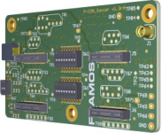
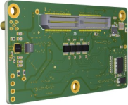
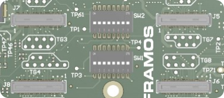
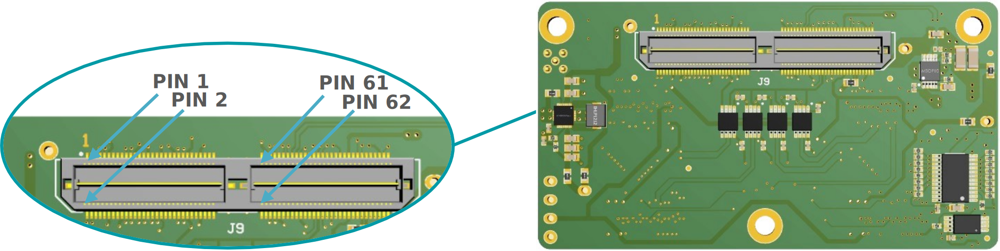
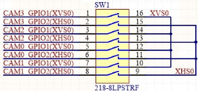
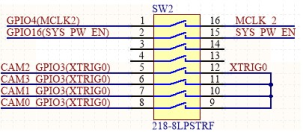
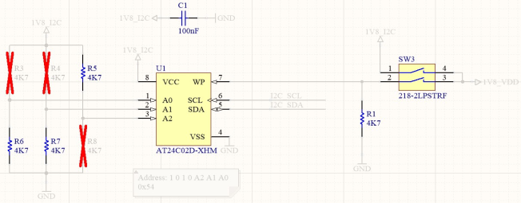
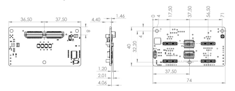

FPA-4.A/TXA-V1
++++++++++++++++

Quad FPA to NVIDIA Jetson TX2 and AGX Xavier, AGX Orin:

   -  Four 4-Lane MIPI CSI-2 Inputs

   -  Signal routing and I2C multiplexing

   -  Testpoints to important sensor signals

   -  Dynamic device tree management (EEPROM)

   -  Configuration of trigger routing

   -  Compatible Processor Boards:

      -  NVIDIA Jetson TX2, AGX Xavier, \**AGX Orin Development Kits

      -  CTI Rogue (AGX101, AGX111)

         |image1|

|image9|

|image10|

**Note**: The FPA-4.A/TXA V1 comes in two variants, V1B and V1C. The V1C
redesign mounts to the NVIDIA® AGX Orin™ natively. The V1B requires
removing a plastic cover on the NVIDIA® AGX Orin™. For more information,
see 10.1.6 Technical Drawing, page 63.

J5, J6, J7, J8: Connectors to Sensor Adapters (FSA)
~~~~~~~~~~~~~~~~~~~~~~~~~~~~~~~~~~~~~~~~~~~~~~~~~~~~~~~

|image11|

+----------+-------------------------+----------------------------+------------------+
| **Name** | **Description**         | **Connector Type**         | **Orientation**  |
|          |                         |                            |                  |
+==========+=========================+============================+==================+
| **J5**   | Port 1, 4-Lanes CSI-2,  | Hirose                     | Pin 1 Printed on |
|          | to FSA                  | DF40HC(4.0)-60DS-0.4V      | PCB next to each |
|          |                         |                            | connector.       |
+----------+-------------------------+----------------------------+------------------+
| **J6**   | Port 2, 4-Lanes CSI-2,  | Hirose                     | Pin 1 Printed on |
|          | to FSA                  | DF40HC(4.0)-60DS-0.4V      | PCB next to each |
|          |                         |                            | connector.       |
+----------+-------------------------+----------------------------+------------------+
| **J7**   | Port 3, 4-Lanes CSI-2   | Hirose                     | Pin 1 Printed on |
|          | (TX2: 2-Lanes), to FSA  | DF40HC(4.0)-60DS-0.4V      | PCB next to each |
|          |                         |                            | connector.       |
+----------+-------------------------+----------------------------+------------------+
| **J8**   | Port 4, 4-Lanes CSI-2   | Hirose                     | Pin 1 Printed on |
|          | (TX2: 2-Lanes), to FSA  | DF40HC(4.0)-60DS-0.4V      | PCB next to each |
|          |                         |                            | connector.       |
+----------+-------------------------+----------------------------+------------------+

**Table**: Image Sensor Connectors on FPA-4.A/TXA-V1

All ports provide the same pinout. The pin assignment is according to
the corresponding FSA.

Further notes for signals on FSA connectors J5, J6, J7, J8:

CAM0_MCLK and CAM1_MCLK are routed through four bus transceivers for
better integrity of the signal

CAM0_PWDN and CAM0_RST signals are routed in parallel to all connectors

I2C_GP3_CLK and I2C_GP3_DATA are routed parallel to EEPROM and I2C
multiplexer (8 channels)

EEPROM functionality is primarily used to utilize functionality of L4T
Plugin manager (deprecated with JetPack 4.6+ drivers) and offers
additional user space for configuration etc.

Each FSA connector is connected to two multiplexer channels:

   -  MUX-ch0/ch1 are connected to J5

   -  MUX-ch2/ch3 are connected to J6

   -  MUX-ch4/ch5 are connected to J7

   -  MUX-ch6/ch7 are connected to J8

**Caution:** Direct connection of FSM to FPA (without FSA) or wrong
cable orientation will lead to permanent damage of FSM, Adapters or the
Processor Board. Using flex cable (FMA-FC-150/60-v1) between FSA and FPA
is mandatory.

Image Sensor CSI-2 lane Support per Port

The table below shows the possible MIPI CSI-2 lane configurations per
FSM / Processor Board combination, that are supported in HW using the
FPA-4.A/TXA-V1.

+-----------------------+--------------------+---------+-----+-----+--------------------+---------+---------+---------+
|                       | NVIDIA Jetson      |         |     |     | NVIDIA AGX Xavier  |         |         |         |
|                       | TX2                |         |     |     | and AGX Orin       |         |         |         |
+=======================+====================+=========+=====+=====+====================+=========+=========+=========+
| FSM with FSA-FTx/A    |  J5                |  J6     |  J7 |  J8 |  J5                |  J6     |  J7     |   J8    |
| (all)                 |                    |         |     |     |                    |         |         |         |
+-----------------------+--------------------+---------+-----+-----+--------------------+---------+---------+---------+
| FSM-AR0144            |  2                 |  2      |  2  |  2  |  2                 |  2      |  2      |   2     |
+-----------------------+--------------------+---------+-----+-----+--------------------+---------+---------+---------+
| FSM-AR0521            | 2 / 4              | 2 / 4   |  2  |  2  | 2 / 4              | 2 / 4   | 2 / 4   | 2 / 4   |
+-----------------------+--------------------+---------+-----+-----+--------------------+---------+---------+---------+
| FSM-AR1335            | 2 / 4              | 2 / 4   |  2  |  2  | 2 / 4              | 2 / 4   | 2 / 4   | 2 / 4   |
+-----------------------+--------------------+---------+-----+-----+--------------------+---------+---------+---------+
| FSM-HDP230            | 2 / 4              | 2 / 4   |  2  |  2  | 2 / 4              | 2 / 4   | 2 / 4   | 2 / 4   |
+-----------------------+--------------------+---------+-----+-----+--------------------+---------+---------+---------+
| FSM-IMX264            |  4                 |  4      |  -  |  -  |  4                 |  4      |  4      |   4     |
+-----------------------+--------------------+---------+-----+-----+--------------------+---------+---------+---------+
| FSM-IMX283            |  4                 |  4      |  -  |  -  |  4                 |  4      |  4      |   4     |
+-----------------------+--------------------+---------+-----+-----+--------------------+---------+---------+---------+
| FSM-IMX290, 327       | 2 / 4              | 2 / 4   |  2  |  2  | 2 / 4              | 2 / 4   | 2 / 4   | 2 / 4   |
+-----------------------+--------------------+---------+-----+-----+--------------------+---------+---------+---------+
| FSM-IMX296, 297       |  1                 |  1      |  1  |  1  |  1                 |  1      |  1      |   1     |
+-----------------------+--------------------+---------+-----+-----+--------------------+---------+---------+---------+
| FSM-IMX304            |  4                 |  4      |  -  |  -  |  4                 |  4      |  4      |   4     |
+-----------------------+--------------------+---------+-----+-----+--------------------+---------+---------+---------+
| FSM-IMX334            |  4                 |  4      |  -  |  -  |  4                 |  4      |  4      |   4     |
+-----------------------+--------------------+---------+-----+-----+--------------------+---------+---------+---------+
| FSM-IMX335            | 2 / 4              | 2 / 4   |  2  |  2  | 2 / 4              | 2 / 4   | 2 / 4   | 2 / 4   |
+-----------------------+--------------------+---------+-----+-----+--------------------+---------+---------+---------+
| FSM-IMX412, 477, 577  | 2 / 4              | 2 / 4   |  2  |  2  | 2 / 4              | 2 / 4   | 2 / 4   | 2 / 4   |
+-----------------------+--------------------+---------+-----+-----+--------------------+---------+---------+---------+
| FSM-IMX415, 715       | 2 / 4              | 2 / 4   |  2  |  2  | 2 / 4              | 2 / 4   | 2 / 4   | 2 / 4   |
+-----------------------+--------------------+---------+-----+-----+--------------------+---------+---------+---------+
| FSM-IMX462, 662       | 2 / 4              | 2 / 4   |  2  |  2  | 2 / 4              | 2 / 4   | 2 / 4   | 2 / 4   |
+-----------------------+--------------------+---------+-----+-----+--------------------+---------+---------+---------+
| FSM-IMX464            | 2 / 4              | 2 / 4   |  2  |  2  | 2 / 4              | 2 / 4   | 2 / 4   | 2 / 4   |
+-----------------------+--------------------+---------+-----+-----+--------------------+---------+---------+---------+
| FSM-IMX485, 585       | 2 / 4              | 2 / 4   |  2  |  2  | 2 / 4              | 2 / 4   | 2 / 4   | 2 / 4   |
+-----------------------+--------------------+---------+-----+-----+--------------------+---------+---------+---------+
| FSM-IMX530            |  4                 |  4      |  -  |  -  |  4                 |  4      |  4      |   4     |
+-----------------------+--------------------+---------+-----+-----+--------------------+---------+---------+---------+
| FSM-IMX565, 568       | 2 / 4              | 2 / 4   |  2  |  2  | 2 / 4              | 2 / 4   | 2 / 4   | 2 / 4   |
+-----------------------+--------------------+---------+-----+-----+--------------------+---------+---------+---------+
| FSM-IMX675            | 2 / 4              | 2 / 4   |  2  |  2  | 2 / 4              | 2 / 4   | 2 / 4   | 2 / 4   |
+-----------------------+--------------------+---------+-----+-----+--------------------+---------+---------+---------+
| FSM-IMX678            | 2 / 4              | 2 / 4   |  2  |  2  | 2 / 4              | 2 / 4   | 2 / 4   | 2 / 4   |
+-----------------------+--------------------+---------+-----+-----+--------------------+---------+---------+---------+

**Table**: Image Sensor Support per Port with FPA-4.A/TXA-V1

J9: Connector to Processor Board
~~~~~~~~~~~~~~~~~~~~~~~~~~~~~~~~~~~~~~~~~~~

|image12|

**Label**: J9

**Type**: QTH-060-01-L-D-A

**Pinout**:

+------+--------------+------+----------------+------+----------------+------+----------------+
| Pin# | Name         | Pin# | Name           | Pin# | Name           | Pin# | Name           |
+======+==============+======+================+======+================+======+================+
| 1    | D_DATA_0_P   | 2    | D_DATA_2_P     | 61   | D_DATA_10_N    | 62   | D_DATA_14_N    |
+------+--------------+------+----------------+------+----------------+------+----------------+
| 3    | D_DATA_0_N   | 4    | D_DATA_2_N     | 63   | GND            | 64   | GND            |
+------+--------------+------+----------------+------+----------------+------+----------------+
| 5    | GND          | 6    | GND            | 65   | D_CLK_5_P      | 66   | D_CLK_7_P      |
+------+--------------+------+----------------+------+----------------+------+----------------+
| 7    | D_CLK_0_P    | 8    | D_CLK_1_P      | 67   | D_CLK_5_N      | 68   | D_CLK_7_N      |
+------+--------------+------+----------------+------+----------------+------+----------------+
| 9    | D_CLK_0_N    | 10   | D_CLK_1_N      | 69   | GND            | 70   | GND            |
+------+--------------+------+----------------+------+----------------+------+----------------+
| 11   | GND          | 12   | GND            | 71   | D_DATA_11_P    | 72   | D_DATA_15_P    |
+------+--------------+------+----------------+------+----------------+------+----------------+
| 13   | D_DATA_1_P   | 14   | D_DATA_3_P     | 73   | D_DATA_11_N    | 74   | D_DATA_15_N    |
+------+--------------+------+----------------+------+----------------+------+----------------+
| 15   | D_DATA_1_N   | 16   | D_DATA_3_N     | 75   | I2C_SCL        | 76   | NC             |
+------+--------------+------+----------------+------+----------------+------+----------------+
| 17   | GND          | 18   | GND            | 77   | I2C_SDA        | 78   | NC             |
+------+--------------+------+----------------+------+----------------+------+----------------+
| 19   | D_DATA_4_P   | 20   | D_DATA_6_P     | 79   | GND            | 80   | GND            |
+------+--------------+------+----------------+------+----------------+------+----------------+
| 21   | D_DATA_4_N   | 22   | D_DATA_6_N     | 81   | 2V8_AUX        | 82   | 2V8_AUX        |
+------+--------------+------+----------------+------+----------------+------+----------------+
| 23   | GND          | 24   | GND            | 83   | 2V8_AUX        | 84   | NC             |
+------+--------------+------+----------------+------+----------------+------+----------------+
| 25   | D_CLK_2_P    | 26   | D_CLK_3_P      | 85   | NC             | 86   | NC             |
+------+--------------+------+----------------+------+----------------+------+----------------+
| 27   | D_CLK_2_N    | 28   | D_CLK_3_N      | 87   | NC             | 88   | MCLK_1         |
+------+--------------+------+----------------+------+----------------+------+----------------+
| 29   | GND          | 30   | GND            | 89   | NC             | 90   | PW_EN_1        |
+------+--------------+------+----------------+------+----------------+------+----------------+
| 31   | D_DATA_5_P   | 32   | D_DATA_7_P     | 91   | MCLK_0         | 92   | RST_1          |
+------+--------------+------+----------------+------+----------------+------+----------------+
| 33   | D_DATA_5_N   | 34   | D_DATA_7_N     | 93   | PW_EN_0        | 94   | MCLK_2         |
+------+--------------+------+----------------+------+----------------+------+----------------+
| 35   | GND          | 36   | GND            | 95   | RST_0          | 96   | NC             |
+------+--------------+------+----------------+------+----------------+------+----------------+
| 37   | D_DATA_8_P   | 38   | D_DATA_12_P    | 97   | NC             | 98   | NC             |
+------+--------------+------+----------------+------+----------------+------+----------------+
| 39   | D_DATA_8_N   | 40   | D_DATA_12_N    | 99   | GND            | 100  | GND            |
+------+--------------+------+----------------+------+----------------+------+----------------+
| 41   | GND          | 42   | GND            | 101  | NC             | 102  | 1V8_AUX        |
+------+--------------+------+----------------+------+----------------+------+----------------+
| 43   | D_CLK_4_P    | 44   | D_CLK_6_P      | 103  | NC             | 104  | NC             |
+------+--------------+------+----------------+------+----------------+------+----------------+
| 45   | D_CLK_4_N    | 46   | D_CLK_6_N      | 105  | NC             | 106  | NC             |
+------+--------------+------+----------------+------+----------------+------+----------------+
| 47   | GND          | 48   | GND            | 107  | NC             | 108  | 3V3_VDD        |
+------+--------------+------+----------------+------+----------------+------+----------------+
| 49   | D_DATA_9_P   | 50   | D_DATA_13_P    | 109  | NC             | 110  | 3V3_VDD        |
+------+--------------+------+----------------+------+----------------+------+----------------+
| 51   | D_DATA_9_N   | 52   | D_DATA_13_N    | 111  | NC             | 112  | NC             |
+------+--------------+------+----------------+------+----------------+------+----------------+
| 53   | GND          | 54   | GND            | 113  | NC             | 114  | NC             |
+------+--------------+------+----------------+------+----------------+------+----------------+
| 55   | NC           | 56   | NC             | 115  | GND            | 116  | GND            |
+------+--------------+------+----------------+------+----------------+------+----------------+
| 57   | NC           | 58   | NC             | 117  | NC             | 118  | 3V3-5V_VDD     |
+------+--------------+------+----------------+------+----------------+------+----------------+
| 59   | D_DATA_10_P  | 60   | D_DATA_14_P    | 119  | NC             | 120  | 3V3-5V_VDD     |
+------+--------------+------+----------------+------+----------------+------+----------------+

**Table**: Pinout of FPA-4.A/TXA-V1 connector to NVIDIA Jetson TX2 and
AGX Xavier and AGX Orin

SW1, SW2: Configuration Switches
~~~~~~~~~~~~~~~~~~~~~~~~~~~~~~~~~~~~

DIP switches SW1 and SW2 are mainly for interconnecting FSA’s triggering
signals (XVS, XHS and XTRIG).

DIP switch SW1 is designated to interconnect XVS/XHS pins while DIP
switch SW2 is designated to interconnect XTRIG pins and aggregate
CAM2_MCLK04(MCLK2) and GPIO25_VDD_SYS_EN(SYS_PW_EN) from FPA in parallel
to all FSA connectors.

|image13| 

|image14|

**Table**: Configuration of SW1 and SW2 on FPA-4.A/TXA-V1

SW3: Configuration Switches
~~~~~~~~~~~~~~~~~~~~~~~~~~~~~~~

DIP switch SW3 is designated to enable/disable FPA EEPROM and it’s write
protection.

|image15|

**Table**: Configuration of SW3 on FPA-4.A/TXA-V1

Default state of DIP switches:

   - SW1 – all positions OFF (XVS/XHS pins are NOT interconnected)

   - SW2 – all positions OFF (XTRIG pins are NOT interconnected, MCLK2 and
     SYS_PW_EN are NOT aggregate)

   - SW3 – positions-1 ON, position-2 OFF (EEPROM is ENABLED without write
     protection)

TGx, TPx: Test Groups and Test Points
~~~~~~~~~~~~~~~~~~~~~~~~~~~~~~~~~~~~~~~~~

|image16|

**Connector J9: TG1 and Ungrouped Test Points**

+---------+---------------------+---------+-----------------+
| Label   | Signal (TG1)        | Label   | Signal          |
+=========+=====================+=========+=================+
| TP48    | TP_85               | TP46    | I2C_SCL         |
+---------+---------------------+---------+-----------------+
| TP49    | TP_87               | TP47    | I2C_SDA         |
+---------+---------------------+---------+-----------------+
| TP50    | TP_89               | TP61    | MCLK_2          |
+---------+---------------------+---------+-----------------+
| TP51    | TP_97               | TP62    | PW_EN_0         |
+---------+---------------------+---------+-----------------+
| TP52    | TP_103              | TP63    | PW_EN_1         |
+---------+---------------------+---------+-----------------+
| TP53    | TP_104              | TP64    | RST_0           |
+---------+---------------------+---------+-----------------+
| TP54    | TP_105              | TP65    | RST_1           |
+---------+---------------------+---------+-----------------+
| TP55    | TP_106              |         |                 |
+---------+---------------------+---------+-----------------+
| TP56    | TP_107              |         |                 |
+---------+---------------------+---------+-----------------+
| TP57    | TP_112              |         |                 |
+---------+---------------------+---------+-----------------+
| TP58    | TP_117              |         |                 |
+---------+---------------------+---------+-----------------+

Connector J5 (TG6, TG7) and J6 (TG8, TG9)

+---------+-----------------------------+---------+-----------------------------+
| Label   | Signal (TG6, TG7)           | Label   | Signal (TG8, TG9)           |
| (J5)    |                             | (J6)    |                             |
+=========+=============================+=========+=============================+
| TP59    | CAM0_MCLK_0                 | TP60    | CAM1_MCLK_0                 |
+---------+-----------------------------+---------+-----------------------------+
| TP88    | CAM0_MCLK_1                 | TP89    | CAM1_MCLK_1                 |
+---------+-----------------------------+---------+-----------------------------+
| TP6     | CAM0_GPIO14                 | TP7     | CAM1_GPIO14                 |
+---------+-----------------------------+---------+-----------------------------+
| TP10    | CAM0_GPIO15(SPI_MISO)       | TP11    | CAM1_GPIO15(SPI_MISO)       |
+---------+-----------------------------+---------+-----------------------------+
| TP14    | CAM0_GPIO0(XMASTER0)        | TP15    | CAM1_GPIO0(XMASTER0)        |
+---------+-----------------------------+---------+-----------------------------+
| TP18    | CAM0_GPIO8                  | TP19    | CAM1_GPIO8                  |
+---------+-----------------------------+---------+-----------------------------+
| TP22    | CAM0_GPIO17(SPI_CS)         | TP23    | CAM1_GPIO17(SPI_CS)         |
+---------+-----------------------------+---------+-----------------------------+
| TP26    | CAM0_GPIO9                  | TP27    | CAM1_GPIO9                  |
+---------+-----------------------------+---------+-----------------------------+
| TP30    | CAM0_GPIO10                 | TP31    | CAM1_GPIO10                 |
+---------+-----------------------------+---------+-----------------------------+
| TP34    | CAM0_GPIO11                 | TP35    | CAM1_GPIO11                 |
+---------+-----------------------------+---------+-----------------------------+
| TP38    | CAM0_GPIO6                  | TP39    | CAM1_GPIO6                  |
+---------+-----------------------------+---------+-----------------------------+
| TP42    | CAM0_GPIO7                  | TP43    | CAM1_GPIO7                  |
+---------+-----------------------------+---------+-----------------------------+
| TP75    | I2C_0_SCL(SPI_SCK)          | TP76    | I2C_2_SCL(SPI_SCK)          |
+---------+-----------------------------+---------+-----------------------------+
| TP79    | I2C_0_SDA(SPI_MOSI)         | TP80    | I2C_2_SDA(SPI_MOSI)         |
+---------+-----------------------------+---------+-----------------------------+

Connector J7 (TG2, TG3) and J8 (TG4, TG5)

+---------+-----------------------------+---------+-----------------------------+
| Label   | Signal (TG6, TG7)           | Label   | Signal (TG8, TG9)           |
| (J5)    |                             | (J6)    |                             |
+=========+=============================+=========+=============================+
| TP86    | CAM2_MCLK_0                 | TP87    | CAM3_MCLK_0                 |
+---------+-----------------------------+---------+-----------------------------+
| TP90    | CAM2_MCLK_1                 | TP91    | CAM3_MCLK_1                 |
+---------+-----------------------------+---------+-----------------------------+
| TP8     | CAM2_GPIO14                 | TP9     | CAM3_GPIO14                 |
+---------+-----------------------------+---------+-----------------------------+
| TP12    | CAM2_GPIO15(SPI_MISO)       | TP13    | CAM3_GPIO15(SPI_MISO)       |
+---------+-----------------------------+---------+-----------------------------+
| TP16    | CAM2_GPIO0(XMASTER0)        | TP17    | CAM3_GPIO0(XMASTER0)        |
+---------+-----------------------------+---------+-----------------------------+
| TP20    | CAM2_GPIO8                  | TP21    | CAM3_GPIO8                  |
+---------+-----------------------------+---------+-----------------------------+
| TP24    | CAM2_GPIO17(SPI_CS)         | TP25    | CAM3_GPIO17(SPI_CS)         |
+---------+-----------------------------+---------+-----------------------------+
| TP28    | CAM2_GPIO9                  | TP29    | CAM3_GPIO9                  |
+---------+-----------------------------+---------+-----------------------------+
| TP32    | CAM2_GPIO10                 | TP33    | CAM3_GPIO10                 |
+---------+-----------------------------+---------+-----------------------------+
| TP36    | CAM2_GPIO11                 | TP37    | CAM3_GPIO11                 |
+---------+-----------------------------+---------+-----------------------------+
| TP40    | CAM2_GPIO6                  | TP41    | CAM3_GPIO6                  |
+---------+-----------------------------+---------+-----------------------------+
| TP44    | CAM2_GPIO7                  | TP45    | CAM3_GPIO7                  |
+---------+-----------------------------+---------+-----------------------------+
| TP77    | I2C_4_SCL(SPI_SCK)          | TP78    | I2C_6_SCL(SPI_SCK)          |
+---------+-----------------------------+---------+-----------------------------+
| TP81    | I2C_4_SDA(SPI_MOSI)         | TP82    | I2C_6_SDA(SPI_MOSI)         |
+---------+-----------------------------+---------+-----------------------------+

Other Test Points (Ungrouped)

+-------------------+--------------------------------------------------+
| Label             | Signal                                           |
+===================+==================================================+
| TP1               | GPIO16(SYS_PW_EN)                                |
+-------------------+--------------------------------------------------+
| TP2               | GPIO5(MCLK3)                                     |
+-------------------+--------------------------------------------------+
| TP3               | XVS0                                             |
+-------------------+--------------------------------------------------+
| TP4               | XHS0                                             |
+-------------------+--------------------------------------------------+
| TP74              | GND                                              |
+-------------------+--------------------------------------------------+
| TP5               | XTRIG0                                           |
+-------------------+--------------------------------------------------+
| TP83              | GPIO4(MCLK2)                                     |
+-------------------+--------------------------------------------------+
| TP84              | CAM0_GPIO2(XHS0)                                 |
+-------------------+--------------------------------------------------+
| TP85              | CAM0_GPIO3(XTRIG0)                               |
+-------------------+--------------------------------------------------+

.. _technical-drawing-1:

Technical Drawing
~~~~~~~~~~~~~~~~~

|image17|

Figure: Technical Drawing of FPA-4.A/TXA-V1

**Note**: The FPA-4.A/TXA-V1 comes in two variants, V1B and V1C. Mechanical
dimensions may alter slightly. The V1C is redesigned to accommodate
mounting to the NVIDIA® AGX Orin™ whereas the V1B, pictured above,
requires removing a plastic cover on the NVIDIA® AGX Orin™ to mount.

.. |image1| image:: FPA-1.png
   :width: 3.10031in
   :height: 1.00079in

.. |image16| image:: FPA-16s.svg
   :width: 850px
   :height: 400px

