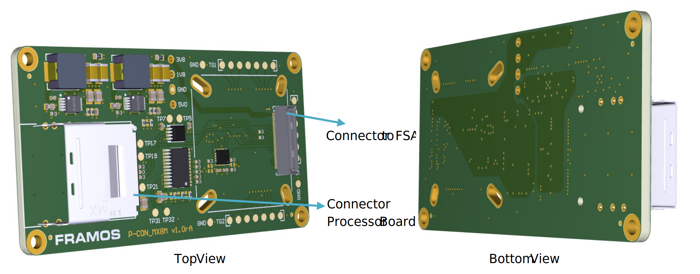
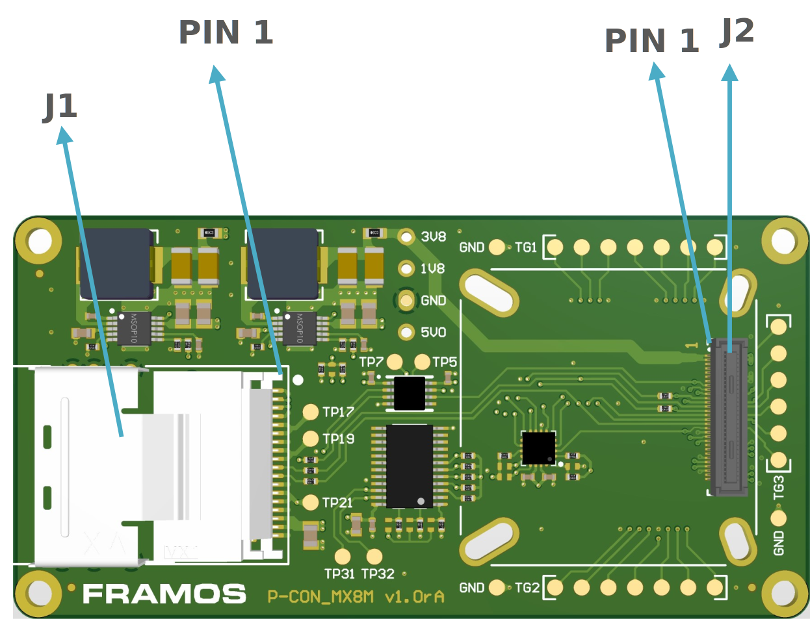
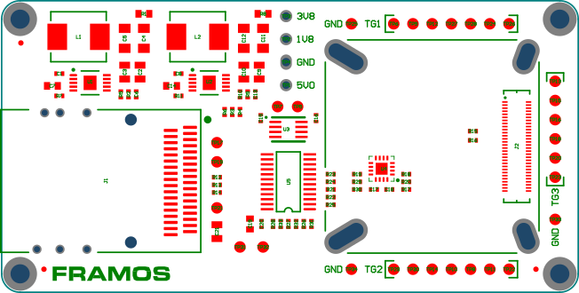

FPA-A/NDK-V1A
++++++++++++++++

Piggyback FPA to NXP i.MX Developer Kit:

   - Adapting from PixelMate to miniSAS Cable

   - 4-Lane MIPI CSI-2
   
   - Generation of standard PixelMate power rails from 3V3 and 5V0 input voltage
   
   - Signal level translation for logic

   - Enhanced sensor control signal access via I2C GPIO Expander
      
   -  Compatible Processor Boards:

      -  NXP i.MX8MP development kit

         |image25|

|image26|

Description of Connectors and Interfaces
~~~~~~~~~~~~~~~~~~~~~~~~~~~~~~~~~~~~~~~~~~~~

+------+-------------------+----------------------+---------------------+
| Name | Description       | Connector Type       | Orientation         |
+======+===================+======================+=====================+
| J1   | PixelMate to      | Molex 757830132      | Pin 1 marked on PCB |
|      | Processor Board   |                      |                     |
+------+-------------------+----------------------+---------------------+
| J2   | PixelMateC to FSA | Hirose DF40HC(4.0)-  | Pin 1 marked on PCB |
|      | (4x MIPI CSI-2    | 60DS-0.4V            |                     |
|      | lanes)            |                      |                     |
+------+-------------------+----------------------+---------------------+

**Table**: Connectors on FPA-A/NDK-V1A

**Note:** The Pin 1 markings can be found in the following chapters
along with the Pinout, as well as on the PCB in copper or silkscreen
layer next to the connector.

J1: Connector to Processor Board
~~~~~~~~~~~~~~~~~~~~~~~~~~~~~~~~

|image27|

**Label**: J1

**Type**: 757830132

**Cable**: miniSAS cable (e.g. Molex 79576-2107)

**Pinout**:

+------+------------------+------+-----------------+
| Pin# | Name             | Pin# | Name            |
+======+==================+======+=================+
| A1   | GND              | B1   | GND             |
+------+------------------+------+-----------------+
| A2   | D_DATA_0_N       | B2   | D_CLK_0_N       |
+------+------------------+------+-----------------+
| A3   | D_DATA_0_P       | B3   | D_CLK_0_P       |
+------+------------------+------+-----------------+
| A4   | GND              | B4   | GND             |
+------+------------------+------+-----------------+
| A5   | D_DATA_1_N       | B5   | TP_1V8          |
+------+------------------+------+-----------------+
| A6   | D_DATA_1_P       | B6   | TP_1V8          |
+------+------------------+------+-----------------+
| A7   | GND              | B7   | GND             |
+------+------------------+------+-----------------+
| A8   | MCLK_IN          | B8   | TP_12V          |
+------+------------------+------+-----------------+
| A9   | RST_R            | B9   | TP_12V          |
+------+------------------+------+-----------------+
| A10  | I2C_SDA          | B10  | SYNC_R          |
+------+------------------+------+-----------------+
| A11  | I2C_SCL          | B11  | PWDN_R          |
+------+------------------+------+-----------------+
| A12  | GND              | B12  | GND             |
+------+------------------+------+-----------------+
| A13  | D_DATA_2_N       | B13  | 3V3_VIN         |
+------+------------------+------+-----------------+
| A14  | D_DATA_2_P       | B14  | 3V3_VIN         |
+------+------------------+------+-----------------+
| A15  | GND              | B15  | GND             |
+------+------------------+------+-----------------+
| A16  | D_DATA_3_N       | B16  | 5V0_VIN         |
+------+------------------+------+-----------------+
| A17  | D_DATA_3_P       | B17  | 5V0_VIN         |
+------+------------------+------+-----------------+
| A18  | GND              | B18  | GND             |
+------+------------------+------+-----------------+

**Table**: Pinout of FPA-4.A/NDK-V1A connector to NXP i.MX

**Note : Component Connections**

1. **MCLK_IN:** Connected to CAM0_MCLK_0 through buffer for stable clock
   signal transmission.

2. **RST_R:** Linked to RST_0 via buffer for controlled and reliable
   reset mechanism.

3. **SYNC_R:** Connected to CAM0_GPIO1 (XVS0) for synchronization
   between components.

4. **PWDN_R:** Direct connection to PW_EN_0 for effective power state
   management.

J2: Connector to Sensor Adapter (FSA)
~~~~~~~~~~~~~~~~~~~~~~~~~~~~~~~~~~~~~

**Label**: J2

**Type**: Hirose DF40HC(4.0)-60DS-0.4V

**Pinout:**

+------+------------------+------+------------------+------+------------------+------+------------------+
| Pin# | Name             | Pin# | Name             | Pin# | Name             | Pin# | Name             |
+======+==================+======+==================+======+==================+======+==================+
| 1    | 3V8_VDD          | 16   | RST_1            | 31   | GPIO3(XTRIG0)    | 46   | D_DATA_3_P       |
+------+------------------+------+------------------+------+------------------+------+------------------+
| 2    | 1V8_VDD          | 17   | CAM0_GPIO14      | 32   | NC               | 47   | D_CLK_B_N        |
+------+------------------+------+------------------+------+------------------+------+------------------+
| 3    | 3V8_VDD          | 18   | CAM0_GPIO0       | 33   | PW_EN_0          | 48   | D_DATA_D_N       |
+------+------------------+------+------------------+------+------------------+------+------------------+
| 4    | 1V8_VDD          | 19   | GPIO0(XMASTER0)  | 34   | PW_EN_1          | 49   | GND              |
+------+------------------+------+------------------+------+------------------+------+------------------+
| 5    | NC               | 20   | CAM0_GPIO8       | 35   | GPIO6(SLAMODE0)  | 50   | GND              |
+------+------------------+------+------------------+------+------------------+------+------------------+
| 6    | NC               | 21   | I2C_0_SCL        | 36   | GPIO7(SLAMODE1)  | 51   | D_DATA_0_N       |
+------+------------------+------+------------------+------+------------------+------+------------------+
| 7    | NC               | 22   | I2C_1_SCL        | 37   | GND              | 52   | D_DATA_1_N       |
+------+------------------+------+------------------+------+------------------+------+------------------+
| 8    | NC               | 23   | CAM0_GPIO17      | 38   | GND              | 53   | D_DATA_0_P       |
+------+------------------+------+------------------+------+------------------+------+------------------+
| 9    | NC               | 24   | GPIO16(SLAMODE2) | 39   | MCLK_0           | 54   | D_DATA_1_P       |
+------+------------------+------+------------------+------+------------------+------+------------------+
| 10   | NC               | 25   | GPIO1(XVS0)      | 40   | GPIO4(MCLK2)     | 55   | GND              |
+------+------------------+------+------------------+------+------------------+------+------------------+
| 11   | GND              | 26   | NC               | 41   | MCLK_1           | 56   | GND              |
+------+------------------+------+------------------+------+------------------+------+------------------+
| 12   | GND              | 27   | I2C_0_SDA        | 42   | GPIO5(MCLK3)     | 57   | D_DATA_C_P       |
+------+------------------+------+------------------+------+------------------+------+------------------+
| 13   | GND              | 28   | I2C_1_SDA        | 43   | GND              | 58   | D_CLK_A_P        |
+------+------------------+------+------------------+------+------------------+------+------------------+
| 14   | GND              | 29   | GPIO2(XHS0)      | 44   | GND              | 59   | D_DATA_C_N       |
+------+------------------+------+------------------+------+------------------+------+------------------+
| 15   | RST_0            | 30   | GPIO10(TENABLE)  | 45   | D_CLK_B_P        | 60   | D_CLK_A_N        |
+------+------------------+------+------------------+------+------------------+------+------------------+

**Table**: Pinout of FPA-4.A/NDK-V1A connector to FSA

I2C: Access to further Signals 
~~~~~~~~~~~~~~~~~~~~~~~~~~~~~~~

The FPA contains an I2C GPIO expander. It allows the control of further
timing uncritical signals through the I2C bus.

I2C Address\ :sup:`5` : 0x20

**Pinout**:

+----------------+-----------------------------------------------------+
| Pin #          | Name                                                |
+================+=====================================================+
| P0             | CAM0_GPIO6(SLAMODE0)                                |
+----------------+-----------------------------------------------------+
| P1             | CAM0_GPIO0(XMASTER0)                                |
+----------------+-----------------------------------------------------+
| P2             | CAM0_GPIO14(LDD_ERR)                                |
+----------------+-----------------------------------------------------+
| P3             | CAM0_GPIO11(TOUT)                                   |
+----------------+-----------------------------------------------------+
| P4             | RST_1                                               |
+----------------+-----------------------------------------------------+
| P5             | PW_EN_1                                             |
+----------------+-----------------------------------------------------+
| P6             | CAM0_GPIO8                                          |
+----------------+-----------------------------------------------------+
| P7             | GPIO16(SYS_PW_EN)                                   |
+----------------+-----------------------------------------------------+

TGx, TPx: Test Groups and Test Points
~~~~~~~~~~~~~~~~~~~~~~~~~~~~~~~~~~~~~~~~~

|image28|

**Ungrouped Test Points**

+-------+-------------------+-------+-------------------+
| Label | Signal            | Label | Signal            |
+=======+===================+=======+===================+
| TP1   | 5V0_VIN           | TP19  | TP_12V            |
+-------+-------------------+-------+-------------------+
| TP2   | 1V8_VDD           | TP21  | 3V3_VIN           |
+-------+-------------------+-------+-------------------+
| TP3   | 3V8_VDD           | TP25  | GND               |
+-------+-------------------+-------+-------------------+
| TP4   | GND               | TP31  | I2C_SCL           |
+-------+-------------------+-------+-------------------+
| TP5   | CAM0_MCLK_0       | TP32  | I2C_SDA           |
+-------+-------------------+-------+-------------------+
| TP7   | CAM0_MCLK_1       | TP33  | GND               |
+-------+-------------------+-------+-------------------+
| TP17  | TP_1V8            | TP34  | GND               |
+-------+-------------------+-------+-------------------+

TG1: Synchronisation Signals

+-------+--------------------+-------+--------------------+
| Label | Signal             | Label | Signal             |
+=======+====================+=======+====================+
| TP6   | CAM0_GPIO1(XVS0)   | TP26  | PW_EN_1            |
+-------+--------------------+-------+--------------------+
| TP9   | CAM0_GPIO2(XHS0)   | TP27  | RST_0              |
+-------+--------------------+-------+--------------------+
| TP12  | CAM0_GPIO3(XTRIG0) | TP28  | RST_1              |
+-------+--------------------+-------+--------------------+
| TP24  | PW_EN_0            |       |                    |
+-------+--------------------+-------+--------------------+

TG2: Control Signals and GPIOs

+-------+-------------------------+-------+-------------------------+
| Label | Signal                  | Label | Signal                  |
+=======+=========================+=======+=========================+
| TP8   | CA_M0_GPIO14(LDD_ERR)   | TP22  | CA_M0_GPIO6(SLAMODE0)   |
+-------+-------------------------+-------+-------------------------+
| TP10  | CAM0_GPIO15(SPI_MISO)   | TP29  | I2C_0_SCL               |
+-------+-------------------------+-------+-------------------------+
| TP11  | CA_M0_GPIO0(XMASTER0)   | TP30  | I2C_0_SDA               |
+-------+-------------------------+-------+-------------------------+
| TP14  | CAM0_GPIO17(SPI_CS)     |       |                         |
+-------+-------------------------+-------+-------------------------+

TG3: Control Signals and GPIOs

+-------+------------------------+-------+-------------------------+
| Label | Signal                 | Label | Signal                  |
+=======+========================+=======+=========================+
| TP13  | CAM0_GPIO8             | TP18  | CAM0_GPIO10             |
+-------+------------------------+-------+-------------------------+
| TP15  | GPIO16(SYS_PW_EN)      | TP20  | CAM0_GPIO11(TOUT)       |
+-------+------------------------+-------+-------------------------+
| TP16  | CAM0_GPIO9             | TP23  | CAM0_GPIO7              |
+-------+------------------------+-------+-------------------------+

Technical Drawing
~~~~~~~~~~~~~~~~~

|image29|

Figure: Technical Drawing of FPA-A/NDK-V1A

.. |image29| image:: FPA-29s.svg
   :width: 800px
   :height: 350px