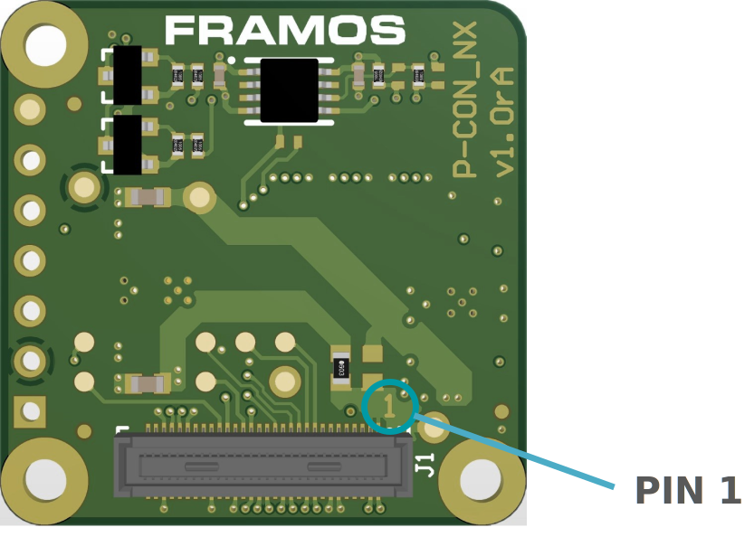

FPA-A/NVN-V1
++++++++++++++

Piggyback FPA to NVIDIA Jetson Nano and TX2 NX:

   -  One 2-Lane MIPI CSI-2 Input

   -  Signal routing and power conversion

   -  Voltage level translation for control signals

   -  Testpoints to important sensor signals

   -  Board-to-board stacking to FSA

   -  Compatible Processor Boards:

      -  NVIDIA Jetson Nano Development Kit

      -  NVIDIA Jetson TX2 NX Developer Kit

      -  NVIDIA Xavier NX Development Kit

         |image1|

+--------------+-----------------+
| **Top View** | **Bottom View** |
+--------------+-----------------+
| |image30|    | |image37|       |
+--------------+-----------------+

**Note**: All signals are routed from J1 (to FSA) to J4 (to processor), test
points and pin row. They follow the signal specification according to
the FSA output interface. Control signals going to J4 (I2C, clock, GPIO)
are buffered to allow voltage translation.

J1: Connector to Sensor Adapters (FSA)
~~~~~~~~~~~~~~~~~~~~~~~~~~~~~~~~~~~~~~~~~~

|image31|

+------+-----------------+-----------------------+---------------------+
| Name | Description     | Connector Type        | Orientation         |
+======+=================+=======================+=====================+
| J1   | 2-Lanes CSI-2,  | Hirose                | Pin 1 marking in    |
|      | to FSA          | DF40HC(4.0)-60DS-0.4V | copper on PCB, next |
|      |                 |                       | to connector.       |
+------+-----------------+-----------------------+---------------------+

**Table**: Image Sensor Connector on FPA-A/NVN-V1

The pin assignment of J1 is according to the corresponding FSA.

**Caution**: Direct connection of FSM to FPA (without FSA) or wrong
cable orientation will lead to permanent damage of FSM, Adapters, or the
Processor Board. Using flex cable (FMA-FC-150/60-V1) between FSA and FPA
is optional.

Image Sensor CSI-2 lane Support per Port

The table below shows the possible MIPI CSI-2 lane configurations per
FSM / Processor Board combination, that are supported in HW using the
FPA-A/NVN-V1.

+-----------------------------------+----------------------------------+
|                                   | NVIDIA Jetson                    |
|                                   | Nano / TX2 NX / Xavier NX        |
+===================================+==================================+
| **FSM with FSA-FTx/A**            | **J4 [# Lanes]**                 |
+-----------------------------------+----------------------------------+
| FSM-AR0144                        | 2                                |
+-----------------------------------+----------------------------------+
| FSM-AR0521                        | 2                                |
+-----------------------------------+----------------------------------+
| FSM-AR1335                        | 2                                |
+-----------------------------------+----------------------------------+
| FSM-HDP230                        | 2                                |
+-----------------------------------+----------------------------------+
| FSM-IMX264                        | Not Supported\ :sup:`6`          |
+-----------------------------------+----------------------------------+
| FSM-IMX283                        | Not Supported\ :sup:`7`          |
+-----------------------------------+----------------------------------+
| FSM-IMX290, 327                   | 2                                |
+-----------------------------------+----------------------------------+
| FSM-IMX296, 297                   | 1                                |
+-----------------------------------+----------------------------------+
| FSM-IMX304                        | Not Supported\ :sup:`7`          |
+-----------------------------------+----------------------------------+
| FSM-IMX334                        | Not Supported\ :sup:`7`          |
+-----------------------------------+----------------------------------+
| FSM-IMX335                        | 2                                |
+-----------------------------------+----------------------------------+
| FSM-IMX412, 477, 577              | 2                                |
+-----------------------------------+----------------------------------+
| FSM-IMX415, 715                   | 2                                |
+-----------------------------------+----------------------------------+
| FSM-IMX462, 662                   | 2                                |
+-----------------------------------+----------------------------------+
| FSM-IMX464                        | 2                                |
+-----------------------------------+----------------------------------+
| FSM-IMX485, 585                   | 2                                |
+-----------------------------------+----------------------------------+
| FSM-IMX530                        | Not Supported\ :sup:`7`          |
+-----------------------------------+----------------------------------+
| FSM-IMX565                        | 2                                |
+-----------------------------------+----------------------------------+
| FSM-IMX675                        | 2                                |
+-----------------------------------+----------------------------------+
| FSM-IMX678                        | 2                                |
+-----------------------------------+----------------------------------+

**Table**: Image Sensor Support per Port with FPA-A/NVN-V1

**Note:** Due to different interface routing and thus Device Tree
configuration, the provided drivers only support NVIDIAs official
Development Kits of the revision B01.

J4: Connector to Processor Board
~~~~~~~~~~~~~~~~~~~~~~~~~~~~~~~~

|image32|

**Label**: J4

**Type**: Amphenol SFW15R-2STE1LF

**Pinout**:

+---------+----------------------+--------+--------------------------+
| Pin #   | Name                 | Pin #  | Name                     |
+=========+======================+========+==========================+
| 1       | 3V3_VDD              | 9      | GND                      |
+---------+----------------------+--------+--------------------------+
| 2       | I2C_SDA_IN           | 10     | CSI0_D1_P                |
+---------+----------------------+--------+--------------------------+
| 3       | I2C_SCL_IN           | 11     | CSI0_D1_N                |
+---------+----------------------+--------+--------------------------+
| 4       | MCLK_0               | 12     | GND                      |
+---------+----------------------+--------+--------------------------+
| 5       | CAM_PWDN             | 13     | CSI0_D0_P                |
+---------+----------------------+--------+--------------------------+
| 6       | GND                  | 14     | CSI0_D0_N                |
+---------+----------------------+--------+--------------------------+
| 7       | CSI0_CLK_P           | 15     | GND                      |
+---------+----------------------+--------+--------------------------+
| 8       | CSI0_CLK_N           |        |                          |
+---------+----------------------+--------+--------------------------+

**Table**: Pinout of FPA-A/NVN-V1 connector to NVIDIA Jetson Nano / TX2
NX / Xavier NX Development Kits

**Caution**: Use only FFC with opposing contacts (TOP-BOT), like Würth 686715200001.

External Signals & Test Points
~~~~~~~~~~~~~~~~~~~~~~~~~~~~~~~~~~

Test Points

Top Side (heading to FSA): 

|image33|

Bottom Side (heading to Processor Board):

|image34|

+-------+---------------------------+-------+---------------------------+
| Label | Signal                    | Label | Signal                    |
+=======+===========================+=======+===========================+
| TP3   | CAM0_GPIO14               | TP1   | I2C_0_SDA (SPI_SCK)       |
+-------+---------------------------+-------+---------------------------+
| TP5   | CAM0_GPIO0 (XMASTER0)     | TP2   | CAM0_RST_0                |
+-------+---------------------------+-------+---------------------------+
| TP7   | CAM0_GPIO17 (SPI_CS)      | TP4   | CAM0_GPIO15 (SPI_MISO)    |
+-------+---------------------------+-------+---------------------------+
| TP13  | CAM0_GPIO6                | TP6   | CAM0_GPIO8                |
+-------+---------------------------+-------+---------------------------+
| TP16  | CAM0_MCLK1                | TP8   | CAM0_SYS_PW_EN            |
+-------+---------------------------+-------+---------------------------+
| TP17  | 1V8_VDD                   | TP9   | CAM0_GPIO9                |
+-------+---------------------------+-------+---------------------------+
| TP18  | 3V8_VDD                   | TP10  | I2C_0_SDA (SPI_MOSI)      |
+-------+---------------------------+-------+---------------------------+
| TP19  | 3V3_VDD                   | TP11  | CAM0_GPIO10               |
+-------+---------------------------+-------+---------------------------+
| TP20  | GND                       | TP12  | CAM0_GPIO11 (FSTROBE)     |
+-------+---------------------------+-------+---------------------------+
| TP21  | CAM0_PW_EN0               | TP14  | CAM0_GPIO7                |
+-------+---------------------------+-------+---------------------------+
| TP23  | CAM0_GPIO3 (XTRIG0)       | TP15  | CAM0_MCLK0                |
+-------+---------------------------+-------+---------------------------+

Pin Rail J2 (not assembled\ :sup:`7`)

|image35|

+--------+-------------------------------------------------------------+
| Pin    | Signal                                                      |
+========+=============================================================+
| 1      | 1V8_VDD                                                     |
+--------+-------------------------------------------------------------+
| 2      | GND                                                         |
+--------+-------------------------------------------------------------+
| 3      | CAM0_GPIO1 (XVS0)                                           |
+--------+-------------------------------------------------------------+
| 4      | CAM0_GPIO2 (XHS0)                                           |
+--------+-------------------------------------------------------------+
| 5      | CAM0_GPIO11 (FSTROBE)                                       |
+--------+-------------------------------------------------------------+
| 6      | CAM0_PW_EN1                                                 |
+--------+-------------------------------------------------------------+

**Note:** All signals on Test Points and Pin Rail are LVCMOS18 (1.8V)
logic, according to image sensor specification.

Technical Drawing
~~~~~~~~~~~~~~~~~

|image36|

Figure: Technical Drawing of FPA-A/NVN-V1

.. |image1| image:: FPA-1.png
   :width: 3.10031in
   :height: 1.00079in

