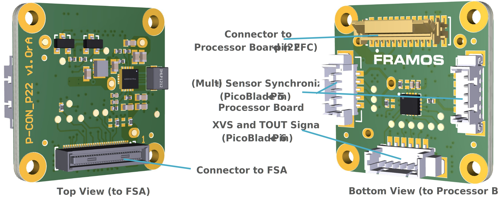
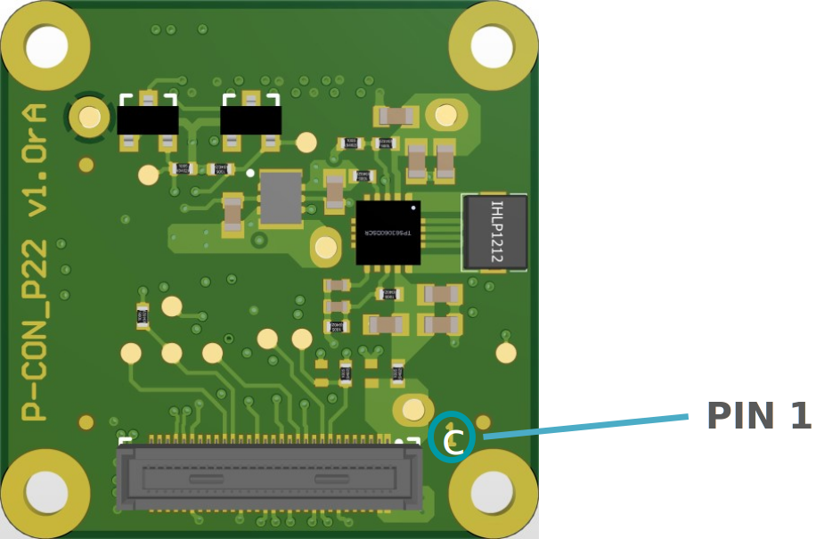
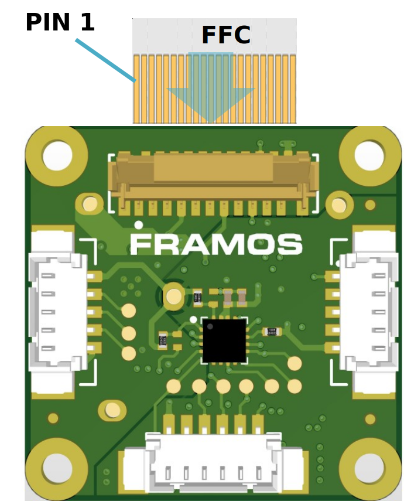
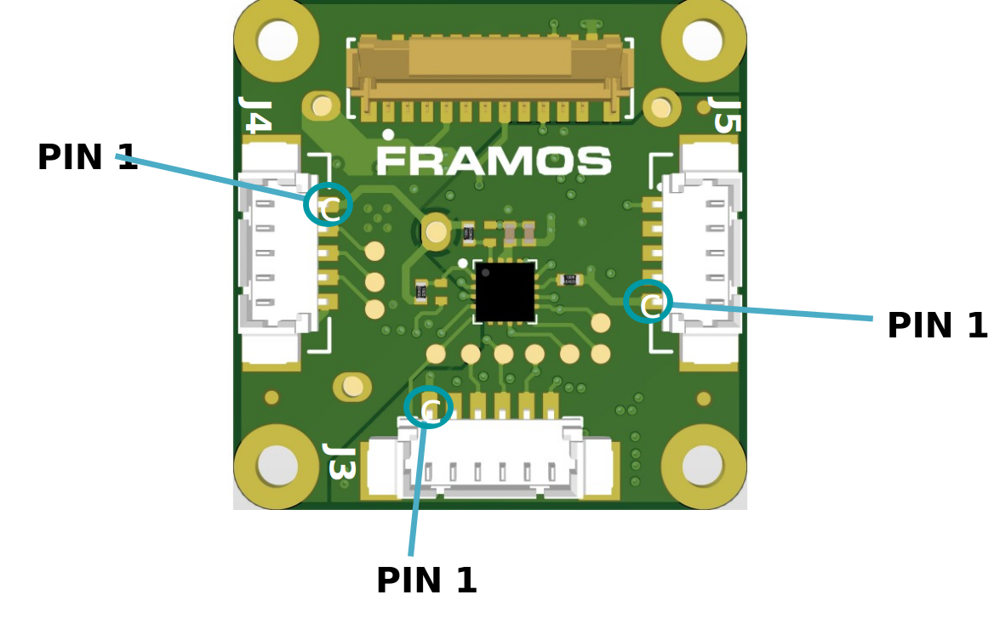
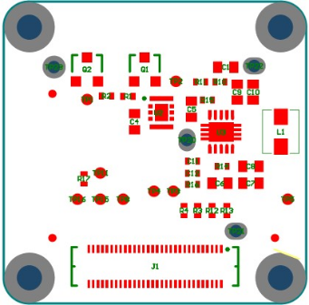
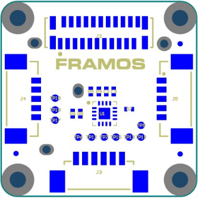
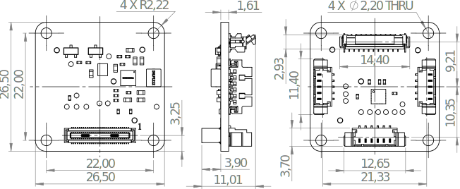

FPA-A/P22-V2
+++++++++++++++

Piggyback FPA to NVIDIA Jetson Orin Nano/NX and Xavier NX Developer Kits:

   -  Adapting from PixelMate to 22-Pin FFC Cable

   -  4-Lane MIPI CSI-2

   -  Generation of standard PixelMate power rails from 3V3 input voltage

   -  Signal level translation for logic

   -  Enhanced sensor control signal access via I2C extender

   -  Synchronization and timing signal access via Molex Picoblade
      connectors

   -  Compatible Processor Boards:

      -  NVIDIA Jetson Orin Nano Development Kit

      -  Orin NX SoM on the Orin Nano carrier
      
         |image1|

|image18|

Description of Connectors and Interfaces
~~~~~~~~~~~~~~~~~~~~~~~~~~~~~~~~~~~~~~~~~~~~

+------+----------------------------+--------------------------------+
| Name | Description                | Connector Type                 |
+======+============================+================================+
| J1   | PixelMateC to FSA          | Hirose DF40HC(4.0)-60DS-0.4V   |
|      | (4x MIPI CSI-2 lanes)      |                                |
+------+----------------------------+--------------------------------+
| J2   | 22-Pin FFC to Processor    | Hirose FH12-22S-0.5SVA(54)     |
|      | Board                      |                                |
+------+----------------------------+--------------------------------+
| J3   | XVS and TOUT Signals       | Molex PicoBlade, 6-Pin         |
|      |                            | (53398-0671)                   |
+------+----------------------------+--------------------------------+
| J4   | (Multi-) Sensor            | Molex PicoBlade, 5-Pin         |
|      | Synchronization            | (53398-0571)                   |
+------+----------------------------+--------------------------------+
| J5   | (Multi-) Sensor            | Molex PicoBlade, 5-Pin         |
|      | Synchronization            | (53398-0571)                   |
+------+----------------------------+--------------------------------+

**Table**: Connectors on FPA-A/P22-V2

The Pin 1 markings can be found in the following chapters along with the
Pinout, as well as on the PCB in copper or silkscreen layer next to the
connector.

J1: PixelMateC to FSA

PixelMate MIPI CSI-2 type connector to FSA. The pin assignment of J1 is
versatile and aligns with FSA pinouts.

|image19|

**Caution:** Direct connection of FSM to FPA (without FSA) or wrong
cable orientation will lead to permanent damage of FSM, Adapters, or the
Processor Board. Using flex cable (FMA-FC-150/60-V1) between FSA and FPA
is optional. It is only compatible to FSAs with MIPI CSI-2 output.

J2: Connector to Processor Board
~~~~~~~~~~~~~~~~~~~~~~~~~~~~~~~~~~

|image20|

**Type**: Hirose FH12-22S-0.5SVA(54)

**Pinout**:

+---------+----------------------+--------+--------------------------+
| Pin #   | Name                 | Pin #  | Name                     |
+=========+======================+========+==========================+
| 1       | GND                  | 12     | D_DATA_2_P               |
+---------+----------------------+--------+--------------------------+
| 2       | D_DATA_0_N           | 13     | GND                      |
+---------+----------------------+--------+--------------------------+
| 3       | D_DATA_0_P           | 14     | D_DATA_3_N               |
+---------+----------------------+--------+--------------------------+
| 4       | GND                  | 15     | D_DATA_3_P               |
+---------+----------------------+--------+--------------------------+
| 5       | D_DATA_1_N           | 16     | GND                      |
+---------+----------------------+--------+--------------------------+
| 6       | D_DATA_1_P           | 17     | IS_RST_IN                |
+---------+----------------------+--------+--------------------------+
| 7       | GND                  | 18     | MCLK_IN                  |
+---------+----------------------+--------+--------------------------+
| 8       | D_CLK_0_N            | 19     | GND                      |
+---------+----------------------+--------+--------------------------+
| 9       | D_CLK_0_P            | 20     | I2C_SCL_IN               |
+---------+----------------------+--------+--------------------------+
| 10      | GND                  | 21     | I2C_SDA_IN               |
+---------+----------------------+--------+--------------------------+
| 11      | D_DATA_2_N           | 22     | 3V3_VDD                  |
+---------+----------------------+--------+--------------------------+

**Table**: Pinout of FPA-A/P22-V2 connector to NVIDIA Jetson Orin Nano
Development Kit / Orin NX SoM

Almost all signals coming from the FSA through J1 are directly routed to
J2 and follow accordingly the signal specification in the section of the
corresponding FSA within “Signal Description to FPA”.

The following signals are converted on the FPA and are to be treated
with **LVCMOS33 (3.3V)** logic level:

-  I2C_SCL_IN

-  I2C_SDA_IN

**Caution**: Use only FFC with same-side contacts, as i.e. Molex 0151660241.

**J3 – XVS, TOUT Signals**

**Type**: Molex PicoBlade, 53398-0671 

**Pinout**:

+-------+-------------------+
| Pin # | Name              |
+=======+===================+
| 1     | 1V8_VDD           |
+-------+-------------------+
| 2     | GPIO1(XVS0)       |
+-------+-------------------+
| 3     | GPIO11(TOUT0)     |
+-------+-------------------+
| 4     | GPIO8(TOUT1)      |
+-------+-------------------+
| 5     | GPIO9(TOUT2)      |
+-------+-------------------+
| 6     | GND               |
+-------+-------------------+

**J4 / J5 – (Multi-) Sensor Synchronization Signals** 

**Type**: Molex PicoBlade, 53398-0571

**Pinout**:

+-------+-------------------+
| Pin # | Name              |
+=======+===================+
| 1     | 1V8_VDD           |
+-------+-------------------+
| 2     | GPIO1(XVS0)       |
+-------+-------------------+
| 3     | GPIO2(XHS0)       |
+-------+-------------------+
| 4     | GPIO3(XTRIG0)     |
+-------+-------------------+
| 5     | GND               |
+-------+-------------------+

 **Note**: This pinout applies to both Connectors J4 and J5 and allows interconnection
 across multiple boards for the synchronization of multiple sensors.

|image21|

I2C: Access to further Signals 
~~~~~~~~~~~~~~~~~~~~~~~~~~~~~~~

As the GPIO capabilities are limited by the low pin-count of the 22-pin
FFC interface connector, the FPA contains an I2C GPIO extender
(TCA6408). It allows the control of further timing uncritical signals
through the I2C bus.

I2C Address\ :sup:`4` : 0x20

**Pinout**:

+-------------------+--------------------------------------------------+
| Pin #             | Name                                             |
+===================+==================================================+
| P0                | PW_EN_0                                          |
+-------------------+--------------------------------------------------+
| P1                | PW_EN_1                                          |
+-------------------+--------------------------------------------------+
| P2                | RST_0                                            |
+-------------------+--------------------------------------------------+
| P3                | GPIO0(XMASTER0)                                  |
+-------------------+--------------------------------------------------+
| P4                | GPIO6(SLAMODE0)                                  |
+-------------------+--------------------------------------------------+
| P5                | GPIO7(SLAMODE1)                                  |
+-------------------+--------------------------------------------------+
| P6                | GPIO16(SLAMODE2)                                 |
+-------------------+--------------------------------------------------+
| P7                | GPIO10(TENABLE)                                  |
+-------------------+--------------------------------------------------+

External Signals & Test Points
~~~~~~~~~~~~~~~~~~~~~~~~~~~~~~~~~~

Test Points

Top Side (heading to FSA): Bottom Side (heading to Processor Board):

+------+------------------------+-------+-----------------------+
| Label | Signal                | Label | Signal                |
+=======+=======================+=======+=======================+
| TP1   | I2C_0_SCL(SPI_SCK)    | TP6   | GPIO0(XMASTER0)       |
+-------+-----------------------+-------+-----------------------+
| TP2   | I2C_0_SDA(SPI_MOSI)   | TP7   | GPIO8(TOUT1)          |
+-------+-----------------------+-------+-----------------------+
| TP3   | CAM_RST_0             | TP9   | GPIO16(SLAMODE2)      |
+-------+-----------------------+-------+-----------------------+
| TP4   | GPIO14                | TP10  | GPIO9(TOUT2)          |
+-------+-----------------------+-------+-----------------------+
| TP5   | GPIO15(SPI_MISO)      | TP12  | GPIO11(TOUT0)         |
+-------+-----------------------+-------+-----------------------+
| TP8   | GPIO17(SPI_CS)        | TP13  | GPIO6(SLAMODE0)       |
+-------+-----------------------+-------+-----------------------+
| TP11  | GPIO10(TENABLE)       | TP14  | GPIO7(SLAMODE1)       |
+-------+-----------------------+-------+-----------------------+
| TP15  | CAM_MCLK_0            | TP17  | GPIO3(XTRIG0)         |
+-------+-----------------------+-------+-----------------------+
| TP16  | CAM_MCLK_1            | TP18  | GPIO1(XVS0)           |
+-------+-----------------------+-------+-----------------------+
| TP20  | 1V8_VDD               | TP19  | GPIO2(XHS0)           |
+-------+-----------------------+-------+-----------------------+
| TP21  | 3V8_VDD               |       |                       |
+-------+-----------------------+-------+-----------------------+
| TP22  | 3V3_VDD               |       |                       |
+-------+-----------------------+-------+-----------------------+
| TP23  | GND                   |       |                       |
+-------+-----------------------+-------+-----------------------+

Top Side

|image22|

Bottom Side

|image23|

Technical Drawing
~~~~~~~~~~~~~~~~~

|image24|

Figure: Technical Drawing of FPA-A/P22-V2

