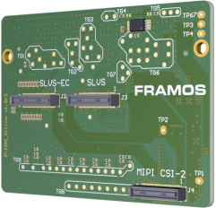
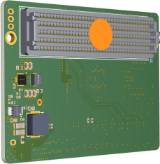
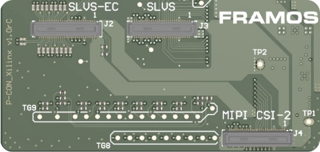
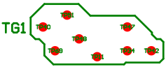
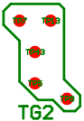
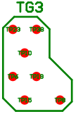
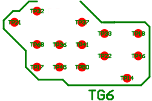
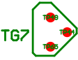
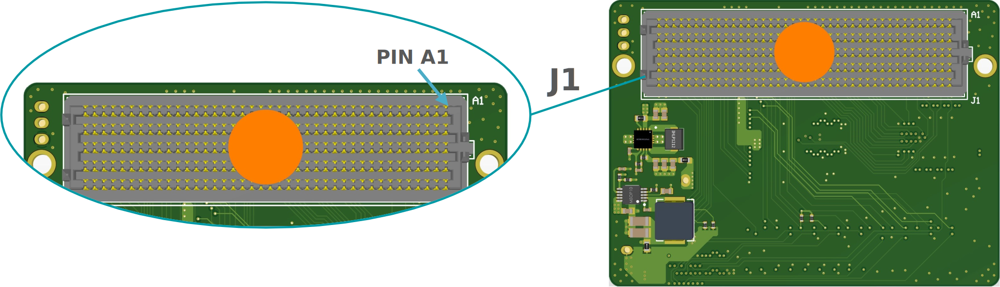

FPA-ABC/XX1-V1
++++++++++++++++

Multi-Format FPA to Xilinx Development Boards:

   This FPA type connects the FSM Ecosystem via the standardized PixelMate™
   interfaces to AMD/Xilinx Development Board deployed with the FPGA
   Mezzanine Card (FMC) connector.

   -  Three inputs, one for each interface:

      -  SLVS-EC

      -  Sub-LVDS / SLVS

      -  MIPI CSI-2 (D-PHY)

   -  EEPROM for dynamic device tree management

   -  Testpoints to important sensor signals

   -  Configurable trigger routing

   -  Compatible to various AMD/Xilinx Development Boards; verified types
      can be found in the compatibility matrix in this chapter.

      |image51|

+--------------+-----------------+
| **Top View** | **Bottom View** |
+--------------+-----------------+
| |image52|    | |image53|       |
+--------------+-----------------+

Image Sensor Connectors
~~~~~~~~~~~~~~~~~~~~~~~~~~~

|image54|

+-----------+----------+----------------------------------+-----------------------+--------------------+
| **Label** | **Name** | **Description**                  | **Connector Type**    | **FPGA Routing**   |
+===========+==========+==================================+=======================+====================+
| J2        | SLVS-EC  | Port 2, 8-Lanes SLVS-EC, to FSA  | Hirose                | 8-Lanes            |
|           |          |                                  | DF40HC(4.0)-60DS-0.4V | Transceive         |
+-----------+----------+----------------------------------+-----------------------+--------------------+
| SLVS      | SLVS     | Port 1, 8-Lanes SLVS / Sub-LVDS, | Hirose                | 8-Lanes to         |
| J3        |          | to FSA                           | DF40HC(4.0)-60DS-0.4V | differential IOs   |
+-----------+----------+----------------------------------+-----------------------+--------------------+
| MIPI      | CSI-2    | Port 3, 4-Lanes MIPI CSI-2,      | Hirose                | 4-Lanes to CSI-2   |
| J4        |          | to FSA                           | DF40HC(4.0)-60DS-0.4V | D-PHY              |
+-----------+----------+----------------------------------+-----------------------+--------------------+

**Table**: Image Sensor Connectors on FPA-ABC/XX1-V1

All ports provide the same pinout. The pin assignment is according to
the corresponding FSA.

**Caution:** Direct connection of FSM to FPA (without FSA) or wrong
cable orientation will lead to permanent damage of FSM, Adapters or the
Processor Board. Using flex cable (FMA-FC-150/60-v1) between FSA and FPA
is mandatory.

**Processor Board Compatibility Matrix**

The FPA has been designed to comply to the following Xilinx Development
Boards.

+---------------------------------+----------+-----------+-----------+
| Xilinx Development Board        | SLVS-EC  | SLVS      | MIPI      |
|                                 |          |           | CSI-2     |
+=================================+==========+===========+===========+
| AC701-G (Artix-7)               | Yes      | TBD       | TBD       |
+---------------------------------+----------+-----------+-----------+
| KC705-G (Kintex-7)              | Yes      | TBD       | TBD       |
+---------------------------------+----------+-----------+-----------+
| ZC706-G (Zynq-7000)             | Yes      | TBD       | TBD       |
+---------------------------------+----------+-----------+-----------+
| KCU105-G (Kintex UltraScale)    | Yes      | Yes       | TBD       |
+---------------------------------+----------+-----------+-----------+
| KCU116-G (Kintex UltraScale+)   | Yes      | TBD       | TBD       |
+---------------------------------+----------+-----------+-----------+
| ZCU102-G (Zynq UltraScale+)     | Yes      | Yes       | Yes       |
+---------------------------------+----------+-----------+-----------+

**Important Notes:**

-  **SLVS-EC:** The different AMD/Xilinx Development Boards provide
   access to a different count of Gigabit Transceivers (GTx). This might
   limit the utilization of the 8-Lanes available from the FPA. Please
   refer to the datasheet of the AMD/Xilinx Development Board for more
   information.

-  **MIPI CSI-2 (D-PHY):** The AMD/Xilinx ZCU102-G provides hard D-PHY
   lanes on the appropriate pins of the FPA connector. The usage of the
   MIPI CSI-2 port is routed but has not been verified. Operation is in
   the responsibility of the user. Further AMD/Xilinx Development Kits
   might be compatible but have not been validated for correct
   electrical connectivity.

-  **Kria KR260:** Boards like the Kria KR260 Robotics Starter Kit
   integrate the PixelMateS SLVS-EC connector (2-Lane) directly into the
   carrier board. FSM+FSA are directly connected, an FPA is not needed.

TGx, TPx: Test Groups and Test Points
~~~~~~~~~~~~~~~~~~~~~~~~~~~~~~~~~~~~~~~~~

Ungrouped (according to silk print)

+----------+------------------------+----------+----------------------+
| Label    | Signal                 | Label    | Signal               |
+==========+========================+==========+======================+
| TP1      | 1V8_VDD                | TP67     | UTIL_3V3_10A         |
+----------+------------------------+----------+----------------------+
| TP2      | 3V8_VDD                | TP75     | GND                  |
+----------+------------------------+----------+----------------------+
| TP3      | UTIL_3V3               | TP76     | GND                  |
+----------+------------------------+----------+----------------------+
| TP4      | GND                    | TP77     | GND                  |
+----------+------------------------+----------+----------------------+
| TP12     | CAM1_GPIO0(XMASTER0)   | TP78     | GND                  |
+----------+------------------------+----------+----------------------+

**TG1**: Clocks and various GPIOs

|image55|

+-----------+---------------------+-----------+-----------------------+
| Label     | Signal              | Label     | Signal                |
+===========+=====================+===========+=======================+
| TP11      | CAM1_GPIO8(TOUT1)   | TP47      | CAM1_GPIO14           |
+-----------+---------------------+-----------+-----------------------+
| TP34      | CAM1_GPIO10         | TP48      | CAM1_MCLK0            |
+-----------+---------------------+-----------+-----------------------+
| TP40      | CAM2_GPIO3(XTRIG0)  | TP51      | CAM3_MCLK0            |
+-----------+---------------------+-----------+-----------------------+
| TP42      | CAM1_GPIO16         | TP69      | CAM2_MCLK0            |
+-----------+---------------------+-----------+-----------------------+

**TG2**: Various

|image56|

+----------+--------------------------+----------+---------------------+
| Label    | Signal                   | Label    | Signal              |
+==========+==========================+==========+=====================+
| TP5      | CAM1_I2C_0_SDA(SPI_MOSI) | TP13      | CAM1_GPIO9(TOUT2)  |
+----------+--------------------------+----------+---------------------+
| TP7      | CAM1_GPIO15(SPI_MISO)    | TP43      | CAM1_RST0          |
+----------+--------------------------+----------+---------------------+
| TP9      | CAM1_GPIO11(TOUT0)       |          |                     |
+----------+--------------------------+----------+---------------------+

**TG3**:

|image57|

+----------+-------------------------+----------+----------------------+
| Label    | Signal                  | Label    | Signal               |
+==========+=========================+==========+======================+
| TP6      | CAM1_I2C_0_SCL(SPI_SCK) | TP19     | CAM1_GPIO3(XTRIG0)   |
+----------+-------------------------+----------+----------------------+
| TP8      | CAM1_GPIO17(SPI_CS)     | TP23     | CAM1_GPIO2(XHS0)     |
+----------+-------------------------+----------+----------------------+
| TP10     | CAM1_GPIO6(SLAMODE)     | TP38     | CAM1_GPIO1(XVS0)     |
+----------+-------------------------+----------+----------------------+
| TP15     | CAM1_GPIO7(XTRIG2)      |          |                      |
+----------+-------------------------+----------+----------------------+

**TG4**: I2C Clock and Data

|image58|

+-------------------------+--------------------------------------------+
| Label                   | Signal                                     |
+=========================+============================================+
| TP25                    | SCL                                        |
+-------------------------+--------------------------------------------+
| TP26                    | SDA                                        |
+-------------------------+--------------------------------------------+

**TG5**: EEPROM Address

|image59|

+-------------------------+--------------------------------------------+
| Label                   | Signal                                     |
+=========================+============================================+
| TP27                    | GA1                                        |
+-------------------------+--------------------------------------------+
| TP28                    | GA0                                        |
+-------------------------+--------------------------------------------+
| TP30                    | GND                                        |
+-------------------------+--------------------------------------------+

**TG6**:

|image60|

+---------+-------------------------+---------+-------------------------+
| Label   | Signal                  | Label   | Signal                  |
+=========+=========================+=========+=========================+
| TP14    | CAM3_RST0               | TP36    | CAM2_GPIO7(XTRIG2)      |
+---------+-------------------------+---------+-------------------------+
| TP17    | CAM2_GPIO6(SLAMODE)     | TP37    | CAM3_I2C_0_SDA(SPI_MOSI)|
+---------+-------------------------+---------+-------------------------+
| TP18    | CAM3_GPIO0(XMASTER0)    | TP41    | CAM3_GPIO2(XHS0)        |
+---------+-------------------------+---------+-------------------------+
| TP21    | CAM2_GPIO8(TOUT1)       | TP45    | CAM2_GPIO2(XHS0)        |
+---------+-------------------------+---------+-------------------------+
| TP22    | CAM3_I2C_0_SCL(SPI_SCK) | TP46    | CAM3_GPIO3(XTRIG0)      |
+---------+-------------------------+---------+-------------------------+
| TP32    | CAM2_GPIO0(XMASTER0)    | TP50    | CAM2_GPIO1(XVS0)        |
+---------+-------------------------+---------+-------------------------+
| TP33    | CAM3_GPIO1(XVS0)        | TP68    | CAM2_RST0               |
+---------+-------------------------+---------+-------------------------+

**TG7**:

|image61|

+------------------------+---------------------------------------------+
| Label                  | Signal                                      |
+========================+=============================================+
| TP44                   | CAM2_GPIO9(TOUT2)                           |
+------------------------+---------------------------------------------+
| TP49                   | CAM2_GPIO10                                 |
+------------------------+---------------------------------------------+
| TP64                   | CAM3_GPIO5(MCLK3)                           |
+------------------------+---------------------------------------------+

**TG8**:

|image62|

+----------+-------------------------+----------+---------------------+
| Label    | Signal                  | Label    | Signal              |
+==========+=========================+==========+=====================+
| TP52     | CAM3_GPIO16(SYS_PW_EN)  | TP62     | CAM3_GPIO4(MCLK2)   |
+----------+-------------------------+----------+---------------------+
| TP53     | CAM3_GPIO8              | TP63     | CAM3_MCLK1          |
+----------+-------------------------+----------+---------------------+
| TP54     | CAM3_GPIO14             | TP64     | CAM3_GPIO5(MCLK3)   |
+----------+-------------------------+----------+---------------------+
| TP55     | CAM3_RST1               |          |                     |
+----------+-------------------------+----------+---------------------+
| TP60     | CAM3_GPIO6              |          |                     |
+----------+-------------------------+----------+---------------------+
| TP61     | CAM3_GPIO7              |          |                     |
+----------+-------------------------+----------+---------------------+

**TG9**:

|image63|

+----------+--------------------------+----------+---------------------+
| Label    | Signal                   | Label    | Signal              |
+==========+==========================+==========+=====================+
| TP16     | CAM2_I2C_0_SDA(SPI_MOSI) | TP59     | CAM3_GPIO9          |
+----------+--------------------------+----------+---------------------+
| TP20     | CAM2_I2C_0_SCL(SPI_SCK)  | TP66     | CAM2_GPIO14         |
+----------+--------------------------+----------+---------------------+
| TP24     | CAM2_GPIO15(SPI_MISO)    | TP70     | CAM3_I2C_1_SDA      |
+----------+--------------------------+----------+---------------------+
| TP35     | CAM2_GPIO17(SPI_CS)      | TP71     | CAM3_GPIO10         |
+----------+--------------------------+----------+---------------------+
| TP39     | CAM2_GPIO11(TOUT0)       | TP72     | CAM3_GPIO11         |
+----------+--------------------------+----------+---------------------+
| TP56     | CAM3_GPIO15(SPI_MISO)    | TP73     | CAM3_PW_EN0         |
+----------+--------------------------+----------+---------------------+
| TP57     | CAM3_I2C_1_SCL           | TP74     | CAM3_PW_EN1         |
+----------+--------------------------+----------+---------------------+
| TP58     | CAM3_GPIO17(SPI_CS)      |          |                     |
+----------+--------------------------+----------+---------------------+

Processor Board Connector
~~~~~~~~~~~~~~~~~~~~~~~~~~~~~~~~~~~~

|image64|

**Label**: J1

**Type**: ASP-134488-01

**Pinout (A – J)**: Table / Table

**Notes**: **CAM1**: J2 (SLVS-EC), **CAM2**: J3 (SLVS), **CAM3**: J4 (MIPI
CSI-2)

**Table**: Pinout J1 - Part1 (A-E) of FPA-ABC/XX1-V1 connector to Xilinx
Development Board

+------+-------------------+-------------------+-------------------+------------------------+-------------------+
| Pin# | A                 | B                 | C                 | D                      | E                 |
+======+===================+===================+===================+========================+===================+
| 1    | GND               | NC                | GND               | NC                     | GND               |
+------+-------------------+-------------------+-------------------+------------------------+-------------------+
| 2    | FMC_CAM1_DO1_P    | GND               | NC                | GND                    | NC                |
+------+-------------------+-------------------+-------------------+------------------------+-------------------+
| 3    | FMC_CAM1_DO1_N    | GND               | NC                | GND                    | NC                |
+------+-------------------+-------------------+-------------------+------------------------+-------------------+
| 4    | GND               | NC                | GND               | FMC_CAM1_D_CLK_0_P     | GND               |
+------+-------------------+-------------------+-------------------+------------------------+-------------------+
| 5    | GND               | NC                | GND               | FMC_CAM1_D_CLK_0_N     | GND               |
+------+-------------------+-------------------+-------------------+------------------------+-------------------+
| 6    | FMC_CAM1_DO2_P    | GND               | FMC_CAM1_DO0_P    | GND                    | NC                |
+------+-------------------+-------------------+-------------------+------------------------+-------------------+
| 7    | FMC_CAM1_DO2_N    | GND               | FMC_CAM1_DO0_N    | GND                    | NC                |
+------+-------------------+-------------------+-------------------+------------------------+-------------------+
| 8    | GND               | NC                | GND               | CAM2_D_DATA_1_P        | GND               |
+------+-------------------+-------------------+-------------------+------------------------+-------------------+
| 9    | GND               | NC                | GND               | CAM2_D_DATA_1_N        | NC                |
+------+-------------------+-------------------+-------------------+------------------------+-------------------+
| 10   | FMC_CAM1_DO3_P    | GND               | CAM2_D_DATA_5_P   | GND                    | NC                |
+------+-------------------+-------------------+-------------------+------------------------+-------------------+
| 11   | FMC_CAM1_DO3_N    | GND               | CAM2_D_DATA_5_N   | CAM2_D_DATA_6_P        | GND               |
+------+-------------------+-------------------+-------------------+------------------------+-------------------+
| 12   | GND               | FMC_CAM1_DO7_P    | GND               | CAM2_D_DATA_6_N        | NC                |
+------+-------------------+-------------------+-------------------+------------------------+-------------------+
| 13   | GND               | FMC_CAM1_DO7_N    | GND               | GND                    | NC                |
+------+-------------------+-------------------+-------------------+------------------------+-------------------+
| 14   | FMC_CAM1_DO4_P    | GND               | CAM2_D_DATA_7_P   | CAM1_GPIO15(SPI_MISO)  | GND               |
+------+-------------------+-------------------+-------------------+------------------------+-------------------+
| 15   | FMC_CAM1_DO4_N    | GND               | CAM2_D_DATA_7_N   | CAM1_GPIO9(TOUT2)      | NC                |
+------+-------------------+-------------------+-------------------+------------------------+-------------------+
| 16   | GND               | FMC_CAM1_DO6_P    | GND               | GND                    | NC                |
+------+-------------------+-------------------+-------------------+------------------------+-------------------+
| 17   | GND               | FMC_CAM1_DO6_N    | GND               | CAM1_GPIO2(XHS0)       | GND               |
+------+-------------------+-------------------+-------------------+------------------------+-------------------+
| 18   | FMC_CAM1_DO5_P    | GND               | CAM1_GPIO1(XVS0)  | CAM1_GPIO6(SLAMODE)    | NC                |
+------+-------------------+-------------------+-------------------+------------------------+-------------------+
| 19   | FMC_CAM1_DO5_N    | GND               | CAM_GPIO14        | GND                    | NC                |
+------+-------------------+-------------------+-------------------+------------------------+-------------------+
| 20   | GND               | NC                | GND               | CAM_GPIO10             | GND               |
+------+-------------------+-------------------+-------------------+------------------------+-------------------+
| 21   | GND               | NC                | GND               | CAM_GPIO9              | NC                |
+------+-------------------+-------------------+-------------------+------------------------+-------------------+
| 22   | NC                | GND               | CAM_GPIO11        | GND                    | NC                |
+------+-------------------+-------------------+-------------------+------------------------+-------------------+
| 23   | NC                | GND               | CAM_GPIO15        | CAM3_D_CLK_0_P         | GND               |
+------+-------------------+-------------------+-------------------+------------------------+-------------------+
| 24   | GND               | NC                | GND               | CAM3_D_CLK_0_N         | NC                |
+------+-------------------+-------------------+-------------------+------------------------+-------------------+
| 25   | GND               | NC                | GND               | GND                    | NC                |
+------+-------------------+-------------------+-------------------+------------------------+-------------------+
| 26   | NC                | GND               | CAM_I2C_SDA       | CAM3_D_DATA_3_P        | GND               |
+------+-------------------+-------------------+-------------------+------------------------+-------------------+
| 27   | NC                | GND               | CAM_GPIO17        | CAM3_D_DATA_3_N        | NC                |
+------+-------------------+-------------------+-------------------+------------------------+-------------------+
| 28   | GND               | NC                | GND               | GND                    | NC                |
+------+-------------------+-------------------+-------------------+------------------------+-------------------+
| 29   | GND               | NC                | GND               | NC                     | GND               |
+------+-------------------+-------------------+-------------------+------------------------+-------------------+
| 30   | NC                | GND               | SCL               | TDI                    | NC                |
+------+-------------------+-------------------+-------------------+------------------------+-------------------+
| 31   | NC                | GND               | SDA               | TDO                    | NC                |
+------+-------------------+-------------------+-------------------+------------------------+-------------------+
| 32   | GND               | NC                | GND               | UTIL_3V3_10A           | GND               |
+------+-------------------+-------------------+-------------------+------------------------+-------------------+
| 33   | GND               | NC                | GND               | NC                     | NC                |
+------+-------------------+-------------------+-------------------+------------------------+-------------------+
| 34   | NC                | GND               | GA0               | NC                     | NC                |
+------+-------------------+-------------------+-------------------+------------------------+-------------------+
| 35   | NC                | GND               | NC                | GA1                    | GND               |
+------+-------------------+-------------------+-------------------+------------------------+-------------------+
| 36   | GND               | NC                | NC                | UTIL_3V3               | NC                |
+------+-------------------+-------------------+-------------------+------------------------+-------------------+
| 37   | GND               | NC                | NC                | GND                    | NC                |
+------+-------------------+-------------------+-------------------+------------------------+-------------------+
| 38   | NC                | GND               | NC                | UTIL_3V3               | GND               |
+------+-------------------+-------------------+-------------------+------------------------+-------------------+
| 39   | NC                | GND               | UTIL_3V3          | GND                    | VADJ              |
+------+-------------------+-------------------+-------------------+------------------------+-------------------+
| 40   | GND               | NC                | NC                | UTIL_3V3               | GND               |
+------+-------------------+-------------------+-------------------+------------------------+-------------------+

**Table**: Pinout J1 – Part2 (F-J) of FPA-ABC/XX1-V1 connector to Xilinx
Development Board

+------+------------------------+----------------------------+------------------------+------------------------+------------------------+
| Pin# | F                      | G                          | H                      | I                      | J                      |
+======+========================+============================+========================+========================+========================+
| 1    | NC                     | GND                        | NC                     | GND                    | NC                     |
+------+------------------------+----------------------------+------------------------+------------------------+------------------------+
| 2    | GND                    | CAM2_GPIO3(XTRIG)          | PRSNT_M2C_L            | NC                     | GND                    |
+------+------------------------+----------------------------+------------------------+------------------------+------------------------+
| 3    | GND                    | CAM3_MCLK0                 | GND                    | NC                     | GND                    |
+------+------------------------+----------------------------+------------------------+------------------------+------------------------+
| 4    | NC                     | GND                        | CAM2_MCLK_0            | GND                    | NC                     |
+------+------------------------+----------------------------+------------------------+------------------------+------------------------+
| 5    | NC                     | GND                        | CAM1_MCLK_0            | GND                    | NC                     |
+------+------------------------+----------------------------+------------------------+------------------------+------------------------+
| 6    | GND                    | CAM2_D_CLK_0_P             | GND                    | NC                     | GND                    |
+------+------------------------+----------------------------+------------------------+------------------------+------------------------+
| 7    | NC                     | CAM2_D_CLK_0_N             | CAM1_GPIO8(TOUT1)      | NC                     | NC                     |
+------+------------------------+----------------------------+------------------------+------------------------+------------------------+
| 8    | NC                     | GND                        | CAM1_GPIO10            | GND                    | NC                     |
+------+------------------------+----------------------------+------------------------+------------------------+------------------------+
| 9    | GND                    | CAM2_D_DATA_3_P            | GND                    | NC                     | GND                    |
+------+------------------------+----------------------------+------------------------+------------------------+------------------------+
| 10   | NC                     | CAM2_D_DATA_3_N            | CAM2_D_DATA_0_P        | NC                     | NC                     |
+------+------------------------+----------------------------+------------------------+------------------------+------------------------+
| 11   | NC                     | GND                        | CAM2_D_DATA_0_N        | GND                    | NC                     |
+------+------------------------+----------------------------+------------------------+------------------------+------------------------+
| 12   | GND                    | CAM2_D_DATA_4_P            | GND                    | NC                     | GND                    |
+------+------------------------+----------------------------+------------------------+------------------------+------------------------+
| 13   | NC                     | CAM2_D_DATA_4_N            | CAM2_D_DATA_2_P        | NC                     | NC                     |
+------+------------------------+----------------------------+------------------------+------------------------+------------------------+
| 14   | NC                     | GND                        | CAM2_D_DATA_2_N        | GND                    | NC                     |
+------+------------------------+----------------------------+------------------------+------------------------+------------------------+
| 15   | GND                    | CAM1_RST0                  | GND                    | NC                     | GND                    |
+------+------------------------+----------------------------+------------------------+------------------------+------------------------+
| 16   | NC                     | CAM1_I2C_0_SDA(SPI_MOSI)   | CAM1_GPIO11(TOUT0)     | NC                     | NC                     |
+------+------------------------+----------------------------+------------------------+------------------------+------------------------+
| 17   | NC                     | GND                        | CAM1_GPIO7(XTRIG2)     | GND                    | NC                     |
+------+------------------------+----------------------------+------------------------+------------------------+------------------------+
| 18   | GND                    | CAM1_I2C_0_SCL(SPI_SCK)    | GND                    | NC                     | GND                    |
+------+------------------------+----------------------------+------------------------+------------------------+------------------------+
| 19   | NC                     | CAM1_GPIO3(XTRIG0)         | CAM1_GPIO0(XMASTER0)   | NC                     | NC                     |
+------+------------------------+----------------------------+------------------------+------------------------+------------------------+
| 20   | NC                     | GND                        | CAM1_GPIO17(SPI_CS)    | GND                    | NC                     |
+------+------------------------+----------------------------+------------------------+------------------------+------------------------+
| 21   | GND                    | CAM3_D_CLK_1_P             | GND                    | NC                     | GND                    |
+------+------------------------+----------------------------+------------------------+------------------------+------------------------+
| 22   | NC                     | CAM3_D_CLK_1_N             | CAM3_D_DATA_2_P        | NC                     | NC                     |
+------+------------------------+----------------------------+------------------------+------------------------+------------------------+
| 23   | NC                     | GND                        | CAM3_D_DATA_2_N        | GND                    | NC                     |
+------+------------------------+----------------------------+------------------------+------------------------+------------------------+
| 24   | GND                    | CAM3_D_DATA_0_P            | GND                    | NC                     | GND                    |
+------+------------------------+----------------------------+------------------------+------------------------+------------------------+
| 25   | NC                     | CAM3_D_DATA_0_N            | CAM3_D_DATA_1_P        | NC                     | NC                     |
+------+------------------------+----------------------------+------------------------+------------------------+------------------------+
| 26   | NC                     | GND                        | CAM3_D_DATA_1_N        | GND                    | NC                     |
+------+------------------------+----------------------------+------------------------+------------------------+------------------------+
| 27   | GND                    | CAM_I2C_SCL                | GND                    | NC                     | GND                    |
+------+------------------------+----------------------------+------------------------+------------------------+------------------------+
| 28   | NC                     | CAM2_GPIO8(TOUT1)          | CAM2_RST0              | NC                     | NC                     |
+------+------------------------+----------------------------+------------------------+------------------------+------------------------+
| 29   | NC                     | GND                        | CAM2_GPIO6(SLAMODE)    | GND                    | NC                     |
+------+------------------------+----------------------------+------------------------+------------------------+------------------------+
| 30   | GND                    | CAM2_GPIO0(XMASTER0)       | GND                    | NC                     | GND                    |
+------+------------------------+----------------------------+------------------------+------------------------+------------------------+
| 31   | NC                     | CAM2_GPIO7(XTRIG2)         | CAM2_GPIO2(XHS0)       | NC                     | NC                     |
+------+------------------------+----------------------------+------------------------+------------------------+------------------------+
| 32   | NC                     | GND                        | CAM2_GPIO1(XVS0)       | GND                    | NC                     |
+------+------------------------+----------------------------+------------------------+------------------------+------------------------+
| 33   | GND                    | CAM3_I2C_0_SDA(SPI_MOSI)   | GND                    | NC                     | GND                    |
+------+------------------------+----------------------------+------------------------+------------------------+------------------------+
| 34   | NC                     | CAM3_GPIO2(XHS0)           | CAM_GPIO16             | NC                     | NC                     |
+------+------------------------+----------------------------+------------------------+------------------------+------------------------+
| 35   | NC                     | GND                        | CAM3_I2C_0_SCL(SPI_SCK)| GND                    | NC                     |
+------+------------------------+----------------------------+------------------------+------------------------+------------------------+
| 36   | GND                    | CAM3_GPIO1(XVS0)           | GND                    | NC                     | GND                    |
+------+------------------------+----------------------------+------------------------+------------------------+------------------------+
| 37   | NC                     | CAM3_GPIO0(XMASTER0)       | CAM3_RST0              | NC                     | NC                     |
+------+------------------------+----------------------------+------------------------+------------------------+------------------------+
| 38   | NC                     | GND                        | CAM3_GPIO3(XTRIG0)     | GND                    | NC                     |
+------+------------------------+----------------------------+------------------------+------------------------+------------------------+
| 39   | GND                    | NC                         | GND                    | NC                     | GND                    |
+------+------------------------+----------------------------+------------------------+------------------------+------------------------+
| 40   | NC                     | GND                        | NC                     | GND                    | NC                     |
+------+------------------------+----------------------------+------------------------+------------------------+------------------------+

Technical Drawing
~~~~~~~~~~~~~~~~~

|image65|

Figure: Technical Drawing of FPA-ABC/XX1-V1

.. |image65| image:: FPA-65s.svg
   :width: 900px
   :height: 330px