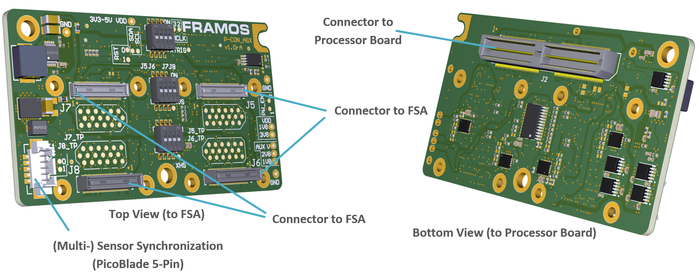

FRAMOS Processor Adapter (FPA) 
++++++++++++++++++++++++++++++++++++++++++

-  Connects multiple FSAs to one processor board

-  Processor board specific

-  Differentiates two input interface types:

   -  **A:** MIPI CSI-2

   -  **BC:** Sub-LVDS / SLVS (**B**) and SLVS-EC (**C**)

FPA-4.A/AGX-V1A: Quad FPA to NVIDIA Jetson AGX Orin and AGX Xavier
------------------------------------------------------------------

-  Adapting from PixelMate to NVIDIA Jetson AGX Developer Kit Connector

-  Four 4-Lane MIPI CSI-2

-  Generation of standard PixelMate power rails

-  Testpoints to important sensor signals

-  Enhanced sensor control signal access via I2C extender

-  Synchronization and timing signal access via Molex Picoblade
   connector

-  Compatible Processor Boards:

   -  NVIDIA Jetson Orin AGX Development Kit

   -  NVIDIA Jetson Xavier AGX Development Kit

      |image1|

|image2|

**Description of Connectors and Interfaces**
~~~~~~~~~~~~~~~~~~~~~~~~~~~~~~~~~~~~~~~~~~~~

+----------+--------------------------+---------------------------+--------------------------+
| **Name** | **Description**          | **Connector Type**        | **Orientation**          |
+==========+==========================+===========================+==========================+
| **J1**   | XVS, XHS and XTRIG       | Molex PicoBlade, 5-Pin    | Pin 1 marked on PCB      |
|          | Signals                  | (53398-0571)              |                          |
+----------+--------------------------+---------------------------+--------------------------+
| **J2**   | PixelMate to Processor   | Samtec QTH-060-01-L-D-A   | Pin 1 marked on PCB      |
|          | Board                    |                           |                          |
+----------+--------------------------+---------------------------+--------------------------+
| **J5**   | PixelMate to FSA (4x     | Hirose DF40C-60DS-0.4V(51)| Pin 1 Printed on PCB     |
|          | MIPI CSI-2 lanes)        |                           | next to each connector.  |
+----------+--------------------------+---------------------------+--------------------------+
| **J6**   |                          | Hirose DF40H              |                          |
|          |                          | C(4.0)-60DS-0.4V(51)      |                          |
+----------+--------------------------+---------------------------+--------------------------+
| **J7**   |                          | Hirose DF40C-60DS-0.4V(51)|                          |
|          |                          |                           |                          |
+----------+--------------------------+---------------------------+--------------------------+
| **J8**   |                          | Hirose DF40H              |                          |
|          |                          | C(4.0)-60DS-0.4V(51)      |                          |
+----------+--------------------------+---------------------------+--------------------------+

Table: Connectors on FPA-4.A/AGX-V1A

The Pin 1 markings can be found in the following chapters along with the
Pinout, as well as on the PCB in copper or silkscreen layer next to the
connector.

**Note:** All signals are routed from J5, J6, J7, J8 (to FSA) to J2 (to
processor), test points and pin row. They follow the signal
specification according to the FSA output interface. Control signals
going to J1 (I2C, clock, GPIO) are buffered to allow voltage
translation.

**J1 – XVS, XHS and XTRIG Signals
Type: Molex PicoBlade, 53398-0571
Pinout:**

|image3|

+--------------------+-------------------------------------------------+
| Pin #              | Name                                            |
+====================+=================================================+
| 1                  | 1V8_VDD                                         |
+--------------------+-------------------------------------------------+
| 2                  | XVS0                                            |
+--------------------+-------------------------------------------------+
| 3                  | XHS0                                            |
+--------------------+-------------------------------------------------+
| 4                  | XTRIG0                                          |
+--------------------+-------------------------------------------------+
| 6                  | GND                                             |
+--------------------+-------------------------------------------------+

Note: Switches SW1, SW2 and SW3 refer to XVS, XHS
and XTRIG signals respectively. When SW1, SW2 and SW3
are off, the corresponding signals XVS0, XHS0 and XTRIG0
are not connected.

**J5, J6, J7, J8 - Connectors to Sensor Adapters (FSA)**

+---------------------------+------------------------------------------+
| Connectors                | Type                                     |
+===========================+==========================================+
| J5, J7                    | Hirose DF40C-60DS-0.4V(51)               |
+---------------------------+------------------------------------------+
| J6, J8                    | Hirose DF40HC(4.0)-60DS-0.4V(51)         |
+---------------------------+------------------------------------------+

**
Note: The two PixelMate connectors, J5 and J7, feature a compact 1.5 mm
height, enabling direct connection of 26.5x26.5mm FSM:GO or classic FSA
modules onto the board through J6 and J8.**

**Pinout:**
+---------+-------------------+---------+-------------------+---------+-------------------+---------+-------------------+
| **Pin** | **Name**          | **Pin** | **Name**          | **Pin** | **Name**          | **Pin** | **Name**          |
+=========+===================+=========+===================+=========+===================+=========+===================+
| 1       | 3V8_VDD           | 16      | RST_1             | 31      | GPIO3(XTRIG0)     | 46      | D_DATA_D_P        |
+---------+-------------------+---------+-------------------+---------+-------------------+---------+-------------------+
| 2       | 1V8_VDD           | 17      | NC                | 32      | NC                | 47      | D_CLK_B_N         |
+---------+-------------------+---------+-------------------+---------+-------------------+---------+-------------------+
| 3       | 3V8_VDD           | 18      | NC                | 33      | PW_EN_0           | 48      | D_DATA_D_N        |
+---------+-------------------+---------+-------------------+---------+-------------------+---------+-------------------+
| 4       | 1V8_VDD           | 19      | GPIO0(XMASTER0)   | 34      | PW_EN_1           | 49      | GND               |
+---------+-------------------+---------+-------------------+---------+-------------------+---------+-------------------+
| 5       | 2V8_AUX           | 20      | NC                | 35      | GPIO6(SLAMODE0)   | 50      | GND               |
+---------+-------------------+---------+-------------------+---------+-------------------+---------+-------------------+
| 6       | NC                | 21      | I2C_X_SCL         | 36      | GPIO7(SLAMODE1)   | 51      | D_DATA_A_N        |
+---------+-------------------+---------+-------------------+---------+-------------------+---------+-------------------+
| 7       | 2V8_AUX           | 22      | I2C_Y_SCL         | 37      | GND               | 52      | D_DATA_B_N        |
+---------+-------------------+---------+-------------------+---------+-------------------+---------+-------------------+
| 8       | NC                | 23      | NC                | 38      | GND               | 53      | D_DATA_A_P        |
+---------+-------------------+---------+-------------------+---------+-------------------+---------+-------------------+
| 9       | 1V8_AUX           | 24      | GPIO16(SLAMODE2)  | 39      | MCLK_0            | 54      | D_DATA_B_P        |
+---------+-------------------+---------+-------------------+---------+-------------------+---------+-------------------+
| 10      | NC                | 25      | GPIO1(XVS0)       | 40      | GPIO4(MCLK2)      | 55      | GND               |
+---------+-------------------+---------+-------------------+---------+-------------------+---------+-------------------+
| 11      | GND               | 26      | NC                | 41      | MCLK_1            | 56      | GND               |
+---------+-------------------+---------+-------------------+---------+-------------------+---------+-------------------+
| 12      | GND               | 27      | I2C_X_SDA         | 42      | GPIO5(MCLK3)      | 57      | D_DATA_C_P        |
+---------+-------------------+---------+-------------------+---------+-------------------+---------+-------------------+
| 13      | GND               | 28      | I2C_Y_SDA         | 43      | GND               | 58      | D_CLK_A_P         |
+---------+-------------------+---------+-------------------+---------+-------------------+---------+-------------------+
| 14      | GND               | 29      | GPIO2(XHS0)       | 44      | GND               | 59      | D_DATA_C_N        |
+---------+-------------------+---------+-------------------+---------+-------------------+---------+-------------------+
| 15      | RST_0             | 30      | GPIO10(TENABLE)   | 45      | D_CLK_B_P         | 60      | D_CLK_A_N         |
+---------+-------------------+---------+-------------------+---------+-------------------+---------+-------------------+

**
Connector I2C Mapping
**\ The connectors are mapped to specific ports on the I2C multiplexer.
Each PixelMate is associated with two I2C lines: the primary line
(I2C_X) and the auxiliary line (I2C_Y)

+----------------+--------------------------+--------------------------+
| Connector      | I2C_X                    | I2C_Y                    |
+================+==========================+==========================+
| J5             | I2C_0                    | I2C_1                    |
+----------------+--------------------------+--------------------------+
| J6             | I2C_2                    | I2C_3                    |
+----------------+--------------------------+--------------------------+
| J7             | I2C_4                    | I2C_5                    |
+----------------+--------------------------+--------------------------+
| J8             | I2C_6                    | I2C_7                    |
+----------------+--------------------------+--------------------------+

**MIPI CSI-2 Signal Mapping for PixelMate Connectors**

+-----------+--------+-----------+-----------+-----------+-----------+
| PixelMate | Signal | Signal    | Signal    | Signal    | Signal    |
| Pin       | Name   | Name on   | Name on   | Name on   | Name on   |
|           |        | J5        | J6        | J7        | J8        |
+===========+========+===========+===========+===========+===========+
| P:58 N:60 | D      | D_CLK_0   | D_CLK_2   | D_CLK_4   | D_CLK_6   |
|           | _CLK_A |           |           |           |           |
+-----------+--------+-----------+-----------+-----------+-----------+
| P:45 N:47 | D      | D_CLK_1   | D_CLK_3   | D_CLK_5   | D_CLK_7   |
|           | _CLK_B |           |           |           |           |
+-----------+--------+-----------+-----------+-----------+-----------+
| P:53 N:51 | D_     | D_DATA_0  | D_DATA_4  | D_DATA_8  | D_DATA_12 |
|           | DATA_A |           |           |           |           |
+-----------+--------+-----------+-----------+-----------+-----------+
| P:54 N:52 | D_     | D_DATA_1  | D_DATA_5  | D_DATA_9  | D_DATA_13 |
|           | DATA_B |           |           |           |           |
+-----------+--------+-----------+-----------+-----------+-----------+
| P:57 N:59 | D_     | D_DATA_2  | D_DATA_6  | D_DATA_10 | D_DATA_14 |
|           | DATA_C |           |           |           |           |
+-----------+--------+-----------+-----------+-----------+-----------+
| P:46 N:48 | D_     | D_DATA_3  | D_DATA_7  | D_DATA_11 | D_DATA_15 |
|           | DATA_D |           |           |           |           |
+-----------+--------+-----------+-----------+-----------+-----------+

J2: Connector to Processor Board
~~~~~~~~~~~~~~~~~~~~~~~~~~~~~~~~~~~~~~~~~~~

|image4|

|image5|

**J2**

Label: J2

Type: Samtec QTH-060-01-L-D-A

Pinout:

+---------+--------------+---------+----------------+---------+----------------+---------+----------------+
| **Pin** | **Name**     | **Pin** | **Name**       | **Pin** | **Name**       | **Pin** | **Name**       |
+=========+==============+=========+================+=========+================+=========+================+
| 1       | D_DATA_0_P   | 2       | D_DATA_2_P     | 61      | D_DATA_10_N    | 62      | D_DATA_14_N    |
+---------+--------------+---------+----------------+---------+----------------+---------+----------------+
| 3       | D_DATA_0_N   | 4       | D_DATA_2_N     | 63      | GND            | 64      | GND            |
+---------+--------------+---------+----------------+---------+----------------+---------+----------------+
| 5       | GND          | 6       | GND            | 65      | D_CLK_5_P      | 66      | D_CLK_7_P      |
+---------+--------------+---------+----------------+---------+----------------+---------+----------------+
| 7       | D_CLK_0_P    | 8       | D_CLK_1_P      | 67      | D_CLK_5_N      | 68      | D_CLK_7_N      |
+---------+--------------+---------+----------------+---------+----------------+---------+----------------+
| 9       | D_CLK_0_N    | 10      | D_CLK_1_N      | 69      | GND            | 70      | GND            |
+---------+--------------+---------+----------------+---------+----------------+---------+----------------+
| 11      | GND          | 12      | GND            | 71      | D_DATA_11_P    | 72      | D_DATA_15_P    |
+---------+--------------+---------+----------------+---------+----------------+---------+----------------+
| 13      | D_DATA_1_P   | 14      | D_DATA_3_P     | 73      | D_DATA_11_N    | 74      | D_DATA_15_N    |
+---------+--------------+---------+----------------+---------+----------------+---------+----------------+
| 15      | D_DATA_1_N   | 16      | D_DATA_3_N     | 75      | I2C_SCL        | 76      | NC             |
+---------+--------------+---------+----------------+---------+----------------+---------+----------------+
| 17      | GND          | 18      | GND            | 77      | I2C_SDA        | 78      | NC             |
+---------+--------------+---------+----------------+---------+----------------+---------+----------------+
| 19      | D_DATA_4_P   | 20      | D_DATA_6_P     | 79      | GND            | 80      | GND            |
+---------+--------------+---------+----------------+---------+----------------+---------+----------------+
| 21      | D_DATA_4_N   | 22      | D_DATA_6_N     | 81      | 2V8_AUX        | 82      | 2V8_AUX        |
+---------+--------------+---------+----------------+---------+----------------+---------+----------------+
| 23      | GND          | 24      | GND            | 83      | 2V8_AUX        | 84      | NC             |
+---------+--------------+---------+----------------+---------+----------------+---------+----------------+
| 25      | D_CLK_2_P    | 26      | D_CLK_3_P      | 85      | NC             | 86      | NC             |
+---------+--------------+---------+----------------+---------+----------------+---------+----------------+
| 27      | D_CLK_2_N    | 28      | D_CLK_3_N      | 87      | NC             | 88      | MCLK_1         |
+---------+--------------+---------+----------------+---------+----------------+---------+----------------+
| 29      | GND          | 30      | GND            | 89      | NC             | 90      | PW_EN_1        |
+---------+--------------+---------+----------------+---------+----------------+---------+----------------+
| 31      | D_DATA_5_P   | 32      | D_DATA_7_P     | 91      | MCLK_0         | 92      | RST_1          |
+---------+--------------+---------+----------------+---------+----------------+---------+----------------+
| 33      | D_DATA_5_N   | 34      | D_DATA_7_N     | 93      | PW_EN_0        | 94      | MCLK_2         |
+---------+--------------+---------+----------------+---------+----------------+---------+----------------+
| 35      | GND          | 36      | GND            | 95      | RST_0          | 96      | NC             |
+---------+--------------+---------+----------------+---------+----------------+---------+----------------+
| 37      | D_DATA_8_P   | 38      | D_DATA_12_P    | 97      | NC             | 98      | NC             |
+---------+--------------+---------+----------------+---------+----------------+---------+----------------+
| 39      | D_DATA_8_N   | 40      | D_DATA_12_N    | 99      | GND            | 100     | GND            |
+---------+--------------+---------+----------------+---------+----------------+---------+----------------+
| 41      | GND          | 42      | GND            | 101     | NC             | 102     | 1V8_AUX        |
+---------+--------------+---------+----------------+---------+----------------+---------+----------------+
| 43      | D_CLK_4_P    | 44      | D_CLK_6_P      | 103     | NC             | 104     | NC             |
+---------+--------------+---------+----------------+---------+----------------+---------+----------------+
| 45      | D_CLK_4_N    | 46      | D_CLK_6_N      | 105     | NC             | 106     | NC             |
+---------+--------------+---------+----------------+---------+----------------+---------+----------------+
| 47      | GND          | 48      | GND            | 107     | NC             | 108     | 3V3_VDD        |
+---------+--------------+---------+----------------+---------+----------------+---------+----------------+
| 49      | D_DATA_9_P   | 50      | D_DATA_13_P    | 109     | NC             | 110     | 3V3_VDD        |
+---------+--------------+---------+----------------+---------+----------------+---------+----------------+
| 51      | D_DATA_9_N   | 52      | D_DATA_13_N    | 111     | NC             | 112     | NC             |
+---------+--------------+---------+----------------+---------+----------------+---------+----------------+
| 53      | GND          | 54      | GND            | 113     | NC             | 114     | NC             |
+---------+--------------+---------+----------------+---------+----------------+---------+----------------+
| 55      | NC           | 56      | NC             | 115     | GND            | 116     | GND            |
+---------+--------------+---------+----------------+---------+----------------+---------+----------------+
| 57      | NC           | 58      | NC             | 117     | NC             | 118     | 3V3-5V_VDD     |
+---------+--------------+---------+----------------+---------+----------------+---------+----------------+
| 59      | D_DATA_10_P  | 60      | D_DATA_14_P    | 119     | NC             | 120     | 3V3-5V_VDD     |
+---------+--------------+---------+----------------+---------+----------------+---------+----------------+

Table: Pinout of FPA-4.A/AGX-V1A connector to NVIDIA Jetson AGX
Xavier and AGX Orin

**SW1, SW2, SW3: Configuration Switches**
~~~~~~~~~~~~~~~~~~~~~~~~~~~~~~~~~~~~~~~~~

DIP switches SW1, SW2 and SW3 are mainly for interconnecting FSA’s
triggering signals (XVS, XHS and XTRIG).

DIP switch SW1 is designated to interconnect XVS pins, DIP switch SW2 is
designated to interconnect XHS pins and DIP switch SW3 is designated to
interconnect XTRIG pins.

|image6|

**I2C: Access to further Signals**

The FPA contains an I2C GPIO extender (TCA6408). It allows the control
of further timing uncritical signals through the I2C bus. Each connector
is paired with its own dedicated I2C GPIO expander, connected to the
I2C_X line. The mapping for I2C_X is as follows:

+--------------------------------------+-------------------------------+
| Connector                            | I2C_X                         |
+======================================+===============================+
| J5                                   | I2C_0                         |
+--------------------------------------+-------------------------------+
| J6                                   | I2C_2                         |
+--------------------------------------+-------------------------------+
| J7                                   | I2C_4                         |
+--------------------------------------+-------------------------------+
| J8                                   | I2C_6                         |
+--------------------------------------+-------------------------------+

While all GPIO expanders share a common address (0x20), they are
accessed through different I2C clock and data lines, and the specific
I2C line for each connector is identified by the corresponding I2C_X
value.

I2C Address [3]_: 0x20

Pinout:

**U1**

+-----------+----------------------------+----------------------------+
| Pin #     | Name                       | Pixelmate PIN              |
+===========+============================+============================+
| P0        | PW_EN_0                    | 33                         |
+-----------+----------------------------+----------------------------+
| P1        | PW_EN_1                    | 34                         |
+-----------+----------------------------+----------------------------+
| P2        | RST_0                      | 15                         |
+-----------+----------------------------+----------------------------+
| P3        | GPIO0(XMASTER0)            | 19                         |
+-----------+----------------------------+----------------------------+
| P4        | GPIO6(SLAMODE0)            | 35                         |
+-----------+----------------------------+----------------------------+
| P5        | GPIO7(SLAMODE1)            | 36                         |
+-----------+----------------------------+----------------------------+
| P6        | GPIO16(SLAMODE2)           | 24                         |
+-----------+----------------------------+----------------------------+
| P7        | GPIO10(TENABLE)            | 30                         |
+-----------+----------------------------+----------------------------+

**External Signals & Test Points**
~~~~~~~~~~~~~~~~~~~~~~~~~~~~~~~~~~

|image7|

|image8|

**Connector J5: J5_TP and Ungrouped Test Points**

+-----------+-----------------------------+-----------+---------------------------+
| **Label** | **Signal**                  | **Label** | **Signal**                |
+===========+=============================+===========+===========================+
| TP18      | CAM0_RST_0                  | TP62      | CAM0_GPIO3(XTRIG0)        |
+-----------+-----------------------------+-----------+---------------------------+
| TP22      | CAM0_RST_1                  | TP66      | CAM0_PW_EN_0              |
+-----------+-----------------------------+-----------+---------------------------+
| TP26      | CAM0_GPIO0(XMASTER0)        | TP70      | CAM0_PW_EN_1              |
+-----------+-----------------------------+-----------+---------------------------+
| TP30      | I2C_0_SCL(SPI_SCK)          | TP74      | CAM0_GPIO6                |
+-----------+-----------------------------+-----------+---------------------------+
| TP34      | I2C_1_SCL                   | TP78      | CAM0_GPIO7                |
+-----------+-----------------------------+-----------+---------------------------+
| TP38      | CAM0_GPIO16(SYS_PW_EN)      | TP82      | CAM0_MCLK_0               |
+-----------+-----------------------------+-----------+---------------------------+
| TP42      | CAM0_GPIO1(XVS0)            | TP86      | GPIO4(MCLK2)              |
+-----------+-----------------------------+-----------+---------------------------+
| TP46      | I2C_0_SDA(SPI_MOSI)         | TP90      | CAM0_MCLK_1               |
+-----------+-----------------------------+-----------+---------------------------+
| TP50      | I2C_1_SDA                   | TP91      | GPIO5(MCLK3)              |
+-----------+-----------------------------+-----------+---------------------------+
| TP54      | CAM0_GPIO2(XHS0)            |           |                           |
+-----------+-----------------------------+-----------+---------------------------+
| TP58      | CAM0_GPIO10                 |           |                           |
+-----------+-----------------------------+-----------+---------------------------+

Connector J6: J6_TP Test Points

+---------+-------------------------+---------+-------------------------+
| Label   | Signal                  | Label   | Signal                  |
+=========+=========================+=========+=========================+
| TP19    | CAM1_RST_0_TP           | TP63    | CAM1_GPIO3(XTRIG0)_TP   |
+---------+-------------------------+---------+-------------------------+
| TP23    | CAM1_RST_1_TP           | TP67    | CAM1_PW_EN_0_TP         |
+---------+-------------------------+---------+-------------------------+
| TP27    | CAM1_GPIO0(XMASTER0)_TP | TP71    | CAM1_PW_EN_1_TP         |
+---------+-------------------------+---------+-------------------------+
| TP31    | I2C_2_SCL(SPI_SCK)_TP   | TP75    | CAM1_GPIO6_TP           |
+---------+-------------------------+---------+-------------------------+
| TP35    | I2C_3_SCL_TP            | TP79    | CAM1_GPIO7_TP           |
+---------+-------------------------+---------+-------------------------+
| TP39    | CAM1_GPIO16(SYS_PW_EN)_TP | TP83  | CAM1_MCLK_0_TP          |
+---------+-------------------------+---------+-------------------------+
| TP43    | CAM1_GPIO1(XVS0)_TP     | TP87    | CAM1_MCLK1_TP           |
+---------+-------------------------+---------+-------------------------+
| TP47    | I2C_2_SDA(SPI_MOSI)_TP  |         |                         |
+---------+-------------------------+---------+-------------------------+
| TP51    | I2C_3_SDA_TP            |         |                         |
+---------+-------------------------+---------+-------------------------+
| TP55    | CAM1_GPIO2(XHS0)_TP     |         |                         |
+---------+-------------------------+---------+-------------------------+
| TP59    | CAM1_GPIO10_TP          |         |                         |
+---------+-------------------------+---------+-------------------------+

Connector J7: J7_TP Test Points

+---------+-------------------------+---------+-------------------------+
| Label   | Signal                  | Label   | Signal                  |
+=========+=========================+=========+=========================+
| TP20    | CAM2_RST_0_TP           | TP64    | CAM2_GPIO3(XTRIG0)_TP   |
+---------+-------------------------+---------+-------------------------+
| TP24    | CAM2_RST_1_TP           | TP68    | CAM2_PW_EN_0_TP         |
+---------+-------------------------+---------+-------------------------+
| TP28    | CAM2_GPIO0(XMASTER0)_TP | TP72    | CAM2_PW_EN_1_TP         |
+---------+-------------------------+---------+-------------------------+
| TP32    | I2C_4_SCL(SPI_SCK)_TP   | TP76    | CAM2_GPIO6_TP           |
+---------+-------------------------+---------+-------------------------+
| TP36    | I2C_5_SCL_TP            | TP80    | CAM2_GPIO7_TP           |
+---------+-------------------------+---------+-------------------------+
| TP40    | CAM2_GPIO16(SYS_PW_EN)_TP | TP84  | CAM2_MCLK_0_TP          |
+---------+-------------------------+---------+-------------------------+
| TP44    | CAM2_GPIO1(XVS0)_TP     | TP88    | CAM2_MCLK1_TP           |
+---------+-------------------------+---------+-------------------------+
| TP48    | I2C_4_SDA(SPI_MOSI)_TP  |         |                         |
+---------+-------------------------+---------+-------------------------+
| TP52    | I2C_5_SDA_TP            |         |                         |
+---------+-------------------------+---------+-------------------------+
| TP56    | CAM2_GPIO2(XHS0)_TP     |         |                         |
+---------+-------------------------+---------+-------------------------+
| TP60    | CAM2_GPIO10_TP          |         |                         |
+---------+-------------------------+---------+-------------------------+

Connector J8: J8_TP Test Points

+---------+-----------------------------+---------+-------------------------+
| Label   | Signal                      | Label   | Signal                  |
+=========+=============================+=========+=========================+
| TP21    | CAM3_RST_0_TP               | TP65    | CAM3_GPIO3(XTRIG0)_TP   |
+---------+-----------------------------+---------+-------------------------+
| TP25    | CAM3_RST_1_TP               | TP69    | CAM3_PW_EN_0_TP         |
+---------+-----------------------------+---------+-------------------------+
| TP29    | CAM3_GPIO0(XMASTER0)_TP     | TP73    | CAM3_PW_EN_1_TP         |
+---------+-----------------------------+---------+-------------------------+
| TP33    | I2C_6_SCL(SPI_SCK)_TP       | TP77    | CAM3_GPIO6_TP           |
+---------+-----------------------------+---------+-------------------------+
| TP37    | I2C_7_SCL_TP                | TP81    | CAM3_GPIO7_TP           |
+---------+-----------------------------+---------+-------------------------+
| TP41    | CAM3_GPIO16(SYS_PW_EN)_TP   | TP85    | CAM3_MCLK_0_TP          |
+---------+-----------------------------+---------+-------------------------+
| TP45    | CAM3_GPIO1(XVS0)_TP         | TP89    | CAM3_MCLK1_TP           |
+---------+-----------------------------+---------+-------------------------+
| TP49    | I2C_6_SDA(SPI_MOSI)_TP      |         |                         |
+---------+-----------------------------+---------+-------------------------+
| TP53    | I2C_7_SDA_TP                |         |                         |
+---------+-----------------------------+---------+-------------------------+
| TP57    | CAM3_GPIO2(XHS0)_TP         |         |                         |
+---------+-----------------------------+---------+-------------------------+
| TP61    | CAM3_GPIO10_TP              |         |                         |
+---------+-----------------------------+---------+-------------------------+

Other Test Points (Ungrouped)

+-------------------+--------------------------------------------------+
| Label             | Signal                                           |
+===================+==================================================+
| TP92              | XVS0_TP                                          |
+-------------------+--------------------------------------------------+
| TP93              | GND                                              |
+-------------------+--------------------------------------------------+
| TP94              | GND                                              |
+-------------------+--------------------------------------------------+
| TP95              | XHS0_TP                                          |
+-------------------+--------------------------------------------------+
| TP96              | XTRIG0_TP                                        |
+-------------------+--------------------------------------------------+

Technical Drawing
~~~~~~~~~~~~~~~~~

|image9|

Figure: Technical Drawing of FPA-4.A/AGX-V1A

**Note:** The two PixelMate connectors, J5 and J7, feature a compact 1.5
mm height.

FPA-4.A/TXA-V1: Quad FPA to NVIDIA Jetson TX2 and AGX Xavier, AGX Orin
----------------------------------------------------------------------

-  Four 4-Lane MIPI CSI-2 Inputs

-  Signal routing and I2C multiplexing

-  Testpoints to important sensor signals

-  Dynamic device tree management (EEPROM)

-  Configuration of trigger routing

-  Compatible Processor Boards:

   -  NVIDIA Jetson TX2, AGX Xavier, \**AGX Orin Development Kits

   -  CTI Rogue (AGX101, AGX111)

      |image10|

|image11| |image12|

\**Note: The FPA-4.A/TXA V1 comes in two variants, V1B and V1C. The V1C
redesign mounts to the NVIDIA® AGX Orin™ natively. The V1B requires
removing a plastic cover on the NVIDIA® AGX Orin™. For more information,
see 10.1.6 Technical Drawing, page 63.

**J5, J6, J7, J8: Connectors to Sensor Adapters (FSA)**
~~~~~~~~~~~~~~~~~~~~~~~~~~~~~~~~~~~~~~~~~~~~~~~~~~~~~~~

|image13|

+----------+-------------------------+----------------------------+------------------+
| **Name** | **Description**         | **Connector Type**         | **Orientation**  |
|          |                         |                            |                  |
+==========+=========================+============================+==================+
| **J5**   | Port 1, 4-Lanes CSI-2,  | Hirose                     | Pin 1 Printed on |
|          | to FSA                  | DF40HC(4.0)-60DS-0.4V      | PCB next to each |
|          |                         |                            | connector.       |
+----------+-------------------------+----------------------------+------------------+
| **J6**   | Port 2, 4-Lanes CSI-2,  |                            |                  |
|          | to FSA                  |                            |                  |
+----------+-------------------------+----------------------------+------------------+
| **J7**   | Port 3, 4-Lanes CSI-2   |                            |                  |
|          | (TX2: 2-Lanes), to FSA  |                            |                  |
+----------+-------------------------+----------------------------+------------------+
| **J8**   | Port 4, 4-Lanes CSI-2   |                            |                  |
|          | (TX2: 2-Lanes), to FSA  |                            |                  |
+----------+-------------------------+----------------------------+------------------+

Table: Image Sensor Connectors on FPA-4.A/TXA-V1

All ports provide the same pinout. The pin assignment is according to
the corresponding FSA.

Further notes for signals on FSA connectors J5, J6, J7, J8:

CAM0_MCLK and CAM1_MCLK are routed through four bus transceivers for
better integrity of the signal

CAM0_PWDN and CAM0_RST signals are routed in parallel to all connectors

I2C_GP3_CLK and I2C_GP3_DATA are routed parallel to EEPROM and I2C
multiplexer (8 channels)

EEPROM functionality is primarily used to utilize functionality of L4T
Plugin manager (deprecated with JetPack 4.6+ drivers) and offers
additional user space for configuration etc.

Each FSA connector is connected to two multiplexer channels:

-  MUX-ch0/ch1 are connected to J5

-  MUX-ch2/ch3 are connected to J6

-  MUX-ch4/ch5 are connected to J7

-  MUX-ch6/ch7 are connected to J8

**Caution:** Direct connection of FSM to FPA (without FSA) or wrong
cable orientation will lead to permanent damage of FSM, Adapters or the
Processor Board. Using flex cable (FMA-FC-150/60-v1) between FSA and FPA
is mandatory.

Image Sensor CSI-2 lane Support per Port

The table below shows the possible MIPI CSI-2 lane configurations per
FSM / Processor Board combination, that are supported in HW using the
FPA-4.A/TXA-V1.

+-----------------------+--------------------+---------+-----+-----+--------------------+---------+---------+---------+
|                       | NVIDIA Jetson      |         |     |     | NVIDIA AGX Xavier  |         |         |         |
|                       | TX2                |         |     |     | and AGX Orin       |         |         |         |
+=======================+====================+=========+=====+=====+====================+=========+=========+=========+
| FSM with FSA-FTx/A    |  J5                |  J6     |  J7 |  J8 |  J5                |  J6     |  J7     |   J8    |
| (all)                 |                    |         |     |     |                    |         |         |         |
+-----------------------+--------------------+---------+-----+-----+--------------------+---------+---------+---------+
| FSM-AR0144            |  2                 |  2      |  2  |  2  |  2                 |  2      |  2      |   2     |
+-----------------------+--------------------+---------+-----+-----+--------------------+---------+---------+---------+
| FSM-AR0521            | 2 / 4              | 2 / 4   |  2  |  2  | 2 / 4              | 2 / 4   | 2 / 4   | 2 / 4   |
+-----------------------+--------------------+---------+-----+-----+--------------------+---------+---------+---------+
| FSM-AR1335            | 2 / 4              | 2 / 4   |  2  |  2  | 2 / 4              | 2 / 4   | 2 / 4   | 2 / 4   |
+-----------------------+--------------------+---------+-----+-----+--------------------+---------+---------+---------+
| FSM-HDP230            | 2 / 4              | 2 / 4   |  2  |  2  | 2 / 4              | 2 / 4   | 2 / 4   | 2 / 4   |
+-----------------------+--------------------+---------+-----+-----+--------------------+---------+---------+---------+
| FSM-IMX264            |  4                 |  4      |  -  |  -  |  4                 |  4      |  4      |   4     |
+-----------------------+--------------------+---------+-----+-----+--------------------+---------+---------+---------+
| FSM-IMX283            |  4                 |  4      |  -  |  -  |  4                 |  4      |  4      |   4     |
+-----------------------+--------------------+---------+-----+-----+--------------------+---------+---------+---------+
| FSM-IMX290, 327       | 2 / 4              | 2 / 4   |  2  |  2  | 2 / 4              | 2 / 4   | 2 / 4   | 2 / 4   |
+-----------------------+--------------------+---------+-----+-----+--------------------+---------+---------+---------+
| FSM-IMX296, 297       |  1                 |  1      |  1  |  1  |  1                 |  1      |  1      |   1     |
+-----------------------+--------------------+---------+-----+-----+--------------------+---------+---------+---------+
| FSM-IMX304            |  4                 |  4      |  -  |  -  |  4                 |  4      |  4      |   4     |
+-----------------------+--------------------+---------+-----+-----+--------------------+---------+---------+---------+
| FSM-IMX334            |  4                 |  4      |  -  |  -  |  4                 |  4      |  4      |   4     |
+-----------------------+--------------------+---------+-----+-----+--------------------+---------+---------+---------+
| FSM-IMX335            | 2 / 4              | 2 / 4   |  2  |  2  | 2 / 4              | 2 / 4   | 2 / 4   | 2 / 4   |
+-----------------------+--------------------+---------+-----+-----+--------------------+---------+---------+---------+
| FSM-IMX412, 477, 577  | 2 / 4              | 2 / 4   |  2  |  2  | 2 / 4              | 2 / 4   | 2 / 4   | 2 / 4   |
+-----------------------+--------------------+---------+-----+-----+--------------------+---------+---------+---------+
| FSM-IMX415, 715       | 2 / 4              | 2 / 4   |  2  |  2  | 2 / 4              | 2 / 4   | 2 / 4   | 2 / 4   |
+-----------------------+--------------------+---------+-----+-----+--------------------+---------+---------+---------+
| FSM-IMX462, 662       | 2 / 4              | 2 / 4   |  2  |  2  | 2 / 4              | 2 / 4   | 2 / 4   | 2 / 4   |
+-----------------------+--------------------+---------+-----+-----+--------------------+---------+---------+---------+
| FSM-IMX464            | 2 / 4              | 2 / 4   |  2  |  2  | 2 / 4              | 2 / 4   | 2 / 4   | 2 / 4   |
+-----------------------+--------------------+---------+-----+-----+--------------------+---------+---------+---------+
| FSM-IMX485, 585       | 2 / 4              | 2 / 4   |  2  |  2  | 2 / 4              | 2 / 4   | 2 / 4   | 2 / 4   |
+-----------------------+--------------------+---------+-----+-----+--------------------+---------+---------+---------+
| FSM-IMX530            |  4                 |  4      |  -  |  -  |  4                 |  4      |  4      |   4     |
+-----------------------+--------------------+---------+-----+-----+--------------------+---------+---------+---------+
| FSM-IMX565, 568       | 2 / 4              | 2 / 4   |  2  |  2  | 2 / 4              | 2 / 4   | 2 / 4   | 2 / 4   |
+-----------------------+--------------------+---------+-----+-----+--------------------+---------+---------+---------+
| FSM-IMX675            | 2 / 4              | 2 / 4   |  2  |  2  | 2 / 4              | 2 / 4   | 2 / 4   | 2 / 4   |
+-----------------------+--------------------+---------+-----+-----+--------------------+---------+---------+---------+
| FSM-IMX678            | 2 / 4              | 2 / 4   |  2  |  2  | 2 / 4              | 2 / 4   | 2 / 4   | 2 / 4   |
+-----------------------+--------------------+---------+-----+-----+--------------------+---------+---------+---------+

Table: Image Sensor Support per Port with FPA-4.A/TXA-V1

J9: Connector to Processor Board
~~~~~~~~~~~~~~~~~~~~~~~~~~~~~~~~~~~~~~~~~~~

|image14|

Label: J9

Type: QTH-060-01-L-D-A

Pinout:

+------+--------------+------+----------------+------+----------------+------+----------------+
| Pin# | Name         | Pin# | Name           | Pin# | Name           | Pin# | Name           |
+======+==============+======+================+======+================+======+================+
| 1    | D_DATA_0_P   | 2    | D_DATA_2_P     | 61   | D_DATA_10_N    | 62   | D_DATA_14_N    |
+------+--------------+------+----------------+------+----------------+------+----------------+
| 3    | D_DATA_0_N   | 4    | D_DATA_2_N     | 63   | GND            | 64   | GND            |
+------+--------------+------+----------------+------+----------------+------+----------------+
| 5    | GND          | 6    | GND            | 65   | D_CLK_5_P      | 66   | D_CLK_7_P      |
+------+--------------+------+----------------+------+----------------+------+----------------+
| 7    | D_CLK_0_P    | 8    | D_CLK_1_P      | 67   | D_CLK_5_N      | 68   | D_CLK_7_N      |
+------+--------------+------+----------------+------+----------------+------+----------------+
| 9    | D_CLK_0_N    | 10   | D_CLK_1_N      | 69   | GND            | 70   | GND            |
+------+--------------+------+----------------+------+----------------+------+----------------+
| 11   | GND          | 12   | GND            | 71   | D_DATA_11_P    | 72   | D_DATA_15_P    |
+------+--------------+------+----------------+------+----------------+------+----------------+
| 13   | D_DATA_1_P   | 14   | D_DATA_3_P     | 73   | D_DATA_11_N    | 74   | D_DATA_15_N    |
+------+--------------+------+----------------+------+----------------+------+----------------+
| 15   | D_DATA_1_N   | 16   | D_DATA_3_N     | 75   | I2C_SCL        | 76   | NC             |
+------+--------------+------+----------------+------+----------------+------+----------------+
| 17   | GND          | 18   | GND            | 77   | I2C_SDA        | 78   | NC             |
+------+--------------+------+----------------+------+----------------+------+----------------+
| 19   | D_DATA_4_P   | 20   | D_DATA_6_P     | 79   | GND            | 80   | GND            |
+------+--------------+------+----------------+------+----------------+------+----------------+
| 21   | D_DATA_4_N   | 22   | D_DATA_6_N     | 81   | 2V8_AUX        | 82   | 2V8_AUX        |
+------+--------------+------+----------------+------+----------------+------+----------------+
| 23   | GND          | 24   | GND            | 83   | 2V8_AUX        | 84   | NC             |
+------+--------------+------+----------------+------+----------------+------+----------------+
| 25   | D_CLK_2_P    | 26   | D_CLK_3_P      | 85   | NC             | 86   | NC             |
+------+--------------+------+----------------+------+----------------+------+----------------+
| 27   | D_CLK_2_N    | 28   | D_CLK_3_N      | 87   | NC             | 88   | MCLK_1         |
+------+--------------+------+----------------+------+----------------+------+----------------+
| 29   | GND          | 30   | GND            | 89   | NC             | 90   | PW_EN_1        |
+------+--------------+------+----------------+------+----------------+------+----------------+
| 31   | D_DATA_5_P   | 32   | D_DATA_7_P     | 91   | MCLK_0         | 92   | RST_1          |
+------+--------------+------+----------------+------+----------------+------+----------------+
| 33   | D_DATA_5_N   | 34   | D_DATA_7_N     | 93   | PW_EN_0        | 94   | MCLK_2         |
+------+--------------+------+----------------+------+----------------+------+----------------+
| 35   | GND          | 36   | GND            | 95   | RST_0          | 96   | NC             |
+------+--------------+------+----------------+------+----------------+------+----------------+
| 37   | D_DATA_8_P   | 38   | D_DATA_12_P    | 97   | NC             | 98   | NC             |
+------+--------------+------+----------------+------+----------------+------+----------------+
| 39   | D_DATA_8_N   | 40   | D_DATA_12_N    | 99   | GND            | 100  | GND            |
+------+--------------+------+----------------+------+----------------+------+----------------+
| 41   | GND          | 42   | GND            | 101  | NC             | 102  | 1V8_AUX        |
+------+--------------+------+----------------+------+----------------+------+----------------+
| 43   | D_CLK_4_P    | 44   | D_CLK_6_P      | 103  | NC             | 104  | NC             |
+------+--------------+------+----------------+------+----------------+------+----------------+
| 45   | D_CLK_4_N    | 46   | D_CLK_6_N      | 105  | NC             | 106  | NC             |
+------+--------------+------+----------------+------+----------------+------+----------------+
| 47   | GND          | 48   | GND            | 107  | NC             | 108  | 3V3_VDD        |
+------+--------------+------+----------------+------+----------------+------+----------------+
| 49   | D_DATA_9_P   | 50   | D_DATA_13_P    | 109  | NC             | 110  | 3V3_VDD        |
+------+--------------+------+----------------+------+----------------+------+----------------+
| 51   | D_DATA_9_N   | 52   | D_DATA_13_N    | 111  | NC             | 112  | NC             |
+------+--------------+------+----------------+------+----------------+------+----------------+
| 53   | GND          | 54   | GND            | 113  | NC             | 114  | NC             |
+------+--------------+------+----------------+------+----------------+------+----------------+
| 55   | NC           | 56   | NC             | 115  | GND            | 116  | GND            |
+------+--------------+------+----------------+------+----------------+------+----------------+
| 57   | NC           | 58   | NC             | 117  | NC             | 118  | 3V3-5V_VDD     |
+------+--------------+------+----------------+------+----------------+------+----------------+
| 59   | D_DATA_10_P  | 60   | D_DATA_14_P    | 119  | NC             | 120  | 3V3-5V_VDD     |
+------+--------------+------+----------------+------+----------------+------+----------------+

Table: Pinout of FPA-4.A/TXA-V1 connector to NVIDIA Jetson TX2 and
AGX Xavier and AGX Orin

**SW1, SW2: Configuration Switches**
~~~~~~~~~~~~~~~~~~~~~~~~~~~~~~~~~~~~

DIP switches SW1 and SW2 are mainly for interconnecting FSA’s triggering
signals (XVS, XHS and XTRIG).

DIP switch SW1 is designated to interconnect XVS/XHS pins while DIP
switch SW2 is designated to interconnect XTRIG pins and aggregate
CAM2_MCLK04(MCLK2) and GPIO25_VDD_SYS_EN(SYS_PW_EN) from FPA in parallel
to all FSA connectors.

|image15| |image16|

Table: Configuration of SW1 and SW2 on FPA-4.A/TXA-V1

**SW3: Configuration Switches**
~~~~~~~~~~~~~~~~~~~~~~~~~~~~~~~

DIP switch SW3 is designated to enable/disable FPA EEPROM and it’s write
protection.

|image17|

Table: Configuration of SW3 on FPA-4.A/TXA-V1

Default state of DIP switches

SW1 – all positions OFF (XVS/XHS pins are NOT interconnected)

SW2 – all positions OFF (XTRIG pins are NOT interconnected, MCLK2 and
SYS_PW_EN are NOT aggregate)

SW3 – positions-1 ON, position-2 OFF (EEPROM is ENABLED without write
protection)

**TGx, TPx: Test Groups and Test Points**
~~~~~~~~~~~~~~~~~~~~~~~~~~~~~~~~~~~~~~~~~

|image18|

**Connector J9: TG1 and Ungrouped Test Points**

+---------+---------------------+---------+-----------------+
| Label   | Signal (TG1)        | Label   | Signal          |
+=========+=====================+=========+=================+
| TP48    | TP_85               | TP46    | I2C_SCL         |
+---------+---------------------+---------+-----------------+
| TP49    | TP_87               | TP47    | I2C_SDA         |
+---------+---------------------+---------+-----------------+
| TP50    | TP_89               | TP61    | MCLK_2          |
+---------+---------------------+---------+-----------------+
| TP51    | TP_97               | TP62    | PW_EN_0         |
+---------+---------------------+---------+-----------------+
| TP52    | TP_103              | TP63    | PW_EN_1         |
+---------+---------------------+---------+-----------------+
| TP53    | TP_104              | TP64    | RST_0           |
+---------+---------------------+---------+-----------------+
| TP54    | TP_105              | TP65    | RST_1           |
+---------+---------------------+---------+-----------------+
| TP55    | TP_106              |         |                 |
+---------+---------------------+---------+-----------------+
| TP56    | TP_107              |         |                 |
+---------+---------------------+---------+-----------------+
| TP57    | TP_112              |         |                 |
+---------+---------------------+---------+-----------------+
| TP58    | TP_117              |         |                 |
+---------+---------------------+---------+-----------------+

Connector J5 (TG6, TG7) and J6 (TG8, TG9)

+---------+-----------------------------+---------+-----------------------------+
| Label   | Signal (TG6, TG7)           | Label   | Signal (TG8, TG9)           |
| (J5)    |                             | (J6)    |                             |
+=========+=============================+=========+=============================+
| TP59    | CAM0_MCLK_0                 | TP60    | CAM1_MCLK_0                 |
+---------+-----------------------------+---------+-----------------------------+
| TP88    | CAM0_MCLK_1                 | TP89    | CAM1_MCLK_1                 |
+---------+-----------------------------+---------+-----------------------------+
| TP6     | CAM0_GPIO14                 | TP7     | CAM1_GPIO14                 |
+---------+-----------------------------+---------+-----------------------------+
| TP10    | CAM0_GPIO15(SPI_MISO)       | TP11    | CAM1_GPIO15(SPI_MISO)       |
+---------+-----------------------------+---------+-----------------------------+
| TP14    | CAM0_GPIO0(XMASTER0)        | TP15    | CAM1_GPIO0(XMASTER0)        |
+---------+-----------------------------+---------+-----------------------------+
| TP18    | CAM0_GPIO8                  | TP19    | CAM1_GPIO8                  |
+---------+-----------------------------+---------+-----------------------------+
| TP22    | CAM0_GPIO17(SPI_CS)         | TP23    | CAM1_GPIO17(SPI_CS)         |
+---------+-----------------------------+---------+-----------------------------+
| TP26    | CAM0_GPIO9                  | TP27    | CAM1_GPIO9                  |
+---------+-----------------------------+---------+-----------------------------+
| TP30    | CAM0_GPIO10                 | TP31    | CAM1_GPIO10                 |
+---------+-----------------------------+---------+-----------------------------+
| TP34    | CAM0_GPIO11                 | TP35    | CAM1_GPIO11                 |
+---------+-----------------------------+---------+-----------------------------+
| TP38    | CAM0_GPIO6                  | TP39    | CAM1_GPIO6                  |
+---------+-----------------------------+---------+-----------------------------+
| TP42    | CAM0_GPIO7                  | TP43    | CAM1_GPIO7                  |
+---------+-----------------------------+---------+-----------------------------+
| TP75    | I2C_0_SCL(SPI_SCK)          | TP76    | I2C_2_SCL(SPI_SCK)          |
+---------+-----------------------------+---------+-----------------------------+
| TP79    | I2C_0_SDA(SPI_MOSI)         | TP80    | I2C_2_SDA(SPI_MOSI)         |
+---------+-----------------------------+---------+-----------------------------+

Connector J7 (TG2, TG3) and J8 (TG4, TG5)

+---------+-----------------------------+---------+-----------------------------+
| Label   | Signal (TG6, TG7)           | Label   | Signal (TG8, TG9)           |
| (J5)    |                             | (J6)    |                             |
+=========+=============================+=========+=============================+
| TP86    | CAM2_MCLK_0                 | TP87    | CAM3_MCLK_0                 |
+---------+-----------------------------+---------+-----------------------------+
| TP90    | CAM2_MCLK_1                 | TP91    | CAM3_MCLK_1                 |
+---------+-----------------------------+---------+-----------------------------+
| TP8     | CAM2_GPIO14                 | TP9     | CAM3_GPIO14                 |
+---------+-----------------------------+---------+-----------------------------+
| TP12    | CAM2_GPIO15(SPI_MISO)       | TP13    | CAM3_GPIO15(SPI_MISO)       |
+---------+-----------------------------+---------+-----------------------------+
| TP16    | CAM2_GPIO0(XMASTER0)        | TP17    | CAM3_GPIO0(XMASTER0)        |
+---------+-----------------------------+---------+-----------------------------+
| TP20    | CAM2_GPIO8                  | TP21    | CAM3_GPIO8                  |
+---------+-----------------------------+---------+-----------------------------+
| TP24    | CAM2_GPIO17(SPI_CS)         | TP25    | CAM3_GPIO17(SPI_CS)         |
+---------+-----------------------------+---------+-----------------------------+
| TP28    | CAM2_GPIO9                  | TP29    | CAM3_GPIO9                  |
+---------+-----------------------------+---------+-----------------------------+
| TP32    | CAM2_GPIO10                 | TP33    | CAM3_GPIO10                 |
+---------+-----------------------------+---------+-----------------------------+
| TP36    | CAM2_GPIO11                 | TP37    | CAM3_GPIO11                 |
+---------+-----------------------------+---------+-----------------------------+
| TP40    | CAM2_GPIO6                  | TP41    | CAM3_GPIO6                  |
+---------+-----------------------------+---------+-----------------------------+
| TP44    | CAM2_GPIO7                  | TP45    | CAM3_GPIO7                  |
+---------+-----------------------------+---------+-----------------------------+
| TP77    | I2C_4_SCL(SPI_SCK)          | TP78    | I2C_6_SCL(SPI_SCK)          |
+---------+-----------------------------+---------+-----------------------------+
| TP81    | I2C_4_SDA(SPI_MOSI)         | TP82    | I2C_6_SDA(SPI_MOSI)         |
+---------+-----------------------------+---------+-----------------------------+

Other Test Points (Ungrouped)

+-------------------+--------------------------------------------------+
| Label             | Signal                                           |
+===================+==================================================+
| TP1               | GPIO16(SYS_PW_EN)                                |
+-------------------+--------------------------------------------------+
| TP2               | GPIO5(MCLK3)                                     |
+-------------------+--------------------------------------------------+
| TP3               | XVS0                                             |
+-------------------+--------------------------------------------------+
| TP4               | XHS0                                             |
+-------------------+--------------------------------------------------+
| TP74              | GND                                              |
+-------------------+--------------------------------------------------+
| TP5               | XTRIG0                                           |
+-------------------+--------------------------------------------------+
| TP83              | GPIO4(MCLK2)                                     |
+-------------------+--------------------------------------------------+
| TP84              | CAM0_GPIO2(XHS0)                                 |
+-------------------+--------------------------------------------------+
| TP85              | CAM0_GPIO3(XTRIG0)                               |
+-------------------+--------------------------------------------------+

.. _technical-drawing-1:

Technical Drawing
~~~~~~~~~~~~~~~~~

|image19|

Figure 17: Technical Drawing of FPA-4.A/TXA-V1

Note: The FPA-4.A/TXA-V1 comes in two variants, V1B and V1C. Mechanical
dimensions may alter slightly. The V1C is redesigned to accommodate
mounting to the NVIDIA® AGX Orin™ whereas the V1B, pictured above,
requires removing a plastic cover on the NVIDIA® AGX Orin™ to mount.

.. _section-1:

 FPA-A/P22-V2: Piggyback FPA to NVIDIA Jetson Orin Nano/NX and Xavier NX Developer Kits
---------------------------------------------------------------------------------------

-  Adapting from PixelMate to 22-Pin FFC Cable

-  4-Lane MIPI CSI-2

-  Generation of standard PixelMate power rails from 3V3 input voltage

-  Signal level translation for logic

-  Enhanced sensor control signal access via I2C extender

-  Synchronization and timing signal access via Molex Picoblade
   connectors

-  **Compatible Processor Boards:**

   -  NVIDIA Jetson Orin Nano Development Kit

   -  Orin NX SoM on the Orin Nano carrier
   
      |image20|

|image21|

.. _description-of-connectors-and-interfaces-1:

**Description of Connectors and Interfaces**
~~~~~~~~~~~~~~~~~~~~~~~~~~~~~~~~~~~~~~~~~~~~

+------+----------------------------+--------------------------------+
| Name | Description                | Connector Type                 |
+======+============================+================================+
| J1   | PixelMateC to FSA          | Hirose DF40HC(4.0)-60DS-0.4V   |
|      | (4x MIPI CSI-2 lanes)      |                                |
+------+----------------------------+--------------------------------+
| J2   | 22-Pin FFC to Processor    | Hirose FH12-22S-0.5SVA(54)     |
|      | Board                      |                                |
+------+----------------------------+--------------------------------+
| J3   | XVS and TOUT Signals       | Molex PicoBlade, 6-Pin         |
|      |                            | (53398-0671)                   |
+------+----------------------------+--------------------------------+
| J4   | (Multi-) Sensor            | Molex PicoBlade, 5-Pin         |
|      | Synchronization            | (53398-0571)                   |
+------+----------------------------+--------------------------------+
| J5   | (Multi-) Sensor            | Molex PicoBlade, 5-Pin         |
|      | Synchronization            | (53398-0571)                   |
+------+----------------------------+--------------------------------+

Table: Connectors on FPA-A/P22-V2

The Pin 1 markings can be found in the following chapters along with the
Pinout, as well as on the PCB in copper or silkscreen layer next to the
connector.

J1: PixelMateC to FSA

PixelMate MIPI CSI-2 type connector to FSA. The pin assignment of J1 is
versatile and aligns with FSA pinouts.

|image22|

**Caution:** Direct connection of FSM to FPA (without FSA) or wrong
cable orientation will lead to permanent damage of FSM, Adapters, or the
Processor Board. Using flex cable (FMA-FC-150/60-V1) between FSA and FPA
is optional. It is only compatible to FSAs with MIPI CSI-2 output.

J2: Connector to Processor Board

|image23|

**FFC**

Type: Hirose FH12-22S-0.5SVA(54)

**J2**

Pinout:

**U1**

+---------+----------------------+--------+--------------------------+
| Pin #   | Name                 | Pin #  | Name                     |
+=========+======================+========+==========================+
| 1       | GND                  | 12     | D_DATA_2_P               |
+---------+----------------------+--------+--------------------------+
| 2       | D_DATA_0_N           | 13     | GND                      |
+---------+----------------------+--------+--------------------------+
| 3       | D_DATA_0_P           | 14     | D_DATA_3_N               |
+---------+----------------------+--------+--------------------------+
| 4       | GND                  | 15     | D_DATA_3_P               |
+---------+----------------------+--------+--------------------------+
| 5       | D_DATA_1_N           | 16     | GND                      |
+---------+----------------------+--------+--------------------------+
| 6       | D_DATA_1_P           | 17     | IS_RST_IN                |
+---------+----------------------+--------+--------------------------+
| 7       | GND                  | 18     | MCLK_IN                  |
+---------+----------------------+--------+--------------------------+
| 8       | D_CLK_0_N            | 19     | GND                      |
+---------+----------------------+--------+--------------------------+
| 9       | D_CLK_0_P            | 20     | I2C_SCL_IN               |
+---------+----------------------+--------+--------------------------+
| 10      | GND                  | 21     | I2C_SDA_IN               |
+---------+----------------------+--------+--------------------------+
| 11      | D_DATA_2_N           | 22     | 3V3_VDD                  |
+---------+----------------------+--------+--------------------------+

Table: Pinout of FPA-A/P22-V2 connector to NVIDIA Jetson Orin Nano
Development Kit / Orin NX SoM

Almost all signals coming from the FSA through J1 are directly routed to
J2 and follow accordingly the signal specification in the section of the
corresponding FSA within “Signal Description to FPA”.

The following signals are converted on the FPA and are to be treated
with **LVCMOS33 (3.3V)** logic level:

-  I2C_SCL_IN

-  I2C_SDA_IN

**Caution**: Use only FFC with same-side contacts, as i.e. Molex
0151660241.

+--------------------------------+-------------------------------------+
| **J3 – XVS, TOUT Signals**     | **J4 / J5 –** (Multi-) Sensor       |
|                                | Synchronization Signals             |
| Type: Molex PicoBlade,         |                                     |
| 53398-0671                     | Type: Molex PicoBlade, 53398-0571   |
|                                |                                     |
| Pinout:                        | Pinout:                             |
|                                |                                     |
| +-------+------------------+   | +---------+---------------------+   |
| | Pin # | Name             |   | | Pin #   | Name                |   |
| +=======+==================+   | +=========+=====================+   |
| | 1     | 1V8_VDD          |   | | 1       | 1V8_VDD             |   |
| +-------+------------------+   | +---------+---------------------+   |
| | 2     | GPIO1(XVS0)      |   | | 2       | GPIO1(XVS0)         |   |
| +-------+------------------+   | +---------+---------------------+   |
| | 3     | GPIO11(TOUT0)    |   | | 3       | GPIO2(XHS0)         |   |
| +-------+------------------+   | +---------+---------------------+   |
| | 4     | GPIO8(TOUT1)     |   | | 4       | GPIO3(XTRIG0)       |   |
| +-------+------------------+   | +---------+---------------------+   |
| | 5     | GPIO9(TOUT2)     |   | | 5       | GND                 |   |
| +-------+------------------+   | +---------+---------------------+   |
| | 6     | GND              |   |                                     |
| +-------+------------------+   |                                     |
+================================+=====================================+
|                                | Note: This pinout applies to both   |
|                                | Connectors J4 and J5 and allows     |
|                                | interconnection across multiple     |
|                                | boards for the synchronization of   |
|                                | multiple sensors.                   |
+--------------------------------+-------------------------------------+

|image24|

I2C: Access to further Signals 
~~~~~~~~~~~~~~~~~~~~~~~~~~~~~~~

As the GPIO capabilities are limited by the low pin-count of the 22-pin
FFC interface connector, the FPA contains an I2C GPIO extender
(TCA6408). It allows the control of further timing uncritical signals
through the I2C bus.

I2C Address [4]_: 0x20

Pinout:

**U1**

+-------------------+--------------------------------------------------+
| Pin #             | Name                                             |
+===================+==================================================+
| P0                | PW_EN_0                                          |
+-------------------+--------------------------------------------------+
| P1                | PW_EN_1                                          |
+-------------------+--------------------------------------------------+
| P2                | RST_0                                            |
+-------------------+--------------------------------------------------+
| P3                | GPIO0(XMASTER0)                                  |
+-------------------+--------------------------------------------------+
| P4                | GPIO6(SLAMODE0)                                  |
+-------------------+--------------------------------------------------+
| P5                | GPIO7(SLAMODE1)                                  |
+-------------------+--------------------------------------------------+
| P6                | GPIO16(SLAMODE2)                                 |
+-------------------+--------------------------------------------------+
| P7                | GPIO10(TENABLE)                                  |
+-------------------+--------------------------------------------------+

.. _external-signals-test-points-1:

**External Signals & Test Points**
~~~~~~~~~~~~~~~~~~~~~~~~~~~~~~~~~~

Test Points

Top Side (heading to FSA): Bottom Side (heading to Processor Board):

+------+------------------------+-------+-----------------------+
| Label | Signal                | Label | Signal                |
+=======+=======================+=======+=======================+
| TP1   | I2C_0_SCL(SPI_SCK)    | TP6   | GPIO0(XMASTER0)       |
+-------+-----------------------+-------+-----------------------+
| TP2   | I2C_0_SDA(SPI_MOSI)   | TP7   | GPIO8(TOUT1)          |
+-------+-----------------------+-------+-----------------------+
| TP3   | CAM_RST_0             | TP9   | GPIO16(SLAMODE2)      |
+-------+-----------------------+-------+-----------------------+
| TP4   | GPIO14                | TP10  | GPIO9(TOUT2)          |
+-------+-----------------------+-------+-----------------------+
| TP5   | GPIO15(SPI_MISO)      | TP12  | GPIO11(TOUT0)         |
+-------+-----------------------+-------+-----------------------+
| TP8   | GPIO17(SPI_CS)        | TP13  | GPIO6(SLAMODE0)       |
+-------+-----------------------+-------+-----------------------+
| TP11  | GPIO10(TENABLE)       | TP14  | GPIO7(SLAMODE1)       |
+-------+-----------------------+-------+-----------------------+
| TP15  | CAM_MCLK_0            | TP17  | GPIO3(XTRIG0)         |
+-------+-----------------------+-------+-----------------------+
| TP16  | CAM_MCLK_1            | TP18  | GPIO1(XVS0)           |
+-------+-----------------------+-------+-----------------------+
| TP20  | 1V8_VDD               | TP19  | GPIO2(XHS0)           |
+-------+-----------------------+-------+-----------------------+
| TP21  | 3V8_VDD               |       |                       |
+-------+-----------------------+-------+-----------------------+
| TP22  | 3V3_VDD               |       |                       |
+-------+-----------------------+-------+-----------------------+
| TP23  | GND                   |       |                       |
+-------+-----------------------+-------+-----------------------+

|image25|\ |image26|

.. _technical-drawing-2:

Technical Drawing
~~~~~~~~~~~~~~~~~

|image27|

Figure: Technical Drawing of FPA-A/P22-V2

FPA-A/NDK-V1A: Piggyback FPA to NXP i.MX Developer Kit
------------------------------------------------------

-  Adapting from PixelMate to miniSAS Cable

-  4-Lane MIPI CSI-2

-  Generation of standard PixelMate power rails from 3V3 and 5V0 input
   voltage

-  Signal level translation for logic

-  Enhanced sensor control signal access via I2C GPIO Expander

-  **Compatible Processor Boards:**

   -  |Industry & Enterprise \| Circuit Cellar - Part 2|\ NXP i.MX8MP
      development kit

|image28|

.. _description-of-connectors-and-interfaces-2:

**Description of Connectors and Interfaces**
~~~~~~~~~~~~~~~~~~~~~~~~~~~~~~~~~~~~~~~~~~~~

+------+-------------------+----------------------+---------------------+
| Name | Description       | Connector Type       | Orientation         |
+======+===================+======================+=====================+
| J1   | PixelMate to      | Molex 757830132      | Pin 1 marked on PCB |
|      | Processor Board   |                      |                     |
+------+-------------------+----------------------+---------------------+
| J2   | PixelMateC to FSA | Hirose DF40HC(4.0)-  | Pin 1 marked on PCB |
|      | (4x MIPI CSI-2    | 60DS-0.4V            |                     |
|      | lanes)            |                      |                     |
+------+-------------------+----------------------+---------------------+

Table: Connectors on FPA-A/NDK-V1A

**Note:** The Pin 1 markings can be found in the following chapters
along with the Pinout, as well as on the PCB in copper or silkscreen
layer next to the connector.

J1: Connector to Processor Board
~~~~~~~~~~~~~~~~~~~~~~~~~~~~~~~~

| Label: J1
| Type: 757830132

**J2**

**PIN 1**

Cable: miniSAS cable (e.g. Molex 79576-2107)

**PIN 1**

| |image33|
| Pinout:

**J1**

+------+------------------+------+-----------------+
| Pin# | Name             | Pin# | Name            |
+======+==================+======+=================+
| A1   | GND              | B1   | GND             |
+------+------------------+------+-----------------+
| A2   | D_DATA_0_N       | B2   | D_CLK_0_N       |
+------+------------------+------+-----------------+
| A3   | D_DATA_0_P       | B3   | D_CLK_0_P       |
+------+------------------+------+-----------------+
| A4   | GND              | B4   | GND             |
+------+------------------+------+-----------------+
| A5   | D_DATA_1_N       | B5   | TP_1V8          |
+------+------------------+------+-----------------+
| A6   | D_DATA_1_P       | B6   | TP_1V8          |
+------+------------------+------+-----------------+
| A7   | GND              | B7   | GND             |
+------+------------------+------+-----------------+
| A8   | MCLK_IN          | B8   | TP_12V          |
+------+------------------+------+-----------------+
| A9   | RST_R            | B9   | TP_12V          |
+------+------------------+------+-----------------+
| A10  | I2C_SDA          | B10  | SYNC_R          |
+------+------------------+------+-----------------+
| A11  | I2C_SCL          | B11  | PWDN_R          |
+------+------------------+------+-----------------+
| A12  | GND              | B12  | GND             |
+------+------------------+------+-----------------+
| A13  | D_DATA_2_N       | B13  | 3V3_VIN         |
+------+------------------+------+-----------------+
| A14  | D_DATA_2_P       | B14  | 3V3_VIN         |
+------+------------------+------+-----------------+
| A15  | GND              | B15  | GND             |
+------+------------------+------+-----------------+
| A16  | D_DATA_3_N       | B16  | 5V0_VIN         |
+------+------------------+------+-----------------+
| A17  | D_DATA_3_P       | B17  | 5V0_VIN         |
+------+------------------+------+-----------------+
| A18  | GND              | B18  | GND             |
+------+------------------+------+-----------------+

Table 30: Pinout of FPA-4.A/NDK-V1A connector to NXP i.MX

**Note : Component Connections**

1. **MCLK_IN:** Connected to CAM0_MCLK_0 through buffer for stable clock
   signal transmission.

2. **RST_R:** Linked to RST_0 via buffer for controlled and reliable
   reset mechanism.

3. **SYNC_R:** Connected to CAM0_GPIO1 (XVS0) for synchronization
   between components.

4. **PWDN_R:** Direct connection to PW_EN_0 for effective power state
   management.

J2: Connector to Sensor Adapter (FSA)
~~~~~~~~~~~~~~~~~~~~~~~~~~~~~~~~~~~~~

| Label: J2
| Type: **Hirose DF40HC(4.0)-60DS-0.4V**

**Pinout:**

+------+------------------+------+------------------+------+------------------+------+------------------+
| Pin# | Name             | Pin# | Name             | Pin# | Name             | Pin# | Name             |
+======+==================+======+==================+======+==================+======+==================+
| 1    | 3V8_VDD          | 16   | RST_1            | 31   | GPIO3(XTRIG0)    | 46   | D_DATA_3_P       |
+------+------------------+------+------------------+------+------------------+------+------------------+
| 2    | 1V8_VDD          | 17   | CAM0_GPIO14      | 32   | NC               | 47   | D_CLK_B_N        |
+------+------------------+------+------------------+------+------------------+------+------------------+
| 3    | 3V8_VDD          | 18   | CAM0_GPIO0       | 33   | PW_EN_0          | 48   | D_DATA_D_N       |
+------+------------------+------+------------------+------+------------------+------+------------------+
| 4    | 1V8_VDD          | 19   | GPIO0(XMASTER0)  | 34   | PW_EN_1          | 49   | GND              |
+------+------------------+------+------------------+------+------------------+------+------------------+
| 5    | NC               | 20   | CAM0_GPIO8       | 35   | GPIO6(SLAMODE0)  | 50   | GND              |
+------+------------------+------+------------------+------+------------------+------+------------------+
| 6    | NC               | 21   | I2C_0_SCL        | 36   | GPIO7(SLAMODE1)  | 51   | D_DATA_0_N       |
+------+------------------+------+------------------+------+------------------+------+------------------+
| 7    | NC               | 22   | I2C_1_SCL        | 37   | GND              | 52   | D_DATA_1_N       |
+------+------------------+------+------------------+------+------------------+------+------------------+
| 8    | NC               | 23   | CAM0_GPIO17      | 38   | GND              | 53   | D_DATA_0_P       |
+------+------------------+------+------------------+------+------------------+------+------------------+
| 9    | NC               | 24   | GPIO16(SLAMODE2) | 39   | MCLK_0           | 54   | D_DATA_1_P       |
+------+------------------+------+------------------+------+------------------+------+------------------+
| 10   | NC               | 25   | GPIO1(XVS0)      | 40   | GPIO4(MCLK2)     | 55   | GND              |
+------+------------------+------+------------------+------+------------------+------+------------------+
| 11   | GND              | 26   | NC               | 41   | MCLK_1           | 56   | GND              |
+------+------------------+------+------------------+------+------------------+------+------------------+
| 12   | GND              | 27   | I2C_0_SDA        | 42   | GPIO5(MCLK3)     | 57   | D_DATA_C_P       |
+------+------------------+------+------------------+------+------------------+------+------------------+
| 13   | GND              | 28   | I2C_1_SDA        | 43   | GND              | 58   | D_CLK_A_P        |
+------+------------------+------+------------------+------+------------------+------+------------------+
| 14   | GND              | 29   | GPIO2(XHS0)      | 44   | GND              | 59   | D_DATA_C_N       |
+------+------------------+------+------------------+------+------------------+------+------------------+
| 15   | RST_0            | 30   | GPIO10(TENABLE)  | 45   | D_CLK_B_P        | 60   | D_CLK_A_N        |
+------+------------------+------+------------------+------+------------------+------+------------------+

Table: Pinout of FPA-4.A/NDK-V1A connector to FSA

.. _i2c-access-to-further-signals-1:

I2C: Access to further Signals 
~~~~~~~~~~~~~~~~~~~~~~~~~~~~~~~

The FPA contains an I2C GPIO expander. It allows the control of further
timing uncritical signals through the I2C bus.

I2C Address [5]_: 0x20

Pinout:

**U1**

+----------------+-----------------------------------------------------+
| Pin #          | Name                                                |
+================+=====================================================+
| P0             | CAM0_GPIO6(SLAMODE0)                                |
+----------------+-----------------------------------------------------+
| P1             | CAM0_GPIO0(XMASTER0)                                |
+----------------+-----------------------------------------------------+
| P2             | CAM0_GPIO14(LDD_ERR)                                |
+----------------+-----------------------------------------------------+
| P3             | CAM0_GPIO11(TOUT)                                   |
+----------------+-----------------------------------------------------+
| P4             | RST_1                                               |
+----------------+-----------------------------------------------------+
| P5             | PW_EN_1                                             |
+----------------+-----------------------------------------------------+
| P6             | CAM0_GPIO8                                          |
+----------------+-----------------------------------------------------+
| P7             | GPIO16(SYS_PW_EN)                                   |
+----------------+-----------------------------------------------------+

.. _tgx-tpx-test-groups-and-test-points-1:

**TGx, TPx: Test Groups and Test Points**
~~~~~~~~~~~~~~~~~~~~~~~~~~~~~~~~~~~~~~~~~

|image34|

**Ungrouped Test Points**

+-------+-------------------+-------+-------------------+
| Label | Signal            | Label | Signal            |
+=======+===================+=======+===================+
| TP1   | 5V0_VIN           | TP19  | TP_12V            |
+-------+-------------------+-------+-------------------+
| TP2   | 1V8_VDD           | TP21  | 3V3_VIN           |
+-------+-------------------+-------+-------------------+
| TP3   | 3V8_VDD           | TP25  | GND               |
+-------+-------------------+-------+-------------------+
| TP4   | GND               | TP31  | I2C_SCL           |
+-------+-------------------+-------+-------------------+
| TP5   | CAM0_MCLK_0       | TP32  | I2C_SDA           |
+-------+-------------------+-------+-------------------+
| TP7   | CAM0_MCLK_1       | TP33  | GND               |
+-------+-------------------+-------+-------------------+
| TP17  | TP_1V8            | TP34  | GND               |
+-------+-------------------+-------+-------------------+

TG1: Synchronisation Signals

+-------+--------------------+-------+--------------------+
| Label | Signal             | Label | Signal             |
+=======+====================+=======+====================+
| TP6   | CAM0_GPIO1(XVS0)   | TP26  | PW_EN_1            |
+-------+--------------------+-------+--------------------+
| TP9   | CAM0_GPIO2(XHS0)   | TP27  | RST_0              |
+-------+--------------------+-------+--------------------+
| TP12  | CAM0_GPIO3(XTRIG0) | TP28  | RST_1              |
+-------+--------------------+-------+--------------------+
| TP24  | PW_EN_0            |       |                    |
+-------+--------------------+-------+--------------------+

TG2: Control Signals and GPIOs

+-------+-------------------------+-------+-------------------------+
| Label | Signal                  | Label | Signal                  |
+=======+=========================+=======+=========================+
| TP8   | CA_M0_GPIO14(LDD_ERR)   | TP22  | CA_M0_GPIO6(SLAMODE0)   |
+-------+-------------------------+-------+-------------------------+
| TP10  | CAM0_GPIO15(SPI_MISO)   | TP29  | I2C_0_SCL               |
+-------+-------------------------+-------+-------------------------+
| TP11  | CA_M0_GPIO0(XMASTER0)   | TP30  | I2C_0_SDA               |
+-------+-------------------------+-------+-------------------------+
| TP14  | CAM0_GPIO17(SPI_CS)     |       |                         |
+-------+-------------------------+-------+-------------------------+

TG3: Control Signals and GPIOs

+-------+------------------------+-------+-------------------------+
| Label | Signal                 | Label | Signal                  |
+=======+========================+=======+=========================+
| TP13  | CAM0_GPIO8             | TP18  | CAM0_GPIO10             |
+-------+------------------------+-------+-------------------------+
| TP15  | GPIO16(SYS_PW_EN)      | TP20  | CAM0_GPIO11(TOUT)       |
+-------+------------------------+-------+-------------------------+
| TP16  | CAM0_GPIO9             | TP23  | CAM0_GPIO7              |
+-------+------------------------+-------+-------------------------+

.. _technical-drawing-3:

Technical Drawing
~~~~~~~~~~~~~~~~~

|image35|

Figure: Technical Drawing of FPA-A/NDK-V1A

FPA-A/NVN-V1: Piggyback FPA to NVIDIA Jetson Nano and TX2 NX 
-------------------------------------------------------------

-  One 2-Lane MIPI CSI-2 Input

-  Signal routing and power conversion

-  Voltage level translation for control signals

-  Testpoints to important sensor signals

-  Board-to-board stacking to FSA

-  Compatible Processor Boards:

   -  NVIDIA Jetson Nano Development Kit

   -  NVIDIA Jetson TX2 NX Developer Kit

   -  NVIDIA Xavier NX Development Kit

|image36| |image37|

Note: All signals are routed from J1 (to FSA) to J4 (to processor), test
points and pin row. They follow the signal specification according to
the FSA output interface. Control signals going to J4 (I2C, clock, GPIO)
are buffered to allow voltage translation.

**J1: Connector to Sensor Adapters (FSA)**
~~~~~~~~~~~~~~~~~~~~~~~~~~~~~~~~~~~~~~~~~~

**PIN 1**

+-----+-----------------+-----------------------+---------------------+
| Name | Description     | Connector Type        | Orientation         |
+======+=================+=======================+=====================+
| J1   | 2-Lanes CSI-2,  | Hirose                | Pin 1 marking in    |
|      | to FSA          | DF40HC(4.0)-60DS-0.4V | copper on PCB, next |
|      |                 |                       | to connector.       |
+------+-----------------+-----------------------+---------------------+

..

   Table: Image Sensor Connector on FPA-A/NVN-V1

   The pin assignment of J1 is according to the corresponding FSA.

**Caution:** Direct connection of FSM to FPA (without FSA) or wrong
cable orientation will lead to permanent damage of FSM, Adapters, or the
Processor Board. Using flex cable (FMA-FC-150/60-V1) between FSA and FPA
is optional.

Image Sensor CSI-2 lane Support per Port

The table below shows the possible MIPI CSI-2 lane configurations per
FSM / Processor Board combination, that are supported in HW using the
FPA-A/NVN-V1.

+-----------------------------------+----------------------------------+
|                                   | NVIDIA Jetson                    |
|                                   |                                  |
|                                   | Nano / TX2 NX / Xavier NX        |
+===================================+==================================+
| FSM with FSA-FTx/A                | **J4 [# Lanes]**                 |
+-----------------------------------+----------------------------------+
| FSM-AR0144                        | 2                                |
+-----------------------------------+----------------------------------+
| FSM-AR0521                        | 2                                |
+-----------------------------------+----------------------------------+
| FSM-AR1335                        | 2                                |
+-----------------------------------+----------------------------------+
| FSM-HDP230                        | 2                                |
+-----------------------------------+----------------------------------+
| FSM-IMX264                        | Not Supported [6]_               |
+-----------------------------------+----------------------------------+
| FSM-IMX283                        | Not Supported\ :sup:`7`          |
+-----------------------------------+----------------------------------+
| FSM-IMX290, 327                   | 2                                |
+-----------------------------------+----------------------------------+
| FSM-IMX296, 297                   | 1                                |
+-----------------------------------+----------------------------------+
| FSM-IMX304                        | Not Supported\ :sup:`7`          |
+-----------------------------------+----------------------------------+
| FSM-IMX334                        | Not Supported\ :sup:`7`          |
+-----------------------------------+----------------------------------+
| FSM-IMX335                        | 2                                |
+-----------------------------------+----------------------------------+
| FSM-IMX412, 477, 577              | 2                                |
+-----------------------------------+----------------------------------+
| FSM-IMX415, 715                   | 2                                |
+-----------------------------------+----------------------------------+
| FSM-IMX462, 662                   | 2                                |
+-----------------------------------+----------------------------------+
| FSM-IMX464                        | 2                                |
+-----------------------------------+----------------------------------+
| FSM-IMX485, 585                   | 2                                |
+-----------------------------------+----------------------------------+
| FSM-IMX530                        | Not Supported\ :sup:`7`          |
+-----------------------------------+----------------------------------+
| FSM-IMX565                        | 2                                |
+-----------------------------------+----------------------------------+
| FSM-IMX675                        | 2                                |
+-----------------------------------+----------------------------------+
| FSM-IMX678                        | 2                                |
+-----------------------------------+----------------------------------+

Table: Image Sensor Support per Port with FPA-A/NVN-V1

**Note:** Due to different interface routing and thus Device Tree
configuration, the provided drivers only support NVIDIAs official
Development Kits of the revision B01.

J4: Connector to Processor Board
~~~~~~~~~~~~~~~~~~~~~~~~~~~~~~~~

**PIN 1**

**FFC**

Label: J4

Type: Amphenol SFW15R-2STE1LF

Pinout:

+---------+----------------------+--------+--------------------------+
| Pin #   | Name                 | Pin #  | Name                     |
+=========+======================+========+==========================+
| 1       | 3V3_VDD              | 9      | GND                      |
+---------+----------------------+--------+--------------------------+
| 2       | I2C_SDA_IN           | 10     | CSI0_D1_P                |
+---------+----------------------+--------+--------------------------+
| 3       | I2C_SCL_IN           | 11     | CSI0_D1_N                |
+---------+----------------------+--------+--------------------------+
| 4       | MCLK_0               | 12     | GND                      |
+---------+----------------------+--------+--------------------------+
| 5       | CAM_PWDN             | 13     | CSI0_D0_P                |
+---------+----------------------+--------+--------------------------+
| 6       | GND                  | 14     | CSI0_D0_N                |
+---------+----------------------+--------+--------------------------+
| 7       | CSI0_CLK_P           | 15     | GND                      |
+---------+----------------------+--------+--------------------------+
| 8       | CSI0_CLK_N           |        |                          |
+---------+----------------------+--------+--------------------------+

Table: Pinout of FPA-A/NVN-V1 connector to NVIDIA Jetson Nano / TX2
NX / Xavier NX Development Kits

**Caution**: Use only FFC with opposing contacts (TOP-BOT), like Würth
686715200001.

.. _external-signals-test-points-2:

**External Signals & Test Points**
~~~~~~~~~~~~~~~~~~~~~~~~~~~~~~~~~~

Test Points

Top Side (heading to FSA): Bottom Side (heading to Processor Board):

+-------+---------------------------+-------+---------------------------+
| Label | Signal                    | Label | Signal                    |
+=======+===========================+=======+===========================+
| TP3   | CAM0_GPIO14               | TP1   | I2C_0_SDA (SPI_SCK)       |
+-------+---------------------------+-------+---------------------------+
| TP5   | CAM0_GPIO0 (XMASTER0)     | TP2   | CAM0_RST_0                |
+-------+---------------------------+-------+---------------------------+
| TP7   | CAM0_GPIO17 (SPI_CS)      | TP4   | CAM0_GPIO15 (SPI_MISO)    |
+-------+---------------------------+-------+---------------------------+
| TP13  | CAM0_GPIO6                | TP6   | CAM0_GPIO8                |
+-------+---------------------------+-------+---------------------------+
| TP16  | CAM0_MCLK1                | TP8   | CAM0_SYS_PW_EN            |
+-------+---------------------------+-------+---------------------------+
| TP17  | 1V8_VDD                   | TP9   | CAM0_GPIO9                |
+-------+---------------------------+-------+---------------------------+
| TP18  | 3V8_VDD                   | TP10  | I2C_0_SDA (SPI_MOSI)      |
+-------+---------------------------+-------+---------------------------+
| TP19  | 3V3_VDD                   | TP11  | CAM0_GPIO10               |
+-------+---------------------------+-------+---------------------------+
| TP20  | GND                       | TP12  | CAM0_GPIO11 (FSTROBE)     |
+-------+---------------------------+-------+---------------------------+
| TP21  | CAM0_PW_EN0               | TP14  | CAM0_GPIO7                |
+-------+---------------------------+-------+---------------------------+
| TP23  | CAM0_GPIO3 (XTRIG0)       | TP15  | CAM0_MCLK0                |
+-------+---------------------------+-------+---------------------------+

|image38|

|image39|

Pin Rail J2 (not assembled [7]_)

|image40|

**PIN 1**

+--------+-------------------------------------------------------------+
| Pin    | Signal                                                      |
+========+=============================================================+
| 1      | 1V8_VDD                                                     |
+--------+-------------------------------------------------------------+
| 2      | GND                                                         |
+--------+-------------------------------------------------------------+
| 3      | CAM0_GPIO1 (XVS0)                                           |
+--------+-------------------------------------------------------------+
| 4      | CAM0_GPIO2 (XHS0)                                           |
+--------+-------------------------------------------------------------+
| 5      | CAM0_GPIO11 (FSTROBE)                                       |
+--------+-------------------------------------------------------------+
| 6      | CAM0_PW_EN1                                                 |
+--------+-------------------------------------------------------------+

**Note:** All signals on Test Points and Pin Rail are LVCMOS18 (1.8V)
logic, according to image sensor specification.

.. _technical-drawing-4:

Technical Drawing
~~~~~~~~~~~~~~~~~

|image41|

Figure: Technical Drawing of FPA-A/NVN-V1

FPA-2.A/96B-V1: Dual FPA to 96Boards.org Consumer Edition
---------------------------------------------------------

-  Two MIPI CSI-2 Inputs with 4- and 2-Lanes

-  Signal routing and I2C multiplexing

-  EEPROM for dynamic device tree management

-  Testpoints to important sensor signals

-  Configuration of trigger routing

-  Compatible Processor Boards:

   -  96boards Consumer Edition (CE)

|image42| |image43|

|image44|

+------+-------------------------+------------------------------+--------------------------------------+
| Name | Description             | Connector Type               | Orientation                          |
+======+=========================+==============================+======================================+
| J3   | Port 1, 4-Lanes CSI-2,  | Hirose DF40HC(4.0)-60DS-0.4V | Pin 1 Printed on PCB next to each    |
|      | to FSA                  |                              | connector.                           |
+------+-------------------------+------------------------------+--------------------------------------+
| J4   | Port 2, 4-Lanes CSI-2,  |                              |                                      |
|      | to FSA                  |                              |                                      |
+------+-------------------------+------------------------------+--------------------------------------+

Table: Image Sensor Connectors on FPA-2.A/A-V1

All ports provide the same pinout. The pin assignment is according to
the corresponding FSA.

**Caution:** Direct connection of FSM to FPA (without FSA) or wrong
cable orientation will lead to permanent damage of FSM, Adapters or the
Processor Board. Using flex cable (FMA-FC-150/60-v1) between FSA and FPA
is mandatory.

Image Sensor Support per Port

The table below shows the possible MIPI CSI-2 lane configurations per
FSM / Processor Board combination, that are supported in HW using the
FPA-2.A/96B-V1.

+---------------------------------------+--------------+--------------+
|                                       | 96Boards CE  |              |
+=======================================+==============+==============+
| FSM with FSA-FTx/A (all)              | **J5**       | **J6**       |
+---------------------------------------+--------------+--------------+
| FSM-AR0144                            | 2            | 2            |
+---------------------------------------+--------------+--------------+
| FSM-AR0521                            | 2 / 4        | 2            |
+---------------------------------------+--------------+--------------+
| FSM-AR1335                            | 2 / 4        | 2            |
+---------------------------------------+--------------+--------------+
| FSM-HDP230                            | 4            | 2            |
+---------------------------------------+--------------+--------------+
| FSM-IMX264                            | 4            | -            |
+---------------------------------------+--------------+--------------+
| FSM-IMX283                            | 4            | -            |
+---------------------------------------+--------------+--------------+
| FSM-IMX290, 327                       | 2 / 4        | 2            |
+---------------------------------------+--------------+--------------+
| FSM-IMX296, 297                       | 1            | 1            |
+---------------------------------------+--------------+--------------+
| FSM-IMX304                            | 4            | -            |
+---------------------------------------+--------------+--------------+
| FSM-IMX334                            | 4            | -            |
+---------------------------------------+--------------+--------------+
| FSM-IMX335                            | 2 / 4        | 2            |
+---------------------------------------+--------------+--------------+
| FSM-IMX412, 477, 577                  | 2 / 4        | 2            |
+---------------------------------------+--------------+--------------+
| FSM-IMX415, 715                       | 2 / 4        | 2            |
+---------------------------------------+--------------+--------------+
| FSM-IMX462, 662                       | 2 / 4        | 2            |
+---------------------------------------+--------------+--------------+
| FSM-IMX464                            | 2 / 4        | 2            |
+---------------------------------------+--------------+--------------+
| FSM-IMX485, 585                       | 2 / 4        | 2            |
+---------------------------------------+--------------+--------------+
| FSM-IMX530                            | 4            | -            |
+---------------------------------------+--------------+--------------+
| FSM-IMX565, 568                       | 2 / 4        | 2            |
+---------------------------------------+--------------+--------------+
| FSM-IMX678                            | 2 / 4        | 2            |
+---------------------------------------+--------------+--------------+

Table 36: Image Sensor Support per Port with FPA-2.A/96B-V1

J5: Processor Board Connector
~~~~~~~~~~~~~~~~~~~~~~~~~~~~~~~~~~~~~~~~

|image45|

Label: J5

Type: 61083-063402LF

**J2**

Pinout:

+---+--------+---+-----------+---+---+-------------+---+-------------+
| P | Name   | P | Name      |   | L |             |   |             |
| i |        | i |           |   | a |             |   |             |
| n |        | n |           |   | b |             |   |             |
| # |        | # |           |   | e |             |   |             |
|   |        |   |           |   | l |             |   |             |
|   |        |   |           |   | : |             |   |             |
|   |        |   |           |   | J |             |   |             |
|   |        |   |           |   | 1 |             |   |             |
|   |        |   |           |   | / |             |   |             |
|   |        |   |           |   | J |             |   |             |
|   |        |   |           |   | 2 |             |   |             |
|   |        |   |           |   |   |             |   |             |
|   |        |   |           |   | T |             |   |             |
|   |        |   |           |   | y |             |   |             |
|   |        |   |           |   | p |             |   |             |
|   |        |   |           |   | e |             |   |             |
|   |        |   |           |   | : |             |   |             |
|   |        |   |           |   | 6 |             |   |             |
|   |        |   |           |   | 1 |             |   |             |
|   |        |   |           |   | 0 |             |   |             |
|   |        |   |           |   | 8 |             |   |             |
|   |        |   |           |   | 3 |             |   |             |
|   |        |   |           |   | - |             |   |             |
|   |        |   |           |   | 0 |             |   |             |
|   |        |   |           |   | 6 |             |   |             |
|   |        |   |           |   | 3 |             |   |             |
|   |        |   |           |   | 4 |             |   |             |
|   |        |   |           |   | 0 |             |   |             |
|   |        |   |           |   | 2 |             |   |             |
|   |        |   |           |   | L |             |   |             |
|   |        |   |           |   | F |             |   |             |
|   |        |   |           |   |   |             |   |             |
|   |        |   |           |   | P |             |   |             |
|   |        |   |           |   | i |             |   |             |
|   |        |   |           |   | n |             |   |             |
|   |        |   |           |   | o |             |   |             |
|   |        |   |           |   | u |             |   |             |
|   |        |   |           |   | t |             |   |             |
|   |        |   |           |   | : |             |   |             |
+===+========+===+===========+===+===+=============+===+=============+
| 1 | SP     | * | D_CLK_0_P |   |   |             |   |             |
|   | I_MOSI | * | (J3)      |   |   |             |   |             |
|   |        | 2 |           |   |   |             |   |             |
|   |        | * |           |   |   |             |   |             |
|   |        | * |           |   |   |             |   |             |
+---+--------+---+-----------+---+---+-------------+---+-------------+
| 3 | NC     | * | D_CLK_0_N |   |   |             |   |             |
|   |        | * | (J3)      |   |   |             |   |             |
|   |        | 4 |           |   |   |             |   |             |
|   |        | * |           |   |   |             |   |             |
|   |        | * |           |   |   |             |   |             |
+---+--------+---+-----------+---+---+-------------+---+-------------+
| 5 | NC     | * | GND       |   |   |             |   |             |
|   |        | * |           |   |   |             |   |             |
|   |        | 6 |           |   |   |             |   |             |
|   |        | * |           |   |   |             |   |             |
|   |        | * |           |   |   |             |   |             |
+---+--------+---+-----------+---+---+-------------+---+-------------+
| 7 | SPI_CS | * | D         |   |   |             |   |             |
|   |        | * | _DATA_0_P |   |   |             |   |             |
|   |        | 8 | (J3)      |   |   |             |   |             |
|   |        | * |           |   |   |             |   |             |
|   |        | * |           |   |   |             |   |             |
+---+--------+---+-----------+---+---+-------------+---+-------------+
| 9 | S      | * | D         |   |   |             |   |             |
|   | PI_SCK | * | _DATA_0_N |   |   |             |   |             |
|   |        | 1 | (J3)      |   |   |             |   |             |
|   |        | 0 |           |   |   |             |   |             |
|   |        | * |           |   |   |             |   |             |
|   |        | * |           |   |   |             |   |             |
+---+--------+---+-----------+---+---+-------------+---+-------------+
| 1 | SP     | * | GND       |   |   |             |   |             |
| 1 | I_MISO | * |           |   |   |             |   |             |
|   |        | 1 |           |   |   |             |   |             |
|   |        | 2 |           |   |   |             |   |             |
|   |        | * |           |   |   |             |   |             |
|   |        | * |           |   |   |             |   |             |
+---+--------+---+-----------+---+---+-------------+---+-------------+
| 1 | GND    | * | D         |   |   |             |   |             |
| 3 |        | * | _DATA_1_P |   |   |             |   |             |
|   |        | 1 | (J3)      |   |   |             |   |             |
|   |        | 4 |           |   |   |             |   |             |
|   |        | * |           |   |   |             |   |             |
|   |        | * |           |   |   |             |   |             |
+---+--------+---+-----------+---+---+-------------+---+-------------+
| 1 | MCLK_0 | * | D         |   |   |             |   |             |
| 5 |        | * | _DATA_1_N |   |   |             |   |             |
|   |        | 1 | (J3)      |   |   |             |   |             |
|   |        | 6 |           |   |   |             |   |             |
|   |        | * |           |   |   |             |   |             |
|   |        | * |           |   |   |             |   |             |
+---+--------+---+-----------+---+---+-------------+---+-------------+
| 1 | MCLK_1 | * | GND       |   |   |             |   |             |
| 7 |        | * |           |   |   |             |   |             |
|   |        | 1 |           |   |   |             |   |             |
|   |        | 8 |           |   |   |             |   |             |
|   |        | * |           |   |   |             |   |             |
|   |        | * |           |   |   |             |   |             |
+---+--------+---+-----------+---+---+-------------+---+-------------+
| 1 | GND    | * | D         |   | * | **Name**    | * | **Name**    |
| 9 |        | * | _DATA_2_P |   | * |             | * |             |
|   |        | 2 | (J3)      |   | P |             | P |             |
|   |        | 0 |           |   | i |             | i |             |
|   |        | * |           |   | n |             | n |             |
|   |        | * |           |   | # |             | # |             |
|   |        |   |           |   | * |             | * |             |
|   |        |   |           |   | * |             | * |             |
+---+--------+---+-----------+---+---+-------------+---+-------------+
| 2 | NC     | * | D         |   | * | GND         | * | GND         |
| 1 |        | * | _DATA_2_N |   | * |             | * |             |
|   |        | 2 | (J3)      |   | 1 |             | 2 |             |
|   |        | 2 |           |   | * |             | * |             |
|   |        | * |           |   | * |             | * |             |
|   |        | * |           |   |   |             |   |             |
+---+--------+---+-----------+---+---+-------------+---+-------------+
| 2 | NC     | * | GND       |   | * | 96          | * | 9           |
| 3 |        | * |           |   | * | B_UART0_CTS | * | 6B_PWR_BTNn |
|   |        | 2 |           |   | 3 |             | 4 |             |
|   |        | 4 |           |   | * |             | * |             |
|   |        | * |           |   | * |             | * |             |
|   |        | * |           |   |   |             |   |             |
+---+--------+---+-----------+---+---+-------------+---+-------------+
| 2 | GND    | * | D         |   | * | 96          | * | 9           |
| 5 |        | * | _DATA_3_P |   | * | B_UART0_TXD | * | 6B_PWR_BTNn |
|   |        | 2 | (J3)      |   | 5 |             | 6 |             |
|   |        | 6 |           |   | * |             | * |             |
|   |        | * |           |   | * |             | * |             |
|   |        | * |           |   |   |             |   |             |
+---+--------+---+-----------+---+---+-------------+---+-------------+
| 2 | NC     | * | D         |   | * | 96          | * | 9           |
| 7 |        | * | _DATA_3_N |   | * | B_UART0_RXD | * | 6B_SPI0_CLK |
|   |        | 2 | (J3)      |   | 7 |             | 8 |             |
|   |        | 8 |           |   | * |             | * |             |
|   |        | * |           |   | * |             | * |             |
|   |        | * |           |   |   |             |   |             |
+---+--------+---+-----------+---+---+-------------+---+-------------+
| 2 | NC     | * | GND       |   | * | 96          | * | 96          |
| 9 |        | * |           |   | * | B_UART0_RTS | * | B_SPI0_MISO |
|   |        | 3 |           |   | 9 |             | 1 |             |
|   |        | 0 |           |   | * |             | 0 |             |
|   |        | * |           |   | * |             | * |             |
|   |        | * |           |   |   |             | * |             |
+---+--------+---+-----------+---+---+-------------+---+-------------+
| 3 | GND    | * | I2C_0_SCL |   | * | 96          | * | 96B_SPI0_CS |
| 1 |        | * |           |   | * | B_UART1_TXD | * |             |
|   |        | 3 |           |   | 1 |             | 1 |             |
|   |        | 2 |           |   | 1 |             | 2 |             |
|   |        | * |           |   | * |             | * |             |
|   |        | * |           |   | * |             | * |             |
+---+--------+---+-----------+---+---+-------------+---+-------------+
| 3 | NC     | * | I2C_0_SDA |   | * | 96          | * | 96          |
| 3 |        | * |           |   | * | B_UART1_RXD | * | B_SPI0_MOSI |
|   |        | 3 |           |   | 1 |             | 1 |             |
|   |        | 4 |           |   | 3 |             | 4 |             |
|   |        | * |           |   | * |             | * |             |
|   |        | * |           |   | * |             | * |             |
+---+--------+---+-----------+---+---+-------------+---+-------------+
| 3 | NC     | * | I2C_2_SCL |   | * | 96B_SCL_0   | * | 96B_PCM_FS  |
| 5 |        | * |           |   | * |             | * |             |
|   |        | 3 |           |   | 1 |             | 1 |             |
|   |        | 6 |           |   | 5 |             | 6 |             |
|   |        | * |           |   | * |             | * |             |
|   |        | * |           |   | * |             | * |             |
+---+--------+---+-----------+---+---+-------------+---+-------------+
| 3 | GND    | * | I2C_2_SDA |   | * | 96B_SDA_0   | * | 96B_PCM_CLK |
| 7 |        | * |           |   | * |             | * |             |
|   |        | 3 |           |   | 1 |             | 1 |             |
|   |        | 8 |           |   | 7 |             | 8 |             |
|   |        | * |           |   | * |             | * |             |
|   |        | * |           |   | * |             | * |             |
+---+--------+---+-----------+---+---+-------------+---+-------------+
| 3 | NC     | * | GND       |   | * | 96B_SCL_1   | * | 96B_PCM_DO  |
| 9 |        | * |           |   | * |             | * |             |
|   |        | 4 |           |   | 1 |             | 2 |             |
|   |        | 0 |           |   | 9 |             | 0 |             |
|   |        | * |           |   | * |             | * |             |
|   |        | * |           |   | * |             | * |             |
+---+--------+---+-----------+---+---+-------------+---+-------------+
| 4 | NC     | * | D         |   | * | 96B_SDA_1   | * | 96B_PCM_DI  |
| 1 |        | * | _DATA_4_P |   | * |             | * |             |
|   |        | 4 | (J4)      |   | 2 |             | 2 |             |
|   |        | 2 |           |   | 1 |             | 2 |             |
|   |        | * |           |   | * |             | * |             |
|   |        | * |           |   | * |             | * |             |
+---+--------+---+-----------+---+---+-------------+---+-------------+
| 4 | GND    | * | D         |   | * | 96B_GPIO_A  | * | 96B_GPIO_B  |
| 3 |        | * | _DATA_4_N |   | * |             | * |             |
|   |        | 4 | (J4)      |   | 2 |             | 2 |             |
|   |        | 4 |           |   | 3 |             | 4 |             |
|   |        | * |           |   | * |             | * |             |
|   |        | * |           |   | * |             | * |             |
+---+--------+---+-----------+---+---+-------------+---+-------------+
| 4 | NC     | * | GND       |   | * | 96B_GPIO_C  | * | 96B_GPIO_D  |
| 5 |        | * |           |   | * |             | * |             |
|   |        | 4 |           |   | 2 |             | 2 |             |
|   |        | 6 |           |   | 5 |             | 6 |             |
|   |        | * |           |   | * |             | * |             |
|   |        | * |           |   | * |             | * |             |
+---+--------+---+-----------+---+---+-------------+---+-------------+
| 4 | NC     | * | D         |   | * | 96B_GPIO_E  | * | 96B_GPIO_F  |
| 7 |        | * | _DATA_5_P |   | * |             | * |             |
|   |        | 4 | (J4)      |   | 2 |             | 2 |             |
|   |        | 8 |           |   | 7 |             | 8 |             |
|   |        | * |           |   | * |             | * |             |
|   |        | * |           |   | * |             | * |             |
+---+--------+---+-----------+---+---+-------------+---+-------------+
| 4 | GND    | * | D         |   | * | 96B_GPIO_G  | * | 96B_GPIO_H  |
| 9 |        | * | _DATA_5_N |   | * |             | * |             |
|   |        | 5 | (J4)      |   | 2 |             | 3 |             |
|   |        | 0 |           |   | 9 |             | 0 |             |
|   |        | * |           |   | * |             | * |             |
|   |        | * |           |   | * |             | * |             |
+---+--------+---+-----------+---+---+-------------+---+-------------+
| 5 | NC     | * | GND       |   | * | CAM0_RST_0  | * | C           |
| 1 |        | * |           |   | * |             | * | AM0_PW_EN_0 |
|   |        | 5 |           |   | 3 |             | 3 |             |
|   |        | 2 |           |   | 1 |             | 2 |             |
|   |        | * |           |   | * |             | * |             |
|   |        | * |           |   | * |             | * |             |
+---+--------+---+-----------+---+---+-------------+---+-------------+
| 5 | NC     | * | D_CLK_0_P |   | * | CAM1_RST_0  | * | C           |
| 3 |        | * | (J4)      |   | * |             | * | AM1_PW_EN_0 |
|   |        | 5 |           |   | 3 |             | 3 |             |
|   |        | 4 |           |   | 3 |             | 4 |             |
|   |        | * |           |   | * |             | * |             |
|   |        | * |           |   | * |             | * |             |
+---+--------+---+-----------+---+---+-------------+---+-------------+
| 5 | GND    | * | D_CLK_0_N |   | * | 96B_1V8     | * | 9           |
| 5 |        | * | (J4)      |   | * |             | * | 6B_SYS_DCIN |
|   |        | 5 |           |   | 3 |             | 3 |             |
|   |        | 6 |           |   | 5 |             | 6 |             |
|   |        | * |           |   | * |             | * |             |
|   |        | * |           |   | * |             | * |             |
+---+--------+---+-----------+---+---+-------------+---+-------------+
| 5 | NC     | * | GND       |   | * | 96B_5V0     | * |             |
| 7 |        | * |           |   | * |             | * |             |
|   |        | 5 |           |   | 3 |             | 3 |             |
|   |        | 8 |           |   | 7 |             | 8 |             |
|   |        | * |           |   | * |             | * |             |
|   |        | * |           |   | * |             | * |             |
+---+--------+---+-----------+---+---+-------------+---+-------------+
| 5 | NC     | * | NC        |   | * | GND         | * | GND         |
| 9 |        | * |           |   | * |             | * |             |
|   |        | 6 |           |   | 3 |             | 4 |             |
|   |        | 0 |           |   | 9 |             | 0 |             |
|   |        | * |           |   | * |             | * |             |
|   |        | * |           |   | * |             | * |             |
+---+--------+---+-----------+---+---+-------------+---+-------------+

Table: Pinout of FPA-2.A/96B-V1 connector to 96Boards.org Consumer
Edition Standard

**SW1: Configuration Switch**
~~~~~~~~~~~~~~~~~~~~~~~~~~~~~

The DIP switch SW1 is for interconnecting FSA’s triggering signals (XVS,
XHS and XTRIG). It is designated to interconnect XVS, XHS and XTRIG pins
from FPA in parallel to both FSA connectors.

|image46|

Table: Configuration of SW1 on FPA-2.A/96B-V1

**Default state of DIP switch**

-  SW1 – all positions OFF (XVS/XHS pins are NOT interconnected)

.. _tgx-tpx-test-groups-and-test-points-2:

**TGx, TPx: Test Groups and Test Points** 
~~~~~~~~~~~~~~~~~~~~~~~~~~~~~~~~~~~~~~~~~~

Ungrouped (according to silk print)
~~~~~~~~~~~~~~~~~~~~~~~~~~~~~~~~~~~

+----------+------------------------+----------+----------------------+
| Label    | Signal                 | Label    | Signal               |
+==========+========================+==========+======================+
| TP2      | GPIO4(MCLK2)           | TP51     | 5V0_VDD              |
+----------+------------------------+----------+----------------------+
| TP4      | GPIO5(MCLK3)           | TP52     | GND                  |
+----------+------------------------+----------+----------------------+
| TP49     | 1V8_VDD                | TP53     | GND                  |
+----------+------------------------+----------+----------------------+
| TP50     | 3V8_VDD                |          |                      |
+----------+------------------------+----------+----------------------+

TG1: Clocks and SPI

|image47|

+-----------+--------------------+-----------+------------------------+
| Label     | Signal             | Label     | Signal                 |
+===========+====================+===========+========================+
| TP1       | MCLK_0             | TP55      | SPI_CS                 |
+-----------+--------------------+-----------+------------------------+
| TP3       | MCLK_1             | TP56      | SPI_SCK                |
+-----------+--------------------+-----------+------------------------+
| TP54      | SPI_MOSI           | TP57      | SPI_MISO               |
+-----------+--------------------+-----------+------------------------+

TG2: Synchronisation Signals

|image48|

+----------+-------------------------+----------+---------------------+
| Label    | Signal                  | Label    | Signal              |
+==========+=========================+==========+=====================+
| TP9      | CAM0_I2C_0_SCL(SPI_SCK) | TP18     | CAM1_GPIO3(XTRIG0)  |
+----------+-------------------------+----------+---------------------+
| TP10     | CAM1_I2C_0_SCL(SPI_SCK) | TP35     | CAM0_GPIO9          |
+----------+-------------------------+----------+---------------------+
| TP11     | CAM0_I2C_0_SDA(SPI_MOSI)| TP36     | CAM1_GPIO9          |
+----------+-------------------------+----------+---------------------+
| TP12     | CAM1_I2C_0_SDA(SPI_MOSI)|          |                     |
+----------+-------------------------+----------+---------------------+
| TP13     | CAM0_GPIO1(XVS0)        |          |                     |
+----------+-------------------------+----------+---------------------+
| TP14     | CAM1_GPIO1(XVS0)        |          |                     |
+----------+-------------------------+----------+---------------------+
| TP15     | CAM0_GPIO2(XHS0)        |          |                     |
+----------+-------------------------+----------+---------------------+
| TP16     | CAM1_GPIO2(XHS0)        |          |                     |
+----------+-------------------------+----------+---------------------+
| TP17     | CAM0_GPIO3(XTRIG0)      |          |                     |
+----------+-------------------------+----------+---------------------+

TG3: Control Signals and GPIOs J3 (CAM0)

|image49|

+----------+-----------------------+----------+------------------------+
| Label    | Signal                | Label    | Signal                 |
+==========+=======================+==========+========================+
| TP21     | CAM0_PW_EN_1          | TP37     | CAM0_GPIO10            |
+----------+-----------------------+----------+------------------------+
| TP23     | CAM0_GPIO15(SPI_MISO) | TP39     | CAM0_GPIO11            |
+----------+-----------------------+----------+------------------------+
| TP27     | CAM0_RST_1            | TP43     | CAM0_GPIO16(SYS_PW_EN) |
+----------+-----------------------+----------+------------------------+
| TP31     | CAM0_GPIO7            | TP45     | CAM0_I2C_1_SCL         |
+----------+-----------------------+----------+------------------------+
| TP33     | CAM0_GPIO8            | TP47     | CAM0_I2C_1_SDA         |
+----------+-----------------------+----------+------------------------+

TG4: Control Signals and GPIOs J4 (CAM1)

|image50|

+----------+-----------------------+----------+------------------------+
| Label    | Signal                | Label    | Signal                 |
+==========+=======================+==========+========================+
| TP22     | CAM1_PW_EN_1          | TP38     | CAM1_GPIO10            |
+----------+-----------------------+----------+------------------------+
| TP24     | CAM1_GPIO15(SPI_MISO) | TP40     | CAM1_GPIO11            |
+----------+-----------------------+----------+------------------------+
| TP28     | CAM1_RST_1            | TP44     | CAM1_GPIO16(SYS_PW_EN) |
+----------+-----------------------+----------+------------------------+
| TP32     | CAM1_GPIO7            | TP46     | CAM1_I2C_1_SCL         |
+----------+-----------------------+----------+------------------------+
| TP34     | CAM1_GPIO8            | TP48     | CAM1_I2C_1_SDA         |
+----------+-----------------------+----------+------------------------+

TG6: Control Signals and GPIOs J3 (CAM0)

|image51|

+----------+------------------------+----------+----------------------+
| Label    | Signal                 | Label    | Signal               |
+==========+========================+==========+======================+
| TP5      | CAM0_RST_0             | TP25     | CAM0_GPIO17(SPI_CS)  |
+----------+------------------------+----------+----------------------+
| TP7      | CAM0_GPIO0(XMASTER0)   | TP29     | CAM0_GPIO6           |
+----------+------------------------+----------+----------------------+
| TP19     | CAM0_PW_EN_0           | TP41     | CAM0_GPIO14          |
+----------+------------------------+----------+----------------------+

TG6: Control Signals and GPIOs J4 (CAM1)

|image52|

+----------+------------------------+----------+----------------------+
| Label    | Signal                 | Label    | Signal               |
+==========+========================+==========+======================+
| TP6      | CAM1_RST_0             | TP26     | CAM1_GPIO17(SPI_CS)  |
+----------+------------------------+----------+----------------------+
| TP8      | CAM1_GPIO0(XMASTER0)   | TP30     | CAM1_GPIO6           |
+----------+------------------------+----------+----------------------+
| TP20     | CAM1_PW_EN_0           | TP42     | CAM1_GPIO14          |
+----------+------------------------+----------+----------------------+

.. _technical-drawing-5:

Technical Drawing
~~~~~~~~~~~~~~~~~

|image53|

Figure: Technical Drawing of FPA-2.A/96B-V1

FPA-ABC/XX1-V1: Multi-Format FPA to Xilinx Development Boards
-------------------------------------------------------------

This FPA type connects the FSM Ecosystem via the standardized PixelMate™
interfaces to AMD/Xilinx Development Board deployed with the FPGA
Mezzanine Card (FMC) connector.

-  Three inputs, one for each interface:

   -  SLVS-EC

   -  Sub-LVDS / SLVS

   -  MIPI CSI-2 (D-PHY)

-  EEPROM for dynamic device tree management

-  Testpoints to important sensor signals

-  Configurable trigger routing

-  Compatible to various AMD/Xilinx Development Boards; verified types
   can be found in the compatibility matrix in this chapter.

   |A black and white sign with white text Description automatically
   generated|

   |A picture containing text, electronics, circuit, sign Description
   automatically generated| |A picture containing text, electronics,
   circuit Description automatically generated|

**Image Sensor Connectors**
~~~~~~~~~~~~~~~~~~~~~~~~~~~

|image54|

+-----------+----------+----------------------------------+-----------------------+--------------------+
| **Label** | **Name** | **Description**                  | **Connector Type**    | **FPGA Routing**   |
+===========+==========+==================================+==================+=========================+
| J2        | SLVS-EC  | Port 2, 8-Lanes SLVS-EC, to FSA  | Hirose                | 8-Lanes            |
|           |          |                                  | DF40HC(4.0)-60DS-0.4V | Transceive         |
+-----------+----------+--------===-----------------------+---------====-------------------------------+
| SLVS      | SLVS     | Port 1, 8-Lanes SLVS / Sub-LVDS, |                       | 8-Lanes to         |
| J3        |          | to FSA                           |                       | differential IOs   |
+-----------+----------+----------------------------------+-----------------------+--------------------+
| MIPI      | CSI-2    | Port 3, 4-Lanes MIPI CSI-2,      |                       | 4-Lanes to CSI-2   |
| J4        |          | to FSA                           |                       | D-PHY              |
+-----------+----------+----------------------------------+-----------------------+--------------------+

Table 38: Image Sensor Connectors on FPA-ABC/XX1-V1

All ports provide the same pinout. The pin assignment is according to
the corresponding FSA.

**Caution:** Direct connection of FSM to FPA (without FSA) or wrong
cable orientation will lead to permanent damage of FSM, Adapters or the
Processor Board. Using flex cable (FMA-FC-150/60-v1) between FSA and FPA
is mandatory.

**Processor Board Compatibility Matrix**

The FPA has been designed to comply to the following Xilinx Development
Boards.

+---------------------------------+----------+-----------+-----------+
| Xilinx Development Board        | SLVS-EC  | SLVS      | MIPI      |
|                                 |          |           | CSI-2     |
+=================================+==========+===========+===========+
| AC701-G (Artix-7)               | Yes      | TBD       | TBD       |
+---------------------------------+----------+-----------+-----------+
| KC705-G (Kintex-7)              | Yes      | TBD       | TBD       |
+---------------------------------+----------+-----------+-----------+
| ZC706-G (Zynq-7000)             | Yes      | TBD       | TBD       |
+---------------------------------+----------+-----------+-----------+
| KCU105-G (Kintex UltraScale)    | Yes      | Yes       | TBD       |
+---------------------------------+----------+-----------+-----------+
| KCU116-G (Kintex UltraScale+)   | Yes      | TBD       | TBD       |
+---------------------------------+----------+-----------+-----------+
| ZCU102-G (Zynq UltraScale+)     | Yes      | Yes       | Yes       |
+---------------------------------+----------+-----------+-----------+

**Important Notes:**

-  **SLVS-EC:** The different AMD/Xilinx Development Boards provide
   access to a different count of Gigabit Transceivers (GTx). This might
   limit the utilization of the 8-Lanes available from the FPA. Please
   refer to the datasheet of the AMD/Xilinx Development Board for more
   information.

-  **MIPI CSI-2 (D-PHY):** The AMD/Xilinx ZCU102-G provides hard D-PHY
   lanes on the appropriate pins of the FPA connector. The usage of the
   MIPI CSI-2 port is routed but has not been verified. Operation is in
   the responsibility of the user. Further AMD/Xilinx Development Kits
   might be compatible but have not been validated for correct
   electrical connectivity.

-  **Kria KR260:** Boards like the Kria KR260 Robotics Starter Kit
   integrate the PixelMateS SLVS-EC connector (2-Lane) directly into the
   carrier board. FSM+FSA are directly connected, an FPA is not needed.

.. _tgx-tpx-test-groups-and-test-points-3:

**TGx, TPx: Test Groups and Test Points**
~~~~~~~~~~~~~~~~~~~~~~~~~~~~~~~~~~~~~~~~~

Ungrouped (according to silk print)

+----------+------------------------+----------+----------------------+
| Label    | Signal                 | Label    | Signal               |
+==========+========================+==========+======================+
| TP1      | 1V8_VDD                | TP67     | UTIL_3V3_10A         |
+----------+------------------------+----------+----------------------+
| TP2      | 3V8_VDD                | TP75     | GND                  |
+----------+------------------------+----------+----------------------+
| TP3      | UTIL_3V3               | TP76     | GND                  |
+----------+------------------------+----------+----------------------+
| TP4      | GND                    | TP77     | GND                  |
+----------+------------------------+----------+----------------------+
| TP12     | CAM1_GPIO0(XMASTER0)   | TP78     | GND                  |
+----------+------------------------+----------+----------------------+

TG1: Clocks and various GPIOs

|image55|

+-----------+---------------------+-----------+-----------------------+
| Label     | Signal              | Label     | Signal                |
+===========+=====================+===========+=======================+
| TP11      | CAM1_GPIO8(TOUT1)   | TP47      | CAM1_GPIO14           |
+-----------+---------------------+-----------+-----------------------+
| TP34      | CAM1_GPIO10         | TP48      | CAM1_MCLK0            |
+-----------+---------------------+-----------+-----------------------+
| TP40      | CAM2_GPIO3(XTRIG0)  | TP51      | CAM3_MCLK0            |
+-----------+---------------------+-----------+-----------------------+
| TP42      | CAM1_GPIO16         | TP69      | CAM2_MCLK0            |
+-----------+---------------------+-----------+-----------------------+

|image56|

TG2: Various

+----------+--------------------------+----------+---------------------+
| Label    | Signal                   | Label    | Signal              |
+==========+==========================+==========+=====================+
| TP5      | CAM1_I2C_0_SDA(SPI_MOSI) | TP13      | CAM1_GPIO9(TOUT2)  |
+----------+--------------------------+----------+---------------------+
| TP7      | CAM1_GPIO15(SPI_MISO)    | TP43      | CAM1_RST0          |
+----------+--------------------------+----------+---------------------+
| TP9      | CAM1_GPIO11(TOUT0)       |          |                     |
+----------+--------------------------+----------+---------------------+

|image57|

TG3:

+----------+-------------------------+----------+----------------------+
| Label    | Signal                  | Label    | Signal               |
+==========+=========================+==========+======================+
| TP6      | CAM1_I2C_0_SCL(SPI_SCK) | TP19     | CAM1_GPIO3(XTRIG0)   |
+----------+-------------------------+----------+----------------------+
| TP8      | CAM1_GPIO17(SPI_CS)     | TP23     | CAM1_GPIO2(XHS0)     |
+----------+-------------------------+----------+----------------------+
| TP10     | CAM1_GPIO6(SLAMODE)     | TP38     | CAM1_GPIO1(XVS0)     |
+----------+-------------------------+----------+----------------------+
| TP15     | CAM1_GPIO7(XTRIG2)      |          |                      |
+----------+-------------------------+----------+----------------------+

TG4: I2C Clock and Data

|image58|

+-------------------------+--------------------------------------------+
| Label                   | Signal                                     |
+=========================+============================================+
| TP25                    | SCL                                        |
+-------------------------+--------------------------------------------+
| TP26                    | SDA                                        |
+-------------------------+--------------------------------------------+

TG5: EEPROM Address

|image59|

+-------------------------+--------------------------------------------+
| Label                   | Signal                                     |
+=========================+============================================+
| TP27                    | GA1                                        |
+-------------------------+--------------------------------------------+
| TP28                    | GA0                                        |
+-------------------------+--------------------------------------------+
| TP30                    | GND                                        |
+-------------------------+--------------------------------------------+

TG6:

|image60|

+---------+-------------------------+---------+-------------------------+
| Label   | Signal                  | Label   | Signal                  |
+=========+=========================+=========+=========================+
| TP14    | CAM3_RST0               | TP36    | CAM2_GPIO7(XTRIG2)      |
+---------+-------------------------+---------+-------------------------+
| TP17    | CAM2_GPIO6(SLAMODE)     | TP37    | CAM3_I2C_0_SDA(SPI_MOSI)|
+---------+-------------------------+---------+-------------------------+
| TP18    | CAM3_GPIO0(XMASTER0)    | TP41    | CAM3_GPIO2(XHS0)        |
+---------+-------------------------+---------+-------------------------+
| TP21    | CAM2_GPIO8(TOUT1)       | TP45    | CAM2_GPIO2(XHS0)        |
+---------+-------------------------+---------+-------------------------+
| TP22    | CAM3_I2C_0_SCL(SPI_SCK) | TP46    | CAM3_GPIO3(XTRIG0)      |
+---------+-------------------------+---------+-------------------------+
| TP32    | CAM2_GPIO0(XMASTER0)    | TP50    | CAM2_GPIO1(XVS0)        |
+---------+-------------------------+---------+-------------------------+
| TP33    | CAM3_GPIO1(XVS0)        | TP68    | CAM2_RST0               |
+---------+-------------------------+---------+-------------------------+

TG7:

|image61|

+------------------------+---------------------------------------------+
| Label                  | Signal                                      |
+========================+=============================================+
| TP44                   | CAM2_GPIO9(TOUT2)                           |
+------------------------+---------------------------------------------+
| TP49                   | CAM2_GPIO10                                 |
+------------------------+---------------------------------------------+
| TP64                   | CAM3_GPIO5(MCLK3)                           |
+------------------------+---------------------------------------------+

TG8:

|image62|

+----------+-------------------------+----------+---------------------+
| Label    | Signal                  | Label    | Signal              |
+==========+=========================+==========+=====================+
| TP52     | CAM3_GPIO16(SYS_PW_EN)  | TP62     | CAM3_GPIO4(MCLK2)   |
+----------+-------------------------+----------+---------------------+
| TP53     | CAM3_GPIO8              | TP63     | CAM3_MCLK1          |
+----------+-------------------------+----------+---------------------+
| TP54     | CAM3_GPIO14             | TP64     | CAM3_GPIO5(MCLK3)   |
+----------+-------------------------+----------+---------------------+
| TP55     | CAM3_RST1               |          |                     |
+----------+-------------------------+----------+---------------------+
| TP60     | CAM3_GPIO6              |          |                     |
+----------+-------------------------+----------+---------------------+
| TP61     | CAM3_GPIO7              |          |                     |
+----------+-------------------------+----------+---------------------+

TG9:

|image63|

+----------+--------------------------+----------+---------------------+
| Label    | Signal                   | Label    | Signal              |
+==========+==========================+==========+=====================+
| TP16     | CAM2_I2C_0_SDA(SPI_MOSI) | TP59     | CAM3_GPIO9          |
+----------+--------------------------+----------+---------------------+
| TP20     | CAM2_I2C_0_SCL(SPI_SCK)  | TP66     | CAM2_GPIO14         |
+----------+--------------------------+----------+---------------------+
| TP24     | CAM2_GPIO15(SPI_MISO)    | TP70     | CAM3_I2C_1_SDA      |
+----------+--------------------------+----------+---------------------+
| TP35     | CAM2_GPIO17(SPI_CS)      | TP71     | CAM3_GPIO10         |
+----------+--------------------------+----------+---------------------+
| TP39     | CAM2_GPIO11(TOUT0)       | TP72     | CAM3_GPIO11         |
+----------+--------------------------+----------+---------------------+
| TP56     | CAM3_GPIO15(SPI_MISO)    | TP73     | CAM3_PW_EN0         |
+----------+--------------------------+----------+---------------------+
| TP57     | CAM3_I2C_1_SCL           | TP74     | CAM3_PW_EN1         |
+----------+--------------------------+----------+---------------------+
| TP58     | CAM3_GPIO17(SPI_CS)      |          |                     |
+----------+--------------------------+----------+---------------------+

Processor Board Connector
~~~~~~~~~~~~~~~~~~~~~~~~~~~~~~~~~~~~

|image64|

**PIN A1**

**J1**

Label: J1

Type: ASP-134488-01

Pinout (A – J): Table / Table

Notes: **CAM1**: J2 (SLVS-EC), **CAM2**: J3 (SLVS), **CAM3**: J4 (MIPI
CSI-2)

Table 39: Pinout J1 - Part1 (A-E) of FPA-ABC/XX1-V1 connector to Xilinx
Development Board

+------+-------------------+-------------------+-------------------+------------------------+-------------------+
| Pin# | A                 | B                 | C                 | D                      | E                 |
+======+===================+===================+===================+========================+===================+
| 1    | GND               | NC                | GND               | NC                     | GND               |
+------+-------------------+-------------------+-------------------+------------------------+-------------------+
| 2    | FMC_CAM1_DO1_P    | GND               | NC                | GND                    | NC                |
+------+-------------------+-------------------+-------------------+------------------------+-------------------+
| 3    | FMC_CAM1_DO1_N    | GND               | NC                | GND                    | NC                |
+------+-------------------+-------------------+-------------------+------------------------+-------------------+
| 4    | GND               | NC                | GND               | FMC_CAM1_D_CLK_0_P     | GND               |
+------+-------------------+-------------------+-------------------+------------------------+-------------------+
| 5    | GND               | NC                | GND               | FMC_CAM1_D_CLK_0_N     | GND               |
+------+-------------------+-------------------+-------------------+------------------------+-------------------+
| 6    | FMC_CAM1_DO2_P    | GND               | FMC_CAM1_DO0_P    | GND                    | NC                |
+------+-------------------+-------------------+-------------------+------------------------+-------------------+
| 7    | FMC_CAM1_DO2_N    | GND               | FMC_CAM1_DO0_N    | GND                    | NC                |
+------+-------------------+-------------------+-------------------+------------------------+-------------------+
| 8    | GND               | NC                | GND               | CAM2_D_DATA_1_P        | GND               |
+------+-------------------+-------------------+-------------------+------------------------+-------------------+
| 9    | GND               | NC                | GND               | CAM2_D_DATA_1_N        | NC                |
+------+-------------------+-------------------+-------------------+------------------------+-------------------+
| 10   | FMC_CAM1_DO3_P    | GND               | CAM2_D_DATA_5_P   | GND                    | NC                |
+------+-------------------+-------------------+-------------------+------------------------+-------------------+
| 11   | FMC_CAM1_DO3_N    | GND               | CAM2_D_DATA_5_N   | CAM2_D_DATA_6_P        | GND               |
+------+-------------------+-------------------+-------------------+------------------------+-------------------+
| 12   | GND               | FMC_CAM1_DO7_P    | GND               | CAM2_D_DATA_6_N        | NC                |
+------+-------------------+-------------------+-------------------+------------------------+-------------------+
| 13   | GND               | FMC_CAM1_DO7_N    | GND               | GND                    | NC                |
+------+-------------------+-------------------+-------------------+------------------------+-------------------+
| 14   | FMC_CAM1_DO4_P    | GND               | CAM2_D_DATA_7_P   | CAM1_GPIO15(SPI_MISO)  | GND               |
+------+-------------------+-------------------+-------------------+------------------------+-------------------+
| 15   | FMC_CAM1_DO4_N    | GND               | CAM2_D_DATA_7_N   | CAM1_GPIO9(TOUT2)      | NC                |
+------+-------------------+-------------------+-------------------+------------------------+-------------------+
| 16   | GND               | FMC_CAM1_DO6_P    | GND               | GND                    | NC                |
+------+-------------------+-------------------+-------------------+------------------------+-------------------+
| 17   | GND               | FMC_CAM1_DO6_N    | GND               | CAM1_GPIO2(XHS0)       | GND               |
+------+-------------------+-------------------+-------------------+------------------------+-------------------+
| 18   | FMC_CAM1_DO5_P    | GND               | CAM1_GPIO1(XVS0)  | CAM1_GPIO6(SLAMODE)    | NC                |
+------+-------------------+-------------------+-------------------+------------------------+-------------------+
| 19   | FMC_CAM1_DO5_N    | GND               | CAM_GPIO14        | GND                    | NC                |
+------+-------------------+-------------------+-------------------+------------------------+-------------------+
| 20   | GND               | NC                | GND               | CAM_GPIO10             | GND               |
+------+-------------------+-------------------+-------------------+------------------------+-------------------+
| 21   | GND               | NC                | GND               | CAM_GPIO9              | NC                |
+------+-------------------+-------------------+-------------------+------------------------+-------------------+
| 22   | NC                | GND               | CAM_GPIO11        | GND                    | NC                |
+------+-------------------+-------------------+-------------------+------------------------+-------------------+
| 23   | NC                | GND               | CAM_GPIO15        | CAM3_D_CLK_0_P         | GND               |
+------+-------------------+-------------------+-------------------+------------------------+-------------------+
| 24   | GND               | NC                | GND               | CAM3_D_CLK_0_N         | NC                |
+------+-------------------+-------------------+-------------------+------------------------+-------------------+
| 25   | GND               | NC                | GND               | GND                    | NC                |
+------+-------------------+-------------------+-------------------+------------------------+-------------------+
| 26   | NC                | GND               | CAM_I2C_SDA       | CAM3_D_DATA_3_P        | GND               |
+------+-------------------+-------------------+-------------------+------------------------+-------------------+
| 27   | NC                | GND               | CAM_GPIO17        | CAM3_D_DATA_3_N        | NC                |
+------+-------------------+-------------------+-------------------+------------------------+-------------------+
| 28   | GND               | NC                | GND               | GND                    | NC                |
+------+-------------------+-------------------+-------------------+------------------------+-------------------+
| 29   | GND               | NC                | GND               | NC                     | GND               |
+------+-------------------+-------------------+-------------------+------------------------+-------------------+
| 30   | NC                | GND               | SCL               | TDI                    | NC                |
+------+-------------------+-------------------+-------------------+------------------------+-------------------+
| 31   | NC                | GND               | SDA               | TDO                    | NC                |
+------+-------------------+-------------------+-------------------+------------------------+-------------------+
| 32   | GND               | NC                | GND               | UTIL_3V3_10A           | GND               |
+------+-------------------+-------------------+-------------------+------------------------+-------------------+
| 33   | GND               | NC                | GND               | NC                     | NC                |
+------+-------------------+-------------------+-------------------+------------------------+-------------------+
| 34   | NC                | GND               | GA0               | NC                     | NC                |
+------+-------------------+-------------------+-------------------+------------------------+-------------------+
| 35   | NC                | GND               | NC                | GA1                    | GND               |
+------+-------------------+-------------------+-------------------+------------------------+-------------------+
| 36   | GND               | NC                | NC                | UTIL_3V3               | NC                |
+------+-------------------+-------------------+-------------------+------------------------+-------------------+
| 37   | GND               | NC                | NC                | GND                    | NC                |
+------+-------------------+-------------------+-------------------+------------------------+-------------------+
| 38   | NC                | GND               | NC                | UTIL_3V3               | GND               |
+------+-------------------+-------------------+-------------------+------------------------+-------------------+
| 39   | NC                | GND               | UTIL_3V3          | GND                    | VADJ              |
+------+-------------------+-------------------+-------------------+------------------------+-------------------+
| 40   | GND               | NC                | NC                | UTIL_3V3               | GND               |
+------+-------------------+-------------------+-------------------+------------------------+-------------------+

Table: Pinout J1 – Part2 (F-J) of FPA-ABC/XX1-V1 connector to Xilinx
Development Board

+------+------------------------+----------------------------+------------------------+------------------------+------------------------+
| Pin# | F                      | G                          | H                      | I                      | J                      |
+======+========================+============================+========================+========================+========================+
| 1    | NC                     | GND                        | NC                     | GND                    | NC                     |
+------+------------------------+----------------------------+------------------------+------------------------+------------------------+
| 2    | GND                    | CAM2_GPIO3(XTRIG)          | PRSNT_M2C_L            | NC                     | GND                    |
+------+------------------------+----------------------------+------------------------+------------------------+------------------------+
| 3    | GND                    | CAM3_MCLK0                 | GND                    | NC                     | GND                    |
+------+------------------------+----------------------------+------------------------+------------------------+------------------------+
| 4    | NC                     | GND                        | CAM2_MCLK_0            | GND                    | NC                     |
+------+------------------------+----------------------------+------------------------+------------------------+------------------------+
| 5    | NC                     | GND                        | CAM1_MCLK_0            | GND                    | NC                     |
+------+------------------------+----------------------------+------------------------+------------------------+------------------------+
| 6    | GND                    | CAM2_D_CLK_0_P             | GND                    | NC                     | GND                    |
+------+------------------------+----------------------------+------------------------+------------------------+------------------------+
| 7    | NC                     | CAM2_D_CLK_0_N             | CAM1_GPIO8(TOUT1)      | NC                     | NC                     |
+------+------------------------+----------------------------+------------------------+------------------------+------------------------+
| 8    | NC                     | GND                        | CAM1_GPIO10            | GND                    | NC                     |
+------+------------------------+----------------------------+------------------------+------------------------+------------------------+
| 9    | GND                    | CAM2_D_DATA_3_P            | GND                    | NC                     | GND                    |
+------+------------------------+----------------------------+------------------------+------------------------+------------------------+
| 10   | NC                     | CAM2_D_DATA_3_N            | CAM2_D_DATA_0_P        | NC                     | NC                     |
+------+------------------------+----------------------------+------------------------+------------------------+------------------------+
| 11   | NC                     | GND                        | CAM2_D_DATA_0_N        | GND                    | NC                     |
+------+------------------------+----------------------------+------------------------+------------------------+------------------------+
| 12   | GND                    | CAM2_D_DATA_4_P            | GND                    | NC                     | GND                    |
+------+------------------------+----------------------------+------------------------+------------------------+------------------------+
| 13   | NC                     | CAM2_D_DATA_4_N            | CAM2_D_DATA_2_P        | NC                     | NC                     |
+------+------------------------+----------------------------+------------------------+------------------------+------------------------+
| 14   | NC                     | GND                        | CAM2_D_DATA_2_N        | GND                    | NC                     |
+------+------------------------+----------------------------+------------------------+------------------------+------------------------+
| 15   | GND                    | CAM1_RST0                  | GND                    | NC                     | GND                    |
+------+------------------------+----------------------------+------------------------+------------------------+------------------------+
| 16   | NC                     | CAM1_I2C_0_SDA(SPI_MOSI)   | CAM1_GPIO11(TOUT0)     | NC                     | NC                     |
+------+------------------------+----------------------------+------------------------+------------------------+------------------------+
| 17   | NC                     | GND                        | CAM1_GPIO7(XTRIG2)     | GND                    | NC                     |
+------+------------------------+----------------------------+------------------------+------------------------+------------------------+
| 18   | GND                    | CAM1_I2C_0_SCL(SPI_SCK)    | GND                    | NC                     | GND                    |
+------+------------------------+----------------------------+------------------------+------------------------+------------------------+
| 19   | NC                     | CAM1_GPIO3(XTRIG0)         | CAM1_GPIO0(XMASTER0)   | NC                     | NC                     |
+------+------------------------+----------------------------+------------------------+------------------------+------------------------+
| 20   | NC                     | GND                        | CAM1_GPIO17(SPI_CS)    | GND                    | NC                     |
+------+------------------------+----------------------------+------------------------+------------------------+------------------------+
| 21   | GND                    | CAM3_D_CLK_1_P             | GND                    | NC                     | GND                    |
+------+------------------------+----------------------------+------------------------+------------------------+------------------------+
| 22   | NC                     | CAM3_D_CLK_1_N             | CAM3_D_DATA_2_P        | NC                     | NC                     |
+------+------------------------+----------------------------+------------------------+------------------------+------------------------+
| 23   | NC                     | GND                        | CAM3_D_DATA_2_N        | GND                    | NC                     |
+------+------------------------+----------------------------+------------------------+------------------------+------------------------+
| 24   | GND                    | CAM3_D_DATA_0_P            | GND                    | NC                     | GND                    |
+------+------------------------+----------------------------+------------------------+------------------------+------------------------+
| 25   | NC                     | CAM3_D_DATA_0_N            | CAM3_D_DATA_1_P        | NC                     | NC                     |
+------+------------------------+----------------------------+------------------------+------------------------+------------------------+
| 26   | NC                     | GND                        | CAM3_D_DATA_1_N        | GND                    | NC                     |
+------+------------------------+----------------------------+------------------------+------------------------+------------------------+
| 27   | GND                    | CAM_I2C_SCL                | GND                    | NC                     | GND                    |
+------+------------------------+----------------------------+------------------------+------------------------+------------------------+
| 28   | NC                     | CAM2_GPIO8(TOUT1)          | CAM2_RST0              | NC                     | NC                     |
+------+------------------------+----------------------------+------------------------+------------------------+------------------------+
| 29   | NC                     | GND                        | CAM2_GPIO6(SLAMODE)    | GND                    | NC                     |
+------+------------------------+----------------------------+------------------------+------------------------+------------------------+
| 30   | GND                    | CAM2_GPIO0(XMASTER0)       | GND                    | NC                     | GND                    |
+------+------------------------+----------------------------+------------------------+------------------------+------------------------+
| 31   | NC                     | CAM2_GPIO7(XTRIG2)         | CAM2_GPIO2(XHS0)       | NC                     | NC                     |
+------+------------------------+----------------------------+------------------------+------------------------+------------------------+
| 32   | NC                     | GND                        | CAM2_GPIO1(XVS0)       | GND                    | NC                     |
+------+------------------------+----------------------------+------------------------+------------------------+------------------------+
| 33   | GND                    | CAM3_I2C_0_SDA(SPI_MOSI)   | GND                    | NC                     | GND                    |
+------+------------------------+----------------------------+------------------------+------------------------+------------------------+
| 34   | NC                     | CAM3_GPIO2(XHS0)           | CAM_GPIO16             | NC                     | NC                     |
+------+------------------------+----------------------------+------------------------+------------------------+------------------------+
| 35   | NC                     | GND                        | CAM3_I2C_0_SCL(SPI_SCK)| GND                    | NC                     |
+------+------------------------+----------------------------+------------------------+------------------------+------------------------+
| 36   | GND                    | CAM3_GPIO1(XVS0)           | GND                    | NC                     | GND                    |
+------+------------------------+----------------------------+------------------------+------------------------+------------------------+
| 37   | NC                     | CAM3_GPIO0(XMASTER0)       | CAM3_RST0              | NC                     | NC                     |
+------+------------------------+----------------------------+------------------------+------------------------+------------------------+
| 38   | NC                     | GND                        | CAM3_GPIO3(XTRIG0)     | GND                    | NC                     |
+------+------------------------+----------------------------+------------------------+------------------------+------------------------+
| 39   | GND                    | NC                         | GND                    | NC                     | GND                    |
+------+------------------------+----------------------------+------------------------+------------------------+------------------------+
| 40   | NC                     | GND                        | NC                     | GND                    | NC                     |
+------+------------------------+----------------------------+------------------------+------------------------+------------------------+

.. _technical-drawing-6:

Technical Drawing
~~~~~~~~~~~~~~~~~

|image65|

Figure 22: Technical Drawing of FPA-ABC/XX1-V1

.. |image1| image:: FPA-1.png
   :width: 3.10031in
   :height: 1.00079in
