IMX662C
++++++++++++++++++++++++++++++++++++++++++

2MP/2K optical sensor module with Sony Starvis2 low-light image sensor. The comprehensive specifications are outlined within the contents of
this datasheet.

Product Specification - Overview
=================================

|image1|

Sensor Module
-------------

+----------------------------+-----------------------------------------+
| **Type**                   | Sony IMX662-AAQR1 (AR)                  |
+----------------------------+-----------------------------------------+
| Shutter Type               | CMOS Rolling Shutter                    |
+----------------------------+-----------------------------------------+
| Technology                 | Starvis2                                |
+----------------------------+-----------------------------------------+
| Spectrum                   | Color (RGB)                             |
+----------------------------+-----------------------------------------+
| Optical Format             | 1/2.8”                                  |
+----------------------------+-----------------------------------------+
| Pixel Size                 | 2.9 x 2.9 µm                            |
+----------------------------+-----------------------------------------+
| Resolution (max.)          | 1920x1080 (1080p/2MP)                   |
+----------------------------+-----------------------------------------+
| Framerate (max.) *         | 10Bit: 97 FPS                           |
|                            |                                         |
|                            | 12Bit: 65 FPS                           |
+----------------------------+-----------------------------------------+
| Bit Depth *                | 10/12 bit                               |
+----------------------------+-----------------------------------------+

:sub:`*Platform dependent`

Platform Support (Driver, ISP)
---------------------------------

+----------------------------+-----------------------------------------+
| NVIDIA                     | Jetson Xavier, Orin Family              |
+----------------------------+-----------------------------------------+
| NXP                        | i.MX8MP                                 |
+----------------------------+-----------------------------------------+

Lens Option(s)
---------------------------------

+--------------+-------------+---------------------+------------------+
| FOV (H)      | 58°         | 86°                 | 137°             |
+--------------+-------------+---------------------+------------------+
| Optical      | IR cut (650 | IR cut (660 nm)     | IR cut (650 nm)  |
| Filter       | nm)         |                     |                  |
+--------------+-------------+---------------------+------------------+
| Aperture     | F/1.9       | F/2.2               | F/1.7            |
+--------------+-------------+---------------------+------------------+
| Lens Mount   | M12 x 0.5   | M12 x 0.5           | M12 x 0.5        |
+--------------+-------------+---------------------+------------------+

Interface Option(s)
---------------------------------

+--------------+--------------------------+----------------------------+
| Data         | MIPI CSI 2 (D-PHY, v1.2) | GMSL3 (12Gbps)             |
| Interface    |                          |                            |
+==============+==========================+============================+
| Physical     | PixelMate (60 pin)       | FAKRA (Single Coax)        |
| Interface    |                          |                            |
|              | Micro Coax (50 pin)      |                            |
|              |                          |                            |
|              | FFC (40 pin)             |                            |
|              | (unshielded)             |                            |
+--------------+--------------------------+----------------------------+
| Communication| I\ :sup:`2`\ C           | I²C                        |                                                       
+--------------+--------------------------+----------------------------+
| Power Supply | Two Rails (3.8V, 1.8V)   | Power over Coax (12V)      |
+--------------+--------------------------+----------------------------+
| Power Cons.  | 540mW                    | 1.2W                       |
| (Max)        |                          |                            |
+--------------+--------------------------+----------------------------+

Mechanical Specification
---------------------------------

+-----------------------+----------------------------------------------+
| Dimensions [mm]       | 26.5 (W) x 26.5 (D)                          |
|                       | H: [min 4.81 – max 57.36]                    |
+=======================+==============================================+
| Housing               | None/Boardlevel                              |
+-----------------------+----------------------------------------------+
| Lens Mount            | M12 x 0.5 (var. options)                     |
+-----------------------+----------------------------------------------+

Applications
---------------------------------

-  Security and surveillance

-  Drones - AGV and AGVs

-  Streaming and conferencing

-  Sport analytics

-  Mapping, digital twins

-  Industrial, robotics

Environmental
---------------------------------

+-------------------------------------+--------------------------------+
| Ingress Protection                  | None                           |
+=====================================+================================+
| Operating Temperature               | -30° to +85°C\*                |
+-------------------------------------+--------------------------------+
| Storage Temperature                 | -40°to +85°C\*                 |
+-------------------------------------+--------------------------------+
| Ambient Humidity                    | Max 95% RH,                    |
|                                     |                                |
|                                     | non-condensing                 |
+-------------------------------------+--------------------------------+

:sub:`*Sensor module without lens, check Lens Options for configurations with Lens.`

Order Code Scheme/Options
===========================
FSM:GO-IMX662C-[LM]-[L]-[FS][FD]-[IF]-[MH]-A1Q1
---------------------------------------------------------------------------

-  **LM**: Lens Holder (Optional)

   -  M12A: 8.6 mm Height

   -  M12B: 12.5 mm Height

   -  M12C: 16.2 mm Height

   -  M12D: 7.9 mm Height

-  **L**: Lens Type (Optional)

   -  L58A: 58° HFOV (LM: M12B)

   -  L86A: 86° HFOV (LM: M12A)

   -  L137A: 137° HFOV (LM: M12D)

-  **FS**: Focusing Service (Optional)

   -  FCS: Center Focusing (L: Required)

-  **FD**: Focusing Distance

   -  HYP: Hyperfocal Distance`0

   -  xxxx: Custom Distance in mm (FS: Required)

-  **IF**: Interface (Mandatory)

   -  PM: PixelMate (60 pin)

   -  MC50A: MicroCoax (50 pin)

   -  FFC40A: Flat-Flex Cable (40 pin)

   -  GMSL3A: GMSL3 (FAKRA, Single Coax)

-  **MH**: Mechanicals/Housing

   -  None: Board Level

Lens Options 
=============

Module Specifications
---------------------

+------------------+----------------+----------------+----------------+
|Lens Type (PN)    | FLP-           | FLP-           | FLP-           |
|                  | AM-059-00-V-00 | HM-029-07-V-00 | AM-025-03-V-00 |
+------------------+----------------+----------------+----------------+
| Field of View    ||662-field1|    ||662-field2|    ||662-field3|    |
| [°]              |                |                |                |
+------------------+----------------+----------------+----------------+
| Horizontal       | 58             | 86             | 137            |
+------------------+----------------+----------------+----------------+
| Vertical         | 31             | 56             | 73             |
+------------------+----------------+----------------+----------------+
| Diagonal         | 68             | 94             | 167            |
+------------------+----------------+----------------+----------------+
| Aperture         | F/1.9          | F/2.2          | F/1.7          |
| (F-Number)       |                |                |                |
+------------------+----------------+----------------+----------------+
| Optical Filter   |IRC\@650 (±10nm)| IRC\@660       | IRC\@650       |
|                  |                | (±10nm)        | (±10nm)        |
+------------------+----------------+----------------+----------------+
| Mount Thread     | M12 x 0.5      | M12 x 0.5      | M12 x 0.5      |
+------------------+----------------+----------------+----------------+
| Mating Mount     | FLA            | FLA            | FLA            |
| (PN)             | -MI-M-12522-00 | -MA-M-08622-00 | -MC-M-07922-00 |
+------------------+----------------+----------------+----------------+
| Temperature      | -40°to +85°C\* | -40°to +85°C\* | -40°to +85°C\* |
| Range            |                |                |                |
+------------------+----------------+----------------+----------------+
| Sensor Coverage  | |662-sensor1|  | |662-sensor2|  | |662-sensor3|  |
+------------------+----------------+----------------+----------------+

:sub:`*Image tuning and assembly are performed at 25°C. Temperature variations may affect performance and focus.`

Lens Specification 
-------------------

+-------------------+----------------+----------------+----------------+
| Focal length [mm] | 5.85           | 2.87           | 2.49           |
+-------------------+----------------+----------------+----------------+
| Min. Object       | 0.5            | 0.5            | 0.7            |
| Distance [m]      |                |                |                |
+-------------------+----------------+----------------+----------------+
| Hyperfocal        | 3.11           | 0.65           | 0.63           |
| Distance [m]      |                |                |                |
+-------------------+----------------+----------------+----------------+
| Max. Image Circle | 6.6            | 7.43           | 6.9            |
| [mm]              |                |                |                |
+-------------------+----------------+----------------+----------------+
| Back Focal Length | 6.1            | 3.49           | 2.87           |
| [mm]              |                |                |                |
+-------------------+----------------+----------------+----------------+
| Distortion [%]    | -19.9          | +3.9           | -12 (F-Theta)  |
|                   | (F-Tan-Theta)  | (F-Tan-Theta)  |                |
+-------------------+----------------+----------------+----------------+
| Rel. Illumination | 50             | 62             | 40             |
| [%]               |                |                |                |
+-------------------+----------------+----------------+----------------+
| Max. CRA [°]      | 12.6           | 15.9           | 16.8           |
+-------------------+----------------+----------------+----------------+
| TTL [mm]          | 23             | 15.65          | 17.43          |
+-------------------+----------------+----------------+----------------+
| Construction      | 6 (Glass)      | 1G4P (Hybrid)  | 3G3P (Hybrid)  |
+-------------------+----------------+----------------+----------------+

Focusing Service and Focusing Distance 
=======================================

Specification
---------------

+------------+-----------+----------------------+----------------------+
|Description |No Focusing| Focusing to          | Focusing to Custom   |
|            |\ :sup:`1`\| Hyperfocal           | Distance             |
|            |           |                      |                      |
+============+===========+======================+======================+
| Type       | N/A       | FCSHYP               | FCS[FD]              |
| (Code)     |           |                      |                      |
+------------+-----------+----------------------+----------------------+
| Focus      | N/A       | Hyperfocal Distance  | Custom Focus Distance|
| Distance   |           | [HYP]\ :sup:`2`\     | [FD]\ :sup:`3`\      |
+------------+-----------+----------------------+----------------------+
| Focus      | N/A       | Virtual Image        | Virtual Image        |
| Target     |           | (Collimator)         | (Collimator)         |
+------------+-----------+----------------------+----------------------+
|Focus Area  | N/A       | Image Center         | Image Center         |
|\ :sup:`4`\ |           |                      |                      |
+------------+-----------+----------------------+----------------------+
| Lens       | N/A       | Permanent (Epoxy)    | Permanent (Epoxy)    |
| Fixation   |           |                      |                      |
+------------+-----------+----------------------+----------------------+

\ :sup:`1`\ :sub:`Lens is properly screwed into the lens mount without focusing and fixation.`

\ :sup:`2`\ :sub:`Please see “Hyperfocal Distance [m]” in Lens Specifications table.`

\ :sup:`3`\ :sub:`Please see “Min. Object Distance [m]” to infinity in Lens Specifications table.`

\ :sup:`4`\ :sub:`Please see Figure 3.1 below showing the virtual target at image center as the focus area.`

Focus Area
----------

|image-662-focus-area|

Lens Mount Options
====================

Specification
-------------

+-----------+-------------+-------------+-------------+--------------+
| Type      | M12A        | M12B        | M12C        | M12D         |
| (Code)    |             |             |             |              |
+===========+=============+=============+=============+==============+
| Type (PN) | FLA-MA      | FLA-MI      | FLA-MO      | FLA-M        |
|           | -M-08622-00 | -M-12522-00 | -M-16222-00 | C-M-07922-00 |
+-----------+-------------+-------------+-------------+--------------+
| Thread    | M12 x 0.5   | M12 x 0.5   | M12 x 0.5   | M12 x 0.5    |
| Type      |             |             |             |              |
+-----------+-------------+-------------+-------------+--------------+
| Height    | 8.6         | 12.5        | 16.2        | 7.9          |
| [mm]      |             |             |             |              |
+-----------+-------------+-------------+-------------+--------------+
| Barrel    | 13.8        | 13.8        | 14.5        | 14.5         |
| Diameter  |             |             |             |              |
| (Outer)   |             |             |             |              |
| [mm]      |             |             |             |              |
+-----------+-------------+-------------+-------------+--------------+
| Thread    | 4.6         | 7.9         | 11.2        | 3            |
| Length    |             |             |             |              |
+-----------+-------------+-------------+-------------+--------------+
| Mounting  | 22          | 22          | 22          | 22           |
| Hole      |             |             |             |              |
| Distance  |             |             |             |              |
| [mm]      |             |             |             |              |
+-----------+-------------+-------------+-------------+--------------+
| Mounting  | M1.6        | M1.6        | M1.6        | M1.6         |
| Screw     |             |             |             |              |
| Size      |             |             |             |              |
+-----------+-------------+-------------+-------------+--------------+
| Material  | PC+30%GF    | ABS         | C1200       | PC+10%GF     |
|           |             |             | PC/ABS      |              |
+-----------+-------------+-------------+-------------+--------------+
| Appearance| Black       | Black       | Black       | Black        |
| [Color]   |             |             |             |              |
+-----------+-------------+-------------+-------------+--------------+
| Mating    | NA          | L58A        | NA          | NA           |
| Std. Lens |             |             |             |              |
| (Code)    |             | L86A        |             |              |
|           |             |             |             |              |
|           |             | L137A       |             |              |
+-----------+-------------+-------------+-------------+--------------+

Interface Options
===================

+------------+-------------+-------------+-------------+-------------+
| Type       | PM          | MC50A       | FFC40A      | GMSL3A      |
| (Code)     |             |             |             |             |
+============+=============+=============+=============+=============+
| Description| PixelMate   | Micro-Coax  | Flat-Flex   | GMSL/SerDes |
|            |             |             | Cable       |             |
+------------+-------------+-------------+-------------+-------------+
| FSM:GO     | Default     | Adapter     | Adapter     | Adapter     |
|            | FSM:GO      | Board       | Board       | Board       |
| Integration| Interface   | (Piggyback) | (Piggyback) | (Piggyback) |
+------------+-------------+-------------+-------------+-------------+
| Interface  | FRAMOS      | Proprietary | Proprietary | GMSL,       |
|            | PixelMateC  |             |             |             |
| Standard   |             |             |             | FAKRA       |
|            |             |             |             | Coaxial     |
+------------+-------------+-------------+-------------+-------------+
| Connector  | Hirose      | I-PEX       | Molex       | Amphenol RF |
| Type       | DF40C-60    | 20          | 5051104091  | 2FA1        |
|            | DP-0.4V(51) | 525-050E-02 |             | -NZSP-PCBB6 |
+------------+-------------+-------------+-------------+-------------+
| Pin Count  | 60          | 50          | 40          | 1+GND       |
| [#]        |             |             |             |             |
+------------+-------------+-------------+-------------+-------------+
| Pin Pitch  | 0.4mm       | 0.4mm       | 0.5mm       | -           |
| [mm]       |             |             |             |             |
+------------+-------------+-------------+-------------+-------------+
| Locking    | S           | Mechanical  | Mechanical  | Mechanical  |
| Style      | elf-locking | locking     | locking     | locking     |
+------------+-------------+-------------+-------------+-------------+
| Shielding  | Yes         | Yes         | No          | Yes         |
+------------+-------------+-------------+-------------+-------------+
| Power      | 3V8, 1V8    | 3V8, 1V8    | 3V8, 1V8    | 12V         |
| Supply [V] |             |             |             |             |
|            |             |             |             | (Power over |
|            |             |             |             | Coax)       |
+------------+-------------+-------------+-------------+-------------+
| Data       | 4-Lanes,    | 4-Lanes,    | 4-Lanes,    | 1-Line at   |
| Lanes      | 2.5 Gbps    | 2.5 Gbps    | 2.5 Gbps    | 12Gbps      |
| /Bandwidth | (ea.)       | (ea.)       | (ea.)       | (10Gbps     |
|            |             |             |             | Effective)  |
+------------+-------------+-------------+-------------+-------------+
| Mating     | Hirose      | I-PEX       | Molex       | Amphenol RF |
| Connector  | DF40C-60    | 20          | 5051104091  | 2FA1        |
|            | DS-0.4V(51) | 525-050E-02 |             | -NZSP-PCBB6 |
+------------+-------------+-------------+-------------+-------------+
| Mating     | FM          | FMA-CB      | Molex       | FMA-CB      |
| Cable(s)   | A-FC-150/60 | L-MC50-0.3m | 0150200440  | L-FAK.LD302 |
+------------+-------------+-------------+-------------+-------------+
| Receiver   | Various     | FFA-MC50/A  | FFA-FFC40/A | FFA-        |
| Boards     | FPAs        |             |             | GMSL-DES-V2 |
+------------+-------------+-------------+-------------+-------------+

Pinouts
------------

**WARNING** Pin 1 is identified on the board. Orient accordingly, paying
close attention to the pin number in reference to the locater view
illustrated below. Failure to align correctly will cause permanent
damage.

PixelMate:
~~~~~~~~~~

|image2| 

+-------------------------+------+------------------+------+----------------+
| Type: Hirose            |Pinout|                  |Pinout|                |
| DF40C-60DP-0.4V(51)     |      |                  |      |                |
+=========================+======+==================+======+================+
|                         | 1    | 3V8_VDD          | 2    | 1V8_VDD        |
+-------------------------+------+------------------+------+----------------+
|                         | 3    | 3V8_VDD          | 4    | 1V8_VDD        |
+-------------------------+------+------------------+------+----------------+
|                         | 5    | NC               | 6    | NC             |
+-------------------------+------+------------------+------+----------------+
|                         | 7    | NC               | 8    | NC             |
+-------------------------+------+------------------+------+----------------+
|                         | 9    | NC               | 10   | NC             |
+-------------------------+------+------------------+------+----------------+
|                         | 11   | GND              | 12   | GND            |
+-------------------------+------+------------------+------+----------------+
|                         | 13   | GND              | 14   | GND            |
+-------------------------+------+------------------+------+----------------+
|                         | 15   | IS_RST_0         | 16   | NC             |
+-------------------------+------+------------------+------+----------------+
|                         | 17   | NC               | 18   | NC             |
+-------------------------+------+------------------+------+----------------+
|                         | 19   | XMASTER          | 20   | TOUT1          |
+-------------------------+------+------------------+------+----------------+
|                         | 21   | I2C_SCL          | 22   | NC             |
+-------------------------+------+------------------+------+----------------+
|                         | 23   | NC               | 24   | NC             |
+-------------------------+------+------------------+------+----------------+
|                         | 25   | XVS              | 26   | NC             |
+-------------------------+------+------------------+------+----------------+
|                         | 27   | I2C_SDA          | 28   | NC             |
+-------------------------+------+------------------+------+----------------+
|                         | 29   | XHS              | 30   | TENABLE        |
+-------------------------+------+------------------+------+----------------+
|                         | 31   | NC               | 32   | TOUT0          |
+-------------------------+------+------------------+------+----------------+
|                         | 33   | NC               | 34   | NC             |
+-------------------------+------+------------------+------+----------------+
|                         | 33   | SLAMODE0         | 36   | SLAMODE1       |
+-------------------------+------+------------------+------+----------------+
|                         | 37   | GND              | 38   | GND            |
+-------------------------+------+------------------+------+----------------+
|                         | 39   | NC               | 40   | NC             |
+-------------------------+------+------------------+------+----------------+
|                         | 41   | NC               | 42   | NC             |
+-------------------------+------+------------------+------+----------------+
|                         | 43   | GND              | 44   | GND            |
+-------------------------+------+------------------+------+----------------+
|                         | 45   | NC               | 46   | D_DATA_3_P     |
+-------------------------+------+------------------+------+----------------+
|                         | 47   | NC               | 48   | D_DATA_3_N     |
+-------------------------+------+------------------+------+----------------+
|                         | 49   | GND              | 50   | GND            |
+-------------------------+------+------------------+------+----------------+
|                         | 51   | D_DATA_0_N       | 52   | D_DATA_1_N     |
+-------------------------+------+------------------+------+----------------+
|                         | 53   | D_DATA_0_P       | 54   | D_DATA_1_P     |
+-------------------------+------+------------------+------+----------------+
|                         | 55   | GND              | 56   | GND            |
+-------------------------+------+------------------+------+----------------+
|                         | 57   | D_DATA_2_P       | 58   | D_CLK_0_P      |
+-------------------------+------+------------------+------+----------------+
|                         | 59   | D_DATA_2_N       | 60   | D_CLK_0_N      |
+-------------------------+------+------------------+------+----------------+

MC50:
~~~~~

|image3| 

+-------------------------+------+------------------+------+------------------+
| Type: I-PEX             |Pinout|                  |Pinout|                  |
| 20525-050E-02           |      |                  |      |                  |
+=========================+======+==================+======+==================+
|                         | 1    | GND              | 26   | I2C_SDA          |
+-------------------------+------+------------------+------+------------------+
|                         | 2    | D_CLK_0_N        | 27   | NC               |
+-------------------------+------+------------------+------+------------------+
|                         | 3    | D_CLK_0_P        | 28   | XVS              |
+-------------------------+------+------------------+------+------------------+
|                         | 4    | GND              | 29   | NC               |
+-------------------------+------+------------------+------+------------------+
|                         | 5    | D_DATA_2_N       | 30   | NC               |
+-------------------------+------+------------------+------+------------------+
|                         | 6    | D_DATA_2_P       | 31   | I2C_SCL          |
+-------------------------+------+------------------+------+------------------+
|                         | 7    | GND              | 32   | TOUT1            |
+-------------------------+------+------------------+------+------------------+
|                         | 8    | D_DATA_1_P       | 33   | XMASTER          |
+-------------------------+------+------------------+------+------------------+
|                         | 9    | D_DATA_1_N       | 34   | NC               |
+-------------------------+------+------------------+------+------------------+
|                         | 10   | GND              | 35   | NC               |
+-------------------------+------+------------------+------+------------------+
|                         | 11   | D_DATA_0_P       | 36   | NC               |
+-------------------------+------+------------------+------+------------------+
|                         | 12   | D_DATA_0_N       | 37   | IS_RST_0         |
+-------------------------+------+------------------+------+------------------+
|                         | 13   | GND              | 38   | GND              |
+-------------------------+------+------------------+------+------------------+
|                         | 14   | D_DATA_3_N       | 39   | NC               |
+-------------------------+------+------------------+------+------------------+
|                         | 15   | D_DATA_3_P       | 40   | NC               |
+-------------------------+------+------------------+------+------------------+
|                         | 16   | GND              | 41   | NC               |
+-------------------------+------+------------------+------+------------------+
|                         | 17   | NC               | 42   | NC               |
+-------------------------+------+------------------+------+------------------+
|                         | 18   | SLAMODE1         | 43   | NC               |
+-------------------------+------+------------------+------+------------------+
|                         | 19   | SLAMODE0         | 44   | NC               |
+-------------------------+------+------------------+------+------------------+
|                         | 20   | NC               | 45   | GND              |
+-------------------------+------+------------------+------+------------------+
|                         | 21   | NC               | 46   | 1V8_VDD          |
+-------------------------+------+------------------+------+------------------+
|                         | 22   | TOUT0            | 47   | 1V8_VDD          |
+-------------------------+------+------------------+------+------------------+
|                         | 23   | NC               | 48   | GND              |
+-------------------------+------+------------------+------+------------------+
|                         | 24   | TENABLE          | 49   | 3V8_VDD          |
+-------------------------+------+------------------+------+------------------+
|                         | 25   | XHS              | 50   | 3V8_VDD          |
+-------------------------+------+------------------+------+------------------+

FFC40:
~~~~~~

|image4|

+------------------------+------+------------------+------+-------------------+
| Type: Molex 5051104091 |Pinout|                  |Pinout|                   |
+========================+======+==================+======+===================+
|                        | 1    | GND              | 21   | NC                |
+------------------------+------+------------------+------+-------------------+
|                        | 2    | D_CLK_0_N        | 22   | XHS               |
+------------------------+------+------------------+------+-------------------+
|                        | 3    | D_CLK_0_P        | 23   | XVS               |
+------------------------+------+------------------+------+-------------------+
|                        | 4    | GND              | 24   | I2C_SDA           |
+------------------------+------+------------------+------+-------------------+
|                        | 5    | D_DATA_2_N       | 25   | I2C_SCL           |
+------------------------+------+------------------+------+-------------------+
|                        | 6    | D_DATA_2_P       | 26   | XMASTER0          |
+------------------------+------+------------------+------+-------------------+
|                        | 7    | GND              | 27   | IS_RST_0          |
+------------------------+------+------------------+------+-------------------+
|                        | 8    | D_DATA_1_P       | 28   | NC                |
+------------------------+------+------------------+------+-------------------+
|                        | 9    | D_DATA_1_N       | 29   | NC                |
+------------------------+------+------------------+------+-------------------+
|                        | 10   | GND              | 30   | NC                |
+------------------------+------+------------------+------+-------------------+
|                        | 11   | D_DATA_0_P       | 31   | NC                |
+------------------------+------+------------------+------+-------------------+
|                        | 12   | D_DATA_0_N       | 32   | NC                |
+------------------------+------+------------------+------+-------------------+
|                        | 13   | GND              | 33   | NC                |
+------------------------+------+------------------+------+-------------------+
|                        | 14   | D_DATA_3_N       | 34   | GND               |
+------------------------+------+------------------+------+-------------------+
|                        | 15   | D_DATA_3_P       | 35   | 1V8_VDD           |
+------------------------+------+------------------+------+-------------------+
|                        | 16   | GND              | 36   | 1V8_VDD           |
+------------------------+------+------------------+------+-------------------+
|                        | 17   | NC               | 37   | GND               |
+------------------------+------+------------------+------+-------------------+
|                        | 18   | GND              | 38   | 3V8_VDD           |
+------------------------+------+------------------+------+-------------------+
|                        | 19   | NC               | 39   | 3V8_VDD           |
+------------------------+------+------------------+------+-------------------+
|                        | 20   | NC               | 40   | GND               |
+------------------------+------+------------------+------+-------------------+

GMSL3A:
~~~~~~~

|image5| 

+-----------------------------+--------+-------------------------------------+
| Type: 2FA1-NZSP-PCBB6       | Pinout |                                     |
+=============================+========+=====================================+
|                             | 1      | GMSL_SIOP                           |
+-----------------------------+--------+-------------------------------------+
|                             | 2      | GND                                 |
+-----------------------------+--------+-------------------------------------+

Signal Description
-----------------------

+----------------------------------+-----------------------------------+
| **3V8_VDD**                      | **1V8_VDD**                       |
|                                  |                                   |
| I/O Type Power                   | I/O Type Power                    |
|                                  |                                   |
| Function 3.8V Power supply       | Function 1.8V Power supply        |
|                                  |                                   |
| Connected to LDO_IC              | Connected to LDO_IC               |
|                                  |                                   |
| DC Charact. 3V8_VDD=3.7V-5.1V,   | DC Charact. 1V8_VDD=1.7V-1.9V,    |
|                                  |                                   |
| max. 0.3A per line               | max. 0.3A per line                |
+----------------------------------+-----------------------------------+
| **IS_RST_0**                     | **SLAMODE0/1**                    |
|                                  |                                   |
| I/O Type IN                      | I/O Type IN                       |
|                                  |                                   |
| Function Image sensor reset      | Function I2C slave address        |
| (XCLR)                           | configuration                     |
|                                  |                                   |
| Connected to Reset_IC            | Connected to Image Sensor,        |
|                                  | pull-down res. 10k                |
| I/O Standard LVCMOS18 (1.8V)     |                                   |
|                                  | I/O Standard LVCMOS18 (1.8V)      |
| I/O State Normal: High,          |                                   |
|                                  | DC Charact. VILmax=0.36V,         |
| Reset: Low                       | VIHmin=1.44V                      |
|                                  |                                   |
| DC Charact. VILmax=0.36V,        |                                   |
| VIHmin=1.44V                     |                                   |
+----------------------------------+-----------------------------------+
| **I2C_SCL**                      | **I2C_SDA**                       |
|                                  |                                   |
| I/O Type IN/OUT                  | I/O Type IN/OUT                   |
|                                  |                                   |
| Function I2C clock               | Function I2C data                 |
|                                  |                                   |
| Connected to Image Sensor, no    | Connected to Image Sensor, no     |
| pull-up                          | pull-up                           |
|                                  |                                   |
| I/O Standard LVCMOS18 (1.8V)     | I/O Standard LVCMOS18 (1.8V)      |
|                                  |                                   |
| DC Charact. VILmax=0.54V,        | DC Charact. VILmax=0.36V,         |
| VIHmin=1.26V                     | VIHmin=1.44V                      |
+----------------------------------+-----------------------------------+
| **XMASTER**                      | **XVS / XHS**                     |
|                                  |                                   |
| I/O Type IN                      | I/O Type IN/OUT                   |
|                                  |                                   |
| Function Image sensor            | Function Vertical/Horizontal sync |
| master/slave                     | signal                            |
|                                  |                                   |
| Connected to Image Sensor,       | Connected to Image Sensor,        |
| pull-down res. 10k               | pull-up res. 10k                  |
|                                  |                                   |
| I/O Standard LVCMOS18 (1.8V)     | I/O Standard LVCMOS18 (1.8V)      |
|                                  |                                   |
| DC Charact. VOLmax=0.36,         | DC Charact. VILmax=0.36V,         |
| VOLmin=1.44V                     | VIHmin=1.44V,                     |
|                                  |                                   |
|                                  | VOLmax=0.2V, VOHmin=1.6V          |
+----------------------------------+-----------------------------------+
| **TENABLE**                      | **TOUT0/1**                       |
|                                  |                                   |
| I/O Type IN                      | I/O Type OUT                      |
|                                  |                                   |
| Function Test enable             | Function Test output pins from    |
|                                  | image sensor                      |
| Connected to Image Sensor        |                                   |
|                                  | Connected to Image Sensor         |
| I/O Standard LVCMOS18 (1.8V)     |                                   |
|                                  | I/O Standard LVCMOS18 (1.8V)      |
| DC Charact. VILmax=0.36V,        |                                   |
| VIHmin=1.44V                     | DC Charact. VILmax=0.36V,         |
|                                  | VIHmin=1.44V                      |
+----------------------------------+-----------------------------------+
| **D_DATA\_#_P/N**                | **D_CLK_0_P/N**                   |
|                                  |                                   |
| I/O Type OUT                     | I/O Type OUT                      |
|                                  |                                   |
| Function MIPI-CSI2 output data   | Function MIPI-CSI2 output clock   |
|                                  | (Positive/Negative)               |
| (Lane #, Positive/Negative)      |                                   |
|                                  | Connected to Image sensor         |
| Connected to Image sensor        |                                   |
|                                  | I/O Standard MIPI D-PHY           |
| I/O Standard MIPI D-PHY          |                                   |
+----------------------------------+-----------------------------------+

I2C Address Configuration (SLAMODE)
----------------------------------------

+---------+----------+------------------------------------------------+
| SLAMODE0| SLAMODE1 | I2C Address                                    |
|         |          |                                                |
+=========+==========+================================================+
| 0       | 0        | 0x1A                                           |
+---------+----------+------------------------------------------------+
| 0       | 1        | 0x10                                           |
+---------+----------+------------------------------------------------+
| 1       | 0        | 0x36                                           |
+---------+----------+------------------------------------------------+
| 1       | 1        | 0x37                                           |
+---------+----------+------------------------------------------------+

Power-On Sequencing
------------------------

For correct function, the host system must follow the below timing to
properly power up or reset the module.

3V8_VDD should be generated after 1V8_VDD, or, ideally at the same time.
RST_0 pin low after powering up PixelMate voltage rails; **180 ms**.

|image6| 

Legend
~~~~~~

Times and voltages which are represented in the above figure are as
follows:

-  3V8_VDD - 3V8 voltage supply from host

-  1V8_VDD - 1V8 voltage supply from host

-  RST_0 - reset signal driven from the host

-  I2C_SCL - I2C Clock

-  I2C_SDA - I2C Data

Mechanical Drawings 
=====================

The following chapter contains the measured drawings split into the core
segments of the product.

-  Bare Sensor Module

-  with Lens

-  with Lens Mount only

-  with Interface Adapter

All measures refer to the backside of the sensor module PCB and allow
this way to obtain the overall measures. Unit of measurements is
milimeters [mm].

Sensor Module (Bare FSM:GO) 
----------------------------

Interface: PixelMate
~~~~~~~~~~~~~~~~~~~~

|image7|

FSM:GO with Lens
---------------------

L58A:
~~~~~

58° HFOV (LH: M12B)

|image8|

L86A:
~~~~~

86° HFOV (LH: M12A)

|image9|

L137A:
~~~~~~

137° HFOV (LH: M12D)

|image10|

FSM:GO with Mount
---------------------
M12A:
~~~~~

8.6 mm Height

|image11|

M12B:
~~~~~

12.5 mm Height

|image12|

M12C:
~~~~~

16.2 mm Height

|image13|

M12D:
~~~~~

7.9 mm Height (wider fitting)

|image14|

FSM:GO with Interface Adapter
----------------------------------

**PM:** See Bare Sensor Module

**NOTE** Interface adapters fixed with screws for transport, mounting
screws not included in product photos and drawings.

**MC50A:** MicroCoax (50 pin)

|image15|

**FFC40A:** Flat-Flex Cable (40 pin)

|image16| 

**GMSL3A** (FAKRA, Single Coax)

|image17|

Platform and Software Specification 
====================================

NVIDIA Jetson Family Support
---------------------------------

**Supported Platforms:**

+-------+------------------+-------+------------------+-------+------------------+-------+------------------+
|       | Jetson           |       | Jetson           |       | Jetson           |       | Jetson           |
|       | AGX              |       | Xavier           |       | AGX              |       | Orin             |
|       | Xavier           |       | NX               |       | Orin             |       | Nano             |
|       | Devkit           |       | Devkit           |       | Devkit           |       | and              |
|       |                  |       |                  |       |                  |       | Jetson           |
|       |                  |       |                  |       |                  |       | Orin             |
|       |                  |       |                  |       |                  |       | NX Devkits       |
+=======+==================+=======+==================+=======+==================+=======+==================+
| Image | Support          | GMSL  | Support          | GMSL  | Support          | GMSL  | Support          |
| Sensor| (Native)         |       | (Native)         |       | (Native)         |       | (Native)         |
+-------+------------------+-------+------------------+-------+------------------+-------+------------------+
| IMX662| Yes              | Yes   | Yes              | Yes   | Yes              | Yes   | Yes              |
+-------+------------------+-------+------------------+-------+------------------+-------+------------------+

**Supported Features:**

+--------+--------------+---------------+-------------+-------------+-------------+-------------+
|  Mode  |  Resolution  |  Description  |2lane/10b    |2lane/12b    |4lane/10b    |4lane/12b    |
|        |              |               |[FPS]        |[FPS]        |[FPS]        |[FPS]        |
+========+==============+===============+=============+=============+=============+=============+
|   0    | 1920x1080    | CROP          | 97.8        | 65.2        | 97.8        | 65.2        |
|        |              |               |             |             |             |             |
+--------+--------------+---------------+-------------+-------------+-------------+-------------+
|   1    | 1280x720     | 720P MODE     | 142.4       | 94.9        | 142.4       | 94.9        |
|        |              |               |             |             |             |             |
+--------+--------------+---------------+-------------+-------------+-------------+-------------+
|   2    | 640x480      | CROP          | 204.5       | 136.4       | 204.5       | 136.4       |
|        |              |               |             |             |             |             |
+--------+--------------+---------------+-------------+-------------+-------------+-------------+
|   3    | 968x550      | BINNING       | NA          | 96.1        | NA          | 96.1        |
|        |              | H2V2          |             |             |             |             |
+--------+--------------+---------------+-------------+-------------+-------------+-------------+

**Implemented Sensor Features:**

+----------------------------------+-----------------------------------+
| Sensor Feature                   | Support                           |
+==================================+===================================+
| Gain (Analog/Digital)            | Yes                               |
+----------------------------------+-----------------------------------+
| Frame Rate                       | Yes                               |
+----------------------------------+-----------------------------------+
| Exposure                         | Yes                               |
+----------------------------------+-----------------------------------+
| Flip/Mirror                      | NA                                |
+----------------------------------+-----------------------------------+
| IS Mode (Master/Slave)           | Yes                               |
+----------------------------------+-----------------------------------+
| Sensor Mode ID                   | Yes                               |
+----------------------------------+-----------------------------------+
| Test Pattern                     | Yes                               |
+----------------------------------+-----------------------------------+
| Black Level                      | Yes                               |
+----------------------------------+-----------------------------------+
| Clear HDR                        | NA                                |
+----------------------------------+-----------------------------------+
| Broadcast                        | Yes                               |
+----------------------------------+-----------------------------------+
| Data Rate                        | Yes                               |
+----------------------------------+-----------------------------------+
| Synchronizing (Master/Slave)     | Yes                               |
+----------------------------------+-----------------------------------+

**Supported ISP Features:**

+----------------------------------+-----------------------------------+
| Image Signal Processing Feature  | Support                           |
+==================================+===================================+
| Demosaic                         | Yes                               |
+----------------------------------+-----------------------------------+
| Black Level Compensation         | Yes                               |
+----------------------------------+-----------------------------------+
| Bad Pixel Correction             | Yes                               |
+----------------------------------+-----------------------------------+
| Color Correction                 | Yes                               |
+----------------------------------+-----------------------------------+
| Auto White Balance (A, TL84,     | Yes                               |
| D65)                             |                                   |
+----------------------------------+-----------------------------------+
| Manual White Balancing           | Yes                               |
+----------------------------------+-----------------------------------+
| Lens Shading/Falloff Correction  | Yes                               |
+----------------------------------+-----------------------------------+
| Noise Reduction                  | Yes                               |
+----------------------------------+-----------------------------------+
| Sharpening                       | Yes                               |
+----------------------------------+-----------------------------------+
| Auto Exposure, Gain, Gamma,      | Yes                               |
| Color/Tone, Contrast Tuning      |                                   |
+----------------------------------+-----------------------------------+

NXP i.MX8MP Support
-------------------

**Supported Platforms:**

+------------+-----------+-----------------------+--------------------+
|            |           | i.MX 8M PLUS Devkit   |                    |
+============+===========+=======================+====================+
|Image sensor| Driver    | Support (Native)      | GMSL               |
+------------+-----------+-----------------------+--------------------+
| IMX662     | IMX662    | Yes                   | NA                 |
+------------+-----------+-----------------------+--------------------+

**Supported Features:**

+------+-------------+--------------+--------------+--------------+
| Mode | Resolution  | Description  | 4lane/10b    | 4lane/12b    |
|      |             |              | [FPS]        | [FPS]        |
+======+=============+==============+==============+==============+
| 0    | 1920x1080   | FULL_PIX     | 60 (594 Mbps)| 60 (594 Mbps)|
|      |             |              | 60 (720 Mbps)|              |
+------+-------------+--------------+--------------+--------------+
| 1    | 1280x720    | CROP         | 60 (594 Mbps)| 60 (594 Mbps)|
|      |             |              | 60 (720 Mbps)|              |
+------+-------------+--------------+--------------+--------------+
| 2    | 960x540     | BINNING      | NA           | 60 fps / 594 |
|      |             |              |              | Mbps         |
+------+-------------+--------------+--------------+--------------+
| 3    | 640x480     | BINNING + ROI| NA           | 60 fps / 594 |
|      |             |              |              | Mbps         |
+------+-------------+--------------+--------------+--------------+

**Implemented Features:**

+----------------------------------+-----------------------------------+
| Supported Features               | FSM:GO-IMX662C                    |
+==================================+===================================+
| Gain (Analog/Digital)            | Yes                               |
+----------------------------------+-----------------------------------+
| Frame Rate                       | Yes                               |
+----------------------------------+-----------------------------------+
| Exposure                         | Yes                               |
+----------------------------------+-----------------------------------+
| Flip/Mirror                      | NA                                |
+----------------------------------+-----------------------------------+
| IS Mode (Master/Slave)           | NA                                |
+----------------------------------+-----------------------------------+
| Sensor Mode ID                   | Yes                               |
+----------------------------------+-----------------------------------+
| Test Pattern                     | Yes                               |
+----------------------------------+-----------------------------------+
| Black Level                      | Yes                               |
+----------------------------------+-----------------------------------+
| HDR                              | NA                                |
+----------------------------------+-----------------------------------+
| Broadcast                        | NA                                |
+----------------------------------+-----------------------------------+
| Data Rate                        | Yes                               |
+----------------------------------+-----------------------------------+
| Synchronizing Master mode        | Yes                               |
+----------------------------------+-----------------------------------+

.. |image1| image:: 662-1.png
   :width: 3in
   :height: 2in
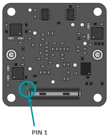
.. |image3| image:: 662-3.png
   :width: 2in
   :height: 2in
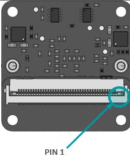
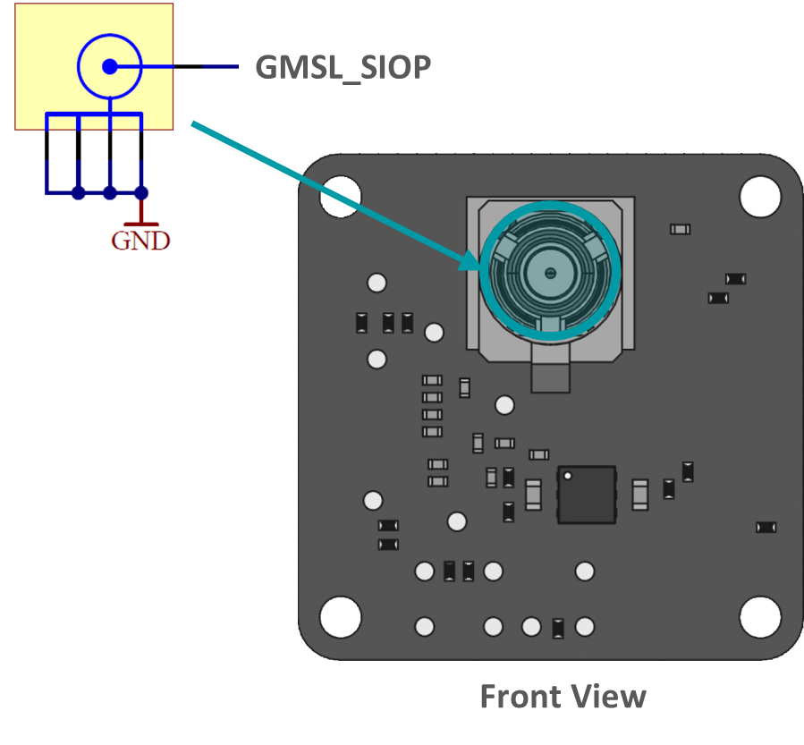
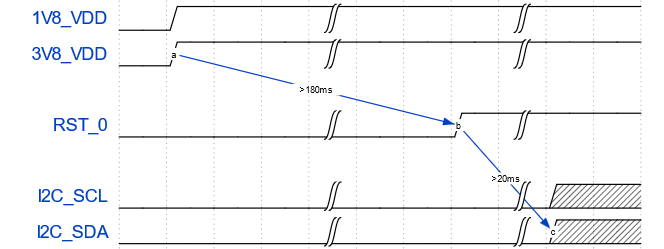
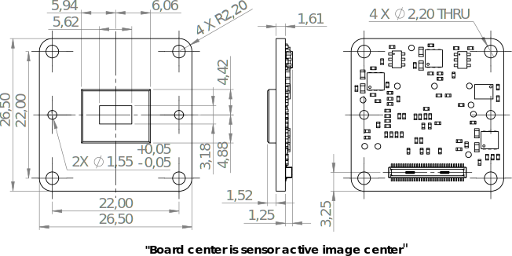
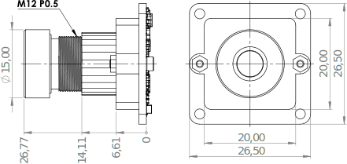
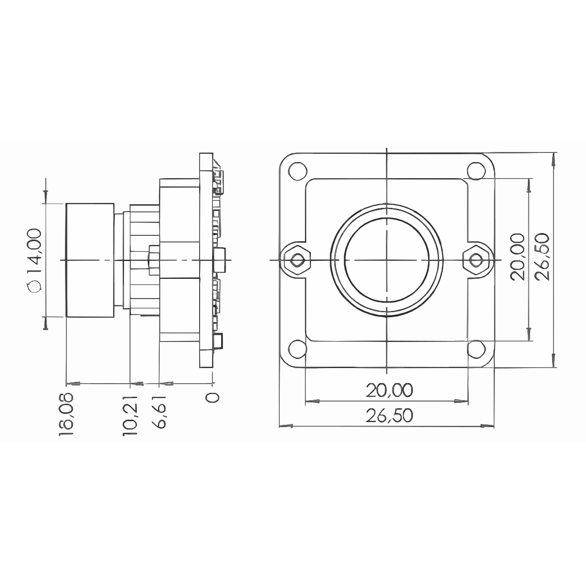
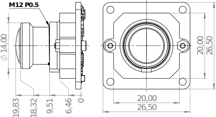
.. |image11| image:: 662-11.svg
   :width: 600px
   :height: 400px
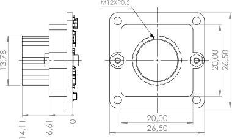
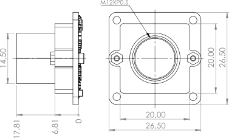
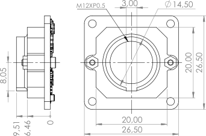
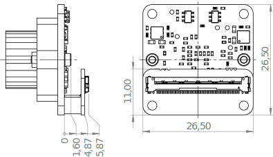
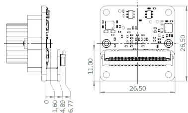
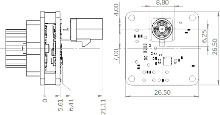
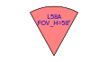
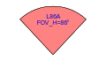
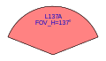
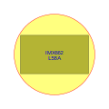
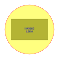
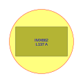
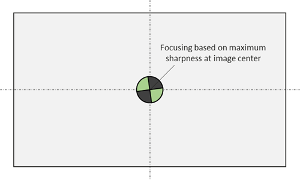
   
   
   