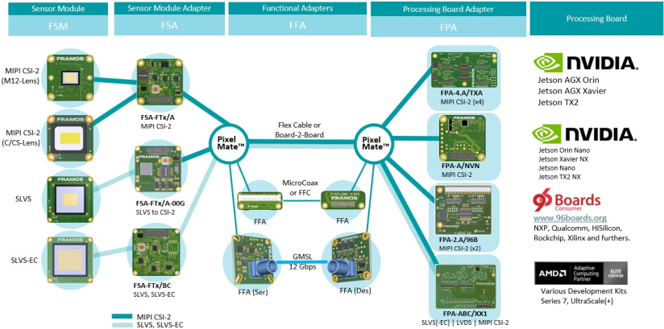
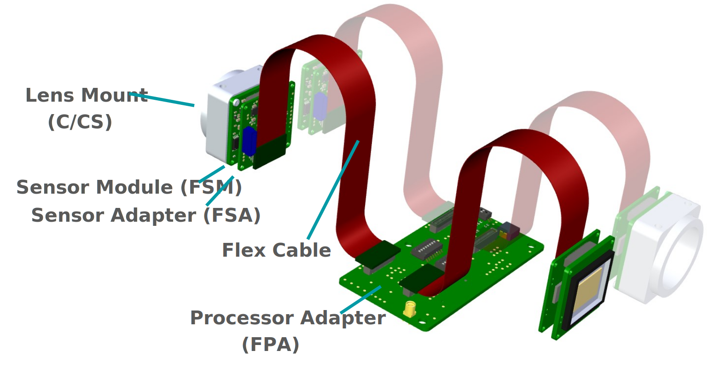

Introduction
++++++++++++

The FRAMOS Sensor Modules (FSM) are printed circuit boards that interface various types of image sensors with standardized connectivity such as connector type, pinout, mechanical format, and compatible accessories. The goal of these modules is to provide various sensor boards that can be used "off the shelf" to connect a variety of image sensors to a host system, starting from evaluation and proof-of-concept phases and extending to mass production, where adjustments to actual needs are easily possible.

This chapter provides information on the generic attributes as well as the individual modules, in addition to the individual FSM datasheets.

Common Specification
~~~~~~~~~~~~~~~~~~~~~~~~~

In general, FSMs are differentiated by two main attributes:

- Image sensor size dependent mechanical footprint (26.5 mm, 28 mm)
- Data interface type specific pinout (MIPI CSI-2, LVDS)

All image sensor signals are routed directly from the sensor to the 60-pin connector. All passives visible on the PCB decouple the various power loads of the image sensor. Please refer to the appropriate image sensor documentation for further information.

The figure below shows a map of compatibility with all components inside the Ecosystem. Every element (or hardware) and connection displayed in **Blue** operates with native MIPI CSI-2 (D-PHY) data.

Every component and connection displayed in **Teal** operates with proprietary (SLVS) or standardized (SLVS-EC) LVDS data, which requires further attention to the physical processing of the image data by either data conversion or specific FPGA IP. Users of MIPI CSI-2 based processing systems are supported by FSM-specific data conversion located on dedicated FRAMOS Sensor Adapters (FSAs).

Specification and compatibility of all individual components are listed in the appropriate chapter of this User Manual. Access to software and drivers is only granted with the purchase of the appropriate development kit. Electrical design sources, support, and services are provided on an individual basis and are not part of the development kit or a standard component purchase.