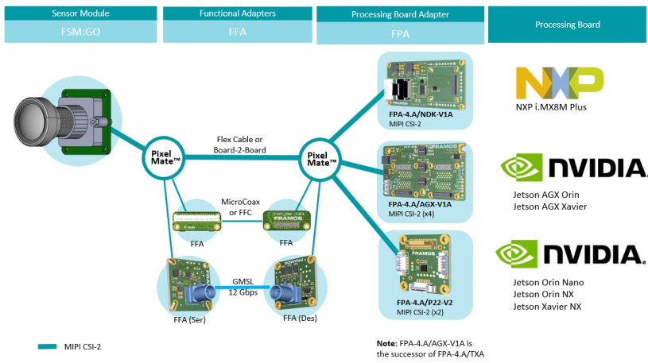

Introduction
++++++++++++

The FSM:GO series of optical sensor modules represents a specialized subset within the FRAMOS Sensor Ecosystem, designed to accelerate the deployment of vision systems with an emphasis on ease of use and rapid integration. Built around cutting-edge image sensor technology, FSM:GO modules are preconfigured with optimal lens pairings and precision focus options to cater to specific application demands. The plug-and-play nature of these modules, combined with FRAMOS's quality calibration, ensures that they are not only ready for immediate deployment but also finely tuned for exceptional performance in a wide array of vision applications. The ensuing subsection provides an introduction to the unique attributes and capabilities of the FSM:GO modules, guiding users toward selecting the perfect vision solution.

The figure presented illustrates the compatibility landscape within the Ecosystem, highlighting all the components designed to interface with the FSM:GO series. Each element and interconnection depicted in blue is configured to operate using the native MIPI CSI-2 (D-PHY) data.

