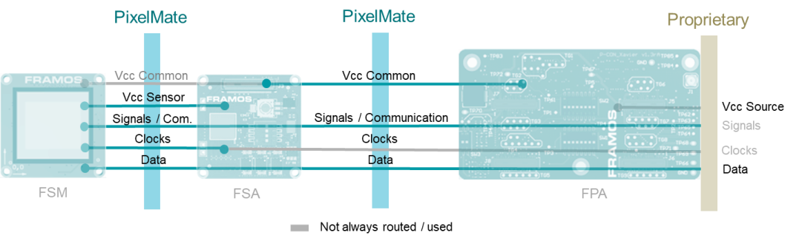

# PixelMate™

## Introduction 

The PixelMate™ connector is the vision industry’s interface into the FRAMOS sensor module ecosystem. PixelMate offers a mechanical specification and defined pin-signals connecting image sensors supporting MIPI CSI-2, SLVS-EC Protocols, and protocol-less transmission methods following the Sony SubLVDS and SLVS standards. The connector creates a flexible and exchangeable front-end, physically independent of the assigned processor hardware, giving camera designers a highly efficient embedded vision system with maximum flexibility in terms of sensor options.

The PixelMate™ connector specification includes:

- 60 pin Connector type (Hirose DF40C-60DP-0.4V(51) and compatible)
- Fixed pin assignment, covering a wide range of specific signals, allowing sensor level access:
  - Common Voltages – Fixed, 3V8 and 1V8 (0.6A each, split into 2x 0.3A pins)
  - Sensor Voltages – 6 pins for sensor-specific voltages
  - Typical Sensor Signals – Native sensor signaling covering configuration, communication (I2C, SPI), and synchronization
  - Number of Pins: 60 (2 rows á 30 pins)
  - Locking: No
  - Cable Shielding: Yes
  - Connector Shielding: No
  - Driving Clocks – Reference clocks for sensor and periphery
  - Data Lines, differentiated into two sub-specifications:
    - PixelMateS – 8-lanes data for SubLVDS/SLVS/SLVS-EC with one clock
    - PixelMateC – 4-lanes data for MIPI CSI-2 with two clocks



Actual signals used by the individual FSM is image sensor dependent and may vary.

```{toctree}
:maxdepth: 2
:hidden:

PixelmateC.rst
PixelmateS.rst
```