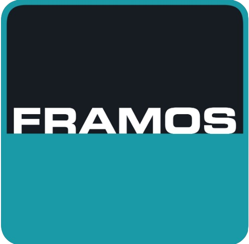

---
myst:
  html_meta:
    "description lang=en": |
      Top-level documentation for FRAMOS, with links to the rest
      of the site.
html_theme.sidebar_secondary.remove: true
html_theme.sidebar_primary.remove: false
---

### FRAMOS Documentation

<!-- <p align="center">
  
</p> -->

Welcome to the FRAMOS Documentation hub, your comprehensive resource for imaging solutions. Whether you are working with image sensors, embedded vision modules, 3D vision technology, optics, or software applications, FRAMOS is your trusted global partner in vision technology.

Our documentation provides quickstarts and detailed guides on our sensor modules, development kits, platform and adapters, product specifications, and more. Use the quick links below to navigate directly to the desired section, or start with the FSM Ecosystem in the top navigation bar and follow the provided navigation instructions.

```{gallery-grid}
:grid-columns: 1 1 1 3

- header: " FRAMOS Sensor Module Ecosystem​"
  content: "Discover the FRAMOS Sensor Module Ecosystem, where interchangeable components streamline your vision development. Access comprehensive user manuals, quick start guides, and application notes to bring your ideas to market faster. See [FSM Ecosystem](FSMEcosystem/GettingStarted/ConnectTheFSM/index.rst) for the details."
  image: "fsmeco.png"

- header: "FSM:GO"
  content: "Access our ready-to-deploy FSM optical sensor modules, offering best-in-class image quality. Find quick start guides, datasheets, and more to streamline your embedded vision projects. See [FSM GO](FSMEcosystem/GettingStarted/ConnectTheFSMGO/index.rst) for the details."
  image: "fsmgo.png"

- header: "D400e Industrial 3D Cameras​"
  content: "Explore our rugged D400e 3D depth cameras, IP66-rated for industrial use and powered by Intel® RealSense™ technology. Access user manuals and integration guides to accelerate your development.  Coming Soon!"
  image: "d400e.png"
```


```{toctree}
:maxdepth: 4
:hidden:

FSMEcosystem/index
AboutFRAMOS/index
```


#### About FRAMOS

FRAMOS offers an extensive product catalog to meet all your imaging needs. From image sensors and the FRAMOS Sensor Module Ecosystem to 3D products, displays, optics, and software applications, we provide a wide array of solutions to integrate vision into machines and devices.

#### Our Expertise

As a leading global partner in vision technology, FRAMOS supports customers, manufacturers, and OEMs in selecting and integrating compatible hardware and software for embedded vision, 3D imaging, and custom vision systems. Our team of experts and engineers works closely with top suppliers and technology providers to deliver both standard and high-end vision solutions, tailored to every application and budget.

#### Latest Updates

- We have recently added the FSM Ecosystem section, complete with all relevant content.

Explore our documentation to find the information and resources you need to successfully implement and optimize FRAMOS products in your projects. For any additional assistance, our support team is always ready to help.


